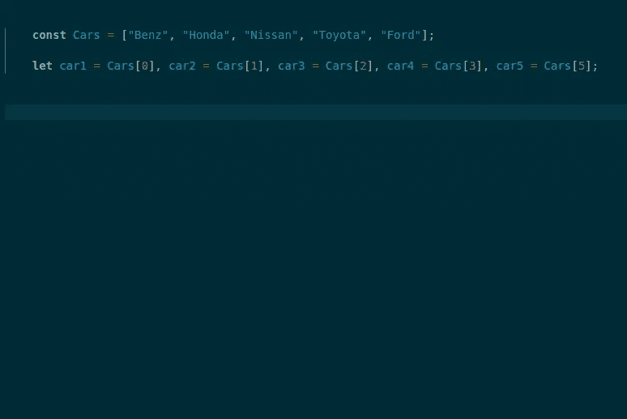
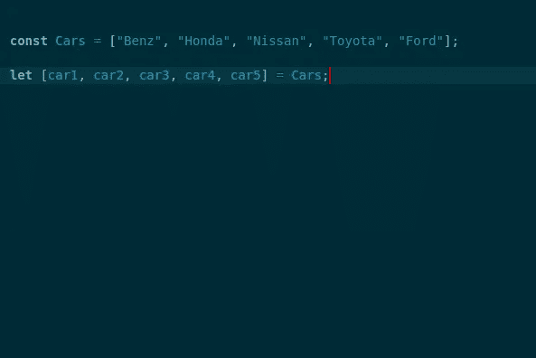
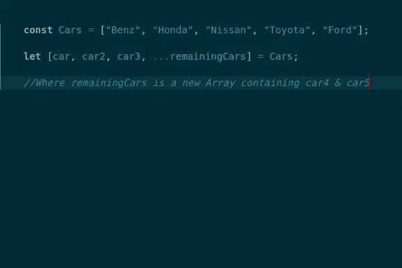
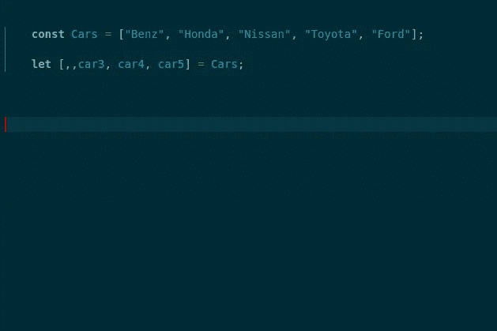

# 在 JS 中析构数组

> 原文：<https://blog.devgenius.io/destructuring-arrays-in-js-ecde1b467f89?source=collection_archive---------40----------------------->

Artem Sapegin 在 [Unsplash](https://unsplash.com?utm_source=medium&utm_medium=referral) 上拍摄的照片

嗨我是 Ndonna Ugwuede，一个 javaScript 新手，作为一个 javaScript 新手，我发现理解析构很难，即使在阅读了许多资料和观看了教程视频之后，这听起来仍然很奇怪，但多亏了 **Mark Zamoyta** 我终于掌握了它。

首先，你需要析构做什么？

析构为我们提供了一种命名数组/对象项的方法，而不是常规的用“arrayName[0]”或“object.key”来调用数组项。

**析构数组**

你可以使用语法 **let [name1，name2，name3] = names 来析构一个数组；**

其中 names 是一个已经存在的数组。例如，我们有一个名为 **Cars** 的数组，其内容为 **["Benz "、" Honda "、" Nissan "、" Toyota "、" Ford"]** ，我们希望将它们分配给变量，即 **car1、car2、car3、car4、car5** 。按照老办法，我们会给每个人赋值:
***让 car1 = Cars[0]，car2 = Cars[1]，…。等等。***

为数组项指定名称的旧方法

析构带来了一种更简单的方法，你可以命名数组项，我们可以使用:
***让[car1，car2，car3，car4，car 5]= Cars；***

解构范例

如果我们不确定要命名的项的数量，您甚至可以使用 rest 操作符(…)将剩余的项分配到另一个命名的数组中。

用 rest 参数进行析构

另一个好处是，如果我们确定我们需要跳过什么，我们可以跳过一些项目。一些战略项目可以通过在它的位置放一个逗号来跳过，例如，我们可以使用:
***let [，，car3，car4，car5] = Cars 来删除数组的第一个和第二个项目；***

析构时移除选定的项

析构也适用于对象，在不久的将来，我会发表另一篇文章解释在 JS 中析构对象，但同时你可以在 twitter 上联系我:[https://twitter.com/Ndonnauc](https://twitter.com/Ndonnauc)