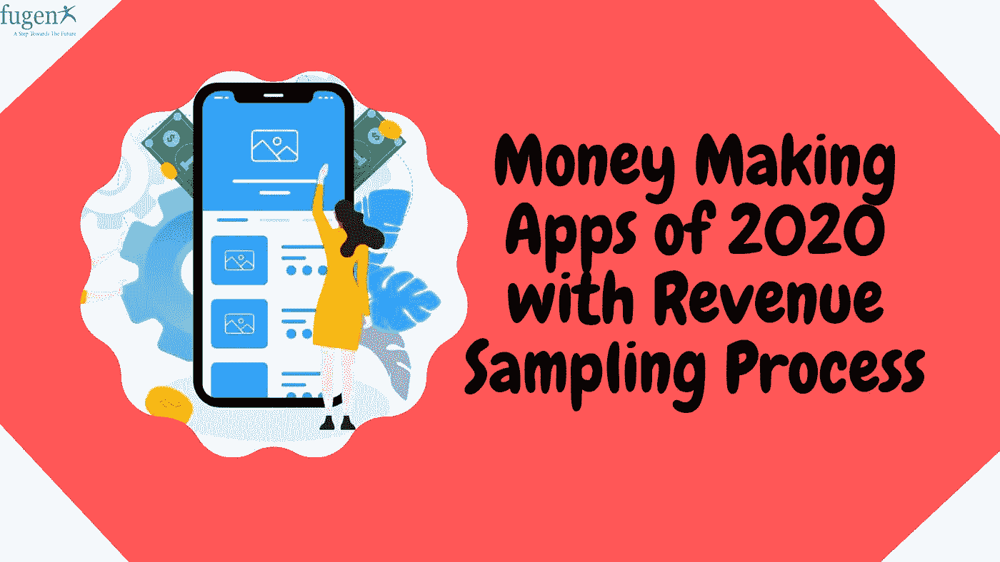
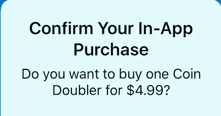

# 2020 年最赚钱的 15 款移动应用

> 原文：<https://blog.devgenius.io/detailed-list-of-money-making-apps-of-2020-with-revenue-sampling-process-ebaa44c15204?source=collection_archive---------2----------------------->

哪个应用程序能帮你赚钱？这听起来像是真的，赚钱的应用程序在现实中存在。这类应用不会让你变得富有，它们将能够筹集一些像样的零花钱或支付你每月的手机账单。从市场研究应用程序到移动广告应用程序，再到金融应用程序共享，你可以在智能手机上下载一个或多个这些[赚钱应用程序](https://www.fugenx.com/how-to-make-money-with-free-mobile-app/how-to-make-money-with-free-mobile-apps/)来从事旅行或空闲时间。毕竟大家都爱钱。

要记住的一点是，在研究赚钱的应用程序时，要注意潜在的骗局，可能涉及索要注册费(远离)或夸大潜在收入。查看应用评级和阅读用户评论。你也可以向一个好的商业机构查询，看看该企业的评级和任何已登记的投诉。

> **在进入移动应用列表之前，我们需要了解免费移动应用最有效的收入抽样流程。**

# 应用内购买:

充分利用免费应用的最流行方式是通过应用内购买。谷歌 Play 商店和 App Store 中的数十个应用程序都使用它，它允许最终用户在应用程序本身内进行购买。

# 商品销售:

从移动应用中赚钱的一种创新方式是在上面销售商品。例如，为了让应用程序出版商通过这种策略赚钱，亚马逊推出了亚马逊 Merch‌，允许出版商创作并上传他们的作品到亚马逊。亚马逊还负责生产、交付和及时付款。大部分电子商务环境保持不变。

# 赞助:

有利可图的赚钱模式赞助可以真正提高你的应用收入。此外，手机为许多新赞助商打开了大门，因为它允许更多的赞助类型和定价选择。你创建了一个伟大的应用程序，获得了大量的牵引力，然后接触到一个潜在的筹款人，他将设计应用程序，以匹配赞助商的品牌。对于付款，您可以与赞助商品牌分享收入或选择每月会员费。

# 广告:

广告是目前大多数应用程序最常用的方法之一。通过第三方网络易于实施和维护，在你的应用程序中设置广告是一项非常简单的任务。应用程序所有者必须在广告空间显示广告，并从第三方广告网络中获利。

# 推荐营销:

正确使用这个技巧可以为你的应用创造奇迹。这将有助于你吸引忠诚和有利可图的客户。应用发行商可以基于点击或安装来推广或销售附属产品/服务。这些都是推荐营销模式来赚钱你的移动应用。

> **同样，阅读-** [**手机 App 开发流程【10 步专家指南】**](https://www.fugenx.com/mobile-app-development-process/)

# 现在让我们深入研究赚钱应用的详细列表

## 1.[金钱 App](http://www.moneyapp.org/)

Money app(iOS 和 Android 均可使用)是一款市场分析应用，奖励你完成任务，包括评论、玩游戏、查看商店展示、购买神秘物品、评估设施和免费试用。当您在 Money 应用程序中打开帐户并开始完成任务以领取奖励时，您可以使用 PayPal 帐户兑换现金。这是最好的快速赚钱的应用程序，因为你可以在两到三个工作日内获得奖励——这在市场研究应用程序的世界中是不寻常的，这些应用程序通常每月支付一次，或者不提供现金奖励。

## 2. [iPoll](https://www.ipoll.com/)

。Android 和 iOS 用户在完成 15 到 20 分钟的调查任务后，可以获得礼券、航空公司奖励积分、杂志订阅以及更多。下载应用程序后，您可以告诉应用程序一些关于您自己的信息，以帮助 iPal 将您与未来的调查进行比较。尽可能多或尽可能少地完成问卷，但是您参与的越多，您赢得的就越多。
根据 IveTriedThat.com 的调查，大多数调查每份支付 1 美元。但是有些人可以得到 10 美元。

## 3.[奖金](https://www.swagbucks.com/)

通过浏览网站、完成调查、观看视频、提及您的朋友、在 App Store 购物、完成特殊交易、定期投票、发现非法代码来获得名为 SB 的点数。这些积分可以兑换成礼品卡或亚马逊等商店的 PayPal 现金。

## 4. [Foap](https://www.foap.com/)

Foap 是一个赚钱的应用程序，它使专业和新手摄影师能够通过出售智能手机上拍摄的图像来筹集额外的资金。这太天才了。通常，它是一个品牌、广告和营销公司从全球超过 250 万摄影师的 Foap 列表中识别和购买照片的众包网站。

您创建一个帐户，提交您的带有特定标签的高质量图像，这些图像将由经过验证的社区进行审核——评级越高，照片的曝光率越高。每笔交易你可以得到 5 到 100 美元。还有一些“套餐”，品牌和代理商对照片提出独特的要求。最近，这些项目已经扩大到包括视频。

## 5.[流体市场](https://blog.fluidmarket.com/fluid-blog/)

不是每个人都有车，我们大多数人的车大部分时间都闲置着。好消息是:这个共享经济应用程序允许你按小时、天或周出租你的货车、箱式卡车、皮卡、轿车和/或 SUV。根据该公司的网站，通过 Fluid Market 租赁你的卡车，你每年可以赚到 2 万美元。你也可以租用工具，如钻头、锯子、树篱修剪机以及其他物品。

> **还有，阅读-** [**金融科技类应用如何赚钱？**](https://www.fugenx.com/how-do-fin-tech-apps-make-money/)

## 6.[维基百科](https://wikibuy.com/)

赚钱最好的应用之一是 Wikibuy。这是一个购物应用程序，可以通过两种方式帮助你赚钱:找到好的交易和给你礼物。

首先是确保你在网上或商店购买的产品价格最优惠。你省下的钱就是你赢得的钱，在你将要进行的交易上省钱和花钱一样好。

Wikibuy 有一个数据库，记录了每个销售产品的网站及其销售价格。一旦你在浏览器中安装了这个应用程序，如果你在一个收费更高的网站上，WikiBuy 会自动引导你找到最好的价格。你也可以使用手机应用程序扫描商店里的商品条形码，找到卖同样商品的好价钱的当地零售商。

## 7.[乐天](https://www.rakuten.com/)

正式 Ebates，乐天会给你购物返现的礼物。

超过 2，500 家商店与该网络合作。这些商店以推荐和浣熊股份的佣金形式向顾客支付佣金。

在亚马逊、沃尔玛、科尔、梅西百货、易贝、Expedia、杰西潘尼、H&M 和无数其他你已经知道的品牌购物后，赢取现金奖励。我看到了 10%以上的返现促销

立即加入乐天，在成为会员后 90 天内进行符合要求的购买，即可获得 10 美元的奖励。

## 8.[谷歌意见奖励](https://surveys.google.com/google-opinion-rewards/)

你想通过移动调查获得报酬吗？开始下载谷歌反馈礼物。

这个概念非常简单。完成一份关于潜在问题的简短调查。这可能是一个酒店评论，个人意见，或来自特定商家的满意度调查。调查很小，你可以在等咖啡的时候拿起它们。

谷歌意见奖励让你通过分享你的电视和互联网使用赚取额外的钱。继续上网浏览，自己看电视。

## 9.[橡子](https://www.acorns.com/)

橡子通过投资让你继续工作。

该应用程序会自动将你用信用卡购买的零钱凑整，存入投资账户。例如，假设你在一顿饭上花了 9.5 美元。Acorns 将把它四舍五入到 10 美元，投资 0.5 美元。

对于那些想投资你，但没有大量资金的人来说，这是一个很好的机会。回答几个关于你的风险承受能力的问题，Acorns 会推荐一个符合你需求的投资组合。

## 10. [Slidejoy](https://www.getslidejoy.com/use)

我们每天都不断接触到数字广告。如果能靠看广告赚钱岂不是很棒？

Slidejoy 让这成为可能。该应用程序广告到您的手机锁屏。每次你检查手机，你都会看到一个新的广告或促销活动。向左滑动以了解更多关于广告的信息。向上滑动以查看另一个。或者向右滑动以访问您的主屏幕。

它只对安卓用户开放。

> **也可阅读-** [**帮助移动应用盈利的 7 大盈利模式**](https://www.fugenx.com/top-7-monetization-models-that-help-in-mobile-app-profitability/)

## 11. [Meesho](https://meesho.com/)

如果你有兴趣成为一名企业家，转售是一个伟大的创业方式。对于那些想在印度创业的人来说，这个应用程序是一个省事又方便的选择

对于许多印度妇女来说，在家转售打字工作是最受欢迎的选择，因为没有必要担心有一个实体店来投资资本。

要开始这项业务，你只需要一部能上网的智能手机。下载应用程序，浏览不同类别的数百万种产品。你可以以批发价买到这些产品。

你可以通过社交媒体平台，如 WhatsApp 和脸书，与你的联系人分享你最喜欢的产品的图片和细节，并在价格上增加利润。收到订单请求后，您下最后一笔订单，利润将归您所有。

## 12. [Frapp 或 Futwork](https://futwork.com/)

对于那些想在实习中赚钱或在大学期间寻找有偿工作的学生来说，这个应用程序可以帮助这些类型的学生

Frapp 是印度最受欢迎的应用之一，青少年和学生可以通过该应用提供的机会轻松赚钱

工作完成后，你会得到一份奖励。网络、营销、活动管理或志愿者工作是学生最喜欢的工作。无论你在哪里感兴趣，你都有机会在这个应用程序中找到一个符合你兴趣和品味的。

## 13.数据精灵应用

这是 Paytm 现金和免费充值的最新应用程序。该应用程序中还有许多其他优惠，让您每次推荐都能赚到大钱。使用 Paytm 现金立即兑换您的点数。该应用程序每天可以帮助您保存大约 25%的移动数据。你需要使用你喜欢的应用程序和玩游戏。你通过一个推荐获得的收入是卢比。28.Datageny 是一款 Android 应用，当你接受你的热门应用和游戏时，它会用移动数据来补偿你。Datageny 将帮助您每天节省 25%的移动数据。获取免费数据，为您保存的数据向应用充值。

## 14.[真实平衡](https://truebalance.io/)

真正的平衡提供了最好的应用程序和数据跟踪系统和移动平衡。您可以查看天平的实时数据和数据使用情况。使用该应用程序，您可以享受带有免费充电设施的免费预付费余额支票，您可以充值并邀请您的朋友，赚取额外积分。见见你的朋友，花点钱。20 为推荐金额。基于你的实际用户调查，他们希望关注预付费智能手机用户的数据包余额。他们想在包降到零字节而没有通知进度时恢复它。所以他们想出了入住和退房的最佳方式。真正的天平一键式让您获得最新的最佳数据。从现在开始，永远不要失去与互联网的连接！

## 15. [TagMango](https://www.tagmango.com/)

如果你对社交媒体充满热情，整天查看你的脸书和 Instagram 账户，如果你有大量的社交粉丝，你可以从这个移动应用中赚钱

这个概念被称为纳米影响者营销，你可以通过推广某些品牌和产品获得报酬。Tag‌mango 就是这样一款应用，它允许你与你喜欢的品牌合作，并获得回报。

这个在 Instagram 上有 500 多名粉丝的家伙有一些最低要求，只有脸书配得上。

你上传的帖子会得到报酬，最好的帖子会得到高质量的参与。

# 结论

这里不是每个 app 都适合所有人。在评估赚钱的应用程序时，需要考虑一些因素。我会解释这些项目有多重要，以及如何根据你的个人需求来权衡。下载赚钱的手机应用前要小心。确保应用程序有积极的评价。阅读负面评论，看看不满意的顾客在说什么。我们列表中的大多数应用都是免费的。但有些是你必须付出的。

**FuGenX** 是德勤获奖的移动[应用程序开发公司，位于印度](https://fugenx.com/services/mobile-application-development/)和美国。我们专门的开发团队拥有成熟的经验和对移动应用技术的深入了解，因此，他们可以高效地为您的项目工作。

# 你想阅读的其他文章

[***App 开发选择 Node.js 的十大理由***](https://medium.com/@fugenxmobileappdevelopment/how-blockchain-technology-is-beneficial-for-mobile-app-development-26752051e820)

[***聊天机器人开发 30 大热门平台***](https://chatbotsjournal.com/top-30-powerful-and-best-platforms-to-build-chatbots-bf413419d584)

[***美国 20 大移动应用开发公司&印度***](https://medium.com/@fugenxmobileappdevelopment/top-20-mobile-app-development-companies-in-usa-india-7258525f32)