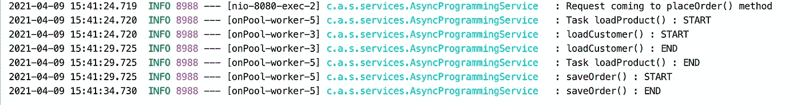
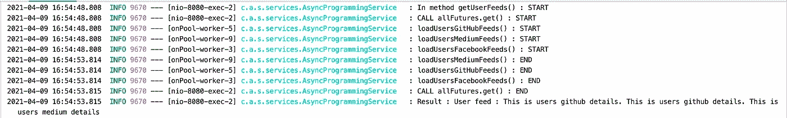
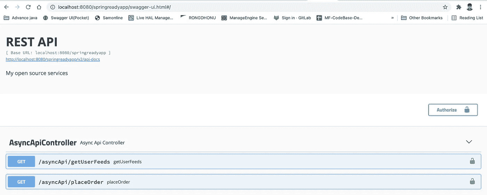

# JAVA 8 中的异步编程及其实现——可完成的未来

> 原文：<https://blog.devgenius.io/details-implementation-of-java-asynchronous-programming-using-completable-future-949826bac6f3?source=collection_archive---------1----------------------->

## **异步编程**是一种并行**编程**的方式，其中一个工作单元独立于主应用线程运行，并通知调用线程其完成、失败或进度。


照片由[萨姆·普林](https://unsplash.com/@sampoullain?utm_source=medium&utm_medium=referral)在 [Unsplash](https://unsplash.com?utm_source=medium&utm_medium=referral) 拍摄

**今天我将讲述以下主题**

1.  关于异步编程的细节
2.  java 中未来任务的缺点以及 completable future 如何解决这个问题
3.  关于 Java 线程池的详细信息
4.  可完成未来的实际实施
5.  分享代码库和详细信息

**先决条件** 对于异步 API 设计，你一定需要 spring boot 的知识。你可以看看下面这篇关于弹簧靴的文章

[](https://mesukcse08.medium.com/spring-data-jpa-a-to-z-6c957ed17a66) [## 深入探讨 spring boot 和数据 JPA 实现:A 到 Z

### 根据 Spring 文档，Spring Data JPA 是更大的 Spring 数据家族的一部分，它使得轻松地…

mesukcse08.medium.com](https://mesukcse08.medium.com/spring-data-jpa-a-to-z-6c957ed17a66) 

**异步编程**

1.  异步编程是并行编程的一种形式，它允许一个工作单元独立于主应用程序线程运行。当工作完成时，它通知主线程(以及工作是完成还是失败)。
2.  并行编程使开发人员能够使用多核计算机，通过同时使用多个处理器来使他们的应用程序运行得更快。
3.  这种模式有助于快速响应用户界面。
4.  异步编程实际上已经存在很长时间了，但是最近几年，它得到了更广泛的应用。
5.  异步编程提供了一个非阻塞、事件驱动的编程模型。这种编程模式利用系统中的多个内核，通过使用多个 CPU 内核执行任务来提供并行化，从而提高应用的吞吐量。
6.  本质上，异步编程模型可以使用同一个线程来处理多个请求，而不会有任何请求阻塞线程。
7.  像编程中的所有东西一样，它不是你应该在每个实例中都使用的东西；事实上，有些情况是你应该避免的。
8.  您应该在异步方法内部处理异常(如果它们倾向于引发或抛出异常)。

**Java 中未来任务的缺点**

CompletableFuture 是 Java 5 中引入的 Java 未来 API 的扩展。

该接口的代码如下所示

未来被用作异步计算结果的参考。它提供了一个`isDone()`方法来检查计算是否完成，并提供了一个`get()`方法来在计算完成时检索计算结果。

其局限性如下

*   **无法手动完成**
    谈到手动完成，future 提供了一个 isDone()方法来检查计算是否完成，以及一个 **get()** 方法来检索计算完成时的结果。但是如果出现需要手动完成的情况，Future 没有提供任何方法来完成。

*在****CompletableFuture****中有一个*回调*命名为* ***完成*** *。我们可以手动调用 complete 方法来完成该任务。*

```
**boolean** complete(T value)
```

*   **完成后无法附加回调** 未来不会通知您其完成。它的 **get()** 方法被阻塞，它将等待方法完成。完成当前操作后，您不能附加进一步回调。

*在****CompletableFuture****中有很多回调像****then apply()*******then accept()*******then run()****等等。您可以根据您的需求使用这些回调***

*   ****任务链接与组合问题** 你不能将多个未来任务链接起来，让它们一个接一个开始。此外，您不能组合多个任务来提高应用程序的性能。**

***在****CompletableFuture****你可以* ***撰写*** *，* ***组合*** *，* ***组合 All，anyOf()，*** *等等这里，如果第二个任务依赖于第一个任务，则使用 compose。***

*   ****缺少异常处理** 在**未来接口**中没有任何异常处理机制。**

***在****CompletableFuture****中有一个回调 exceptionally()和一个异常消息，让你有机会从原来的 Future 产生的错误中恢复。***

****Java 线程池****

*   **线程池是多线程编程中的一个核心概念，简单地说，它代表了可用于执行任务的空闲线程的集合。**
*   ****Java 线程池**代表一组等待作业并多次重用的工作者线程。**
*   **它可以重用现有的工作线程，这样可以节省时间，因为不需要创建新的线程。**
*   **线程是一个执行上下文，它可以在一个进程中运行一组指令，也就是一个正在运行的程序。多线程编程是指使用线程同时执行多个任务。当然，这种范式在 JVM 上得到很好的支持。**
*   **线程池通过减少所需的线程数量和管理它们的生命周期来帮助缓解性能问题。这种机制在执行大量小任务的系统中特别有用。**

**Java 通过称为**执行器**的对象提供了自己的线程池模式实现。这些可以通过执行器接口或直接通过线程池实现来使用——这确实允许更细粒度的控制。**

*****Java . util . concurrent****包*包含以下接口:**

*   *****执行器*** —执行任务的简单界面**
*   *****ExecutorService***—一个更复杂的接口，包含管理任务和执行器本身的附加方法**
*   *****ScheduledExecutorService***—用调度任务执行的方法扩展 *ExecutorService***

****可完成未来的实际实施****

**在 CompletableFuture 中，如果我们不提供自己的执行器，那么新创建的线程将添加到全局线程连接池中。**

****runAsync()实现无返回值** 如果你想运行某个任务，但不想要某些响应，那么你可以使用它。它有两种表现形式**

```
****public static** CompletableFuture<Void> runAsync(Runnable runnable) {
    **return** asyncRunStage(ASYNC_POOL, runnable);
}

**public static** CompletableFuture<Void> runAsync(Runnable runnable, Executor executor) {
    **return** asyncRunStage(screenExecutor(executor), runnable);
}**
```

**这里，第一个只取**可运行**，第二个取**可运行和执行器**。在这两种情况下，其返回类型都是 **Void** 。实现代码如下**

**这里，在 runAsync 回调中，我们在第一种情况下提供 Runnable 接口，在第二种情况下，我们也提供 Executor。通过提供 executor，我们将该线程添加到我们自己的线程连接池中，其大小为 10。**

**在这里，我们通过**的调用得到响应。get()** 方法，它是一个阻塞调用。**

****计算后的处理结果:链接** 我们将处理运行任务返回后的数据。考虑一个场景**

**步骤 1:从数据库获取数据并返回**

**第 2 步:操作第一阶段的数据，使用它并返回它的最终响应。**

**步骤 3:处理引发的异常。**

**检查代码片段**

**这里，使用**supply sync**回调，我们使用电子邮件地址获取客户钱包 id。这可能是一个耗时的过程，它可能是通过数据库调用或网络调用。数据到达后，我们在**中获取钱包余额，然后应用**调用回调，最后返回响应。**

**在此操作过程中，如果出现异常，那么它将进入**异常**回调。然后我们处理它并发送适当的消息。**

**这里，第二步依赖于第一步。在这种依赖的情况下，我们可以使用回调 **thenCompose。**它可以像贝娄一样写道**

```
**CompletableFuture<Double> balanceFuture = fetchWalletId(emailId)
        .thenCompose(walletId -> loadWalletBalance(walletId));**
```

**下面给出了所用回调的回调签名**

****合并两个独立的未来** 使用**然后合并**回调，我们可以合并和操纵两个独立的未来任务。其签名如下**

```
****public** <U, V> CompletableFuture<V> thenCombine(CompletionStage<? **extends** U> other, BiFunction<? **super** T, ? **super** U, ? **extends** V> fn) {
    **return this**.biApplyStage((Executor)**null**, other, fn);
}**
```

**其实现如下所示**

**这里，我们并行加载客户和产品，最后将它们组合起来，并将数据放入数据库。**

**执行此代码后，日志如下所示**

****

**在这里，装载客户和装载产品一次开始。他们同时处理这些请求。所以我们得到了实际的期望输出。在传统的编码中，需要两倍的时间来完成，因为首先要加载客户，然后再加载产品。之后，它会下订单。**

**同样在这里，为了可完成的未来任务，他们正在打开一个新的工作线程。仔细检查日志，例如运行在**forkjoinpool . common pool-worker-5**上的 l **oadProduct()** 和运行在**forkjoinpool . common pool-worker-3**上的 **loadCustomer()****

**此外，在完成一项任务后，工作人员将返回资源池并分配新任务。这里，在释放了**工人 5** 之后，它正在处理 **saveOrder()** 任务**

****合并多项任务****

**在这种方法中，它接受一个可计算的未来任务列表，并在完成所有任务后准备结果。**

**假设假设一个企业。我们有一个 scraper 服务，输入的是用户的电子邮件地址。通过电子邮件，我们可以获取 facebook、github 和 medium feed 的用户。当所有提要加载完成时，合并这些数据并作为响应发送回来。**

**下面给出了代码片段。这里主要的方法是 **getUserFeeds()****

**这里，我们创建 3 个可完成的未来任务，并使用 **allOff 合并它们。**如果加载已完成，则准备响应并将其作为响应发送。**

**下面给出了响应日志。仔细检查日志的时间。所有任务开始和结束的时间相同，因为所有任务都有 5 秒钟的延迟。**

****

**还有一个回调名为 anyOff。它接受未来任务的列表，并在任何人完成后返回。**

```
**CompletableFuture<Object> anyOf(CompletableFuture<?>... cfs)**
```

****该代码库的 Github 链接是** [**此处**](https://github.com/mesuk/SpringReadyApp)
**控制器名称** : AsyncApiController
**服务名称:** AsyncProgrammingService**

****Swagger 网址**
[http://localhost:8081/springreadyapp/Swagger-ui . html #/](http://localhost:8081/springreadyapp/swagger-ui.html#/)**

****

**您还可以查看如何在分布式系统中实现锁定机制。你可以看看我的文章。**

**[](https://mesukcse08.medium.com/locking-in-a-distributed-system-using-redis-java-6d1007251d61) [## 使用 Redis JAVA 锁定分布式系统

### 最近，我在 Redis 锁定分布式系统上工作。在分布式系统中，锁定/并发管理是一种…

mesukcse08.medium.com](https://mesukcse08.medium.com/locking-in-a-distributed-system-using-redis-java-6d1007251d61) 

快乐编码:)**