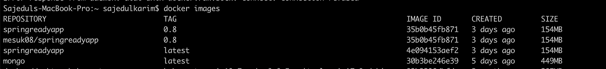
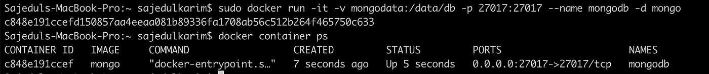
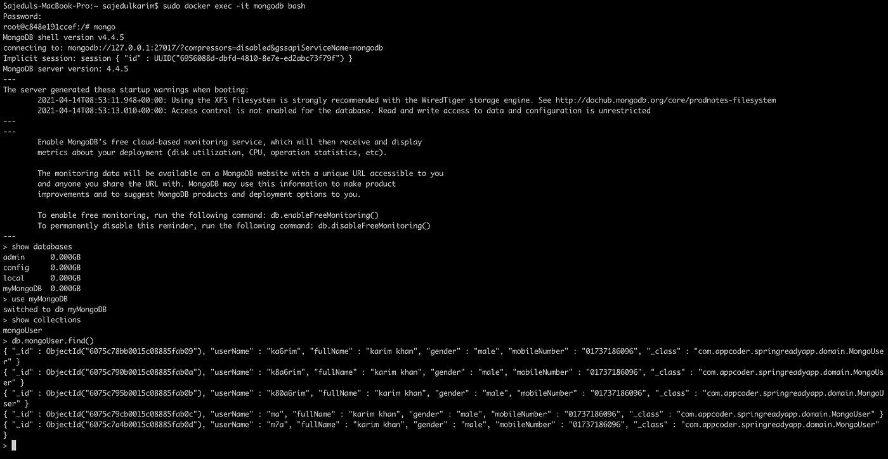
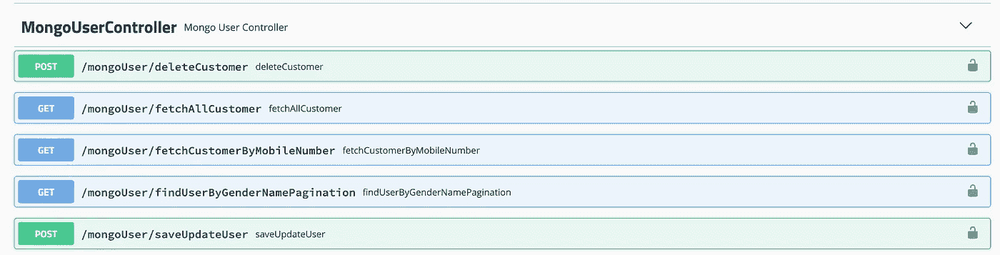

# MongoDB 及其 Spring 实现的细节

> 原文：<https://blog.devgenius.io/details-of-mongodb-and-its-spring-implementation-899be09be9e2?source=collection_archive---------5----------------------->

## MongoDB 非常适合关注性能的交易型商店。当数据结构将随着时间的推移而发展时，这也很好，因为它的无模式操作允许您动态更新数据。


由[卢克·切瑟](https://unsplash.com/@lukechesser?utm_source=medium&utm_medium=referral)在 [Unsplash](https://unsplash.com?utm_source=medium&utm_medium=referral) 上拍摄的照片

我们将在本文中讨论什么？

1.  数据库系统的类型
2.  RDBMS 和 NoSQL 数据库及使用案例的详细信息
3.  像 MongoDb 这样的文档数据库和像 MySql 这样的 RDMS 数据库之间的区别
4.  关于 MongoDB 的详细信息
5.  在 docker 容器中配置和运行 MongoDB，并从终端访问数据
6.  MongoDB Spring boot 应用程序之间的实用细节级集成。
7.  共享源代码和其他资源

**先决条件**
要涵盖这篇文章，你必须先了解 docker 和 spring boot。为了获得这方面的知识，你可以查看下面我的文章

[](https://medium.com/dev-genius/dockerizing-spring-app-with-gradle-3b6fbd650bf7) [## 用 Gradle 编写 spring 应用程序

### 根据文档，Docker 是一个开发、运输和运行应用程序的开放平台。码头工人…

medium.com](https://medium.com/dev-genius/dockerizing-spring-app-with-gradle-3b6fbd650bf7) 

**数据库管理系统的类型**

有几种类型的数据库管理系统。这里列出了七种常见的数据库管理系统:

1.  分层数据库
2.  网络数据库
3.  关系数据库
4.  面向对象的数据库
5.  图形数据库
6.  ER 模型数据库
7.  文档数据库
8.  NoSQL 数据库

今天我们在这里只讨论**关系数据库**和 **NoSQL 数据库**。

**关系数据库**

*   在关系数据库管理系统(RDBMS)中，数据之间的关系是关系型的，数据以列和行的表格形式存储。
*   这个数据库基于关系数据模型，它以行(元组)和列(属性)的形式存储数据，共同形成一个表(关系)。
*   表中的每一列代表一个属性，表中的每一行代表一条记录。表中的每个字段代表一个数据值。
*   结构化查询语言(SQL)是用于查询 RDBMS 的语言，包括插入、更新、删除和搜索记录。关系数据库处理每个表，每个表都有一个唯一指示每一行的键字段。这些关键字段可用于将一个数据表连接到另一个数据表。
*   关系数据库是最流行和最广泛使用的数据库。一些流行的 DDBMS 是 Oracle、SQL Server、MySQL、SQLite 和 IBM DB2。
*   它遵循普通酸的属性

**使用关系数据库的理由**

尽管 NoSQL 数据库因其速度和可伸缩性而广受欢迎，但在某些情况下，高度结构化的 SQL 数据库可能更好。以下是您可能考虑使用 SQL 数据库的一些原因:

1.  **你需要耐酸性*(原子性、一致性、隔离性、持久性)*** 。ACID 合规性减少了异常并保护了数据库的完整性。它通过准确定义事务如何与数据库交互来实现这一点，这与 NoSQL 数据库不同，后者的主要目标是灵活性和速度，而不是 100%的数据完整性。对于银行业来说，溶液酸是一个重要的东西
2.  **您的数据是结构化且不变的**:使用基于 SQL 的 RDBMS，您的信息将保留在您最初创建的结构中。如果您不需要用于大量数据的动态信息系统，并且您不需要处理大量的数据类型，RDBMS 可以提供很高的速度和稳定性。
3.  数据仓库&分析:RDBMS 非常适合复杂的查询和分析。最初，DB2 和 Oracle 主要用于查询密集型工作负载。因此，如果查询和报告需求非常重要，RDBMS 是一个不错的选择。
4.  **更好的支持选项:**因为 RDBMS 数据库已经存在了 40 多年，所以更容易获得支持、附加产品和集成来自其他系统的数据。

**NoSQL 数据库**

*   NoSQL 数据库是不使用 SQL 作为主要数据访问语言的数据库。
*   NoSQL 数据库没有预定义的模式，这使得 NoSQL 数据库成为快速变化的开发环境的完美候选。
*   NoSQL 允许开发人员在不影响应用程序的情况下进行动态修改。
*   当构建现代应用程序的需求增加时，它就出现了。

因此，NoSQL 提出了各种各样的数据库技术来满足需求。我们可以进一步将 NoSQL 数据库分为以下四种类型:

1.  **键值存储:**这是最简单的数据库存储类型，它将每一项都存储为保存其值的键(或属性名)。
2.  **面向文档的数据库:**一种用于将数据存储为类似 JSON 的文档的数据库。它通过使用与应用程序代码中使用的相同的文档模型格式来帮助开发人员存储数据。
3.  **图形数据库:**用于以图形结构存储大量数据。最常见的是，社交网站使用图形数据库。
4.  **宽列存储:**类似于关系数据库中表示的数据。在这里，数据一起存储在大的列中，而不是存储在行中。

**使用 NoSQL 数据库的理由**

非关系数据库也与 NoSQL 格式如 JSON 一起工作，这对于基于网络的应用程序来说已经变得必不可少，这些应用程序允许网站“实时”更新，而不需要刷新页面。

这里有一些您可以使用 NoSQL 数据库的用例

*   **非常适合处理“大数据”分析:**NoSQL 数据库变得越来越受欢迎的主要原因是，它们消除了需要对大量信息进行分类和应用严格结构的瓶颈。HBase、Cassandra 和 CouchDB 等 NoSQL 数据库支持服务器操作的速度和效率，同时提供处理大量数据的能力。
*   **对您可以存储的数据类型没有限制:** NoSQL 数据库让您可以在同一个地方无限自由地存储不同类型的数据。这提供了随时向数据库添加新的和不同类型的数据的灵活性。
*   **更容易扩展:** NoSQL 数据库更容易扩展。它们旨在毫无困难地分散在多个数据中心。
*   **无需数据准备:**当没有时间设计复杂的模型，并且需要让数据库快速运行时，非关系数据库会节省大量的时间。

**什么是蒙古数据库及其重要性？** MongoDB 是一个基于横向扩展架构构建的开源**文档数据库**。MongoDB 成立于 2007 年，在开发人员社区拥有全球追随者。

MongoDB 数据库中的每一行都是用 JSON(一种格式化语言)描述的文档，而不是像 SQL 数据库那样将数据存储在由行或列组成的表中。

下面是一个简单的 JSON 文档，描述了联系信息:

文档数据库非常灵活，允许文档结构的变化，并允许存储部分完整的文档。一个文档可以嵌入其他文档。

各种规模的公司和开发团队使用 MongoDB 是因为:

1.  每个数据库都包含集合，集合又包含文档。每个文档可以有不同的字段数量。每个文档的大小和内容可能各不相同。
2.  文档数据模型是一种存储和检索数据的强大方法，允许开发人员快速移动。
3.  文档结构更符合开发人员如何用他们各自的编程语言构造他们的类和对象。开发人员经常会说，他们的类不是行和列，而是具有明确的键值对结构。
4.  行(或在 MongoDB 中调用的文档)不需要预先定义模式。相反，可以动态创建字段。
5.  MongoDB 中可用的数据模型允许您更容易地表示层次关系、存储数组和其他更复杂的结构。
6.  MongoDB 的横向扩展架构可以支持海量数据和流量。
7.  对于可以安装 MongoDB 并立即开始编写代码的开发人员来说，MongoDB 有很好的用户体验。
8.  MongoDB 可以在任何地方被任何人使用:
    * *通过开源社区版
    *在最大的数据中心通过企业版
    *在任何主要的公共云中通过 MongoDB Atlas*

**MongoDB 是用来做什么的，应该在什么时候使用？**

如前所述，MongoDB 被广泛用于支持物联网、游戏、物流、银行、电子商务和内容管理领域的应用。

MongoDB 已经在许多不同的业务和功能中找到了归宿，因为它在解决数据管理和软件开发中的许多长期问题方面做得很好。

下面是 MongoDB 解决的一些问题:

*   **集成大量不同的数据**:如果您将数十或数百个数据源整合在一起，文档模型的灵活性和强大功能可以创建一个统一的视图，这是其他数据库无法做到的。当使用其他数据库的方法失败时，MongoDB 成功地将这样的项目带入生活。
*   **描述演变的复杂数据结构**:文档数据库允许嵌入文档来描述嵌套结构，并且容易容忍各代文档中的数据变化。像地理空间这样的特殊数据格式得到了有效的支持。这就产生了一个有弹性的存储库，它不会崩溃，也不需要在每次有变化时重新设计。
*   **在高性能应用中交付数据** : MongoDB 的横向扩展架构可以支持海量数据库上的大量事务。不像其他数据库要么不能支持这样的规模，要么只能通过大量的工程和额外的组件来实现，MongoDB 有一条通往可伸缩性的清晰道路，这是因为它的设计方式。MongoDB 是开箱即可扩展的。
*   **支持混合和多云应用** : MongoDB 可以部署和运行在桌面、数据中心的大型计算机集群或公共云中，既可以作为安装的软件，也可以通过 MongoDB Atlas(数据库即服务产品)来部署和运行。如果您有需要在任何有意义的地方运行的应用程序，MongoDB 支持现在和将来的任何配置。
*   **支持敏捷开发和协作**:文档数据库让开发人员负责数据。数据变得像对开发人员友好的代码。这与让开发人员使用一个需要专家的奇怪系统大不相同。随着需求被更好地理解，文档数据库也允许数据结构的演变。通过允许一个团队控制文档的一个部分，另一个团队控制另一个部分，可以进行协作和治理。

**在 docker 中配置 MongoDB**

如今，为了实现 MongoDB，您不需要将整个数据库系统安装到您的机器中。您可以很容易地将 mongo docker 映像与您的首选版本一起从 docker 中枢中取出，并运行该映像。使用 Docker 和官方 MongoDB 容器映像可以显著缩短和简化数据库部署过程。

其步骤如下:

1.  在您的机器上安装码头工人并运行码头工人
2.  从码头工人中枢提取 mongo 数据库图像。它的命令如下

```
sudo docker pull mongo
```

使用该命令，它将从码头工人中枢下载最新的图像。您也可以使用以下命令拉特定的图像

```
sudo docker pull mongo:4.2.2
```

它将下载 MongoDB 版本 **4.2.2**

这是码头工人拉命令后的输出



这里，库名为 **mongo** ，标签为最新，图像 id 为: **30b3be246e39**

3.部署 MongoDB 容器
默认情况下，MongoDB 将数据存储在 Docker 容器内的/data/db 目录中。为了解决这个问题，从底层主机系统装载一个目录到运行 MongoDB 数据库的容器中。这样，数据会存储在您的主机系统上，并且在容器实例出现故障时不会被擦除。

在主机系统上创建 **/mongodata** 目录:

```
sudo mkdir -p /mongodata
```

从 mongo docker 映像运行 docker 容器

```
sudo docker run -it -v mongodata:/data/db -p 27017:27017 — name mongodb -d mongo
```

`-it`-为 Docker 容器提供一个交互式外壳。

`-v`-使用该选项将 **/mongodata** 主机卷附加到 **/data/db** 容器卷。

`-p`–端口 27017 正在与内部端口 27017 进行映射。

`-d`-作为后台进程启动容器。

`--name`——集装箱名称。这里，容器的名称是 mongodb

下面给出了集装箱清单



现在您的容器正在运行，这意味着您的数据库也在运行。您可以进入那个 docker 容器并执行数据库命令。

容器当前正在分离模式下运行。改为使用交互式终端连接到容器:

```
sudo docker exec -it mongodb bash
```

在交互式终端中键入`mongo`启动 MongoDB 外壳。

现在您可以在这里输入所有 MongoDB 命令。下面给出了一些命令

**显示数据库**

```
show databases
It will show all databases.
```

**选择数据库**

```
use myMongoDB
It will select the database **myMongoDB**.
```

**展示系列**

```
show collections
It will show all the documents from database.
```

**显示采集的所有数据**

```
db.mongoUser.find()
It will show all the data from collection **mongoUser**.
```

**丢弃收藏**

```
db.mongoUser.drop()
It will drop the collection **mongoUser**.
```



**带 MongoDB 集成的弹簧靴**

用春季引导应用程序实现 MongoDB 非常简单。

您需要在 build.gradle 文件中添加 MongoDB 依赖项。这是密码

```
compile **'org.springframework.boot:spring-boot-starter-data-mongodb'**
```

为了与数据库连接，我们在**应用程序-mongo.properties** 文件中有一些配置。下面给出了这些

在此，代码将搜索本地主机上的 MongoDB 数据库，端口为 **27017** ，数据库名称为 myMongoDB。如果数据库不存在，它将创建一个新的。

我们的文档文件名是**蒙古用户。**代码如下

在这里，我们很简单地展示了 CRUD 的例子。

我们的存储库类如下所示

在这里，我们什么都不做，Spring 数据仓库什么都做。我们添加了一些接口方法，如 countByUserName、findByMobileNumber，以及通过分页查找所有内容。

我们将使用 API 实现 CRUD。这是斯瓦格的空气污染指数列表



下面给出了常见的用户创建请求类

**将用户保存到**

保存和更新的代码如下所示

在这里，首先检查身份是否存在。如果存在，那就更新它。否则检查用户名是否存在。如果存在，则返回 false。否则就保存它。

**取数**

取数查询如下所示

控制器正在调用这些方法，以便根据条件获取数据。

**删除数据**

删除方法如下所示

这里，按 id 删除用户。

您可以将该代码检入[该库](https://github.com/mesuk/SpringReadyApp)。

**控制器名称**:mongouser Controller
**服务名称**:mongouser serviceimpl
**存储库名称** : MongoUserRepository

**注意**在运行之前，您必须通过代码从 application.properties 文件中激活 profile:**application-mongo . properties**。

**spring . profiles . active**:**mongo**

staggle URL:[http://localhost:8080/springreadyapp/staggle-ui . html #/](http://localhost:8080/springreadyapp/swagger-ui.html#/)

希望本教程能对您有所帮助。快乐编码:)