# 用计算机视觉检测黑色素瘤皮肤癌

> 原文：<https://blog.devgenius.io/detecting-melanoma-skin-cancer-with-computer-vision-9907b162abdc?source=collection_archive---------6----------------------->

你也可以在这里免费访问[。](https://www.jakobsalomonsson.com/projects/detecting_melanoma_skin_cancer_with_computer_vision.html)

2018 年，全球约有 30 万例确诊的*黑色素瘤*(恶性)皮肤癌病例。在同一年，超过 100 万新的*非黑色素瘤*(良性)病例被确诊。然而，由于各种因素(如国家缺乏注册或战争)，这些数字很可能被低估了。

就人均癌症发病率而言，斯堪的纳维亚国家都排在很高的位置，而我的祖国瑞典，在所有性别中平均排名第六。白种人的肤色和一个认为被太阳晒黑的人有吸引力的社会可能是瑞典这些高数字的原因。因此，能够快速准确地检查皮肤上的斑点是许多人所希望的。通过使用深度学习技术和公开可用的数据集，**我将测试是否有可能使用计算机视觉将黑色素瘤与非黑色素瘤皮肤癌进行分类**。

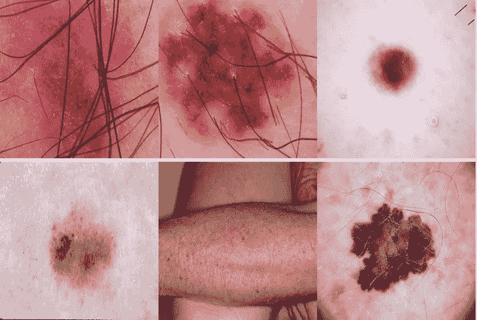

黑色素瘤皮肤癌还是不是？

数据集可以通过这个[链接](https://www.kaggle.com/fanconic/skin-cancer-malignant-vs-benign)在 Kaggle 上访问。总共有 3，297 幅图像，分成 2，110 幅训练图像、527 幅验证图像和 660 幅测试图像。这是一个相当小的数据集，专门用来节省计算成本。然而，我将选择一个实现，其中图像的数量可以很容易地增加到任何数量，而几乎不需要修改代码。

这项工作将被记录在一个 Jupyter 笔记本中，这个笔记本可以放在本地机器上，也可以放在云中。强烈建议使用 GPU，因为它将显著加快模型训练的速度——可能高达 10 倍。数据集足够小，可以与 Google Colab 一起使用(它可以访问覆盖我们需求的免费 GPU)。

## 数据处理和探索

与所有其他数据相关的工作一样，我们需要先加载并了解数据。这些图片的大小是(224，224)，我现在会保持原样。如果我们在将图像放入 GPU 内存时遇到问题，我们可能会考虑降低分辨率。但是我们应该小心，因为我们可能会丢失重要的信息。降低批量大小(我最初设置为 32)可能是一个更安全的选择。

数据存储在文件夹中，一个文件夹用于训练集，一个文件夹用于测试集。这些文件夹中的每一个都包含另外两个文件夹，每个类别一个，即恶性(1)和良性(0)。在训练期间用于检查模型性能以相应地调整学习的验证集将对应于训练文件夹中最后 20%的数据。

数据结构。

我们将创建数据生成器，这些生成器将在训练期间批量向模型提供数据。通过使用批量训练，几乎任何大小的数据集都可以在训练期间进行处理，并允许我们在需要时扩大规模。生成器还负责将图像从原始的`[0, 255]`缩放到更适合神经网络的`[0, 1]`范围。这将允许更快的收敛，从而训练，同时也提高性能。

定义数据生成器的 Python 代码。

运行上面的代码，我们可以确认我们正在处理一个小数据集。2110 幅图像用于训练，527 幅用于验证，660 幅用于测试。

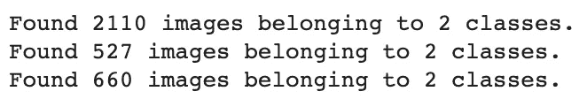

确认数据集大小。

此外，我们可以对这三个生成器进行快速的健全性检查。我们希望训练数据批次的大小为`(32, 224, 224, 3)`，而标签的大小为`(32,)`。32 表示批量大小，而 224 和 224 表示图像大小，3 表示图像通道。因为我们处理的是彩色图像，所以每种 RGB 颜色都应该有一个维度。

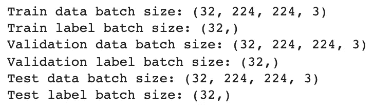

确认数据生成器尺寸。

接下来，我们将通过班级形象化一些图像来更好地理解我们正在学习的内容。这些都是从列车组加载的。

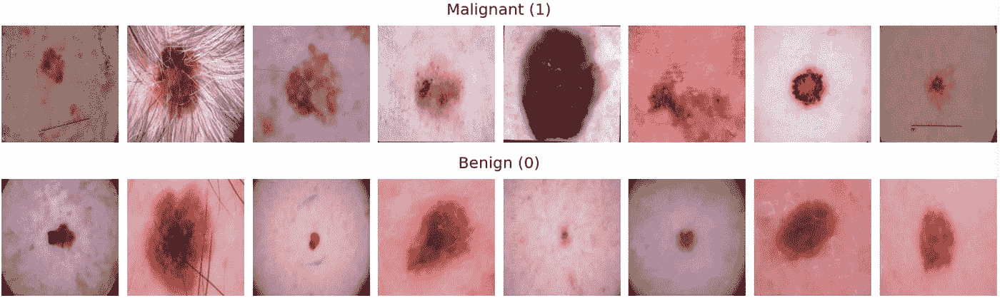

来自训练数据的恶性(上)和良性(下)样本图像。也许恶性肿瘤的图像稍微难看一些。不过，我不相信自己会做出这个决定。

平均而言，恶性肿瘤(1)看起来确实比良性肿瘤(0)稍难看，只有少数例外。但是对于一个没有受过训练的人来说，区分上下两排是一件非常困难的事情，我自己也不太有信心对这些进行分类。幸运的是，我们有放射科医生，也许还有深度学习系统很快会帮助我们(事实上，这些系统已经在那里了)。

让我们继续显示类比率。

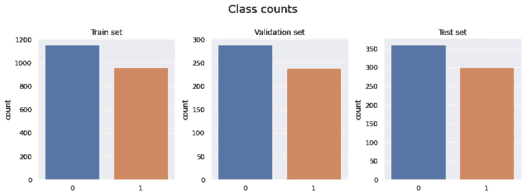

良性(0)和恶性(1)肿瘤之间的等级比率在所有三个分裂中大致相同；大约 55:45%

这三组图像中，良性图像占 55%,恶性图像占 45%,等级比例相当，几乎没有等级不平衡可言。

接下来，定义在模型训练期间要跟踪的重要指标。我们将优化 AUC(因为它代表了一个更好的模型),但密切关注召回，因为错过将肿瘤分类为恶性比意外将良性分类为恶性更糟糕。前者可能导致病人的死亡，而后者虽然很不方便，但只会让病人经历更多的检查。

## 定义初始偏差和回调

首先计算初始输出偏置。这将有助于模型在训练期间更快地收敛。

计算启动模型训练时要使用的初始输入和输出偏差。

在 Keras 中，回调可以用于几个方面。在这种情况下，我们将实施:

*   `ModelCheckpoint`:用于训练时在验证集上评估时保存最佳模型。我们只保存最好的型号，如果新型号更好，会覆盖旧型号。
*   `EarlyStopping`:深度学习模式培训需要时间。如果验证 AUC 在 10 个时期内没有增加，这将导致培训停止。
*   `CSVLogger`:将每个纪元后的度量存储在. csv 文件中。

定义回调以在模型训练期间存储结果。

# 基线模型

神经网络很难训练，为了得到你想要的结果，有很多旋钮需要调整。出于这个原因，引入错误很容易把事情搞砸。一种常见的方法，也是我们将在这里采用的方法，是从一个只有几层的简单模型开始。这也有一个继承的优势，即允许我们为问题找到最简单的模型，这个模型表现得足够好。我们将努力坚持 [KISS 原则](https://en.wikipedia.org/wiki/KISS_principle)。

`SeparableConv2D`层将被用来代替更常见的`Conv2D`层，因为它们训练更快，需要更少的内存，同时经常产生更好的结果。`MaxPooling2D`层用于在每个卷积层之后对特征图进行下采样，并且由于其经证明的优越性能而被选为优于其他池的选择。

由于这是一个二进制分类问题，我们添加了一个完全连接的分类器，该分类器具有单个输出单元(`Dense`层具有 1 个单元)和输出层中的`sigmoid`激活函数。激活函数的一般目的是实现数据中非线性关系的映射。

> 激活函数的一般目的是实现数据中非线性关系的映射。

隐藏层中会使用`Relu`激活函数，因为与其他选择相比，它通常会产生更快的收敛。我们还启动了上面创建的输出偏差，以更好地反映数据集中的类不平衡。这样，该模型就不必在第一个时代花时间学习这个。尽管在这种情况下，差异将是最小的，因为类是相当平衡的。

`filters`的数量、`kerne_size`、`pool_size`、`Dropout`的速率、隐藏层的数量以及它们的堆叠方式都是应该调整以获得最佳性能的超级参数。研究人员花费了他们整个博士学位来构建这些架构，这些架构随后会向公众发布。我们根本没有时间花在这上面，所以我们会做一些简单的事情。稍后，我们将通过迁移学习来利用其中的一些架构，这是该领域非常常见的方法。

定义创建基线模型架构的功能。

## 创建基线模型

使用之前定义的`make_base_model()`函数创建基线模型。二进制交叉熵被用作损失函数，因为这是一个二进制问题，并且因为目标标签被存储在一个向量中，如我们之前看到的(而不是一位热编码)。`Adam`默认优化器`learning_rate`通常可以很好地解决这类问题。

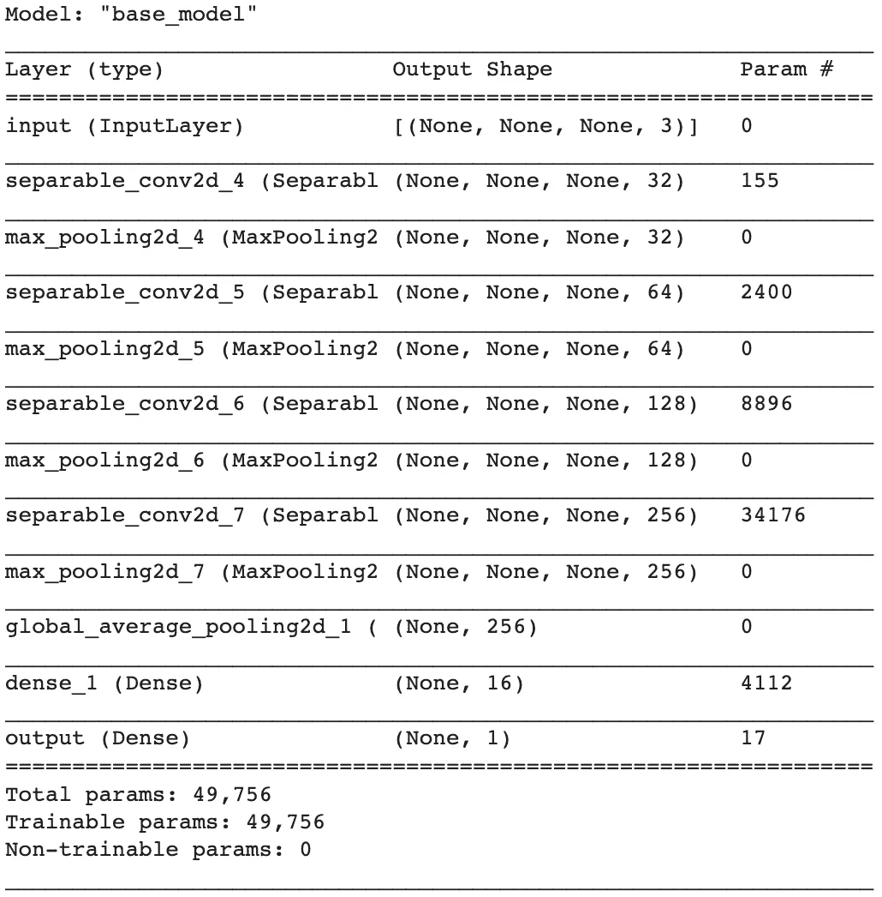

基线模型架构。

最终的架构总共有 49，756 个参数，这些参数都是可训练的。

## 训练模型

接下来，我们将训练 50 个时期的模型，并跟踪训练和验证集的结果指标。将它们存储在一个名为`history`的变量中。请注意，由于我们实施了回调，如果验证 AUC 在连续 10 个时期内没有增加，模型将在 50 个时期之前停止训练。

启动基线模型培训的代码。

根据我们使用的硬件，培训会有所不同。但是通过在 Google Colab 上使用免费的 K80 GPU，大约需要 5 分钟。

## 检查培训历史

绘制训练集和验证集在训练期间的损失、准确性、AUC 和召回。

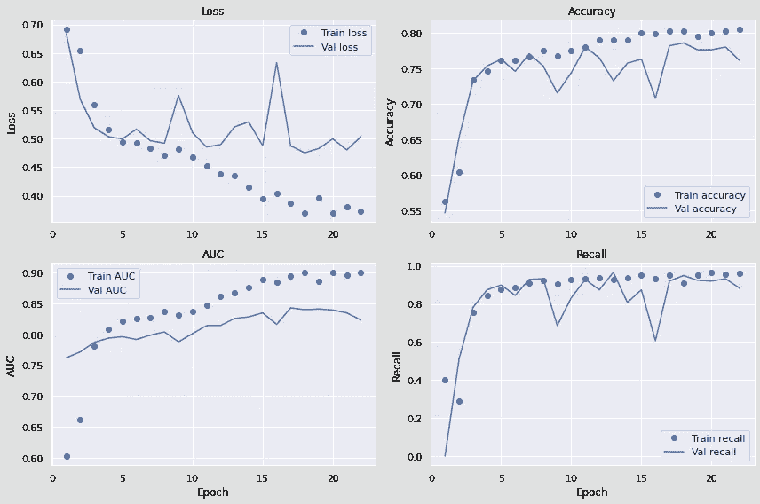

基线模型的训练和验证集的丢失、准确性、AUC 和召回。

首先要注意的是验证曲线是多么的不规则，它们呈之字形。我们还注意到*高偏置*——特别是在精度方面。这可能是小模型不能正确学习数据特征的结果。*方差较低*，所有指标的训练和验证曲线之间只有微小差异。

然而，理想情况下，我们会使用类似于 [Keras Tuner](https://keras-team.github.io/keras-tuner/) 的东西来正确地构建和评估这样的架构。但由于这是一个非常资源密集型的过程，我们将把它推迟到将来使用更强大的 GPU 时进行。

## 情节混乱矩阵

让我们在测试集上评估模型。请记住，我们在训练期间只存储了最佳模型，因此我们将使用它。我们还将绘制一个混淆矩阵，以更好地理解模型的优点和缺点。预测阈值设置为 50%，这意味着模型需要至少 50%的置信度，以便将样本分类为恶性。

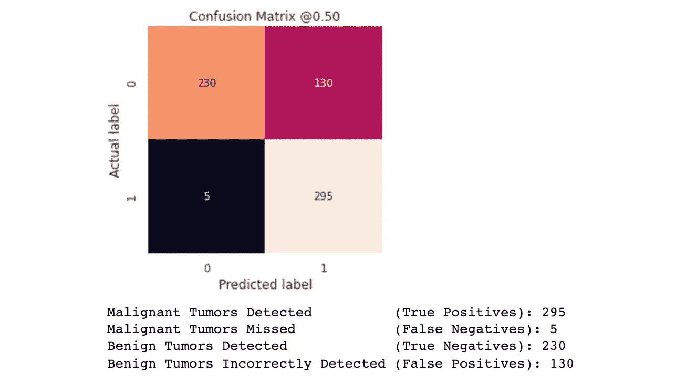

基线模型的混淆矩阵。

该模型正确地分类了 295 个恶性肿瘤和 230 个良性肿瘤。它只漏掉了 5 种恶性肿瘤。到目前为止一切顺利。然而，如果我们看一看良性肿瘤被错误地归类为恶性肿瘤的数量，我们就会看到一个严重的问题。似乎每当模型不确定样本属于哪一类时，它就将其分类为恶性。安全总比后悔好。但是，由于 130 种无害的肿瘤被错误地归类为恶性肿瘤，许多患者将面临不必要的担忧和检查。显然我们可以做得更好。

## 绘制 ROC 和 AUPRC

不过，在继续之前，让我们在插值精度-召回曲线 (AUPRC)下绘制*接收器工作特性* (ROC)和*面积。这些曲线非常有用，因为它们以清晰的方式显示了真阳性和假阳性(如 ROC 中)以及精确度和召回率(如 AUPRC 中)之间的权衡；当一个度量增加时，另一个度量减少。这是机器学习工程师和数据科学家面临的共同问题。*

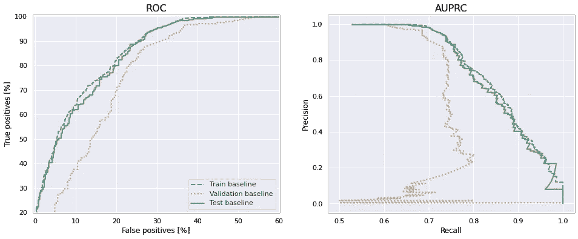

基线模型的 ROC 和 AUPRC 曲线。

理想情况下，ROC 应该尽可能靠近左上角，而 AUPRC 应该尽可能靠近右边。我们可以看到在这两种情况下都有明显的改进空间。不过，该模型正在学习一些东西，这对于接下来的步骤是令人鼓舞的。

## 训练和评估多个基线模型

由于系统和张量流级别的随机性，每次运行的结果都不同(这里的运行是指构建、训练和评估模型)。为了更好地评估模型的性能，需要构建、训练和评估 10 个模型，并对其结果进行平均。理想情况下，我们会运行更多的模型，但这需要很长时间。出于本文的目的，我们可以把它留给将来的工作。

首先定义一个函数，它为我们完成所有这些工作，并输出训练集、验证集和测试集的分数。

用于训练和评估多个模型的代码。

10 次以上运行的结果(含标准偏差)如下所示。所有指标的最低值和最高值之间存在相当大的差异(检查括号内的标准偏差)。然而，我们也可以看到，这个相当简单的基线模型已经表现良好，召回率为 92%，AUC 为 86%，准确率为 76%。正如我们之前指出的那样，精确度较低，为 70%，因为该模型似乎总是倾向于在不确定时预测恶性肿瘤。

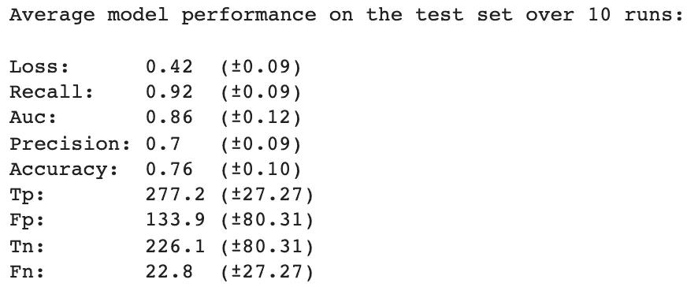

10 次运行的平均基线模型性能。

# 数据扩充

提高模型性能的常见方法是添加更多数据。如果这是不可能的，那么旋转、缩放、翻转、调整亮度等对你已经拥有的数据，往往可以是一个很好的和简单的方法来提高模型的性能。这在`Keras`中使用我们之前使用的`ImageDataGenerator`很容易做到。在数据加载过程中增加有两大好处；我们可以利用 GPU 中的并行线程，允许更快的处理，并通过允许它接受任何类型的原始图像，使最终的生产就绪模型更加健壮。这样，我们就不必担心如何在并行过程中正确地预处理图像，因为模型架构会处理好所有的事情。

## 使用增强功能定义数据生成器

旋转范围用于将图像随机旋转 30 度，而`fill_mode='constant'`用一个常数值(在本例中为黑色或 0)填充原始和增强图像区域之间的差异。知道了这一点，其余的参数就不言自明了。

为了获得最佳的模型性能，可以也应该对这些参数的具体设置进行实验。请记住，指定范围越大，创建的新图像就越多，训练模型所需的时间和处理能力也就越多。好处是我们有可能得到更好的结果。同样，这也是我们经常要做的一个常见的权衡。

训练和验证发生器的`save_to_dir`参数用于存储发生器处理的图像。这对于检查什么样的图像被输入到模型中非常有用，如果模型的行为不符合预期，这可以让我们避免很多麻烦。经过反复试验，我已经注释掉这些以节省磁盘空间。

请注意，我们没有**而不是**在验证和测试集上使用数据增强，因为我们不希望模型在生产时图像看起来是那样的。除了这些小的变化，发电机与以前非常相似。

增强的数据生成器。请注意，我们不**而**在验证和测试集上使用增强，因为我们不期望模型在生产中使用时图像具有那些质量。

## 可视化增强图像

想象一些增强的图像。

应用数据增强。

我们注意到增强图像周围的黑色区域以及旋转、放大或缩小，在某些情况下还有亮度差异。这通常允许模型更好地学习类之间的差异，因为它有每个图像的更多变化可以学习。

## 用增强图像训练模型

我还选择在卷积层之后增加 50%的压差。这意味着 50%的输入单元在训练期间被随机丢弃。它迫使模型学习更重要的数据特征，并且是进一步调整模型以防止过度拟合的一种方式。这通常会导致验证和测试集的改进。脱落层仅在训练期间被激活。

38 个周期后，验证 AUC 停止改善，模型终止训练。

## 检查培训历史

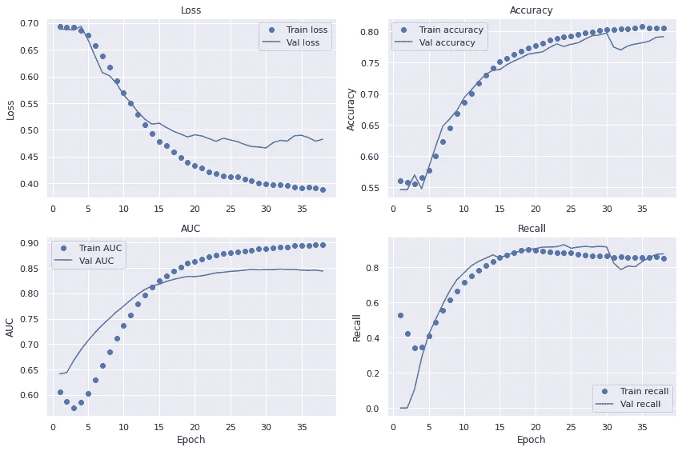

使用基线模型的带有增强图像的训练和验证集的训练历史。

总之，基线模型之间似乎没有什么区别。相当令人失望。然而，数据集很小，并且在该过程中存在随机性。让我们再深入一点。

## 混淆矩阵

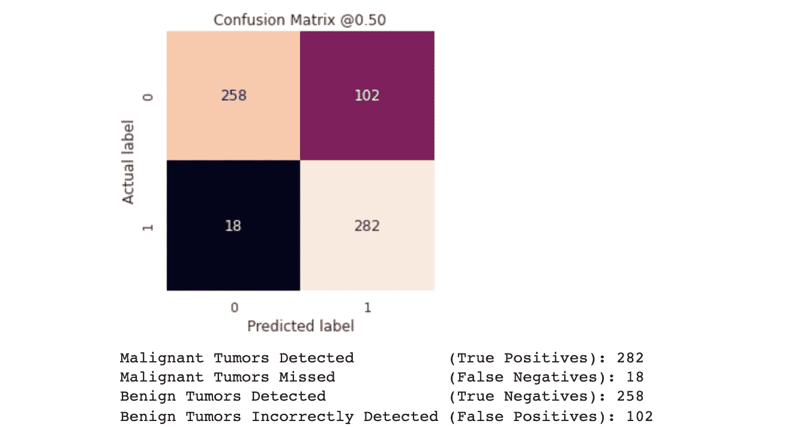

扩充基线的混淆矩阵。

测试集上的指标都相当具有可比性，并且可以单独用随机性来解释。

## 绘制 ROC 和 AUPRC

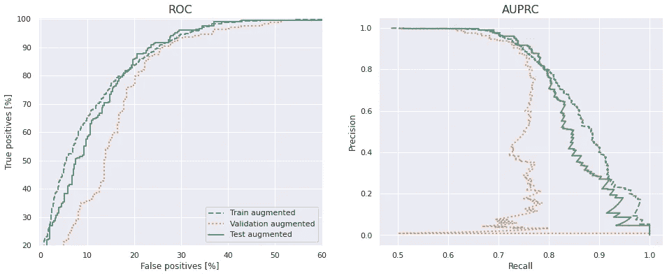

扩充基线模型的 ROC 和 AUPRC 曲线。

ROC 曲线和 AUPRC 曲线也是如此。ROC 可能比以前稍好一些——在测试集上实现了 90%的真阳性率和 23%的假阳性率。

比较这个模型和基线的性能的一个更准确的方法是运行每个模型很多次，然后比较平均值。接下来让我们开始吧。

## 训练和评估多个模型

让我们用数据增强来训练和评估 10 个模型。使用 50%的退出率，每个周期训练 25 次。

如下所示，每个指标的标准偏差低于基线模型。这表明增加数据增加和减少似乎有稳定的效果。此外，丢失、召回、AUC 和准确性都稍高，表明模型整体更好。精度仍然相当低，虽然像以前一样只有 70%。

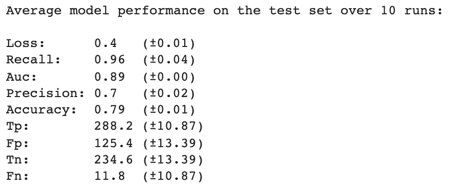

使用增强图像的 10 次运行的平均基线模型性能。

处理有限数据集的一种常用方法是利用预先训练好的模型。我们接下来将对此进行研究。

# 预先训练的例外模型(迁移学习)

迁移学习包括使用已经训练好的模型，并将其应用于不同的问题。总体思路是，通过在大型数据集上预先训练模型，该模型能够学习可以推广到其他领域的特征。该数据集越大越全面，预训练模型能够学习的特征就越好，有效地充当视觉世界的通用模型，并且这些学习的特征在其他计算机视觉问题中变得越有用。

我们将使用在 [Imagenet](https://imagenet.stanford.edu/index.php) 数据集上预先训练的 Xception 架构，这个数据集如此之大，以至于很少有研究人员和工程师有资源从头开始训练一个模型。在预训练期间使用了 120 万张分成 1000 个类别的图像，尽管数据集跨越了超过 1400 万张图像。

我们将采用的方法是使用 Xception 架构作为卷积基础构建一个模型，并在其上添加一个密集连接的分类器。以前只有卷积基在 Imagenet 上训练过，我们将把这些权重加载到模型中。

## **加载异常卷积基数**

加载 Xception 卷积基，用`weights='imagenet'`实例化。指定`include_top=False`排除了上面的密连层(我们想用自己的)。其原因是模型中的较低层倾向于包含特征和目标之间的更一般化的映射，而顶层倾向于更具体的任务。

用 Imagenet 权重加载例外卷积基数。

运行上面的代码实例化了 Xception 卷积基，并输出一个(很长的)架构摘要，如下所示。

例外卷积基。

请注意上面的例外基数有多大，总共有 14 个块，每个块由许多层组成。与基线的 49，756 个参数相比，总共有 20，861，480 个参数。这是 400 多倍的参数！

## 在顶部添加一个分类器，并冻结卷积基础

除了添加的例外卷积基础，构建这个模型看起来与之前非常相似。

在卷积基础上增加一个分类器。

在编译和训练模型之前，冻结卷积基非常重要。*冻结*一个层或一组层意味着在训练期间保持权重不被更新。如果我们不这样做，那么卷积基先前学习的表示将在训练期间被修改，并可能被破坏。我们可以在 Keras 中通过设置属性`trainable=False`来做到这一点。

冻结卷积基数。

上面的代码块将输出以下内容。

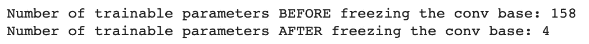

冻结卷积基前后模型中可训练参数的数量。

通过编译模型，我们存储这些变化。我们也降低了学习速度，让学习速度慢了一点。

冻结卷积基后，如下所示，可训练的参数应该会明显减少。

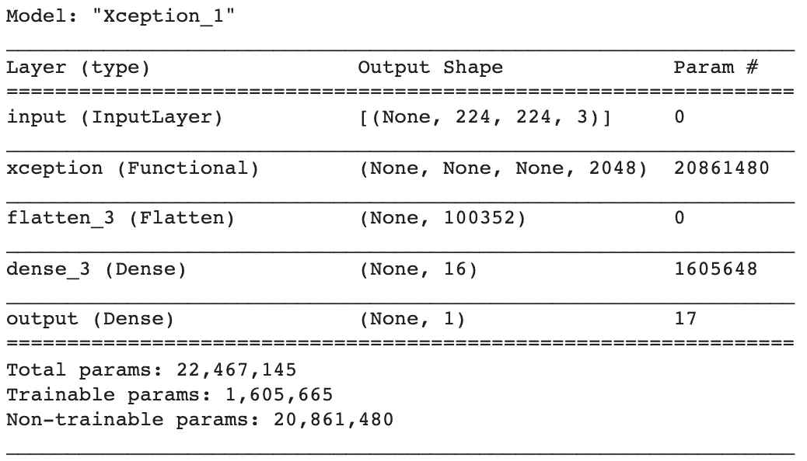

冻结卷积基后的异常模型架构。

## 训练模型

我们将模型设置为训练 100 个时期，而如果在 10 个时期内验证 AUC 没有改善，则将其调整为停止训练。

## 检查培训历史

在培训期间检查指标时，我们注意到偏差比以前的方法低。在训练集上，准确性、AUC 和召回曲线比以前更高。训练损失也在不断减少，表明模型的学习能力还没有达到极限。然而，在大约 25 个时期之后，所有四个度量都停滞在验证集上，并且给我们一个具有高方差的模型。训练集和验证集的性能之间的这种差异可能是数据集太小的结果。处理高方差的最好方法之一就是添加更多的数据。

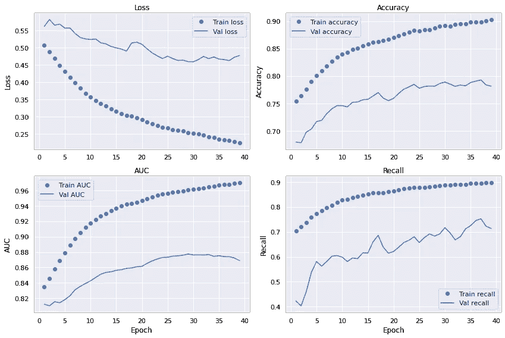

使用数据扩充的异常模型的训练和评估集的训练历史。

## 混淆矩阵

看看测试集上的性能，我们注意到它与以前的模型大致相当。然而，这里的主要区别是更高的精度，这意味着该模型比以前更频繁地得到正确的结果。不过，这似乎是一种权衡；召回率较低。

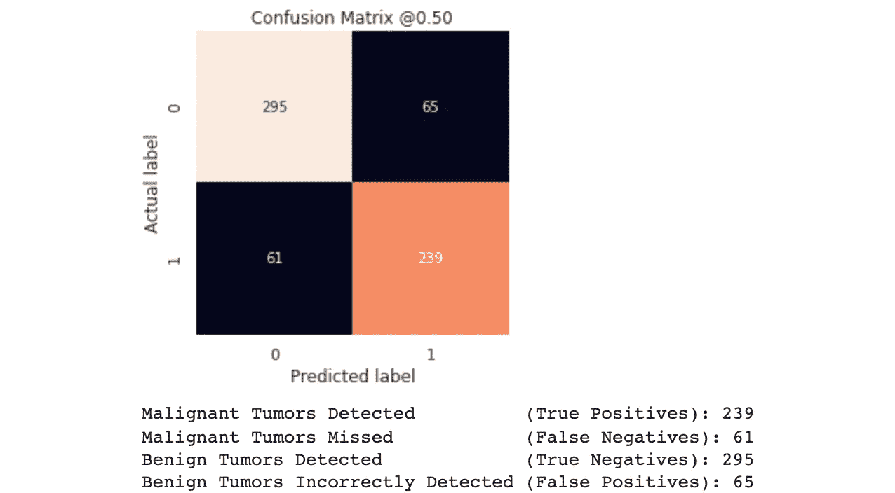

例外模型的混淆矩阵。

该模型遗漏了 61 种恶性肿瘤——这是一个显著的数字，比以前更多。然而，也有相当少的良性肿瘤被错误检测(65)。

## 绘制 ROC 和 AUPRC

ROC 图和 AUPRC 图如下所示，它们证实了高方差；一方面是训练集，另一方面是验证和测试集。

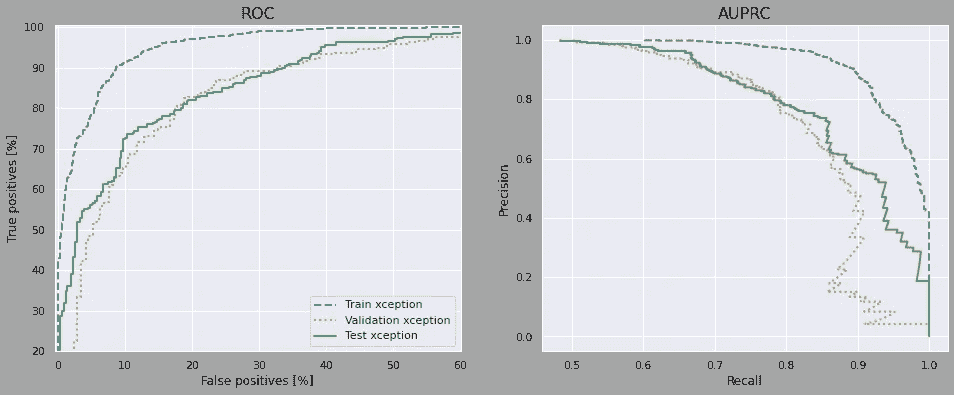

训练集、验证集和测试集上异常模型的 ROC 和 AUPRC 曲线。

## 训练和评估多个异常模型

实例化、训练和评估多个预训练的异常模型。

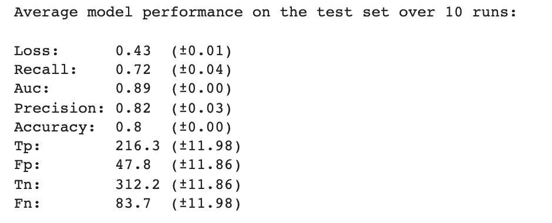

e Xception 模型 10 次运行的模型性能。括号内的标准偏差。

如上所示，使用预先训练的异常模型似乎确实可以降低大多数指标的标准偏差。这是一件好事，因为我们可以在任何给定的时刻对模型的性能感觉更好。我们还可以确认与之前相比更高的精度，同时保持大致相同的准确度和 AUC。然而，较高的精确度是以较低的召回率为代价的。重要的是，与以前的模型相比，该模型需要更长的训练时间，并使用更多的磁盘空间(大约 100MB)。

# 微调异常模型

对预先训练好的模型进行微调通常会有所收获。然而，如前所述，为了能够在顶部训练分类器，有必要冻结*异常*卷积基。出于同样的原因，**一旦顶层的分类器已经被训练好，就只能微调卷积基础的顶层**。如果分类器还没有被训练，在训练期间通过网络传播的误差信号将会非常大，以至于先前学习的权重将会被破坏。接下来，微调预训练网络的步骤如下:

*   在已经训练好的网络上添加自定义网络。
*   冻结已经训练好的基地网络。
*   训练添加的自定义网络。
*   解冻基础网络中的一些顶层。
*   联合训练这些层和添加的定制网络。

我们已经实施了前三个步骤。让我们继续解冻 Xception 卷积库的最后几层。请记住，第一层学习更多的通用特性，而后面的层(或者更深入)学习更具体的任务。已经在 Imagenet 上训练了初始权重；一个包含大量动物、自然和人类图片的数据集——这些图片与癌症肿瘤截然不同。迁移学习已被证明在非常多样化的数据集上是成功的，但为了增加在最后几层中学习更多肿瘤相关特征的可能性，我们将解冻更大的块。在这个特例中，让我们选择解冻 *block14* 中的所有图层；一共 6 层。尝试解冻更多的块可能是一个好主意。

## 指定可训练层

*区块 14* 中的所有图层将被解冻，如下图所示。

解冻卷积基底中 *block14* 的所有图层。

这导致了下面的模型架构。

block14 解冻时的例外模型。现在有 640 万个可训练参数。

通过解冻*模块 14* 中的最后 6 层，我们将可训练参数的数量从 160 万增加到大约 640 万。

## 调整和评估异常模型

我们将以非常低的学习速率训练模型，以避免破坏网络已经学习的权重的风险。大约 17 分钟后，验证 AUC 停止改善，训练终止。

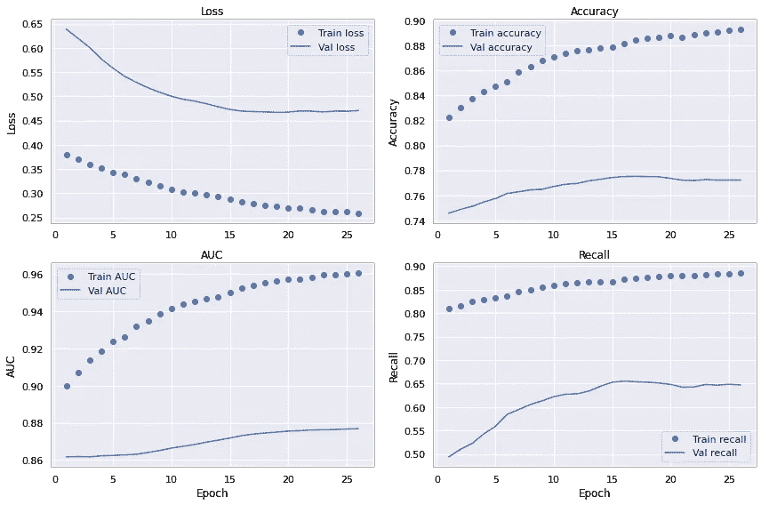

优化异常模型的训练历史记录。

这些曲线显示了与之前相似的特征，具有显著的方差和相当低的偏差。目前还不清楚仅从这些图来看，微调是否提高了性能。

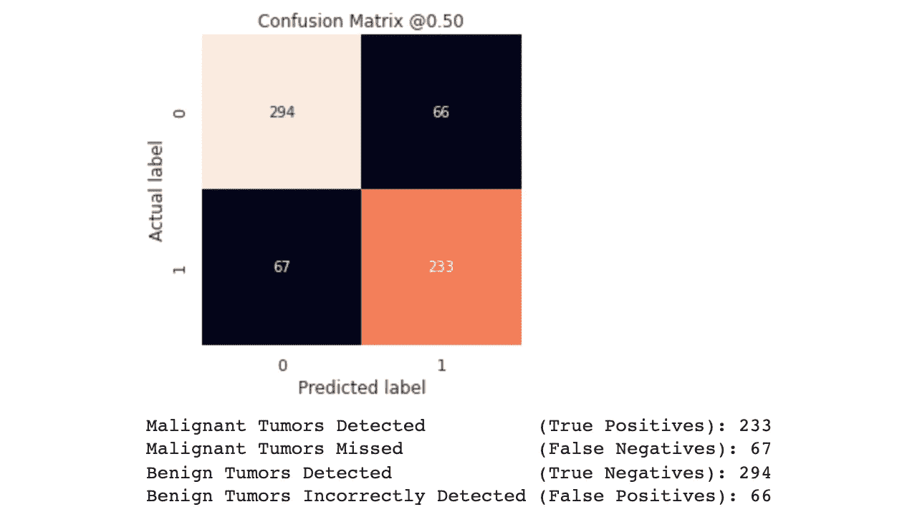

调谐例外模型的混淆矩阵。

微调的 Xception 模型和之前的版本之间似乎没有什么区别，在之前的版本中，我们只在顶部训练了自定义分类器。在某些情况下，我们可以期待有百分之几的改善。微小的差异甚至表明微调会略微降低模型性能。但是，这可能是由训练和数据加载期间的随机启动造成的，应该通过运行多个模型并对其结果进行平均来进行更彻底的研究。这是相当昂贵的计算，将留给未来的工作。

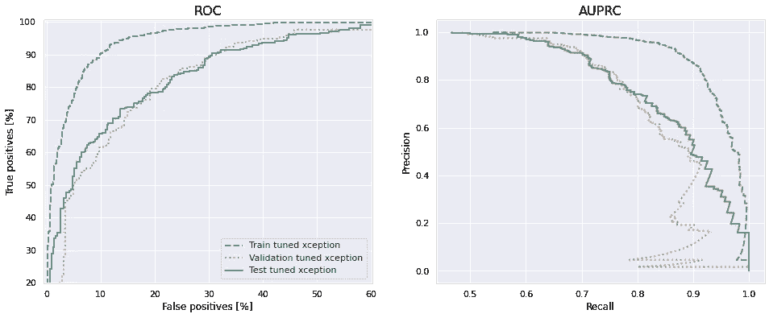

ROC 和 AUPRC 在列车上弯曲，验证和测试集用于调谐的 Xception 模型。

ROC 和 AUPRC 曲线也证实了微调模型的高方差。

# 摘要

下图显示了在测试集上运行 10 次后，*基线*、*基线和*例外和例外的平均损失、召回、AUC、精确度和准确度。只看下面的图，不清楚哪个模型表现最好。在较高的召回率和较低的精确度(两个基线)之间有一个折衷，即较低的召回率和较高的精确度(例外)。所有三个模型显示相似的 AUC 和准确性。添加数据扩充显著降低了所有指标的标准偏差，并带来更稳定的模型。

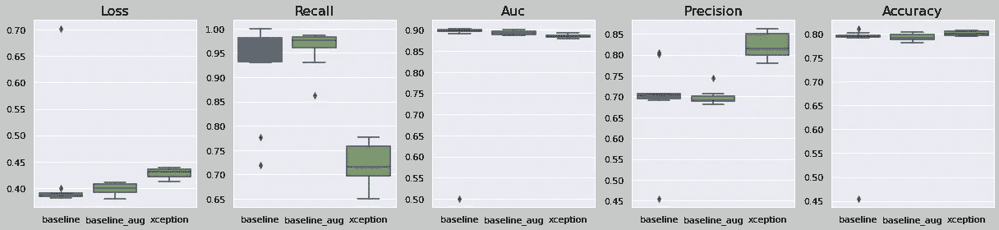

所有已训练模型的汇总图。

为了更全面地了解模型的性能，我们还应该比较训练集和验证集上的指标。至于基线和增强基线，模型在早期就达到了最大学习能力——这意味着即使我们增加更多的数据，也几乎没有改进的空间。然而，即使在验证指标停滞不前之后，异常模型也在训练集上不断改进。通常可以通过向模型中添加更多数据来处理由此产生的高差异，从而提高性能。

因此，如果我们受限于当前数据，使用数据扩充基线可能会更好，因为它的性能与更大的异常模型相当，但训练速度更快，占用的磁盘空间更少，并且通常不太复杂。它也比没有增加数据的基线更可靠。然而，如果有一种方法可以收集更多的数据，那么 Xception 模型可能会在大多数(如果不是全部)指标上表现得更好。

我们的结论是，使用深度学习来区分恶性和良性皮肤癌是可能的。未来的工作应该从收集更多的数据开始，因为这可能会产生最大的改进。