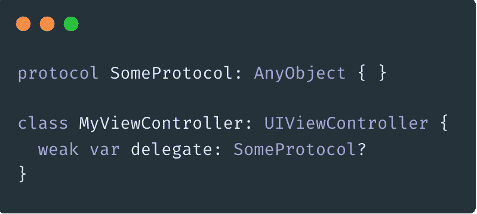

# 检测 iOS 中的内存泄漏

> 原文：<https://blog.devgenius.io/detecting-memory-leaks-in-ios-25360e6ee51f?source=collection_archive---------0----------------------->

## 了解内存泄漏以及如何使用工具和内存图来捕获它们

阿姆扎·安德烈在 [Unsplash](https://unsplash.com?utm_source=medium&utm_medium=referral) 上拍摄的照片

iOS 开发并不总是给屏幕添加漂亮的颜色和实现 dope 动画。为了确保给用户最好的体验，工程师必须确保不在他们的源代码中引入任何内存泄漏。

# 什么是内存泄漏

基本上，内存泄漏是指应该从内存中释放的对象没有被初始化，它仍然像幽灵一样徘徊不去。当内存不能被释放时，这是存在保留周期的标志。

保持循环是指两个或更多的对象持有彼此的强引用。因此，这些对象在内存中相互保留，因为它们的保留计数永远不会递减到 0。这阻止了调用 deinit 和释放内存。

当一个对象强引用另一个对象时，这意味着存在一个保留周期

# 但是我为什么要关心内存泄漏呢？

现在的内存容易存取，价格便宜，而且数量巨大。我们不再需要使用只有大约 1 兆存储空间的软盘。那么，我为什么要关心我的应用程序是否有一两次内存泄漏呢？我可以利用其他可用的空间！

嗯，操作系统(OS)关心有多少内存正在被使用。如果应用程序接近分配空间的尽头，iOS 将向应用程序发出警告。如果应用程序没有及时处理它，那么操作系统将会退出应用程序，因为内存不足而崩溃，以便为其他进程回收内存。

在应用程序崩溃之前，用户看不到内存问题。这破坏了应用程序的稳定性，并造成了糟糕的用户体验。这导致用户不高兴，并可能失去业务客户。

崩溃会造成糟糕的用户体验，从而导致不愉快的客户

# 如何防止内存泄漏？

防止内存泄漏的最好方法是根本不引起内存泄漏。当您移动到下一个屏幕/显示一个新的视图控制器时，请务必仔细检查您创建的对象是否已被取消初始化。

确保保留周期中断的一个方法是使用**弱**关键字。我将展示两个关于如何对一个对象应用弱引用的例子。

## 委托模式

委托/协议模式的代码示例

当您希望一个对象符合一个协议时，一定要在协议声明中添加一个 [AnyObject](https://github.com/apple/swift-evolution/blob/master/proposals/0156-subclass-existentials.md) 约束。如果不添加类约束，编译器默认会给你一个错误。委托模式中的代理应该被声明为**弱**，并且应该被声明为可选的。问号是使变量成为可选变量的语法，这意味着该变量可以有值，也可以为空或为零。确保委托是可选的，可以确保在视图被取消初始化时释放值。

## 关闭

默认情况下，将函数用作闭包会保持强引用。如果您必须将一个对象传入您的闭包，您必须使用捕获列表来保存一个对该对象的**弱**引用。

向闭包内使用的对象添加 weak 的代码示例

在这个例子中，对象 *someModelVC* 保存了对函数 *actionHandler* 的引用。如果我们在这里没有 weak 关键字，那么 actionHandler 在默认情况下也会在这个闭包内有一个对 someModelVC 的强引用。所以**弱**关键词打破了这个保留循环。

# 如何检测内存泄漏

Apple 为开发人员提供了一些工具来帮助捕捉内存泄漏，等等！

## 工具

Instruments 是一个可以让您查看各种性能数据的软件。这是一个性能分析器和可视化工具，如果你有 Xcode，它会自动安装到你的机器上。在下面的截图中，您可以看到许多评测不同事物的评测模板。

仪器中可用的模板，泄漏模板突出显示

## 运行仪器

1.  打开 Xcode
2.  插入您的设备
3.  在设备/模拟器下拉菜单中选择您的设备，并启用自动签名
4.  产品→配置文件(Cmd + I)
5.  仪器启动时，按顶部的红色按钮
6.  点击设备上的应用程序

仪器每 10 秒运行一次泄漏检查。这是可配置的，您可以更改任何给定仪器的首选项。然而，就 RAM 和 CPU 时间而言，泄漏检查是非常昂贵的，所以我建议将其保持在 10 秒。

## Xcode 的内存图形调试器

iOS 开发人员可能更熟悉的工具是内存图调试器。

Xcode 上用红色圈出的内存图形调试器按钮

如果您还没有使用过这个工具，那么在开发时很容易访问它。点击图标将暂停您的应用程序，并生成一个对象图，其中包含这些对象对其他对象的引用。如果检测到内存泄漏，您会在 Xcode 的左侧面板上看到紫色图标。

Xcode 从一个闭包泄漏内存警告

## 使用 Xcode 的内存图形调试器

1.  打开 Xcode
2.  在设备/模拟器下拉菜单中选择您的设备，并启用自动管理签名
3.  从 Xcode (Cmd + R)运行代码
4.  点击设备上的应用程序
5.  点击 Xcode 上的内存图形调试器

Instruments 不是内存图调试器的替代品，而是检查内存泄漏的伴侣。两者各有利弊。一个工具可以发现另一个工具可能遗漏的东西。Instruments 的一个优点是，我不需要停止应用程序就可以看到有什么泄漏。当我运行应用程序时，我可以看到所有这些数据。不过 Xcode 里的内存图是直截了当的。我可以看到运行时错误以及哪个对象泄漏了。

# 技巧

*   添加到您的开发习惯中的一个好的实践是在特性开发期间检查内存泄漏，这样您就不会在以后遇到任何意外。
    –运行仪器以在开发前收集内存数据
    –实现您的功能
    –在发出拉取请求前再次运行泄漏跟踪
*   永远记住在物理设备上运行和测试你的应用，尤其是当你检查性能和内存使用时。因为模拟器使用 Mac 的处理能力，所以在模拟器上运行代码看起来一切都很好，直到应用程序在生产中开始崩溃。

# 最后的想法

什么是内存泄漏？我忘记了

当两个或更多的对象持有对彼此的强引用时，就会发生内存泄漏，这会导致一个保留循环。打破保持循环将修复内存泄漏。

将工具和内存图调试器都添加到您的工具带中可以帮助尽早发现棘手的问题。开发人员有责任确保他们的代码是高性能的，这样用户就可以有无缝的体验。

更多 iOS 开发内容，一定要关注我的 Medium！

# 参考

*   [Swift 中的去初始化](https://docs.swift.org/swift-book/LanguageGuide/Deinitialization.html)
*   [WWDC19:乐器入门](https://developer.apple.com/videos/play/wwdc2019/411)
*   [雷·温德里希:Swift 乐器教程](https://www.raywenderlich.com/16126261-instruments-tutorial-with-swift-getting-started)
*   [利用 Swift: Instruments 进行黑客攻击](https://www.hackingwithswift.com/read/30/overview)
*   [利用 Swift 进行黑客攻击:如何将协议限制在类内](https://www.hackingwithswift.com/example-code/language/how-to-restrict-a-protocol-to-classes)
*   [DoorDash 工程:如何使用 Xcode 的内存图调试器检测 iOS 内存泄漏并保留周期](https://doordash.engineering/2019/05/22/ios-memory-leaks-and-retain-cycle-detection-using-xcodes-memory-graph-debugger/)