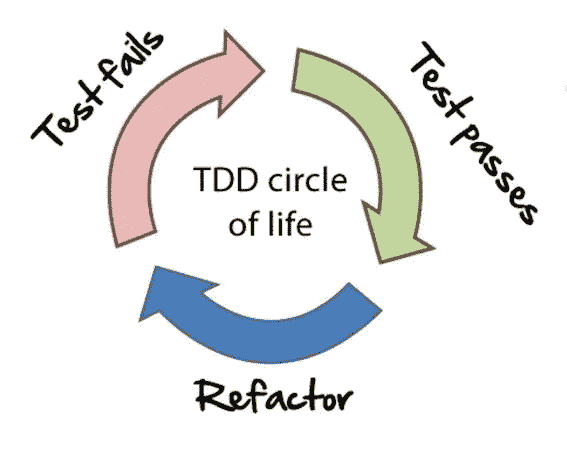
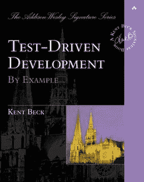
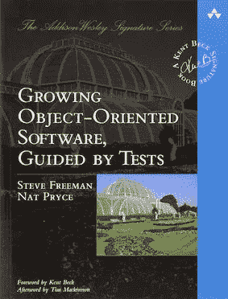
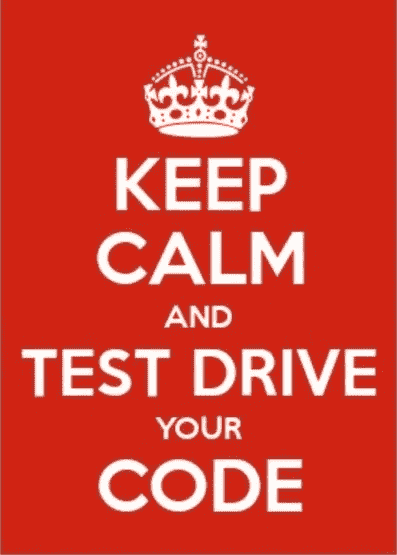

# 测试驱动开发的底特律和伦敦学派

> 原文：<https://blog.devgenius.io/detroit-and-london-schools-of-test-driven-development-3d2f8dca71e5?source=collection_archive---------0----------------------->

# 介绍

测试驱动开发(TDD)已经成为现代开发人员工具箱中的核心工具之一。它的实践通常被认为是软件专业的表现。

测试驱动的开发周期

我做 TDD 已经十多年了。我参与的每个项目都获得了一种略微不同的方法。我可以很容易地说出具体的技术，比如状态或交互测试、测试加倍、模拟、自下而上的应用程序开发，或者广义的设计。但是总是缺少一些东西，一个将这些有时相互矛盾的技术组合在一起的通用术语，并阐明与给定技术相关的利益或风险。一次对话(嗨，大卫！)已经改变了这一切。这就是我如何了解到**底特律和伦敦的 TDD** 学校(或风格)的，并决定深入探索以发现更多。实践 TDD 是一种简单明了的技术，尽管困难在于细节。

在这篇文章中，我将概述测试驱动开发的两个流派之间的主要区别，研究形成实践的具体技术，分析它们如何解决问题，并建议如何减轻使用它们所带来的风险。我的目标是保持独立，希望这不是徒劳的努力(谁没有强烈的意见？).尽管向我挑战，指出我错在哪里。

# 一点历史或“位置，位置，位置”

测试驱动开发起源于 90 年代末的底特律，脱胎于克莱斯勒的全面薪酬体系。Kent Beck，该项目的首席工程师，在 ***测试驱动开发示例*** 一书中整理了技术并概述了实践。TDD 成为了**极限编程(XP)** 方法中一个基本的最佳实践，为新兴的敏捷运动奠定了基础。贝克提倡的方法的细节被认为是底特律，或者是 TDD 的古典学派。突出的代表还有罗伯特·c·马丁(鲍勃大叔)、罗恩·杰弗里斯和马丁·福勒。

测试驱动的开发很快就流行起来。几个世纪以来，伦敦为发人深省的思想提供了肥沃的土壤。21 世纪初，伦敦的极端星期二俱乐部(XTC)成立。它吸引了英国 TDD/XP 实践者的先锋，并提供了一个伟大的社区来分享经验、技术和想法。它帮助 Steve Freeman 和 Nat Pryce 提炼出他们的 TDD 愿景，这导致了在测试 指导下的 ***成长面向对象软件的出版。仅次于 Kent Beck 的书，它很快成为测试驱动开发的第二大重要出版物。书中提倡的风格被称为伦敦 TDD 学院***的**，有时也被称为**模仿者**。它整理并阐明了以前不广为人知的模拟对象技术。**

# 通往觉悟的两条道路

底特律和伦敦的学校都称赞 TDD 实践的好处:稳定的增量过程、消除恐惧、设计的简单性和代码的质量。然而，它们提供了达到 TDD 涅槃的不同指导方针。我把它们分成三个部分:

*   单位的定义
*   设计和测试写作练习
*   测试替身的使用

让我们深入了解一下它们有多大的不同。

# 单位

单元测试是 TDD 的标志性活动。单元测试中的单元是什么？

在古典主义的世界里，**单位是模块**。模块是一个单独的类，只是一个函数，或者是一组紧密相关的类，它们实现了特定的功能。不管它有多小多简单，也不管它有多复杂，充满了内部协作。模块的功能由公共导出(API)公开。因此，在 Detroit 风格中，您针对该模块编写一个测试。

另一方面，在伦敦学校，一个单元测试通常是在考虑一个类的情况下编写的，因此**单元往往是一个类**。如果一个类有合作者，他们会被嘲笑(模仿者风格，记得吗？)，使依赖的应用层分离。使用模拟对象实现了这种方法，这也是编写测试的可能方式。另一方面，如果你认为它更有益的话，没有什么可以阻止你把它作为一个模块来使用。

在底特律风格中，测试中的**系统(SUT)** 随着应用程序而增长，使得单元测试在一个扩展的上下文中运行。在伦敦风格中，使用模拟代替真实的合作者使得测试设置变得很小并且环境受到限制。

# 新兴设计与测试写作实践

应用程序设计是一门复杂的学科。传统上，团队通过一系列非编码活动来处理它，比如深度分析、UML 草图或者广泛的设计会议。TDD 方法几乎是相反的。它本身就是一种设计技术。它让测试决定系统的设计。这并不意味着架构只来自于测试。好的架构是随着时间的推移，通过迭代设计出来的。你需要一段时间才能最终找到一个好的。TDD 学派对待设计的方式是独特的，并且也体现在你编写测试的方式中。

从底特律的角度来说，我喜欢把它看作是深入挖掘。从一开始就关注对核心逻辑及其复杂性的探索。不要回避直接投入其中。如果你需要一个合作者，那就去实现它，用最简单的方法让你的测试通过。处理垂直切片。发现背后的东西，及早整合。挖洋葱的中心。不要担心广度，它会及时到来。观察设计是如何出现的。

在伦敦风格中，你的探索首先从获得更广阔的视野开始。做一个粗线条的设计。先画几样东西，不要太多，刚够得到系统的心智模型。探索 API 入口点，确定合作者之间的角色、职责和关键交互。不深究，这不是重点。从顶部开始，向内推进。重点写一个第一层的测试。嘲笑你的合作者，承诺以后充实他们的行为。一旦准备好深入，确定下一层，重复这个过程。一个接一个地探索洋葱的层次。最终，你会到达心脏。

底特律风格是由内向外的设计过程，而伦敦、**则是由外向内的设计过程。他们能影响最终的设计吗？没有证据证明。系统的测试方式在短时间内形成了它的设计。它越完整，测试风格的影响就越小。另一方面，有人可能会说*深挖* vs *分层作业*会产生一个明显的系统。这只有在特征周期很长时才会发生。然而，如果周期很短，并且持续生产少量但完整的产品，我看不出设计中有大的差异。此外，除了编写测试的方式之外，还有更多的东西需要设计。很快会有更多的报道。**

# 测试双打

底特律学派认为:*如果一个对象很难测试，那么就很难使用*。伦敦商学院更进一步说:*如果一种依赖很难被模仿，那么就很难被利用*。两者相辅相成，也有一些区别。

虽然侧重于垂直切片，底特律风格并不特别关注合作。协作，只要是内部的，都被包含在测试工具中并完全初始化。测试夹具产生一个几乎完整的系统。这导致**不需要大量使用模拟**，并且能够进行**状态验证**。实际上，随着单元测试扩展到整个系统，它们变成了小型验收测试。虽然这并不意味着你不需要测试替身，即模仿，如果一个合作者变得尴尬。

在伦敦的方法中，层发现优先，模仿成为风格的面包和黄油。在一个单位就是一个类的世界里，嘲弄合作者更方便**。您只绘制通过特定测试所需的交互部分。虽然断言状态是明智的，但通常你依赖于**来验证交互**。您希望确保代码对其合作者进行所有相关的调用，以实现预期的目标，结果可能只会在下面显示出来。**

底特律风格只需要很少的端到端测试。通常，你只需要几个就可以演示集成系统的正确布线。在伦敦的风格中，如果你最终得到的是被严重嘲笑的测试，那么端到端测试的需求就更大了。他们将为系统提供急需的信心，否则无法保证这一点。

值得一提的是 ***模拟对象*** 是一种被广泛误解的技术，它的使用激起了最激烈的争论。模拟不是关于隔离代码依赖。它是试驾系统设计过程中的一个工具。它们有助于推迟你现在不想做的决定。不管怎样，下面的观点都是公平的，不会互相矛盾。

> “程序员测试应该对行为变化敏感，对结构变化不敏感。(……)如果我关心操作的顺序，我就设计了错误的系统”——肯特·贝克(底特律学派)
> 
> “如果我有一个具有行为的对象，而我在做‘告诉，不要问’，那么我只能测试交互。”史蒂夫·弗里曼(伦敦商学院)

# 你做错了！

任何工具或技术，无论多么聪明，都可能被误用。如果你只有一把锤子，就很容易把所有东西都看成钉子。批评很快出现。相反，让我们看看一些与样式相关的反模式，以及如何减轻它们。因为这不是技巧的问题，而是你做错了的事实！

# 底特律:我的装置太复杂了

有如此多的测试，你需要将 fixture 代码复制到每个测试用例中。你的测试例子已经失控了。你的测试变得膨胀，微妙，难以阅读。每一个小的产品代码调整都会迫使你改变许多测试。 ***你做错了！***

*   是时候花些时间在你的测试代码上了。引入常见的 fixtures(工厂、构建器、对象母亲)并在测试中重用它们。它们应该用领域语言来表达，并且易于阅读。你希望他们给你讲一个系统如何团结一致的故事。也许你不仅可以简化测试设置，还可以简化系统本身？
*   如果它仍然太复杂，也许你的模块试图做太多。设计有问题吗？再带一双眼睛，再复习一遍。
*   测试代码的质量和产品代码的质量一样重要。这是你的文件。测试必须写得便宜，易于阅读，易于修改。

# 伦敦:我花在修正测试上的时间比写生产代码还多

你在使用模拟。太好了。这里嘲笑一个，那里嘲笑另一个。这个模拟返回另一个模拟，地狱耶！你动作很快。你的测试是绿色的。一切都棒极了。有一天，你有了一个伟大的想法，如何在不改变功能的情况下，让你的应用变得更加简单。这是你不想谈论的一天。一切都在下降。你不能动。每一个微小的变化都会导致数百次测试失败。 ***你做错了！***

*   你正在遭受测试引起的损伤。重构是一场噩梦，功能交付会显著变慢。您的模拟重测试与实现如此紧密地联系在一起，以至于每一个微小的变化都是一个大问题。是时候拿起你的剑面对野兽了！
*   有人忘了告诉你一个关于模仿的小细节。模仿对于推迟决定是很棒的，但是你不应该留下太多的模仿。一旦你完成了所有的排序、理解和实现，为什么不引入一个真正的合作者来代替一个模仿者呢？这可能需要更大的重构，但是，嘿，你在这里获得了信心。您的单元测试变成了小型验收测试。这是一场胜利！这也是一个回顾甚至删除一些测试的好机会，因为你可以用更少的资源获得更多的覆盖率。哦，你可能不需要这么多端到端的测试。你对此有什么看法？
*   你有没有挠头想知道这个测试到底证明了什么？它受到了如此严重的嘲笑，以至于很难判断它是否有任何价值。杀了它。不能信任的朋友不是朋友。
*   经验法则是:更少的模仿导致更可进化和无错误的系统。只要能带来价值，就使用模拟。他们不应该阻止你前进。他们不应该阻止你重构。留着它们，只要它们有用。当他们开始挡路时，退后一步再看一看。

# 底特律或伦敦:我的设计还没有成形，它是一团泥…

一次又一次的测试你的系统变得越来越复杂，脱离了你的控制。这种设计应该出现在哪里？我没看到！编写下一个测试并保持其他测试通过只会越来越难。我讨厌这个底特律/伦敦 TDD 学校。 ***你做错了！***

*   如果架构仅仅来自于测试，那你就是在自找麻烦。仅仅因为你写了很多测试，并不意味着你的设计会开花结果。另一方面，如果你的设计很糟糕，你的测试会告诉你。它们将变得更难写，太脆弱而难以维护，太复杂而难以理解。是时候退后一步，思考一下，画一点草图，开始一次重构狂飙了。
*   花在学习建筑和设计上的时间会有回报的。要观察新兴的设计，你需要对好的设计保持敏感。这些设计模式在这里会很有用。但不要过度工程化。不要从第一天就引入大架构。只要让测试引导你，惊奇的事情就会发生。

# 在嘲笑和名声的代价上走了一点弯路

对许多人来说，使用模拟已经成为测试驱动开发的同义词。我甚至看到过招聘广告，要求候选人使用模拟框架展示她对 TDD 的流利程度。也许流行是因为这种风格更容易开始:你不需要构建太多的上下文，层更容易处理，团队冲突更少，并且有大量的模拟库可供使用。虽然模拟对象的想法很好，但它是一个很容易被误用的工具。许多人指责伦敦 TDD 学院被严重的模拟驱动，并对系统设计产生了不良影响。这与事实相去甚远。伦敦商学院在定义最佳实践时拥抱了模仿的好处，这样应用程序就不会遭受过度模仿。在进行模仿时，值得记住几个要点:

# 备受嘲笑的测试并不是它的最终状态

使用模拟进行发现，推迟一次性编写所有产品代码。一旦你把一切都整理好了，检查一下模拟是否还有用，或者只是把你的测试和实现捆绑在一起。一些模拟会有用，去掉其余的。

# 使用模拟进行尴尬的协作

当与外部服务、文件系统或数据库对话时，测试双精度对于消除缓慢或不确定性是非常宝贵的。模拟为您的测试提供了快速和稳定的优势。您还应该考虑使用 fakes(具有工作但简化的实现的对象),它可以带来类似的好处，而且可以被重用。假货在快乐路径场景中特别有用。

# 使用模拟来诱发错误

当应用程序需要处理外部交互产生的错误时，应用程序就变得复杂了。如何让你的应用有弹性？测试错误。有许多方法可以在测试中引起错误，模仿是一个突出的例子。

# 仅模拟您拥有的类型

不要嘲笑外部的第三方代码。模仿你不完全了解的外部 API 的复杂性是一件危险的事情。它给你一种错误的自信感，并使你的测试设置更加困难。引入一个适配器层。您可以在整个应用程序中重用它，而不会泄露外部 API 细节。当嘲弄适配器时，您处于控制之中——您知道合同。此外，您可以通过集成测试来评估适配器实现的正确性。

# 使用正确的嘲讽工具

去找适合工作的工具。不要想当然。在你选定一个之前先玩几个。如果这很难操作，或者需要记住的东西太多，去试试另一个。最受欢迎的不一定是最好的。如果你的语言有一流的、简洁的 lambda 支持，并且重定义一个函数或方法很容易，那么考虑不要使用模仿库。拥抱函数式编程风格。在我多年使用 Scala 和 Clojure 的过程中，我从未使用过外部模拟工具。

# 摘要

我希望你有机会理解底特律和伦敦 TDD 学校的区别。到现在为止，你应该明白使用这种或那种风格的区别，它们在单元测试、测试写作方法和测试替身上的不同表现。我希望你能看到这两种风格是如何同样有用，而不一定互相矛盾。在下一个项目中，你会采用哪种方法？也许技术的结合能带来好处？选择对你有用的。务实，保持开放的心态。只要你在正确的水平上测试，明智地使用合适的工具，并让你的想法干净一致地实现，你应该是好的。如果有些东西不工作，听听你的测试并重构。保持你的测试快速，易读，便宜。您的测试工具是您系统的活文档。它给你信心。它让你晚上睡得更好。赞美你的测试。如果他们不给你前进的勇气… ***你就做错了*。**

感谢邓肯·麦格雷戈、马特·麦克唐纳、本·亚瑟、奥古斯托·罗德里格斯和詹姆斯·安德斯的评论、更正和讨论。