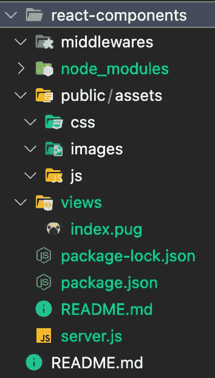

# Dev IRL:如何使用 Create React App 向 Express powered 网站添加 React 组件(不带弹出)

> 原文：<https://blog.devgenius.io/dev-irl-how-to-add-react-components-to-an-express-powered-website-using-create-react-app-336670c9261a?source=collection_archive---------4----------------------->


图为[舒巴姆·达吉](https://unsplash.com/@theshubhamdhage?utm_source=medium&utm_medium=referral)在 [Unsplash](https://unsplash.com?utm_source=medium&utm_medium=referral)

我们通常将 React 定义为一个库，而不是一个框架。理论上，你可以在你的网站上添加 React，而不必完全依赖它，也不必更新网站的内部结构。但在实际操作中，如果你只是想用 React 添加一些组件，那就另当别论了。

# TL；速度三角形定位法(dead reckoning)

> 如果只是想看最终文件，可以去 repo:[https://github . com/Simon riche/medium-stories/tree/main/react-components](https://github.com/SimonBriche/medium-stories/tree/main/react-components)
> 
> 如果你想要一步一步的教程，请继续阅读😄

正如《宣言》所述:

> 你可以在一分钟内将 React 添加到一个 HTML 页面中。然后，您可以逐渐扩展它的存在，或者保持它包含在几个动态小部件中。

虽然这种说法是正确的，但是如果你按照教程去做，你最终会得到一堆不那么“生产就绪”的代码。此外，您将无法获得 [Create React App](https://create-react-app.dev) (CRA)的所有好处。

因此，在编写我的即插即用 React 组件之前，我的要求是:

1.  使用 CRA，并获得其所有功能
2.  能够根据我的网站结构编译到特定的文件夹
3.  在任何 HTML 文件中加载 React 组件
4.  仅加载页面上使用的 React 组件的代码
5.  用 HTML 标记将属性注入组件
6.  组件之间的通信能力
7.  能够动态添加更多组件
8.  轻松测试组件(无论是独立的，与他人或在最终网站本地)
9.  不需要弹出 CRA(不要为自定义 webpack 配置而烦恼)
10.  *奖励*:在远程 CDN 中托管组件

让我们从 Express powered 网站的最低配置和文件夹结构开始(请不要在生产中使用！仅供测试之用):



使用根文件夹中的`node server.js`运行服务器，访问`http://localhost:3000`，您应该会看到您的索引页面。注意，我在这里使用了`pug` [模板](https://pugjs.org/)，因为我喜欢它简洁的语法😄

现在，我们可以通过在根文件夹中运行`npx create-react-app react-cmp`在`/react-cmp`文件夹中安装一个默认的 Create React 应用程序。`cd react-cmp`和`npm start`，你会看到你默认的 React 应用🎉

让我们稍微调整一下 React 应用程序，在`react-cmp`文件夹的根目录下创建一个`.env` [文件](https://create-react-app.dev/docs/advanced-configuration)。现在，只需添加以下两行:

```
BROWSER=none
PORT=4200
```

这将防止 CRA 在启动时打开一个新的浏览器窗口(我不喜欢这种行为)和改变 CRA 服务器的监听端口(默认是 3000，这也是我们的快速服务器端口)。您现在可以打开两个终端窗口，一个通过运行根文件夹中的`node server.js`来启动我们的 Express 服务器，另一个通过运行`/react-cmp`文件夹中的`npm start`来启动 CRA 服务器。访问`http://localhost:3000`上的快速服务器和`[http://localhost:4200](http://localhost:4200.)`上的 CRA 服务器。恭喜你，我们已经达到了第一个目标:*访问 CRA 的所有功能*！

# 建立档案

我们的第二个目标是在 Express 服务器可访问的位置构建文件。默认情况下，如果你运行`npm run build`，CRA 会用编译后的文件创建一个`/react-cmp/build`文件夹。由于我们的 Express 服务器访问其`public`文件夹中的公共文件，我们需要**改变 CRA** 的构建路径。

打开您的`.env`文件并添加以下行:

```
BUILD_PATH="../public/react-cmp/production"
```

这将在 Express 服务器的`production` a 文件夹中构建文件(我们将在后面看到为什么需要`production`文件夹)。目标 2 完成✅

## 在 Express 服务器中加载我们的 React 应用程序

让我们检查一下 CRA 生成的`index.html`文件:

看到文件的路径了吗？显然，这会导致一个难看的`404`错误。幸运的是，我们可以通过在我们的`.env`文件中设置一个`PUBLIC_URL`环境变量来告诉 CRA **最终文件位于哪里**，在我们的例子中:

```
PUBLIC_URL="/react-cmp/production"
```

用`npm run build`重新构建 app，检查新的`index.html`:

好多了！我们甚至可以通过访问`http://localhost:3000/react-cmp/production`查看我们的应用程序运行🎉

这很棒，但是请记住我们的第三个目标:*在* ***任何*** *HTML 文件*中加载 React 组件。

# 反应积分

因为我们需要在任何 HTML 模板中加载 React 代码，所以我们需要获取生成的`.js`和`.css`文件的路径，并将它们放入模板中。但是如果您仔细看看路径，例如`.js`主文件:

```
/react-cmp/production/static/js/main.b37b1599.js
```

…虽然路径本身是相同的，但文件名包含一个哈希，它将在每次代码更新时更新。然而，`index.html`文件本身总是在一个已知的位置:`[PUBLIC_URL]/static/index.html`！

由于我们最终并不真正需要`index.html`文件(我们宁愿加载我们的 Express 服务器页面’),我们仍然可以使用它作为一个*映射*,在那里找到组件的代码(即`.js`和`.css`文件)。

所以我们知道 React 文件在哪里，但是我们需要在每个 HTML 页面中注入它们的 URL。这听起来像是一个小型加载器实用程序的工作！

让我们来看看:

这个实用程序(我们将存储在 CRA 的`/react-cmp/public`文件夹中，就在`index.html`旁边)相当简单:

*   我们获取脚本的当前路径(该路径实际上是在`script`标签的`src`属性中设置的**。这将是我们所有资源的根路径。**
*   我们找到了`index.html`文件，它应该是我们的加载程序的下一个的
*   *我们用正则表达式从`index.html`文件内容中提取出`.js`和`.css`文件的路径*
*   *我们注入并执行`.js`文件*
*   *我们注入`.css`文件*

*最后，将其加载到`index.pug`模板中:*

*最后一件事，在产品构建期间，CRA 可以将运行时脚本作为内嵌脚本嵌入到 index.html 中。为了确保所有代码都将构建在`.js`文件中，我们可以通过添加以下行在`.env`文件中添加一个额外的配置:*

```
*INLINE_RUNTIME_CHUNK=false*
```

*您现在应该看到我们的默认 React 应用程序被加载到我们的`#root`容器 div 中，就在`h1`的下面。任务完成:我们现在可以在任何 HTML 文件中加载 React 组件了 ✅*

# *加载实际组件*

*我们的设置已经完成，我们现在可以编写 2 个(非常)简单的组件，并将它们加载到页面上。但是请记住:我们的目标是**只加载使用过的组件的代码**，而不是整个应用！*

*首先，让我们把它们写下来:*

*正如你所看到的，你很难让他们更简单！在一个标准的 React 应用程序中，我们会导入它们并把它们放在`App`模板中。但是我们希望能够只加载一个、另一个或两个组件。*

*让我们来看看`index.js`文件，那是我们 CRA 的切入点:*

*如你所见，它导入整个`App`并渲染它。我们将更新这个行为来控制**必须加载什么**(基于组件列表)和**如何加载**(只加载需要的代码)。*

## *什么*

*如果您查看默认的`index.js`文件，您会注意到它会搜索一个将`root`作为`id`的`div`,将其用作渲染的容器。以类似的方式，我们可以搜索 HTML 元素的一个非常具体的*集合*，并将它们用作组件的容器。比方说，所有以`__react-cmp`为类名的`div`。*

*至于要在这些容器中呈现的实际组件，我们可以使用 custom `attributes`来存储它们的类名。比方说，`data-react-component`。*

## *怎么做*

*事情是这样的，如果你导入所有可能被插入到我们的 HTML 页面中的*潜在的*组件，你最终会加载*所有的代码*所有的组件，例如只显示一个简单的按钮。好在 React 自带[代码拆分](https://reactjs.org/docs/code-splitting.html)使用 **React.lazy()** 和**悬念**！*

*简而言之，您可以用一个承诺(使用`React.lazy()`)来导入模块，如果模块被实际调用并显示给用户(使用`<Suspense />`)，只有**才能解析。***

## *将“什么”和“如何”结合在一起*

*您已经知道了:这个想法是用`React.lazy()`导入所有的*潜在的*组件，遍历当前 HTML 页面中的`div.__react-cmp`元素，获取它们的`data-react-component`属性，并在一个`<Suspense />`组件中呈现它们。那我们就这么做吧:*

*我们需要相应地更新我们的`index.pug`:*

```
*//old
h1 Hello there !
#root//new
h1 Hello there !
.__react-cmp(data-react-component="App")*
```

*运行`npm run build`更新 React app，重新加载`[http://localhost:3000](http://localhost:3000.)`。你应该看到完全一样的东西，除了 React 应用的容器不是`#root`而是`.__react-cmp`。*

*神奇的事情发生了:如果您将`data-react-component`属性从`App`更新为`TestComponent1`，您应该会看到我们的组件，而不是默认的应用程序！尝试将属性更新为`TestComponent2`或复制容器，现在您就可以在 HTML 页面的任何位置注入任何组件，次数不限。*

*如果您在 DevTools 中检查您加载的资源，您应该看到根据加载的组件，资源是不同的。这实现了我们的第四个目标:*只加载页面上使用的 React 组件的代码🎉**

*这基本上是我们想要的，但现在让我们添加一些功能。*

# *将属性注入组件*

*自定义属性是组件的必备属性。例如，如果你实现了一个“共享”按钮，你必须能够注入 URL 来共享，因为这是不同按钮之间唯一的区别。为了更有趣，你会想给你的按钮设置大小(`normal`、`small`、`big`)，甚至是一个主题(`light`、`dark`)。*

*因为容器是一个 HTML 元素，我们可以用它所有的`dataset`来呈现我们的组件。让我们相应地更新我们的`index.js`文件:*

```
*<Suspense fallback={<Fallback />}>
  <App {...el.dataset} />
</Suspense>*
```

*以及我们的`TestComponent1`的模板来确保我们可以通过组件的`props`访问属性:*

```
*<div>
  I'm the component 1 with attribute {props.testAttribute}
</div>*
```

*更新`index.pug`文件添加`data-test-attribute`:*

```
*h1 Hello there !
.__react-cmp(data-react-component="TestComponent1" data-test-attribute="test attribute value")*
```

*构建并重新加载页面:您现在应该会看到`I'm the component 1 with attribute test attribute value`。您现在可以通过 HTML 属性向组件注入各种类型的(字符串)值！*

*请注意，定制的 HTML 属性必须以`data-`开头，虽然 HTML 属性的名称是破折号大小写，但是在`dataset`属性中它们是驼色大小写。*

# *组件之间的通信能力*

*如果您想对组件的布局有更多的控制，这个目标是非常有用的。*

*假设您想要创建一个图库，带有一个用于过滤、搜索或排序元素的工具栏。你可以用这两者来制作一个组件，但是你需要在它们之间放一些 HTML 元素，或者工具栏需要总是在页面的顶部，等等...长话短说，它们不能在同一个组件中。*

*这里的想法是有一个“桥”，可以跨组件传递事件，因此它们可以互相更新。首先，我们需要将这个桥的引用传递给所有组件。我们只需创建一个新的`EventTarget`对象，并将其作为`bridgeEvent`属性传递给所有组件:*

*然后我们在`TestComponent1.js`中实现了两个简单的计数器:一个用于接收的事件(将在组件本身中递增)，另一个用于按钮被点击的次数(作为自定义`detail`与事件一起传递)。注意，一旦用`useEffect`钩子声明了事件监听器，我们就在`bridge`上添加事件监听器。*

*在`TestComponent2.js`中，我们在每次按钮被点击时调度一个新的事件，点击计数器作为事件的`detail`。请注意，您可以在该属性上传递任何您想要的内容。*

*最后，更新`index.pug`以显示两个组件:*

```
*h1 Hello there !
.__react-cmp(data-react-component="TestComponent1" data-test-attribute="test attribute value")
.__react-cmp(data-react-component="TestComponent2")*
```

*构建并刷新页面。如果你点击按钮，计数器应该增加！我们清除了第 6 个目标:*将信息从一个 React 组件发送到另一个组件*👍*

# *能够动态添加更多组件*

*如果你的应用 100%由 React 驱动，那么动态添加组件就是框架的一部分。但是在我们的例子中，您可能需要在服务器渲染之后添加一些新的组件。换句话说，我们需要能够随时解析 HTML。*

*这是脸书对其 SDK 和 FBML 的典型做法:*

*   *首先，你用`fbAsyncInit`监听 SDK 的可用性*
*   *然后，您可以通过一个全局对象访问 SDK:`window.FB`*
*   *最后，你可以通过调用 `window.FB.XFBML.parse();`随时解析你的 HTML，如果你已经动态地添加了新的部件(这在 SPAs 中很常见)*

*我们可以为组件系统实现类似的行为，对吗？但是有一个小问题:我们需要选择一个可能已经被使用的全局对象名。幸运的是，React 附带了定制环境变量[，我们可以用它来设置这个名字。这样，我们可以在构建时定制这个全局对象的名称。让我们看看如何在我们的`index.js`中实现这一点:](https://create-react-app.dev/docs/adding-custom-environment-variables)*

*首先，我们用默认名称`ReactComponents`定义我们的应用程序名称空间。这个名字可以被替换为在我们的`.env`文件中定义的`REACT_APP_NAMESPACE`环境变量的内容，如果它存在的话。注意，所有自定义环境变量都必须以`REACT_APP_`开头。*

*然后，我们用以下方法实现我们的全局对象:*

*   *一个`ready`属性，用于检查对象是否可用*
*   *一个`parseComponents`方法，用于解析 HTML 文档或特定容器*

*最后，我们通过调用`parseComponents()`(它将解析服务器生成的 HTML)来触发我们的第一个文档解析，我们注意到通过调用(potential) `ReactComponentsAsyncInit`函数，我们的全局对象是可用的。*

*让我们更新我们的`index.pug`文件来使用这个全局对象，并动态实例化一些组件:*

*出于测试的目的，我们添加了一个`#new-components` `div`来进行特定的容器解析，并添加了一个脚本标签，我们将在其中通过一个`addNewComponent()`函数进行动态插入和解析。*

*基本上，我们首先检查全局对象是否可用(通过测试它的`ready`属性):*

*   *如果有，我们可以立即打电话`addNewComponent()`*
*   *如果没有，我们通过创建一个`window.ReactComponentsAsyncInit`函数来等待对象被实例化，这个函数将在第一次解析完成后被调用*

*为了说明这种生成，我们通过`addNewComponent()`创建、附加和解析超时略有不同的组件。重新加载页面，您应该会看到动态组件一个接一个地出现，与`TestComponent1`完全连接。无论你点击由服务器生成的`TestComponent2`，追加到文档或`#new-component`容器的那个，全局事件计数器都会增加，按钮点击计数器会被发送！我们已经成功地*动态添加了更多组件*！✅*

# *轻松测试组件*

*您应该已经注意到，从这个旅程开始，构建和重新加载页面以查看修改是一件痛苦的事情。那么，当我们在一个开发团队中工作时，我们能做些什么来一个接一个地测试组件，与其他人一起或者在最终的网站中？答案就在可以和 React 一起使用的多个`.env` [文件中。](https://create-react-app.dev/docs/adding-custom-environment-variables#what-other-env-files-can-be-used)*

*CRA 最酷的功能之一是实时重载:你只需要保存你的文件，浏览器就会立即反映你的改变。事情是这样的，我们在`index.js`文件中做了更新，当你运行`npm start`并访问`http://localhost:4200`时，什么也没有显示。事实上，我们不再在`#root`容器中呈现任何东西(我们甚至不需要`index.html`来呈现)，但是我们可以使用这个模板来呈现我们的测试！我们缺少的信息是我们想要测试的组件列表。*

*因为我们正在开发，并且我们想在本地机器上测试组件，所以让我们在`/react-cmp`文件夹中创建一个`.env.development.local`文件。这个不会包含在 Git 回购中，所以不会困扰我们的同事。在这个文件中，我们可以定义一个环境变量，该变量包含我们想要测试的组件的类名，以逗号分隔(因为我们希望能够测试多个组件)。姑且称之为`REACT_APP_RENDER_CMP`:*

```
*REACT_APP_RENDER_CMP="App"*
```

*然后，我们可以更新我们的`index.js`文件来获取这个变量，如果可能的话分割它的内容，并在`#root`容器中追加所有组件:*

*注意，所有的环境变量都可以通过`process.env`对象访问。在你的终端中运行`npm start`，访问`http://localhost:4200`，你应该会看到默认的 CRA 应用，就好像你没有改变任何东西一样！现在更新您的`.env.development.local`文件并设置:*

```
*REACT_APP_RENDER_CMP="TestComponent1,TestComponent2"*
```

*在您的终端中再次运行`npm start`(您需要重新启动您的服务器以便考虑环境变量)，重新加载页面，您应该看到两个测试组件。现在，看看这个:如果你改变了`TestComponent1`模板中的一个单词，一旦你保存了这个文件，它会立即在浏览器中更新！🎉*

## *使用属性*

*缺少的一件事是测试具有定制属性的组件。为了保持`REACT_APP_RENDER_CMP`变量和生成逻辑的简单性，我们将创建另一个变量:`REACT_APP_RENDER_CMP_WITH_ATTRS`。这个变量将包含一个数组的 JSON 表示，其中包含我们需要的所有信息:类名和属性。例如:*

```
*REACT_APP_RENDER_CMP_WITH_ATTRS="[{"class":"TestComponent1","data":{"data-test-attribute":"test attribute value"}}]"*
```

*现在，用那些具有属性的组件**的生成逻辑来更新我们的`index.js`:***

*这相当简单:我们基于对象的`class`属性生成组件，然后我们将所有的`data`对象属性作为属性注入。重启您的 CRA 服务器并重新加载您的页面:您应该看到一个没有属性的`TestComponent1`(用`REACT_APP_RENDER_CMP`变量生成的那个)和一个带 `test attribute value`的`TestComponent1` **(用`REACT_APP_RENDER_CMP_WITH_ATTRS`变量生成的那个)。当然，如果`TestComponent1.js`的代码源发生变化，两者都会立即更新。***

*所以你已经独立地开发和测试了你的组件，现在你想在网站上看到结果。很公平。*

## *网站内测试*

*还记得我们设置为`../public/react-cmp/production`的`BUILD_PATH`环境变量吗？是时候设置到`../public/react-cmp/development`了！*

*等等。*

*你仍然需要你的体型，对吗？因此，创建一个`.env.development`文件，并在其中设置`BUILD_PATH`变量，以及`PUBLIC_URL`变量:*

```
*BUILD_PATH="../public/react-cmp/development"
PUBLIC_URL="/react-cmp/development"*
```

*现在您应该有 3 个`.env`文件，它们在运行 CRA 服务器时以这个顺序覆盖变量:*

*   *`.env`设置初始值*
*   *`.env.development`覆盖`.env`值*
*   *`.env.development.local`覆盖`.env.development`值*

*注意，一旦构建完成，组件只考虑`.env`文件的变量。那么，我们如何告诉 CRA 在构建我们的应用程序时获取`.env.development`定义呢？借助`env-cmd`的 [NPM 当然包](https://www.npmjs.com/package/env-cmd)了！*

*基本上，这个包将帮助我们在执行 CRA 的`package.json`文件中定义的脚本时选择一个特定的`.env`文件。让我们通过运行以下命令将它安装在我们的开发依赖项中:*

```
*npm install env-cmd --save-dev*
```

*然后，通过在`scripts`部分添加一个新脚本来更新我们的`package.json`，就在`build`脚本的下面:*

```
*"build:development": "env-cmd -f ./.env.development npm run-script build",*
```

*注意到`:development`部分了吗？这样你可以创建更多的环境，比如`staging` one。现在，运行`npm run build:development`来构建我们的开发应用程序！检查你的`/public/react-cmp/development`文件夹，你应该会看到生成的文件。你应该把这个文件夹添加到你的`.gitignore`文件中，因为它只是为开发阶段准备的。*

*最后要做的是告诉我们的 Express 服务器当前的环境，即`cmp-loader.js`所在的位置。我们可以简单地将`PUBLIC_URL`存储在 Express 服务器的环境变量中，并在`index.pug`模板中更新加载程序的路径以使用它:*

```
*//old
script(src="/react-cmp/production/cmp-loader.js")
//new
script(src=`${process.env.REACT_PUBLIC_URL}/cmp-loader.js`)*
```

*为了简单起见，我们只在`server.js`文件的最开始添加`REACT_PUBLIC_URL`定义:*

```
*process.env.REACT_PUBLIC_URL = "/react-cmp/development";const morgan = require('morgan');
const express = require('express');
const PORT = "3000";
const app = express();....*
```

*当然，你可以在一个`.env`文件中声明`REACT_PUBLIC_URL`变量，并使用[节点领班](https://github.com/strongloop/node-foreman)或`dotenv`NPM 包[来加载它。](https://www.npmjs.com/package/dotenv)*

*就是这样！现在，您可以按照您想要的方式测试您的组件，而不会打扰其他开发人员，因为所有的更改都是通过环境变量完成的，并且临时文件不是 repo 的一部分。🎊*

# *不需要驱逐 CRA*

*这里只需简单说明一下，正如你看到的，我们不需要为这个设置弹出 CRA，这很好，因为你保持简单(不需要额外的 webpack 配置),并且你可以没有太多麻烦地更新 CRA。*

# *✨Bonus✨将组件托管在远程 CDN 中*

*如果您想在远程 CDN 中托管您的组件，您只需:*

*   *相应地设置 CRA `PUBLIC_URL`环境变量，例如`https://your-cdn-solution.com/react-cmp/production`*
*   *将 Express server `REACT_PUBLIC_URL`环境变量设置为与**完全相同的值**，即`[https://your-cdn-solution.com/react-cmp/production](https://your-cdn-solution.com/react-cmp/production)`*
*   *构建文件，这些文件应该存储在由`BUILD_PATH`环境变量定义的文件夹中(在 CRA 的`.env`文件中)*
*   *上传你的 CDN 文件夹中的文件`[/react-cmp/production](https://your-cdn-solution.com/react-cmp/production)`*

*重新启动 Express 服务器并重新加载页面。所有组件的文件都应该来自你的 CDN！🎉*

*拍拍你自己的背，你现在能够在任何现有的 HTML 网站上创建和添加可重用的 React 组件，而不用让它们成为一个 SPA。您甚至可以创建一个完整的 React 应用程序作为静态 HTML 网站上的组件，并将其托管在您的服务器或远程 CDN 中。*