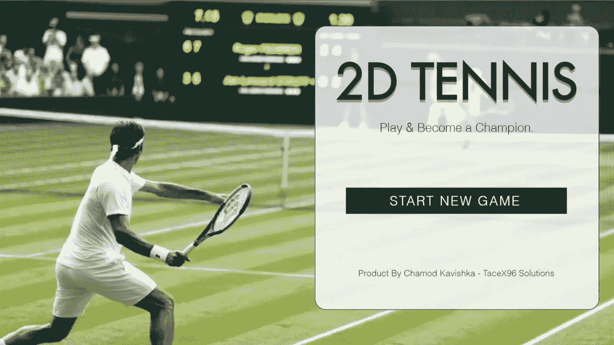
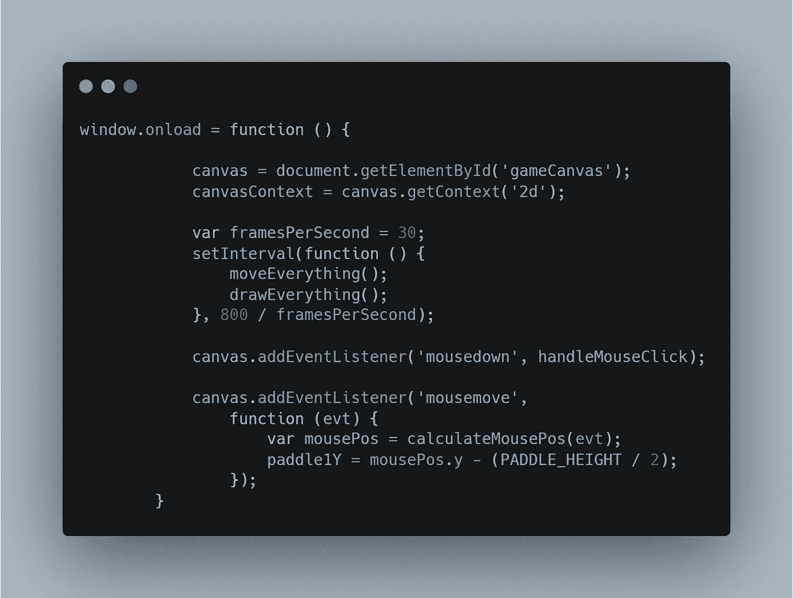
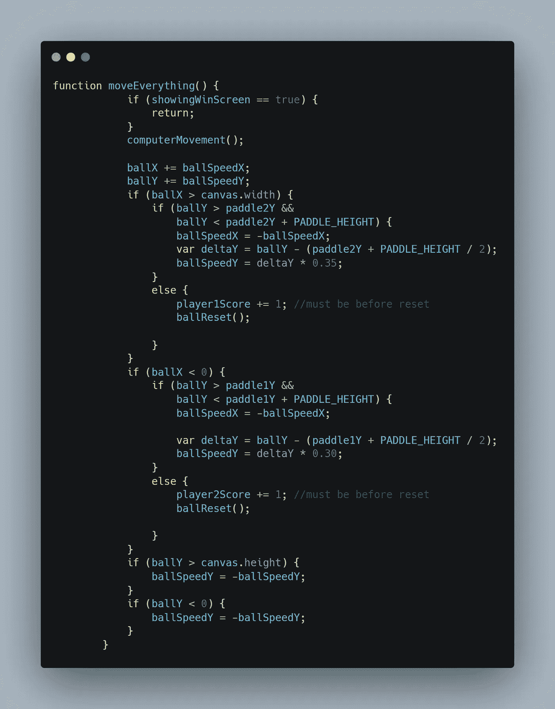
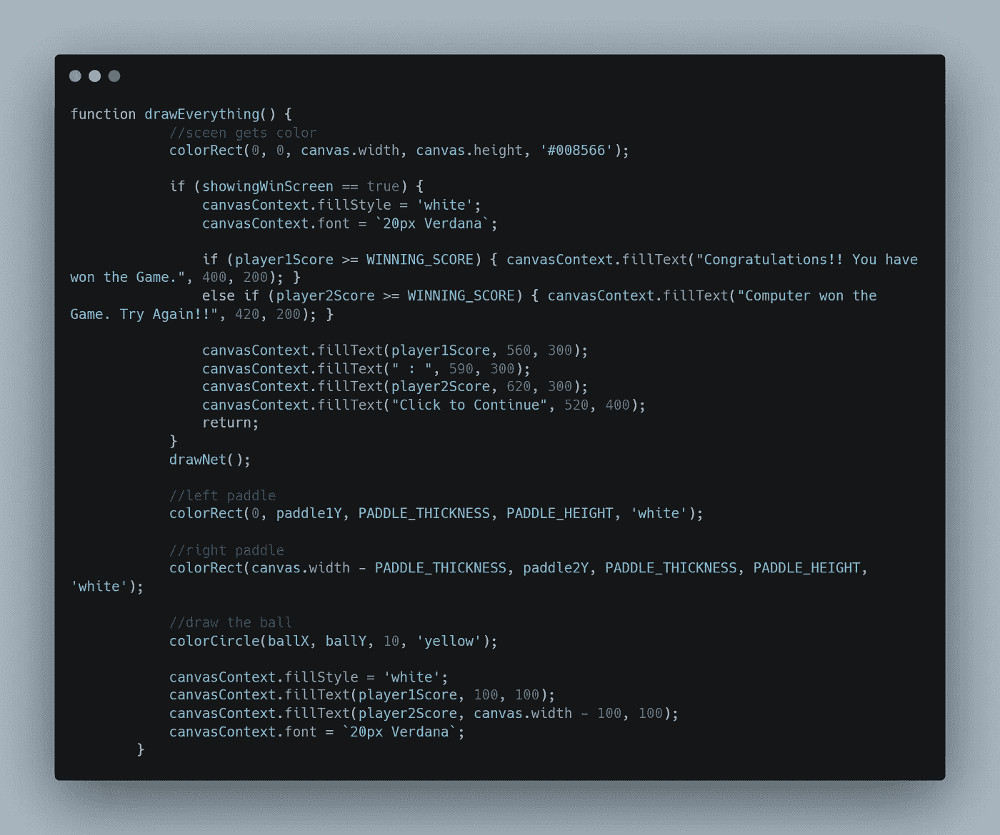
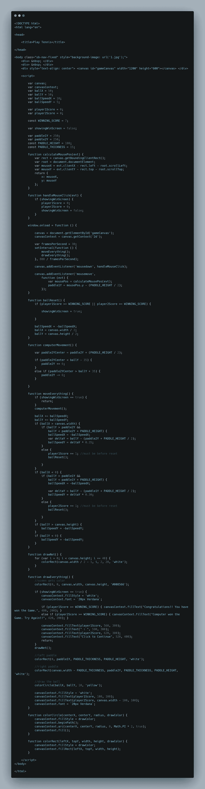
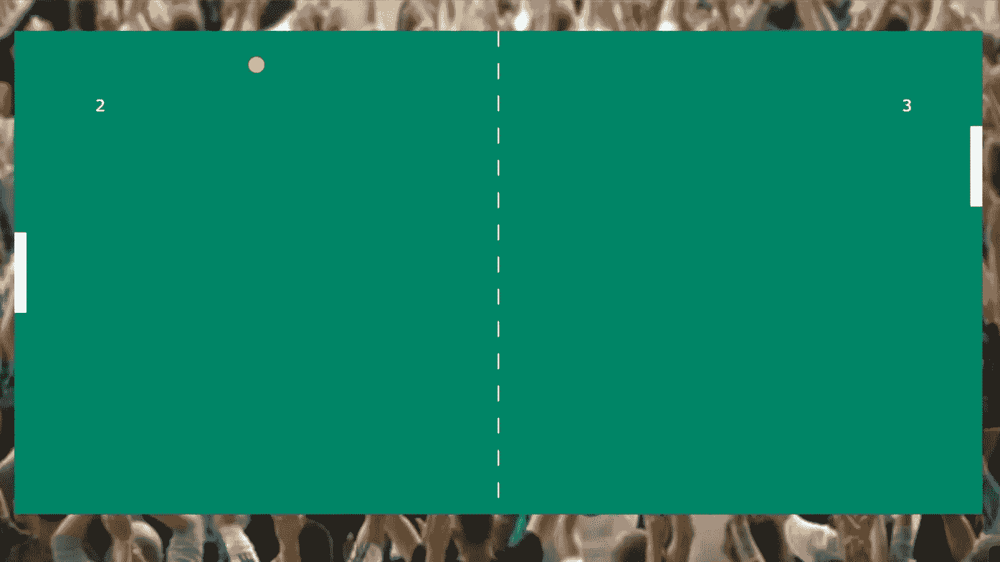
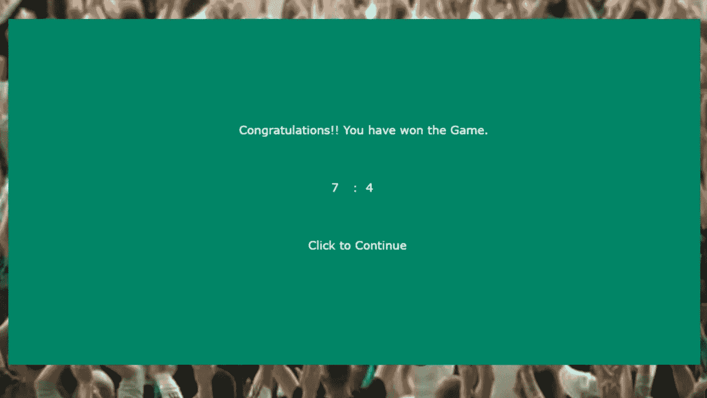

# 用 HTML 和 JavaScript 开发一个游戏

> 原文：<https://blog.devgenius.io/develop-a-game-with-html-javascript-c21780bd9f6b?source=collection_archive---------4----------------------->

当读到这篇文章的标题时，你们中的一些人可能会感到惊讶，甚至认为我有妄想症。在一个拥有高质量图形和逼真体验的游戏已经成为趋势的世界里，只使用 HTML、CSS 和 JavaScript 开发一个游戏真的可能吗？

哦，是的，它是！！！！在一个 HTML 文件中创建一个游戏是可能的，也是可行的。这里你需要的只是 HTML，CSS，JavaScript 的基础知识。

你可以在这里玩已经开发好的游戏**。让我们看看我们如何建立这个。**

**首先，你必须创建一个 HTML 文件，并按照你喜欢的名字命名。Game.html 是我给它起的名字。由于 HTML 文件支持 CSS 和 JavaScript，我们不需要创建任何额外的文件。因此，我们可以在我们创建的同一个文件中编写所有的 JavaScript 部分。**

**然后，您可以给它一个标题，如下面的代码片段所示。当您打开文件时，它将出现在浏览器窗口中。**

**添加标题**

**然后，我们必须为游戏板创建`**
**`，它包括所有动作将发生的画布。此外，我们可以添加一个图像到背景中，如下所示。**

**为游戏创造画布**

**现在我们开始编写 JavaScript 部分。基本上是这个简单游戏的绝对核心。我们将使用 JavaScript 来定义游戏的玩法、外观和行为。首先，我们将定义将在编码过程中使用的变量和常数，如下所示。打开您的`**<script>**`标签并定义以下变量和常量。**

**定义变量和常数**

**在那里，我们可以定义画布的变量，它的内容，球的位置，球的速度，球拍的大小和球员的分数。此外，我们可以设置一个获胜分数，它是一个常量，如上面的代码片段所示。**

**然后我们将定义决定这个游戏行为的函数。**

**首先，我们可以使用下面的代码来计算鼠标的位置。这是至关重要的，因为游戏只能通过移动鼠标来玩。**

**计算鼠标位置**

**我们还需要处理鼠标点击事件。一旦游戏完成，鼠标点击事件用于在游戏屏幕和获胜屏幕之间导航。您可以使用下面的代码片段来定义鼠标单击事件函数。**

**处理鼠标点击**

**然后，使用以下代码来定义与此游戏相关的所有其他函数。这些函数将定义游戏在屏幕上的外观，它的属性，最重要的是，游戏的行为。确保将以下所有代码片段添加到代码中。**

****

**加载时定义窗口**

**以下代码片段用于在得分或游戏结束时重置球的位置。**

**球复位**

**下面代码中的函数将决定计算机(玩家 02)如何玩游戏。**

**计算机运动**

**`**moveEverything()**`下面代码上的函数将公式化游戏的所有动作和流程。它将控制球如何随着双方球员的球拍移动。**

****

**移动所有代码片段**

**下面的代码用于绘制划分玩家双方的网。**

**拉网**

**`**drawEverything()**`功能上下面的代码是用来完成游戏的设计的。这个函数将设计画布、球网、球、球员球拍和它们的颜色。此外，当一场比赛结束时，它会显示获胜者。**

**在这里，我将画布颜色设置为`**#008566**`，这将给出一个类似于现实生活中网球场颜色的结果。**

****

**画出一切**

**完成**

**这就是`**<script>**`标签，意思是这个游戏开发过程中的 JavaScript 部分。**

**游戏的完整代码应该是这样的。**

****

**完全码**

**一旦你完成了上面的代码，你的文件将会在一个浏览器中打开，你将会得到一个类似于下图的结果。**

****

**游戏部分**

****

**完成的游戏**

**就是这样。现在你有了一个只用 HTML 和 JavaScript 开发的游戏。**

**但是这个怎么玩呢？没问题。这是一个非常简单和容易玩的游戏。如果您有任何疑问，请使用以下说明。**

## **玩的方向**

*   **作为用户，你将扮演左侧挡板，而计算机将扮演右侧挡板。**
*   **你所要做的就是上下移动鼠标*跟着球走。**不要滚动**，移动鼠标即可。***
*   ***因此，这个游戏只能在电脑上玩，它不支持移动设备。***

***我已经在我的作品集网站上实现了这个游戏。 [**点击此处**](https://ckavishka.wixsite.com/chamodkavishka/2d-tennis-game) 参加 2D 网球赛。***

***此外，观看下面的视频，看看这个游戏是如何工作的，你可以如何玩它。好好享受吧。***

****对此你有什么想法？如果你有任何问题或其他事实，请在下面评论。敬请关注下一篇文章。****

****业务查询，可以在这里* ***找我* [***。***](https://linktr.ee/Chamod_Kavishka)*****