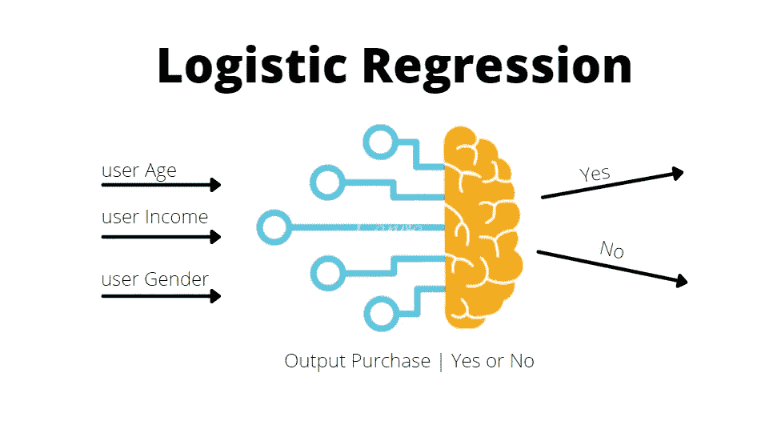
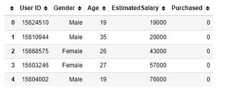
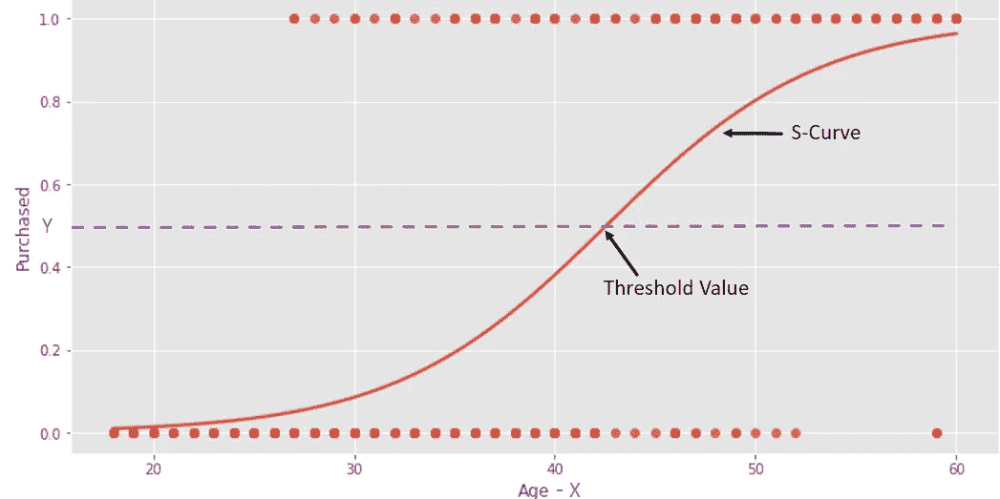
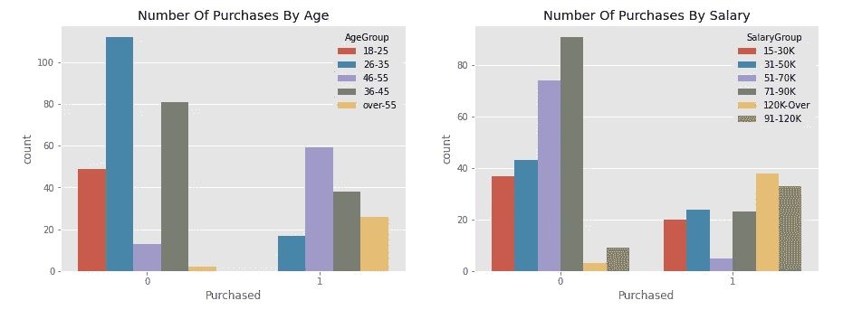
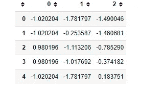
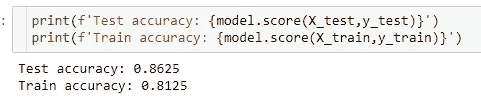
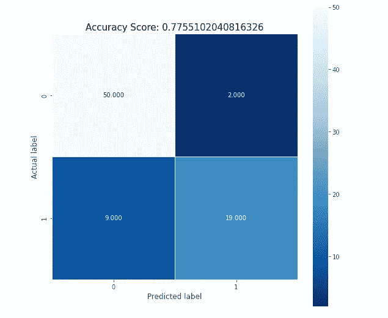

# 开发逻辑回归机器学习模型

> 原文：<https://blog.devgenius.io/develop-a-logistic-regression-machine-learning-model-64d2be403ba3?source=collection_archive---------5----------------------->



逻辑回归概述

**背景**

逻辑回归是一种统计技术，是一种非常流行的机器学习算法。它用于解决机器学习中的分类问题。使用逻辑回归，我们将预测用户是否会购买(1)或不购买(0)。

在我们深入逻辑回归之前，让我们回顾一下我们在这里提到的[的线性回归。我们通过预测一家公司的销售额来涵盖线性回归。我们有一些数据营销预算和销售额，然后我们拟合一条线。](https://www.youtube.com/watch?v=TR6vn4lZ3Mo)

首先，我们确定预算和销售是否相关，因为预算的变化对销售有直接影响。事实证明是这样的，因为预算的增加直接影响了销售。

我们可以用这条线来预测给定预算下的销售额。例如，如果预算金额为 20 万，那么我们可以预测销售额将在 1400 万左右。根据预算金额，我们可以查找相应的销售额。

牢记这一点，我们建立了一个线性回归模型，使用这种技术进行预测。

先说逻辑回归。逻辑回归类似于线性回归，除了逻辑回归预测某事是真还是假。所以与其预测一些连续的东西，比如销售额。我们预测某事是真还是假。如果我们试图拟合一条直线，它会错过大多数数据点。逻辑回归符合“S”形逻辑函数。

**笔记本**

我们将使用 Jupyter 笔记本对此模型进行编码。在笔记本中，我们导入所需的库。确保在运行这段代码之前已经安装了这些程序。完整的笔记本和数据集可在 [GitHub](https://www.youtube.com/watch?v=TR6vn4lZ3Mo) 上获得。代码演练可在 [YouTube](https://www.youtube.com/watch?v=4h7sTyGgyuc) 上获得。

让我们导入数据。我们正在借助 pandas read excel 方法导入一个 excel 文件，并将其保存到一个名为 *df* 的数据帧中。让我们打印 *df* 来了解一下数据。这是一个包含用户信息的简单数据集；



用户数据集

我们将尝试使用用户的性别、年龄和收入变量来预测用户是否会购买。因此，如果没有购买，输出将为零，如果购买，输出将为一。

此外，逻辑回归拟合的不是数据的直线，而是 s 形逻辑函数。“S”形曲线从 0 到 1。这意味着曲线告诉我们，基于用户的属性，用户进行购买的概率。



s 曲线

**探索性数据分析**

如果我们的用户年龄在 35 到 55 岁之间，收入中值超过 9 万英镑。那么用户很有可能会进行购买。如果年龄在 26 岁到 35 岁之间，收入在 71000 到 90000 之间，那么用户不购买的可能性更大。尽管逻辑回归告诉我们用户是否会购买的概率，但它通常用于分类问题。



按年龄/收入划分的用户购买量

**数据准备**

为了准备逻辑回归模型的数据，我们将删除用户 ID 列，并将性别列转换为数字。我们将创建一个新的数据框架 X，包含年龄、性别和工资列。我们将从数据框架中删除剩余的列。这是我们的“X”，或独立变量。对于因变量或“Y ”,我们将从“Y”变量的数据帧中保存购买的列。

我们的数据有不同的值，甚至不同的度量单位，很难对它们进行比较。相对于薪水，年龄算什么？还是性别比年龄？

这个问题的答案是缩放。我们可以将数据换算成更容易比较的新值。我们正在使用*标准缩放器*来缩放我们的特征。现在比较-1.78 到-1.49 比 19 到 19000 更容易。

```
from sklearn. Preprocessing import StandardScalerscaler = StandardScaler()
d_scaled = scaler.fit_transform(X)
data_scaled = pd.DataFrame(d_scaled)
```



数据缩放

现在，我们将把这个数据集分成训练数据集和测试数据集。因此，一旦我们的模型准备好了，我们就可以使用这些数据集来训练和测试它。为此，我们将使用来自 sklearn 的 *train_test_split* 。这个函数给了我们四个不同的数据集 X 训练和 y 训练。x 检验和 y 检验

**模型开发&测试**

准备好数据集后，我们可以通过从线性模型调用逻辑回归来创建逻辑回归对象。它被保存为模型变量。让我们调用 fit 方法并向其提供 *X_train* 和 *y_train* 数据集。一旦我们执行了这段代码，我们的回归模型就训练好了，准备好了。

```
#build the model from logistic Regression.
from sklearn.linear_model import LogisticRegression
#model object
model = LogisticRegression(C=0.1,max_iter = 500)
#train the model with train datasets
model.fit(X_train,y_train)
```

我们可以通过得到模型得分来检验模型的测试和训练精度。我们的测试准确率为 86 %,这很好。我们可以尝试不同的参数来提高精确度。



模型预测精度

另一个很好的测试是混淆矩阵。它有助于确定我们做出了多少正确的预测，以及我们错误分类了多少实例。这有助于我们识别*真阳性*和*真阴性*；也就是说我们已经正确分类了。*假阳性*和*假阴性*就是我们分类错误的那个。



混淆矩阵

这就是我们如何实现逻辑回归算法来解决分类问题。

**结论**

我们描述什么是逻辑回归，并涵盖线性和逻辑回归之间的差异。

我们展示了如何为机器学习模型准备数据集。

我们实现了一个逻辑回归模型来解决一个分类问题。

完整的源代码可以在[这里](https://github.com/hnawaz007/pythondataanalysis/tree/main/ML)找到