# 开发没有代码的 ETL 过程——一步一步的指南

> 原文：<https://blog.devgenius.io/develop-an-etl-process-with-make-step-by-step-guide-acfe44e428d5?source=collection_archive---------13----------------------->

在一个编码对开发越来越不重要的世界里，掌握自动化工具及其逻辑变得越来越重要。像[扎皮尔](https://zapier.com/)、 [Make](https://www.make.com/en/register?pc=dsegev) 等工具提供了一种执行想法和开发过程的好方法，就像你处理代码一样。

掌握自动化工具的主要好处是它可以节省你很多时间。这些工具带有预定义的集成、触发器和操作，您只需点击几下鼠标即可选择。不用花时间研究平台的 API 文档，您可以简单地注册一个自动化平台并立即开始开发。

当然，相对于经典的编码开发，选择自动化工具有一些缺点。这主要是缺乏灵活性。然而，在某些情况下，自动化工具可以为一个成功的项目提供所有必要的组件。

对于那些喜欢玩自动挡的人来说，这真的改变了他们的生活。有无限的方法可以跟踪来自互联网上所有地方的数据，也可以用于日常工作:开发流程、创建警报、平台之间的通信等。自动化工具还可以帮助我们开发 **ETL 过程**，这对每一个处理数据的业务都是必不可少的(还有哪些业务不处理数据呢？).

让我们从基础开始。ETL 代表**提取**、**转换**、**加载**。这是数据从一个地方移动到另一个地方时要经历的三个主要步骤。在某些情况下,“转换”步骤在“加载”之后，导致“ELT ”:提取、加载，然后转换。只要数据以正确的格式交付，这是有效的。

如前所述，今天你不需要成为 Python 或任何其他编码语言的专家来开发 ETL 过程。您可以使用一个很棒的自动化工具从头到尾构建完美的 ETL 过程，而无需任何编码知识。让我们看看如何开发一个过程，例如，从[随机数据 API](https://random-data-api.com/) 获得自动报告，并在我们的私人 Google 电子表格中创建一个假啤酒集合。

我们会保持简单。这个过程将只包括三个主要模块，也就是我们前面讨论的三个步骤:提取、转换和加载。因此， [Make](https://www.make.com/en/register?pc=dsegev) 上的场景看起来会像这样:

1.  使用 HTTP 请求从数据源提取数据。
2.  转换数据，并根据需要进行修改。
3.  将数据加载到特定结构的电子表格中。

让我们继续，从开发过程开始。

# 1.提取

首先，我们必须建立与数据源的连接，以便从数据源中提取数据。因为它是来自开放 API 源的虚拟数据，所以我们不需要任何特殊的认证；我们只需要使用提供的 URL 和结构。在我们的例子中，我们想要获得关于假想的啤酒的数据，所以我们将使用如下所示的 URL(所有信息都在[随机数据文档](https://random-data-api.com/documentation)中提供):

```
https://random-data-api.com/api/v2/beers
```

我们希望将我们的结果限制为每个 API 调用 50 次。随机数据 API 为 HTTP 请求提供了一个`limit`参数，如下所示:

```
https://random-data-api.com/api/v2/beers?size=50
```

我们想在 JSON 中格式化数据。源代码提供了 JSON 和 XML 两种格式，所以我们的请求是:

```
https://random-data-api.com/api/v2/beers?size=25&response_type=json
```

创建所需的 URL 后，使用“HTTP 请求”模块将其添加到场景中。将“方法”设置为“获取”，并将所有其他字段留空。它应该是这样的:


现在，我们可以运行一次场景来查看其结果。如果运行成功，我们将能够展开“数据”选项卡。如果场景失败，我们将看到一个错误而不是数据。

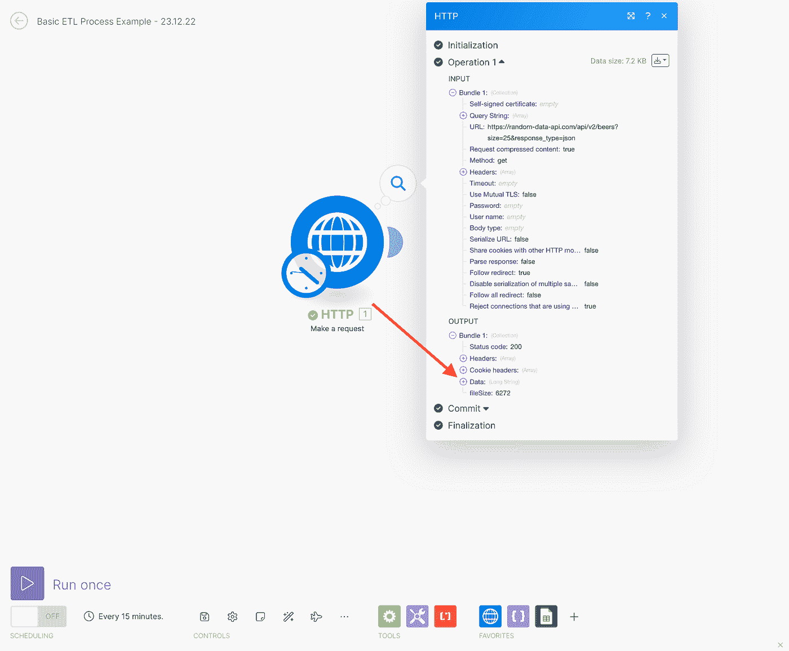

我们可以单击“数据”旁边的加号图标来查看请求结果。如果很混乱也不用担心；它是 JSON 格式的原始数据。在使用它之前，我们需要对它进行转换和组织。目标是确保收到原始数据，这样我们就可以继续下一步。

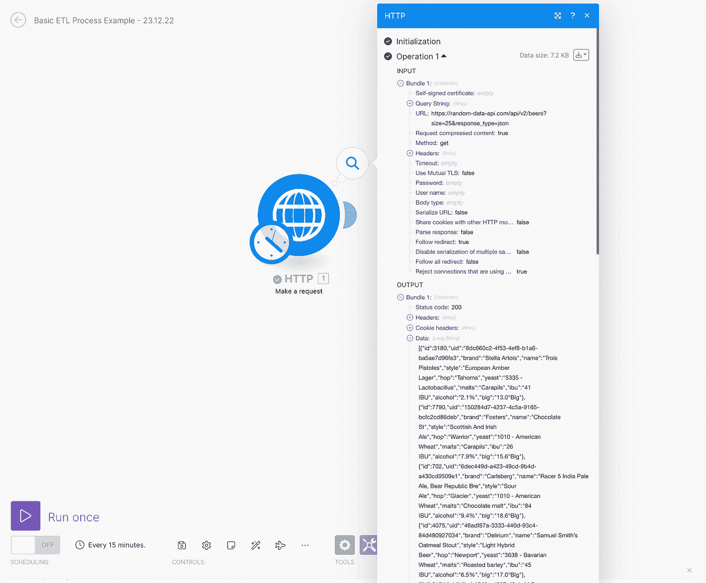

# 2.改变

[Make.com](https://www.make.com/en/register?pc=dsegev)为组织和处理原始数据提供了一个简单的解决方案。数据是 JSON 格式的，我们可以用 [Make 的](https://www.make.com/en/register?pc=dsegev)“解析 JSON”模型来处理。


然后，我们需要将这个模块与我们已经有的 HTTP 请求连接起来，并在解析中添加“数据”字段。

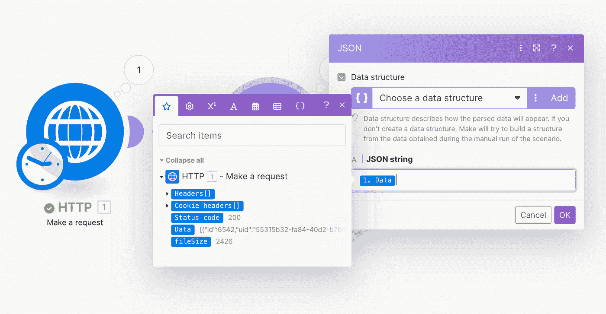

既然我们已经将来自一个长 JSON 查询的数据解析成单独的值，我们可以开始转换它了。首先，我们需要映射从源接收的所有字段。为此，我们可以运行该场景一次，然后观察结果。

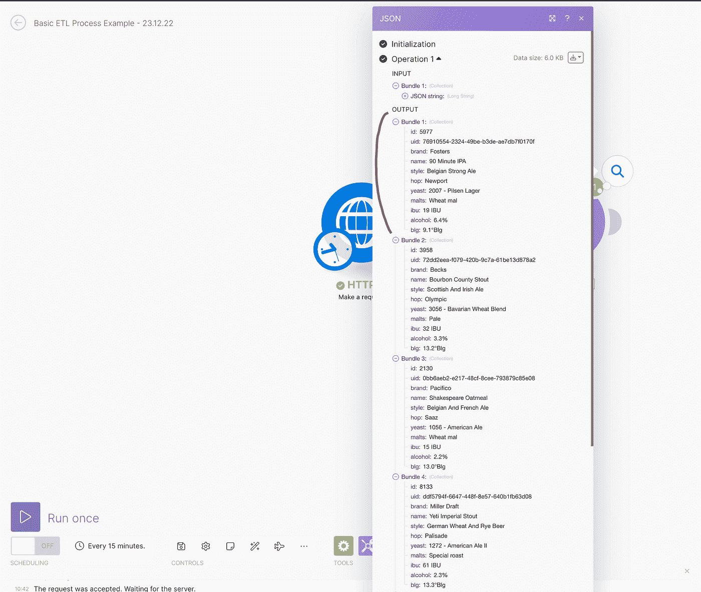

我们有:

*   **ID** —编号
*   **UID** —文本
*   **品牌** —文字
*   **名称** —文本
*   **样式** —文本
*   **跳跃** —文本
*   **酵母** —正文
*   **麦芽酒** —正文
*   **IBU** —正文
*   **酒精** —正文
*   **BLG** —正文

对于我们的例子，我们希望所有的字段都出现在我们的目的地。为了转换数据，我们将使用“工具”模块中的“设置多个变量”模块。

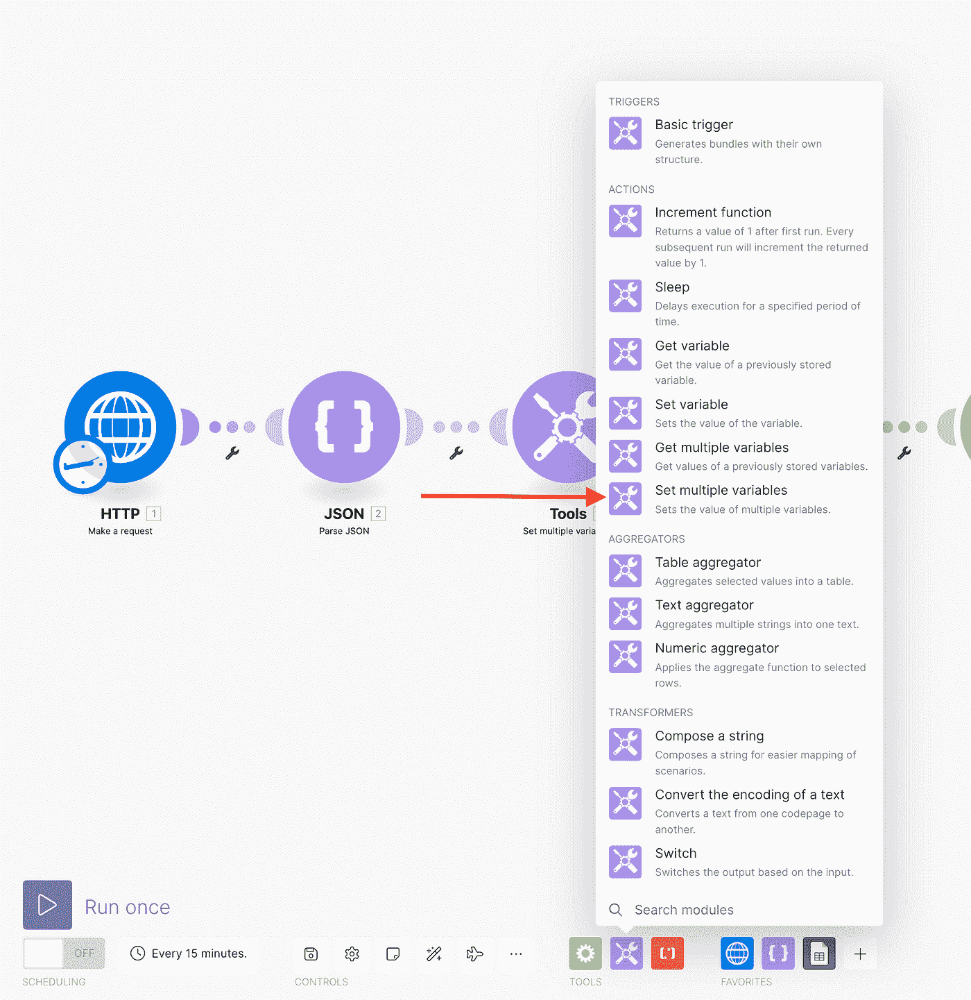

现在，我们可以将正确的值填充到适当的字段中。大多数字段将在我们收到时填写，但我们也决定将以下字段配置为数字:

1.  异丁脲(international benzoate unit)
2.  酒精
3.  BLG

我们目前收到的是附带文本。如前所述，它们如下所示:

1.  IBU =“IBU 67 号”(首字母缩写“IBU”与该号码相关联。)
2.  酒精=“4.5%”(百分比附在数字后。)
3.  BLG =“7.6 BLG”(附度数符号( )和“Blg”字样。)

为了用数字显示这些值，我们将使用一个函数来转换它。

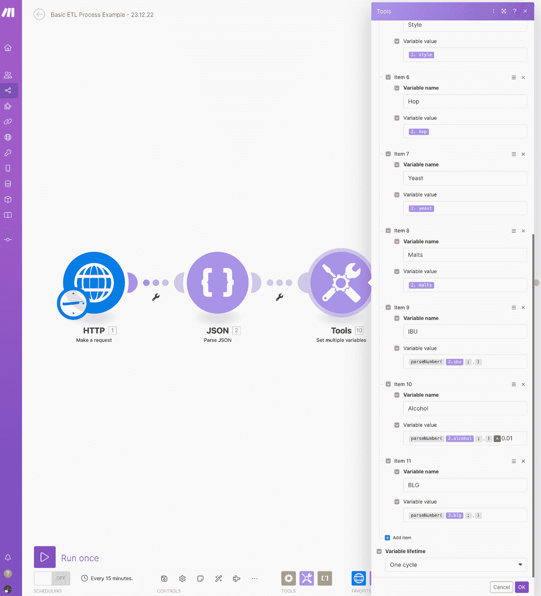

我使用了`parseNumber()`函数从接收到的值中删除所有非数字字符。这个函数将一个字符串解析为一个数字。为了转换酒精百分比，我将它乘以 0.01 以得到正确的格式。这使我们能够稍后在该字段上执行计算。

我们现在可以运行场景并观察我们收到的数据。

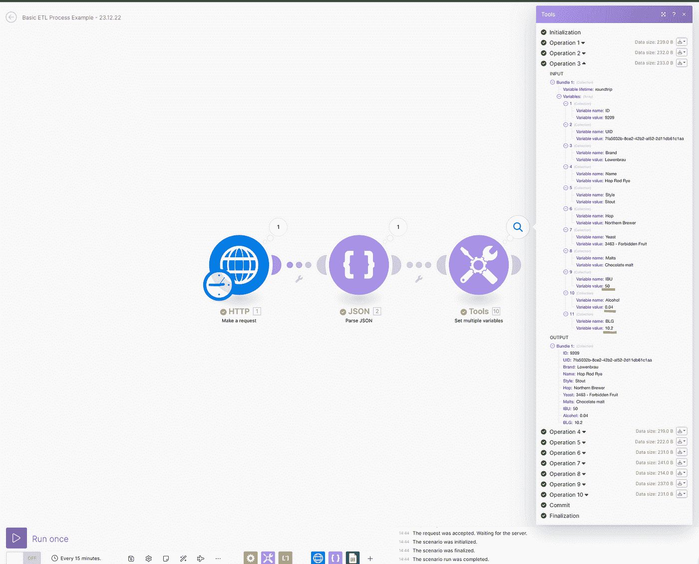

我们现在以期望的格式接收数字；它们很干净，随时可以使用。

**请注意** —这不是转换 HTTP 请求中接收的数据的唯一方法。我们还可以在 Google Sheet 的模块中直接转换数据，在我们的场景中节省了一个步骤。然而，对于这个例子，我们将以传统的方式完成:完全转换数据，然后直接将它填充到目的地。

# 3.负荷

正如 ETL 指导我们的那样，我们过程的最后一步是将数据装载到我们的目的地。

我们将根据我们收到的字段，在 Google Sheets 中存储数据。在使用它之前，我们需要创建电子表格并添加列标题，例如:

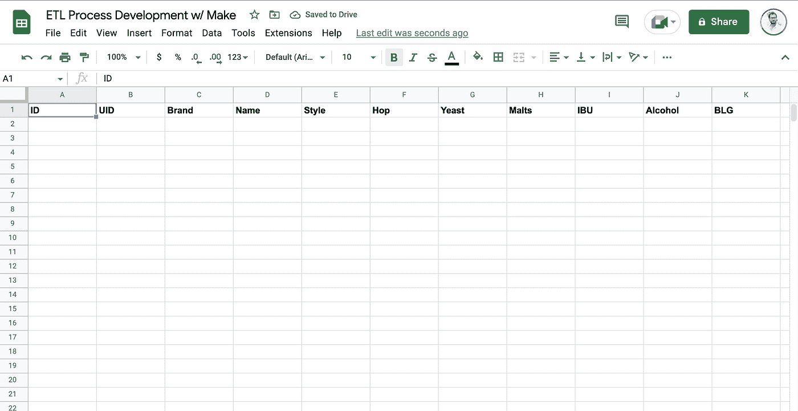

当我们收到已经在电子表格中的啤酒数据时，我们需要考虑该怎么办。我们不想有重复的记录。我们有两个选择:

1.  在添加新记录之前，我们将检查啤酒的 ID。如果它存在，我们将更新该行，而不是创建一个新行。
2.  我们将在所有情况下添加行，但将包括一个时间戳列来检测最新的行并只使用它。

对于我们的例子，我们将使用提到的第一个选项。我们将在目的地寻找啤酒，并在两种情况下使用路由器:如果它存在，如果它不存在。为此，我们将使用 Google Sheets 的“搜索行”模块。


在配置模块时，我们将使用字段“UID”来搜索目的地中的特定记录。每种啤酒都有唯一的 UID，所以我们不能有重复的值。该模块的配置应该如下所示:


最大返回行数应为**“1”**，因为没有重复。

我们需要添加一个路由器来检测最后一个模块是否找到记录。如果找到记录，它应该更新该行。如果没有，它应该创建一个新的。

路由器的条件是 Google Sheets“搜索行”模块生成的“束总数”的值。如果找到了记录，包的数量必须大于零。如果它什么也没找到，它肯定是 0。

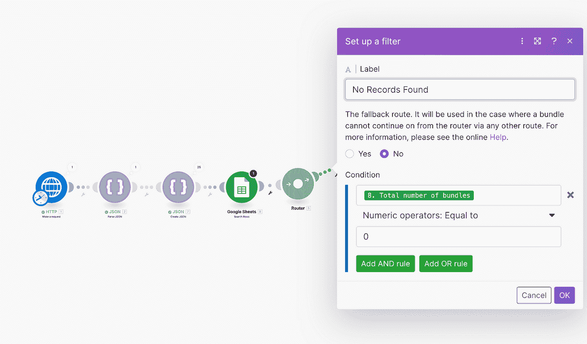

当在路由器中使用某个条件时，不需要在两条路由中都进行配置。我们可以将其中一条标记为“备用路线”。为此，只需选择“是”按钮。


一旦不满足第一个条件，默认执行另一条路线。我们现在有两条路由连接到路由器，所以我们可以设置它们。


由于我们的数据已经是所需的格式，我们只需要将值映射到电子表格中两个模块的所需位置。两者之间的唯一区别是，对于“更新行”模块，我们需要添加上一个模块(搜索行)中的行号，这样系统就知道要修改哪一行。

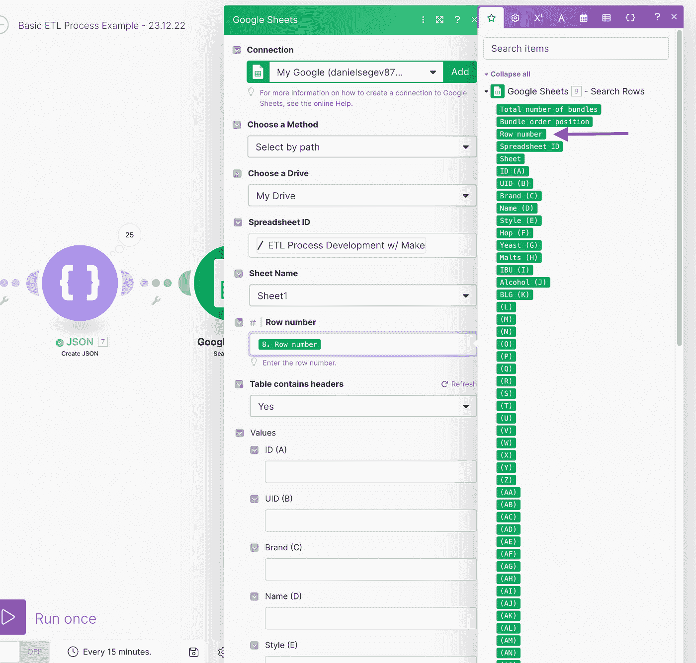

我们将按原样使用“设置多个变量”模块中的值，如下所示:

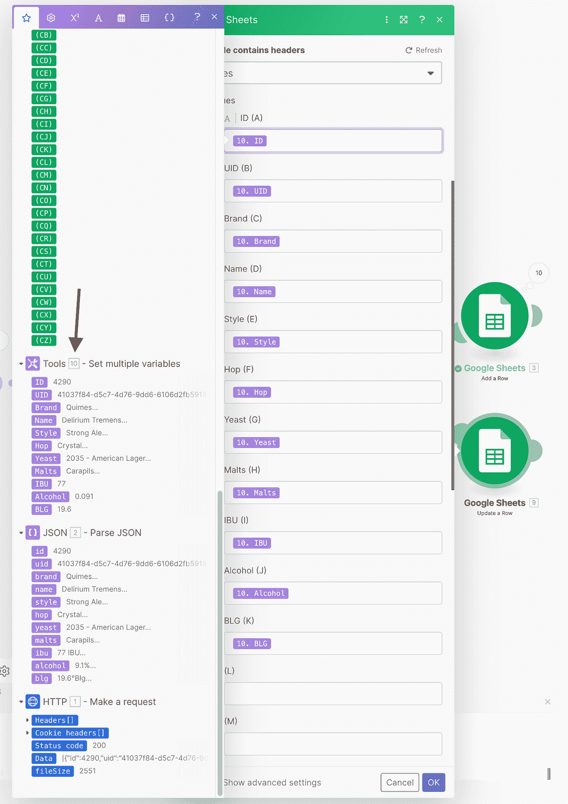

我们现在将对“添加一行”模块重复相同的过程。

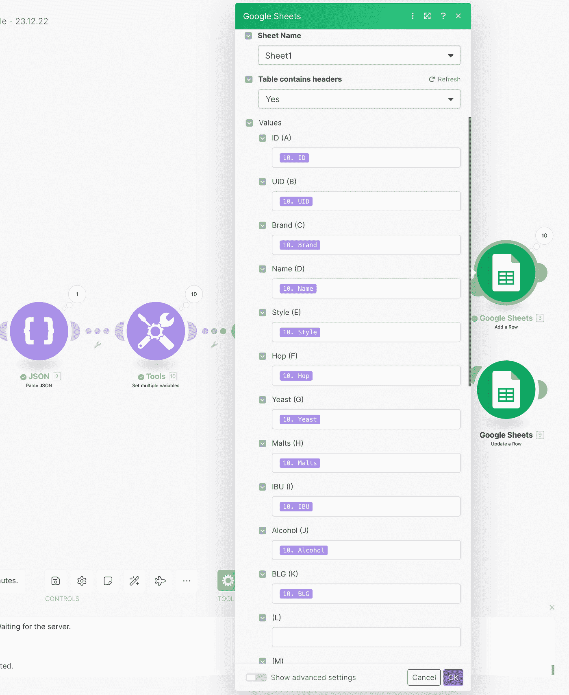

我们完了。当我们运行场景时，数据将从源中检索，由我们的自动化转换，并发送到电子表格。让我们试一试。

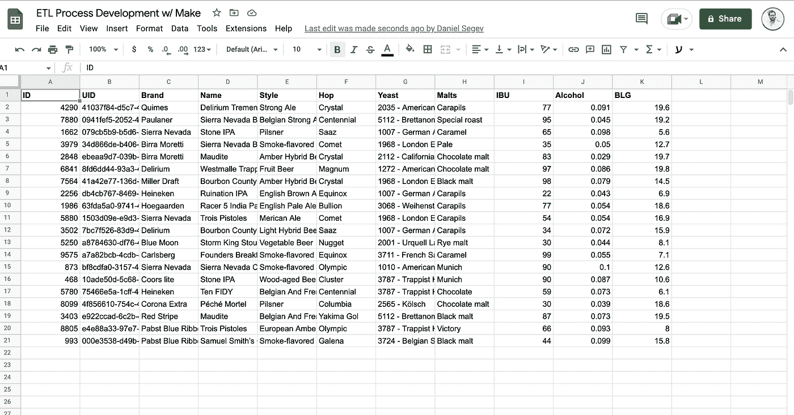

我们可以看到，数据以期望的状态到达了目的地:干净、有组织，并准备好进行分析。

# 结论

这是一个基本的例子，说明了 [Make](https://www.make.com/en/register?pc=dsegev) (但是基本上任何其他酷的自动化平台)可以做什么。当然，它可以变得复杂得多，但逻辑是相同的:以任何可行的方式获得您需要的数据，转换和清理它，使它适合您的目的地，最后，将它加载到您的目的地。

如前所述，这不是执行我们刚才所做的自动化的唯一方式。我们可以在“ELT”过程中做同样的事情，首先加载它，然后在电子表格端转换数据。请记住，这里没有对错，只要过程有效。以有组织和可读的方式从一个地方到另一个地方获取您需要的数据。您可以在以后优化流程的每一步，甚至在自动化上线之后。

你使用自动化工具来创建有趣的 ETL 过程吗？你对自动化或数据集有什么好主意吗？请[联系我](mailto:danielsegev87@gmail.com)；我很想听听他们的故事。