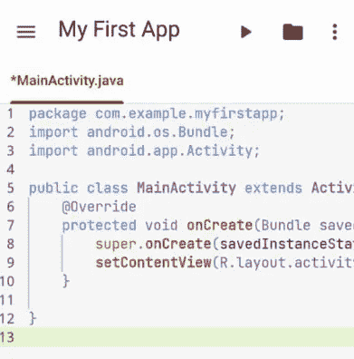

# 使用 Java 或 Kotlin 语言直接在 Android 移动设备上开发 Android 应用程序

> 原文：<https://blog.devgenius.io/develop-android-app-directly-from-android-mobile-device-using-java-or-kotlin-language-958d6365dc5a?source=collection_archive---------6----------------------->

构建 Android 应用的快速步骤


[拉拉·阿兹利](https://unsplash.com/@lazizli?utm_source=medium&utm_medium=referral)在 [Unsplash](https://unsplash.com?utm_source=medium&utm_medium=referral) 上的照片

Android 开发一般需要大量的机器资源(参考 [Canopas 提示](https://blog.canopas.com/10-tips-from-10-years-of-android-experience-dd9a009bd51))。这对新开发人员来说可能听起来令人沮丧。幸运的是，有一个名为 Code Assist 的应用程序，允许开发人员使用真正的编程(即 Java 和 Kotlin 语言)创建 Android 应用程序(参见 [Google Play — Code Assist](https://play.google.com/store/apps/details?id=com.tyron.code) )。这篇文章为新开发人员快速学习 Android 开发的基础知识提供了一个快速的起点，而无需花费时间在 Android Studio 安装、Android 模拟器配置等方面。

# (1)从 Google Play 网站安装

参观[https://play.google.com/store/apps/details?id=com.tyron.code](https://play.google.com/store/apps/details?id=com.tyron.code) 安装应用程序。更多信息请参考他们的 GitHub 页面，[https://github.com/tyron12233/CodeAssist](https://github.com/tyron12233/CodeAssist)。安装只需要很短的时间。一旦完成，应用程序就可以进行 Android 开发了。


CodeAssist 版本 0.2.9 Alpha

# (2)创建 Android 项目

点击+按钮创建一个新项目。


代码辅助提供了三个模板供开发者选择。点击空项目模板。


输入项目的以下详细信息，并点击**创建**按钮。代码助手将创建项目，然后显示编辑器窗口。

```
App name = My First App
Package name = com.example.myfirstapp
Save location = (accept the default value)
Language = Java
Minimum SDK = API 16 ... (or any minimum SDK listed in the Android Device)
```


点击编辑器侧菜单以显示项目文件夹/文件列表。点击“`MainActivity.java`”文件。


项目文件夹/文件列表

将以下代码复制/粘贴到编辑器窗口中的文件中(如果代码与下面的示例不同)。这个`MainActivity`类从标准的 Android Activity 扩展而来。Android Activity 控制 Android 用户在屏幕上看到的视觉显示或页面。

```
package com.example.myfirstapp;
import android.os.Bundle;
import android.app.Activity;

public class MainActivity extends Activity {
    @Override
    protected void onCreate(Bundle savedInstanceState) {
        super.onCreate(savedInstanceState);
        setContentView(R.layout.activity_main);
    }   
}
```

点击运行按钮，将应用程序编译并部署到主机设备。



轻按“安装”将应用程序安装到主机设备中。


点击打开运行应用程序。


`My First App`现在应该弹出并显示文本 **Hello World！**。


切换回代码辅助，通过向布局文件添加一些布局代码来进一步编辑应用程序。布局文件“`activity_main.xml`”位于`res/layout`文件夹中(参考上面的项目文件夹/文件列表)。


编辑“`activity_main.xml`”如下。

```
<LinearLayout xmlns:android="http://schemas.android.com/apk/res/android"
    xmlns:tools="http://schemas.android.com/tools"
    android:layout_width="match_parent"
    android:layout_height="match_parent"
    android:orientation="horizontal"
    tools:context=".MainActivity" >
    <EditText
        android:id="@+id/edit_message"
        android:layout_weight="1"
        android:layout_width="0dp"
        android:layout_height="wrap_content"
        android:text="@string/edit_message" />
    <Button
        android:id="@+id/send_message"
        android:layout_width="wrap_content"
        android:layout_height="wrap_content"
        android:text="@string/button_send" />
</LinearLayout>
```

上面的布局文件使用了字符串资源，即`@string/edit_message`和`@string/button_send`。Android 要求在另一个名为“`strings.xml`”的 XML 文件中定义这些资源，该文件位于“`res/values`”文件夹下。

如下编辑文件“`strings.xml`”。resources 标签中的最后两项将"`edit_message`"字符串定义为"`Enter a message`"并将"`button_send`"字符串定义为"`SEND`"。

```
<?xml version="1.0" encoding="utf-8"?>
<resources>
    <string name="app_name">My First App</string>
    <string name="hello_world">Hello world!</string>
    <string name="edit_message">Enter a message</string>
    <string name="button_send">SEND</string>
</resources>
```

每次编辑文件时，点击文件夹图标，然后点击弹出菜单中的“保存”项。

点击文件名关闭文件，然后点击弹出菜单中的“关闭”项。

再次运行`My First App`并检查它是否显示如下所示的新布局。


# (3)添加第二个活动

第二个活动应该显示应用程序用户在`Main Activity`页面中给出的文本。要添加第二个活动，导航到文件夹“`src/main/java/com/example/myfirstapp`”，点击标签“`myfirstapp`”，然后点击项目“`Java class`”。


输入类名“`DisplayMessageActivity`”，然后点击创建按钮。


编辑文件`DisplayMessageActivity.java`，如下图所示。导入部分包括一个意图内容(用于保存从`Main Activity`输入的文本)和一个文本视图小部件(用于显示该文本)。文本视图将动态创建，而不是从 XML 布局文件引用。然而，这种方法非常基础，如果开发人员希望有更多的布局定制，使用 XML 布局文件(如上面的**步骤 2** 所示)将是一个更好的选择。

```
package com.example.myfirstapp;
import android.os.Bundle;
import android.app.Activity;
import android.content.Intent;
import android.widget.TextView;

public class DisplayMessageActivity extends Activity {
 @Override
 protected void onCreate(Bundle savedInstanceState) {
  super.onCreate(savedInstanceState);
  // Get the message from the intent
  Intent intent = getIntent();
  String message = intent.getStringExtra("com.example.myfirstapp.EXTRA_MESSAGE");
  // Create the text view
  TextView textView = new TextView(this);
  textView.setTextSize(40);
  textView.setText(message);
  // Set the text view as the activity layout
  setContentView(textView);
 }
}
```

运行应用程序前，检查位于文件夹“`src/main`”中的“`AndroidManifest.xml`”包含以下代码。

```
<?xml version="1.0" encoding="utf-8"?>
<manifest xmlns:android="http://schemas.android.com/apk/res/android"
    package="com.example.myfirstapp"
    android:versionCode="1"
 android:versionName="1.0">

    <uses-sdk android:minSdkVersion="16" android:targetSdkVersion="31"/>

    <application
        android:allowBackup="true"
        android:icon="@mipmap/ic_launcher"
        android:label="@string/app_name"
        android:roundIcon="@mipmap/ic_launcher_round"
        android:supportsRtl="true"
        android:theme="@style/Theme.MyApplication">
        <activity
            android:name=".MainActivity"
            android:exported="true">
            <intent-filter>
                <action android:name="android.intent.action.MAIN" />

                <category android:name="android.intent.category.LAUNCHER" />
            </intent-filter>
        </activity>
        <activity
            android:name=".DisplayMessageActivity">

        </activity>

    </application>

</manifest>
```

第一个`<activity>`标签包含一个属性“`android:exported='true'`”。从 Android SDK 12 开始，强制添加属性(参考 [Android Provider 元素](https://developer.android.com/guide/topics/manifest/provider-element))。

`<activity>`标签还包括一个`<intent-filter>`标签，该标签声明其父组件的能力，即一个活动或服务可以做什么，以及一个接收器可以处理什么类型的广播(参考[Android<intent-filter>](https://developer.android.com/guide/topics/manifest/intent-filter-element))。在这个例子中，CATEGORY_LAUNCHER 意味着它应该作为顶级应用程序出现在启动器中。

在运行应用程序之前，需要更新“MainActivity.java”。

# (4)更新主活动页面

要将页面从`Main Activity`切换到`Display Message Activity`，需要在`Main Activity`类上做进一步的编辑。通过 onClickListener()方法导入视图对象以实现 click listener 事件。导入 EditText 和 Button 小部件，将 Java 代码绑定到 XML 文件中的可视对象。

addListener()方法将 onClickListener()方法分配给按钮，以便当单击按钮时，将调用 sendMessage()方法。sendMessage()方法创建一个 intent 对象，获取文本输入，将文本放入 intent 对象并调用 startActivity()方法，同时将 intent 对象作为参数传递。

```
package com.example.myfirstapp;
import android.os.Bundle;
import android.app.Activity;
import android.content.Intent;
import android.util.Log;
import android.view.View;
import android.view.View.OnClickListener;
import android.widget.EditText;
import android.widget.Button;

public class MainActivity extends Activity {
    @Override
    protected void onCreate(Bundle savedInstanceState) {
        super.onCreate(savedInstanceState);
        setContentView(R.layout.activity_main);
        addListener();
    }

 public void sendMessage() {
  Log.v("Click","Send Button is clicked");
  Intent intent = new Intent(this, DisplayMessageActivity.class);
  EditText editText = (EditText) findViewById(R.id.edit_message);
  String message = editText.getText().toString();
  intent.putExtra("com.example.myfirstapp.EXTRA_MESSAGE", message);
  startActivity(intent);
 }

 public void addListener(){
  /** Listen to button click event */
  Button button = (Button) findViewById(R.id.send_message);  
  button.setOnClickListener(new OnClickListener() {
   public void onClick(View v) {
    sendMessage();
   }
  });
 }

} 
```

最终的结局如下图所示。


在第一页中，用户键入文本，例如 hello，然后点击发送按钮。


作为对 SEND 按钮上的 click 事件的响应，应用程序打开第二个页面并显示文本输入。

# 清单

本练习仅涉及四个文件的编辑。错误可能在任何时候发生，它们经常让新开发人员感到沮丧。始终检查每个文件是否已相应更新。

```
(1) app/src/main/java/com/example/myfirstapp/MainActivity.java
(2) app/src/main/res/activity_main.xml
(3) app/src/main/java/com/example/myfirstapp/DisplayMessageActivity.java
(4) app/src/main/AndroidManifest.xml
```