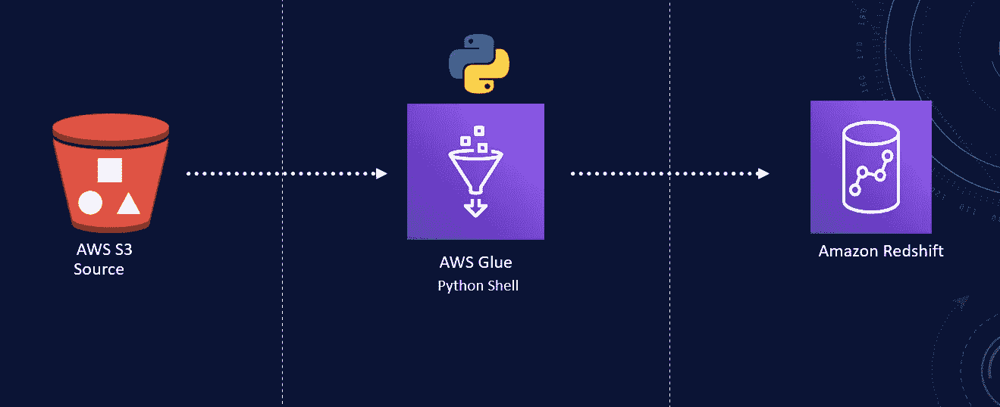

# 用 Python shell 开发 AWS Glue ETL 管道

> 原文：<https://blog.devgenius.io/develop-aws-glue-etl-pipeline-with-python-shell-fe6f66763e9d?source=collection_archive---------3----------------------->

**使用 AWS、Python**



AWS 用 Python 粘合 ETL

AWS Glue 是来自 Amazon Web Services 的一个完全托管的 ETL 服务。它提供了各种执行 ETL 任务的环境。我们可以选择 AWS Glue Spark，也可以使用 Python Shell 作业。对于处理小型或中型数据集，最后一种类型的作业可能是更经济的选择。此外，如果你的团队精通 Python，那就不用费脑子了。

Python shell 作业与 Python 版本 2 和 3 兼容，运行时预配置了最流行的版本，如 Numpy、pandas 等。在 Glue 中，我们还可以安装脚本所依赖的其他附加库。

完整代码可在 [GitHub](https://github.com/hnawaz007/pythondataanalysis/tree/main/AWS%20Glue%20ETL%20Python%20Shell) 上获得。在 [YouTube](https://www.youtube.com/watch?v=nAWUGfjAIaA) 上可以找到代码演练。

Python shell 使我们能够:

*   用我们最喜欢的语言构建结构良好的 ETL 管道
*   Python 的易用性和预构建库的强大功能
*   以 Python 代码形式创建和管理脚本化数据管道
*   通过 AWS 控制台跟踪、监控和管理您的 ETL 管道

**先决条件**

Python shell 没有什么先决条件。我们需要一个 S3 桶来存放我们的脚本。另外，我们需要在开发人员的机器上安装和配置 AWS CLI。您可以从该 URL 下载适用于您的操作系统的 AWS CLI。我会在下面的描述中留下链接。安装后，您可以使用访问密钥和秘密密钥对此进行配置。

我们可以通过发出 AWS dash dash version 命令来确认 AWS CLI 是否正确安装。如果安装，这将返回 AWS CLI 版本。

**打造。whl 文件**

第一步是生成一个 Python。包含所需库的 whl 文件。我们可以在命令行界面(CLI)创建一个。我们将创建一个名为`aws_glue_python_shell`的目录，并在这个目录中创建一个名为`setup.py`的文件。我们在`setup.py`文件中有以下代码。在这个文件中，我们可以列出脚本所需的库。

```
from setuptools import setupsetup(
    name="glue_python_shell_sample_module",
    version="0.1",
    install_requires=[
  "psycopg2"
    ]
)
```

为了创建文件，我们在终端中输入以下代码。

```
python setup.py bdist under wheel
```

该命令将生成。whl 文件和各种文件夹。我们将关注 *dist* 文件夹。这是我们将生成 ETL 脚本的地方。

**ETL 脚本**

在 *dist* 文件夹中，让我们创建名为 e *tl.py* 的 ETL 脚本。这个文件将包含 ETL 脚本。我们在顶部导入 psycopg2 库。使用 psycopg2，我们创建了一个到红移数据库的连接。

我们将使用复制命令将 S3 数据复制到红移表中。我们调用 copy 命令，然后指定表和列。在 from 子句中，我们提供了 S3 对象名。然后，我们以 IAM 角色的形式提供凭证。请确保此角色与红移群集相关联。这是一个逗号分隔的文件，我们跳过第一行。

我们从连接变量创建一个游标，并执行 copy 命令。这将从 S3 物体中读取数据并存储在指定的红移表中。一旦我们执行完脚本，我们就关闭光标和连接。

```
#Obtaining the connection to RedShift
con=psycopg2.connect(dbname= 'dev', host='redshift.amazonaws.com', port= '5439', user= 'awsuser', password= '*****')#Copy Command as Variable
copy_command="""copy  src_dimproductsubcategory (productsubcategorykey ,productsubcategoryalternatekey ,englishproductsubcategoryname ,spanishproductsubcategorysame,frenchproductsubcategorysame ,productcategorykey )
from 's3://your-s3-bukcet-name/public/DimProductSubcategory/DimProductSubcategory.csv' 
iam_role 'arn:aws:iam::8040854000:role/'
DELIMITER ','
IGNOREHEADER 1;"""#Opening a cursor and run copy query
cur = con.cursor()
cur.execute("truncate table src_dimproductsubcategory;")
cur.execute(copy_command)
con.commit()#Close the cursor and the connection
cur.close()
con.close()
```

**上传脚本到 S3**

我们已经准备好部署我们的脚本。让我们将脚本复制到目标 S3 存储桶。我们将复制。 *whl* 文件到 *lib* 文件夹， *etl.py* 到 S*scripts*文件夹。在终端中，我们发出复制命令。

```
aws s3 cp glue_python_shell_sample_module-0.1-py3-none-any.whl s3://your-s3-bukcet-name/lib/
```

我们可以通过进入 s3 存储桶并刷新页面来确认。我们的文件被复制了。类似地，我们可以将 etl.py 复制到 s3 bucket 中的 Scripts 文件夹。

```
aws s3 cp etl.py s3://your-s3-bukcet-name/scripts/
```

**AWS 涂胶作业**

在 AWS Glue 控制台中，我们现在可以使用我们的脚本创建一个作业。那么，让我们单击“Add Job”。为此作业提供一个名称，我们需要提供一个 IAM 角色。在“type”下，我们选择 Python shell，并将为此作业提供一个现有脚本。这里我们将选择我们的 *etl.py* 文件的 S3 路径，它位于*脚本*文件夹中。

在安全性和配置下，我们将设置 python 库路径。再次单击文件夹图标，导航至 *lib* 文件夹，并选择。 *whl* 文件。让我们保住这份工作。它将调出脚本。在这里，我们可以检查一下，以确保一切正常。我将继续更新主机和密码，并提供实际的 IAM 角色的 ARN。我们的工作保住了。然而，在运行它之前，让我们确保我们试图填充的表存在于数据库中。如果没有，我们将需要创建它。

回到 AWS Glue，让我们选择作业并运行它。作业正在排队。我们可以再次选择作业，UI 将显示作业状态。我们可以单击刷新图标来查看更新。根据您的数据大小，这可能需要一段时间。二十多秒后，该作业返回成功状态。

我们可以通过跟踪作业状态旁边的日志 URL 来查看日志。为了验证数据，我们可以转到红移控制台，对表执行 select 语句。select 语句返回数据，因此我们已经在 AWS Glue 中使用 Python Shell 作业成功地将 S3 数据加载到 redshift 中。在 CloudWatch 日志中，我们可以看到我们执行了。 *whl* 文件，下载 *psycopg2* 库并安装。

**结论**

*   我们已经使用 Python shell 成功地在 AWS Glue 中实现了 ETL。
*   我们展示了如何创建一个包含包依赖关系的. whl 文件。
*   我们使用 Python 和 AWS Glue 实现了 ETL(提取、转换和加载)管道。
*   完整的代码可以在[这里](https://github.com/hnawaz007/pythondataanalysis/tree/main/AWS%20Glue%20ETL%20Python%20Shell)找到