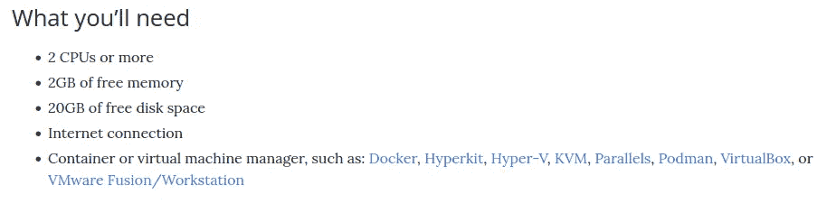

# 与 K3s Rancher 一起为 Kubernetes 开发本地容器

> 原文：<https://blog.devgenius.io/develop-locally-containers-for-kubernetes-with-k3s-rancher-219d5d0ba34a?source=collection_archive---------4----------------------->

## 用牧场主取代码头工人，促进地方发展


# 介绍

在本地建立 Kubernetes 很困难，这使得很难在本地开发和快速试用。K3s Rancher 是 K8s (Kubernetes)的轻量级版本，甚至可以在树莓 Pi 上运行。对于任何学习 K8s 部署的人来说，这也是一个很好的起点。

使用 K3s 的优点是:

*   在本地开发和测试(Docker)容器，而不会通过安装许多额外的包来污染本地机器。
*   用类似 Kubernetes 的 API 在本地编排几个容器既快又容易
*   一旦您对本地部署感到满意，所有的 YAML 配置都可以部署到 Kubernetes，而无需任何(重大)更改。
*   没有什么比试图找出为什么容器 A 不与容器 B 对话或者为什么容器 C 拒绝启动更烦人的了。能够接触到当地的东西可以节省你很多时间。

作为比较，以下是使用[Minikube](https://minikube.sigs.k8s.io/docs/)(2021 年)的系统要求，它是 Kubernetes 的本地部署:



*它不是什么都没有，这是在你开始在它上面运行任何容器之前。*

# 第 1 部分:在本地设置 K3s

**！！本教程假设一个 Linux 开发环境！！**

K3s 的好处在于它是一个单独的二进制文件，`k3s`，可以配置成将所有数据保存在一个文件夹中，如下所示:

```
sudo ./k3s-system/k3s server  \
  --data-dir  ./k3s-system \
  --config ./config.yaml \
  --write-kubeconfig ./k3s.yaml
```

它所有的内部数据都在这个文件夹`./k3-system`下。`config.yaml`的配置文件可以简单到:

```
write-kubeconfig-mode: "0644"
tls-san:
  - "foo.local"
node-label:
  - "foo=bar"
  - "something=amazing"
```

启动 K3s 服务器会生成一个配置文件，`k3s.yaml`:

```
apiVersion: v1
clusters:
- cluster:
    certificate-authority-data: ...
    server: [https://127.0.0.1:6443](https://127.0.0.1:6443)
  name: default
contexts:
- context:
    cluster: default
    user: default
  name: default
current-context: default
kind: Config
preferences: {}
users:
- name: default
  user:
    client-certificate-data: ...
    client-key-data: ...
```

它可以与标准的 Kubernetes CLI `kubectl`一起使用。

# 第 2 部分:PostgreSQL 在 K3s 上本地运行的例子

能够在本地测试是一种享受。这样做也很好，不会让你的机器一直塞满垃圾。因此，将 PostgreSQL 作为可在本地主机上访问的容器运行是有意义的。`docker-compose`可以这样做，但是配置文件是没有用的，除非你在生产中运行 [Docker Swarm](https://docs.docker.com/engine/swarm/) 。在实践中，许多人使用 Kubernetes 进行容器编排。

这是一个在 K8s/K3s 上部署 PostgreSQL 的简单图表

```
---
# Source: postgresql/templates/serviceaccount.yaml
apiVersion: v1
kind: ServiceAccount
metadata:
  name: k3s-env-postgresql
  labels:
    helm.sh/chart: postgresql-0.1.0
    app.kubernetes.io/name: postgresql
    app.kubernetes.io/instance: k3s-env
    app.kubernetes.io/version: "14.1-bullseye"
    app.kubernetes.io/managed-by: Helm
---
# Source: postgresql/templates/service.yaml
apiVersion: v1
kind: Service
metadata:
  name: k3s-env-postgresql
  labels:
    helm.sh/chart: postgresql-0.1.0
    app.kubernetes.io/name: postgresql
    app.kubernetes.io/instance: k3s-env
    app.kubernetes.io/version: "14.1-bullseye"
    app.kubernetes.io/managed-by: Helm
spec:
  type: NodePort
  ports:
    - port: 5432
      nodePort: 30001
      targetPort: http
      protocol: TCP
      name: http
  selector:
    app.kubernetes.io/name: postgresql
    app.kubernetes.io/instance: k3s-env
---
# Source: postgresql/templates/deployment.yaml
apiVersion: apps/v1
kind: Deployment
metadata:
  name: k3s-env-postgresql
  labels:
    helm.sh/chart: postgresql-0.1.0
    app.kubernetes.io/name: postgresql
    app.kubernetes.io/instance: k3s-env
    app.kubernetes.io/version: "14.1-bullseye"
    app.kubernetes.io/managed-by: Helm
spec:
  replicas: 1
  selector:
    matchLabels:
      app.kubernetes.io/name: postgresql
      app.kubernetes.io/instance: k3s-env
  template:
    metadata:
      labels:
        app.kubernetes.io/name: postgresql
        app.kubernetes.io/instance: k3s-env
    spec:
      serviceAccountName: k3s-env-postgresql
      securityContext:
        {}
      containers:
        - name: postgresql
          securityContext:
            {}
          image: "postgres:14.1-bullseye"
          imagePullPolicy: IfNotPresent
          env:
            - name: POSTGRES_PASSWORD
              value: "password"
          ports:
            - name: http
              containerPort: 5432
              protocol: TCP
```

它包含 PostgreSQL 部署使用的服务帐户(很高兴拥有)。然后，它创建一个节点端口服务，允许访问`localhost:30001`上的数据库，最后，它定义了一个 PostgreSQL 实例的基本部署，只有一个服务器(`replicas: 1`)

就是这样！可以使用用户名`root`和密码`password`在`localhost:30001`上使用 [pgAdmin III](https://www.pgadmin.org/download/) 或类似的东西来访问数据库。

# 摘要

PostgreSQL 的例子很好，因为它展示了如何在本地进行设置，但它还可以更进一步。例如，DB 可以与同样运行在容器中的 [Apache 超集](https://superset.apache.org/)相结合，在本地创建一个良好的数据分析环境。

然而，在数据变得对本地机器来说太大之前，本地能做的就这么多了。下一步是在云中的托管 Kubernetes 中部署容器，并使用 [**skafold**](https://skaffold.dev/) 继续开发工作，这允许文件在本地机器和远程容器之间同步。例如，这对于开发启用了热重载的 Node.js 服务器非常有用。

[**K8s lens**](https://k8slens.dev/)**是一个独立的 UI，可用于监控 K3s/K8s 部署。它执行与 kubectl 相同的任务，但是它以可视化的方式呈现信息，并提供了一个很好的 UI。**

**简而言之，K3s 可以用于本地开发和测试部署。它还可以用于将不同的服务编排到本地环境中，用于数据分析、ML 等。**

# **我们如何来到这里的简史？**

**五年前 Docker 还很受欢迎。应用程序的容器化仍然是相对较新的事物，在`docker-compose`上运行容器才是正确的方向。我甚至在 docker-compose 上运行了我的第一个网站，用的是数字海洋的“水滴 T21”。(他们当时没有托管的 Kubernetes 产品。Docker-compose 笨重且功能有限。**

**因此，我开始学习 Kubernetes 容器编排平台。它来自谷歌，据说相当灵活和可伸缩。我可以证明它绝对是功能齐全，而且每天都在变得更好。习惯它需要一点时间(很多时间)，但这是值得的。很快，我很高兴在谷歌 GKE 上运行容器，这是一个在谷歌云上的托管 Kubernetes 部署。**

**我在 Kubernetes 上遇到的唯一困难是缺少按照预定义的顺序部署容器的选项，比如启动数据库，然后才启动主服务器应用程序。这更像是微服务架构的一个特性，因为任何服务/容器都应该能够独立运行。微服务之间的紧密耦合通常不被鼓励，这是有原因的；**相互依赖阻碍扩展**。**

***我的名字是* [*尼克·瓦克莱夫*](https://de.linkedin.com/in/nikolay-vaklev-b0582b4a) *，我是*[*Techccino Ltd*](https://techccino.com/?utm_source=medium.com&utm_medium=tech-blog&utm_content=dev-locally-rancher)*的创始人。如果你有兴趣打造自己的应用和产品* [*联系*](https://techccino.com/contact-us/?utm_source=medium.com&utm_medium=tech-blog&utm_content=dev-locally-rancher) *。***