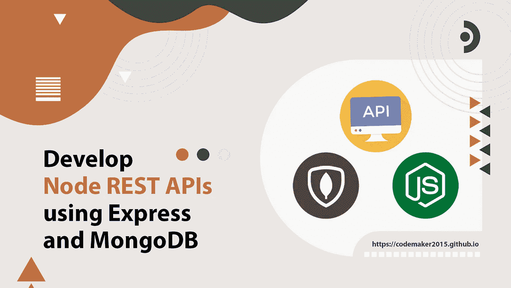
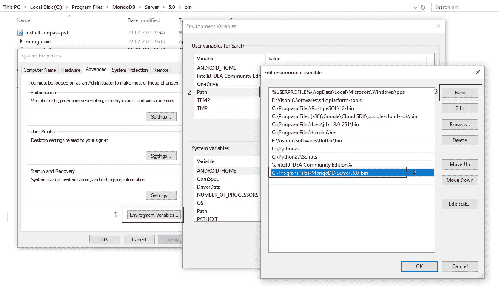
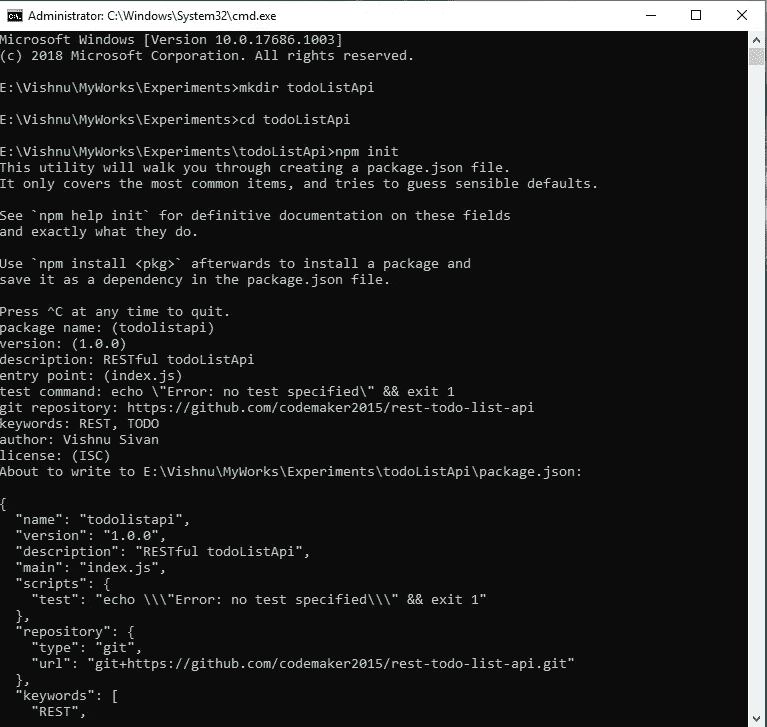
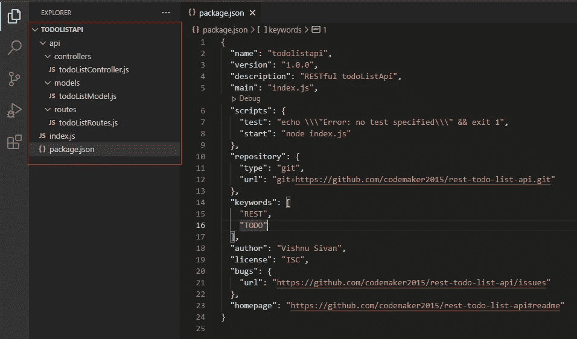
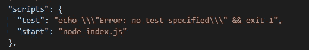
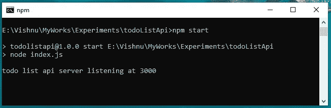

# 使用 Express 和 MongoDB 开发 NodeJs REST APIs

> 原文：<https://blog.devgenius.io/develop-nodejs-rest-apis-using-express-and-mongodb-840ff885be39?source=collection_archive---------13----------------------->



应用程序编程接口(API)定义了一组规则，用于与服务器交互以进行数据检索。API 提供了一种与不同程序通信的方式，并允许一个计算机程序的功能被另一个程序使用。

REST(表述性状态转移)是一种 web 标准架构和 HTTP 协议。在 REST 架构中，客户机和服务器可以请求同时读取、写入和更新数据，而不需要了解客户机和服务器的任何操作。REST API 遵循 REST 架构的设计原则。

在本文中，我们将使用 Node.js 和 mongoDB 创建一个 REST API。

# 入门指南

这篇文章是以这样一种方式设计的，我们将创建一个 RESTful todo list API，它将创建、读取、更新和删除任务。

## 要求

*   Node.js [ [下载](https://nodejs.org/en/download/)
*   MongoDB [ [下载](https://fastdl.mongodb.org/windows/mongodb-windows-x86_64-5.0.1-signed.msi) ]
*   邮递员[ [下载](https://www.postman.com/downloads/)
*   Visual Studio 代码或任何文本编辑器[ [下载](https://code.visualstudio.com/download)

如果您尚未安装列出的软件，请从官方网站下载并安装在您的机器上。确保您已经在环境变量中添加了`mongodb`和`node.js`路径。



使用以下命令检查 node.js 和 mongodb 版本。

```
npm -v
mongo --version
```

## 设置项目结构

*   打开命令提示符，创建一个名为`todoListApi`的文件夹

```
mkdir todoListApi
```

*   移动到该文件夹，使用以下命令初始化 node.js 项目，

```
cd todoListApi
npm init
```

`npm init`将提示您输入一些基本信息，如应用名称、描述、版本、作者和关键字。输入这些信息，然后按 Enter 键完成该过程。项目创建后，你会在目录中得到一个`package.json`文件。`package.json`给出基本项目信息以及项目依赖关系。



*   在目录中打开 VSCode。
*   创建一个名为`index.js`的新文件
*   创建一个名为`api`的新文件夹。在其中，创建三个文件夹— `models`、`routes`和`controllers`。
*   在`api/controller`文件夹中创建`todoListController.js`，在`routes`文件夹中创建`todoListRoutes.js`，在`models`文件夹中创建`todoListModel`。

最终的文件夹结构应该如下所示:



## 设置服务器

*   打开命令提示符，输入以下命令，在机器上安装`express`和`body-parser`包。

```
npm install express body-parser
```

*   打开`package.json`文件，在`scripts`下添加`start`命令。

```
"start": "node index.js"
```



*   打开`index.js`文件，添加以下代码。

*   通过运行以下命令启动服务器。

```
npm start
```



## 设置模式

*   Mongoose 可用于与 MongoDB 实例进行交互。使用以下命令安装`mongoose`。

```
npm install mongoose
```

*   从 `api/models`文件夹中打开`todoListModel.js`文件，添加以下代码。

我们已经为任务集合创建了一个模型。任务模型包含名称、创建日期和状态。默认情况下，状态被定义为待定。

## 设置路线

路由有助于理解应用程序端点处理客户端请求的方式。每个路由都有处理函数，当路由匹配时将执行这些函数。
我们可以定义两条基本路线— `/tasks`和`/tasks/taskId`。下一步，我们将在控制器中定义处理函数。

*   从`api/routes`文件夹中打开`todoListRoutes.js`文件，添加以下代码。

## 设置控制器

控制器是与路由器绑定的回调函数，用于处理请求。

定义控制器来创建、更新、删除和列出任务。创建名为 **listAllTasks、createTask、readTask、updateTask、**和 **deleteTask** 的控制器。控制器使用`mongoose`方法，如**查找**(用于选择)**、findById** (用于单选)**、findOneAndUpdate** (用于更新)**、save** 和 **remove** 对数据库进行更改。

从`api/controllers`文件夹中打开`todoListController.js`文件，添加以下代码。

## 完成服务器设置

让我们连接到数据库并完成服务器配置。

*   使用 mongoose 实例连接来连接数据库。
*   使用`require()`方法加载模型。
*   在 express 应用程序中注册路线。
*   将以下代码添加到`index.js`文件中(替换旧内容)。

使用以下命令启动服务器。

```
npm start
```

你有它！nodejs 中您自己的待办事项列表 api:)

## 测试你的应用

让我们使用 postman 测试 API。

*   打开 postman，在输入请求 URL 部分输入`http://localhost:3000/tasks`,然后按回车键。你可以在 postman 里看到一个空的回复。
*   将方法更改为 POST，并将请求正文类型更改为`x-www-form-urlencoded`。提供名称作为键，任务名称作为值。点击发送按钮，你会得到一个回复`200 ok`

## 处理异常(可选)

如果您输入了错误的路线`[http://localhost:3000/task](http://localhost:3000/task)`而不是`[http://localhost:3000/task](http://localhost:3000/task)s`，服务器会响应一条消息**无法获得/任务**。通过在服务器文件(index.js)中添加以下代码，创建自定义错误信息，而不是默认错误信息。

```
app.use(function(req, res) {
  res.status(404).send({url: req.originalUrl + ' not found'})
});
```

感谢阅读这篇文章。

感谢 [Gowri M Bhatt](https://www.linkedin.com/in/gowri-m-bhatt-85b31814b/) 审阅内容。

如果你喜欢这篇文章，请点击拍手按钮👏并且分享出来帮别人找！

这篇文章也可以在 [Dev](https://dev.to/codemaker2015/develop-nodejs-rest-apis-using-express-and-mongodb-3bdm) 上找到。

本教程的完整源代码可以在这里找到，

[](https://github.com/codemaker2015/rest-todo-list-api) [## GitHub-code maker 2015/Rest-todo-list-api:使用 nodejs 和 mongodb 的 Rest todo 列表 API

### 此时您不能执行该操作。您已使用另一个标签页或窗口登录。您已在另一个选项卡中注销，或者…

github.com](https://github.com/codemaker2015/rest-todo-list-api)