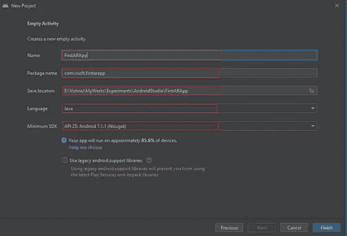

# 使用 ARCore 和 Sceneform 在 Android studio 中开发 HelloAR 应用程序

> 原文：<https://blog.devgenius.io/develop-your-helloar-app-in-android-studio-using-arcore-and-sceneform-ae9e1b7a1b5b?source=collection_archive---------2----------------------->

随着人们对元宇宙每日趋势的兴趣越来越浓厚，AR 变得触手可及。它正在改变传统的互动方式，使之更加数字化。

# 什么是增强现实

增强现实(AR)是一种真实世界环境的交互体验，其中驻留在真实世界中的对象通过计算机生成的感知信息得到增强，有时跨越多种感官形式，包括视觉、听觉、触觉、体感和嗅觉——维基百科

# 什么是 ARCore

ARCore 是谷歌开发的一个软件开发工具包，允许构建增强现实应用程序。

ARCore 使用三种关键技术将虚拟内容与通过智能手机摄像头看到的真实世界相结合。

*   六个自由度允许手机理解和跟踪其相对于世界的位置。
*   环境理解允许手机检测水平平面的大小和位置，如地面或咖啡桌。
*   光线估计允许手机估计环境的当前光线条件。

# 场景形式

Sceneform 是 Google 官方 AR SDK，使开发人员能够制作 AR 应用程序，而不必被告知 OpenGL。

Sceneform 提供了以下选项:

*   支持 ARCore 的手机的自动兼容性检查。
*   正在检查相机权限。
*   一个操纵 3D 资产的插件。
*   一个场景图形 API 来抽象所有的复杂性。

# 入门指南

首先需要通过添加 Sceneform SDK 在项目中启用 ARCore。Sceneform 自动执行两个主要操作:

*   检查 ARCore 的可用性
*   请求允许拍照

创建一个新的 Android Studio 项目，并选择一个空活动。

## 添加依赖关系

将以下依赖项添加到项目级`build.gradle`文件中:

将以下依赖项添加到您的应用程序级`build.gradle`文件中:

> *确保您设置了****minSdkVersion>23****因为***scene form SDK 要求* `*minSdkVersion*` *大于 23。另外，将****Maven****资源库包含在您的项目级别* `*build.gradle*` *中。**

*在您的`AndroidManifest.xml`文件中添加以下几行:*

*如果您的应用程序仅在 AR 模式下工作，则通过设置`**required = true**`启用 ARCore 支持，否则将其设置为`**required = false**.`*

*然后将您的项目与 Gradle 文件同步，并等待构建完成(单击同步图标)。这将在我们的项目中安装并启用 Sceneform SDK。现在，我们可以开始创建我们的第一个 ARCore 应用程序。*

*首先，我们必须将 Sceneform 片段添加到我们的设计布局中。这将是渲染 3d 模型的容器，并处理相机实例化和其他 ar 相关功能。*

*像这样将 sceneform ar 片段添加到`activity_main.xml` 中，*

## *运行时检查兼容性*

*我们将检查设备是否:*

*   *正在运行 Android API 版本> = 24。*
*   *可以支持 OpenGL 版本。*

*对于使用 ARCore 和 Sceneform SDK 支持 AR 应用的设备，上述条件是强制性的。如果不满足这些条件，则提供一条有效消息并结束活动。*

*将下面的方法添加到您的类中进行兼容性检查:*

## *向我们的应用程序添加 3D 模型*

*现在，我们可以下载 3D 模型并将其导入到我们的应用程序中。你将从像 [cgtrader](https://www.cgtrader.com/free-3d-models) 、 [free3d](https://free3d.com/3d-models/) 和 [turboquid](https://www.turbosquid.com/) 这样的仓库中获得 3D 模型。Google 还提供了一个优秀的资源库 [POLY](https://poly.google.com/) 来为你的应用程序下载 3D 模型。您可以在下载模型。fbx，。obj 或。gltf 格式。我们将在。fbx 格式。*

*在这个演示中，我们将在用户点击时增加一个 3D 立方体。*

*打开项目并在项目视图中展开 app 文件夹。在 app 文件夹内创建一个名为`sampledata`的文件夹。然后你必须将下载的模型文件添加到这个`sampledata`文件夹中。这里我加了一个`cube.fbx`型号。您可以添加自己的模型。*

**

## *使用 Sceneform 插件导入模型*

*在你的应用程序的`build.gradle`文件中应用 sceneform ar 插件。
添加以下依赖关系:*

*在应用程序的`build.gradle`文件末尾添加以下行:*

*最后，应用程序的`build.gradle`看起来是这样的:*

> *Android ARCore Sceneform 需要 Java 8 或更高版本。*

*我们有两个场景表单资产文件`sfa`和`sfb`。`sfa`只是一个元数据文件，而`sfb`是二进制文件。当您创建`sfb`文件时，会自动创建`sfa`文件。*

## *整合模型*

*将以下代码添加到 java 文件中:*

## *将模型添加到 AR 场景*

*AR 片段是容纳所有 3d 对象的容器。因此，我们将通过在片段中实现`onTapListener`在片段被点击时添加一个模型。*

*让我们来理解代码:*

*使用`hitResult`，获取点击的位置值，并在该位置创建锚节点。锚节点用于将对象放置在真实世界的位置，但它不能在模型上执行任何操作。因此，我们创建了一个`TransformableNode`，它可以让用户对对象进行各种变换，如平移、旋转和缩放。*

*让我们来看看这里的一些术语:*

*   ***场景**:是我们 3D 世界渲染的地方。*
*   ***HitResult** :这是一条来自无穷远处的假想光线，它与现实世界的第一个交点就是轻击点。*
*   ***锚点**:现实世界中的固定位置。用于将本地坐标转换为真实坐标。*
*   ***TransformableNode** :能够对用户交互做出反应的节点，比如平移、旋转、缩放、拖动。*

*最后，`MainActivity.java`文件看起来像这样:*

*让我们看看这里发生了什么:*

1.  *首先，我们需要使用`supportFragmentManager` 从布局文件中获取 ar 片段及其 id。*
2.  *然后，我们需要将模型加载到场景中。为此，我们使用 Sceneform SDK 提供的`ModelRenderable`类。我们通过将生成的`.sfb`文件的名称作为`setSource()`方法的参数来加载模型。*
3.  *该模型正在后台线程上构建。之后，它使用主线程在场景中渲染。*
4.  *我们在`thenAccept`方法中接收模型。如果在构建模型时出现错误，就会抛出一个异常。*
5.  *现在，我们创建一个`anchorNode` 和一个`transformableNode`。另外，请参考`setRenderable()`中的可渲染对象。最后，我们将`anchorNode`设置为`transformableNode`的父对象，并将`anchorNode`添加到场景中。*

*你有它！Android studio 中自己的 AR 应用:)*

**

*感谢阅读这篇文章。*

*如果你喜欢这篇文章，请点击拍手按钮👏并且分享出来帮别人找！*

*本教程中项目的完整代码可从以下网址获得:*

* [## GitHub-codemaker 2015/ar-Object-augmentation-Android-studio:使用 ARCore 的对象增强在…

### 此时您不能执行该操作。您已使用另一个标签页或窗口登录。您已在另一个选项卡中注销，或者…

github.com](https://github.com/codemaker2015/ar-object-augmentation-android-studio)*