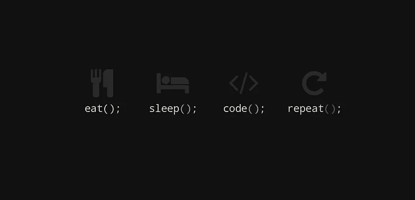

# 开发人员的职业生涯陷入了一个循环——吃饭→睡觉→编码→重复

> 原文：<https://blog.devgenius.io/developer-careers-are-stuck-in-a-loop-eat-sleep-code-repeat-1393dcb359aa?source=collection_archive---------1----------------------->

## 更多的代码，更少的生命，事业停滞不前

[iamaliuyar](https://pixabay.com/illustrations/eat-sleep-code-repeat-2661935/)

> 开发人员正努力在他们的职业生涯中站稳脚跟

开发人员被困在土拨鼠日编码循环中，他们工作更加努力，但他们的职业生涯停滞不前，工作之外的生活停滞不前。

开发人员处于一个 for 循环中，每天都是另一个循环，但他们的职业生涯并没有进步，他们只是在不停地循环。

我在看[《明日边缘》](https://www.imdb.com/title/tt1631867/?ref_=ttmc_mc_tt)，一个士兵被困在时间循环中，当他死去的时候，日子重新设定，他一遍又一遍地重复着同一天。

他(汤姆·克鲁斯)练习格斗技巧，通过试错慢慢在战斗中杀死更多的人。就像玩电脑游戏，你知道会发生什么。

这就是许多开发人员如何处理他们的日常工作，创建代码，完成他们的任务，一天重新开始，明天你再做一遍。开发人员非常擅长编写代码，但他们的职业生涯没有重点或动力。

**吃饭→睡觉→打码→复读**

# **更加努力**

我经常看到开发人员的一个陷阱是在项目工作上更加努力，更长的时间和做更多的任务。

软件项目将花费你给他们的所有时间和精力，在软件项目上总会有更多的工作要做。完成工作的回报更多的是同样的工作。

**软件项目并不是拿多少就给多少。**

我看过一个编码工作循环的例子，一个 C#开发人员在一个项目上做了惊人的工作，经常工作到很晚，通过加班和周末工作积累了 22 天的假期。除此之外，他只休了他应得的一半假期。

客户反馈非常好，开发人员为成功上线做出了贡献。

开发者得到了好评(平均分)，仅此而已。他的 C#经验又增加了一年，他还开发了另一个项目。他的职业生涯停滞不前，他在年底和年初处于同样的位置。

# 运行至停止

作为一名开发人员，每天的工作就像在跑步机上跑步，你可以跑得更快、更久，但你哪儿也去不了。

对你的项目工作的奖励是在年底的一个平均回顾和在你的核心技能上的另一年经验。

如果你幸运的话，你将获得不同的技能，并有希望获得需求技能(有经验的开发人员较少的地方的新技能)。

不要在工作之外做项目工作，这是你的时间，你应该用它来获得新的知识(认证)或新的技术技能(练习技能和编写代码)，从而推进你的职业生涯。

享受美好的生活，在工作结束时有所期待。

日常项目工作有益于公司，工作之外的时间应该有益于你工作或职业之外的生活。

# **远程工作是厄运滚动**

在家工作模糊了工作生活和家庭生活的界限。类似地，社交媒体也有无尽的滚动，它带走了自然的停止点。

当你在家工作时，你没有通勤作为一个自然的停止点，所以你可以很容易地给工作更多的时间。

工作时间的增加降低了你工作之外的生活质量。在家工作减少了我们在屏幕和键盘之外观看、感受、嗅闻和观察生活的时间。

生活感觉就像

**吃饭→睡觉→打码→重复**

这会让你筋疲力尽，这也是为什么倦怠会增加的原因

*   [为什么没有人谈论减少开发人员倦怠的必要性？](/Why Is No One Talking About the Need to Reduce Developer Burnout)
*   83%的开发人员感到精疲力竭，81%的人说在 Covid 期间情况变得更糟

# **工作不会让你升职**

这种方法的问题是，开发人员的工作通常涉及到使用您已经掌握的相同技能，而不是建立新的技能。当你

*   获得新技能(编程语言、DevOps、Azure、集成)
*   承担新的责任(首席开发人员、Scrum master 等)
*   新角色(解决方案架构师、首席开发人员、新领域的开发人员)
*   认证和知识
*   人脉(你认识谁，不仅仅是你认识的人)
*   提升你的品牌——社区、博客等

你不知道新的机会，如果你不与团队中的其他开发人员和高级人员接触，你就不太可能被考虑新的机会。

你拥有的技能越多，你就越有价值。最有价值的技能是新兴技术。专家少了，你有机会成为思想领袖。

# **停下来看大图**

要走出工作循环，跳出工作的仓鼠轮，你需要退后一步，评估一下情况。别跑了，看看地图，看看你走的方向对不对。

很容易坚持工作，每天做同样的工作，然后一年后意识到它没有让你去你想去的地方。

你需要回顾过去的 6-12 个月

*   你学到了什么？
*   你喜欢什么？
*   我获得了哪些技能？
*   我犯了什么错误？
*   我会有什么不同的做法？

放眼未来

*   我想继续走这条路吗？
*   一年后我会在哪里？
*   我的下一个职业目标是什么，我会实现吗？
*   我需要做些什么来实现我的下一个职业目标？
*   我想使用什么技术？
*   我应该学什么？
*   我以后想做什么工作？
*   我的理想角色是什么，我该如何实现？

走出圈子，赢得职业生涯的战斗