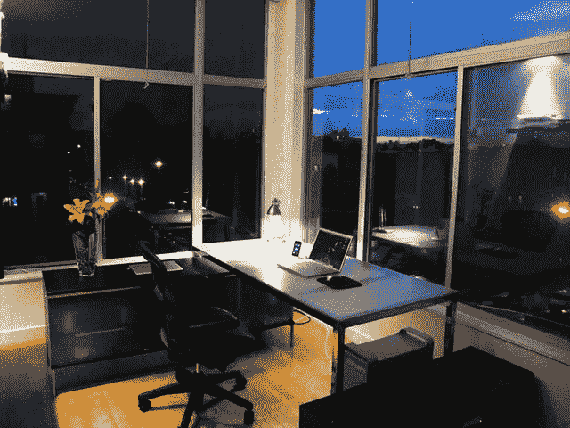
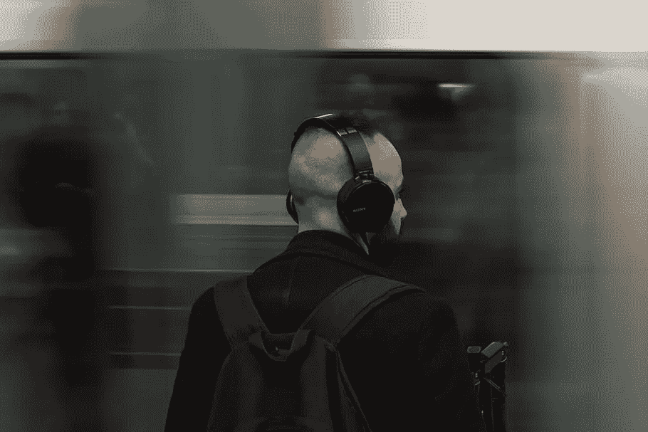
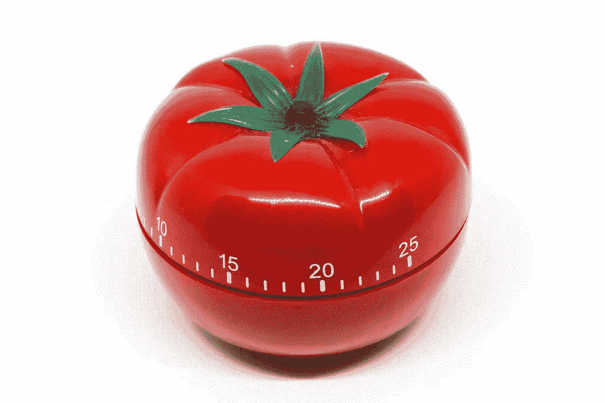
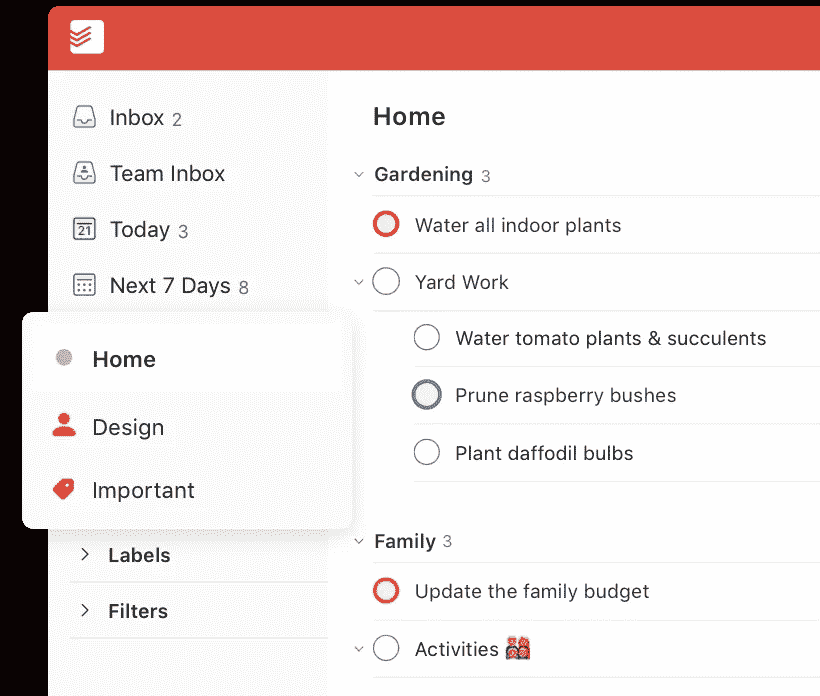
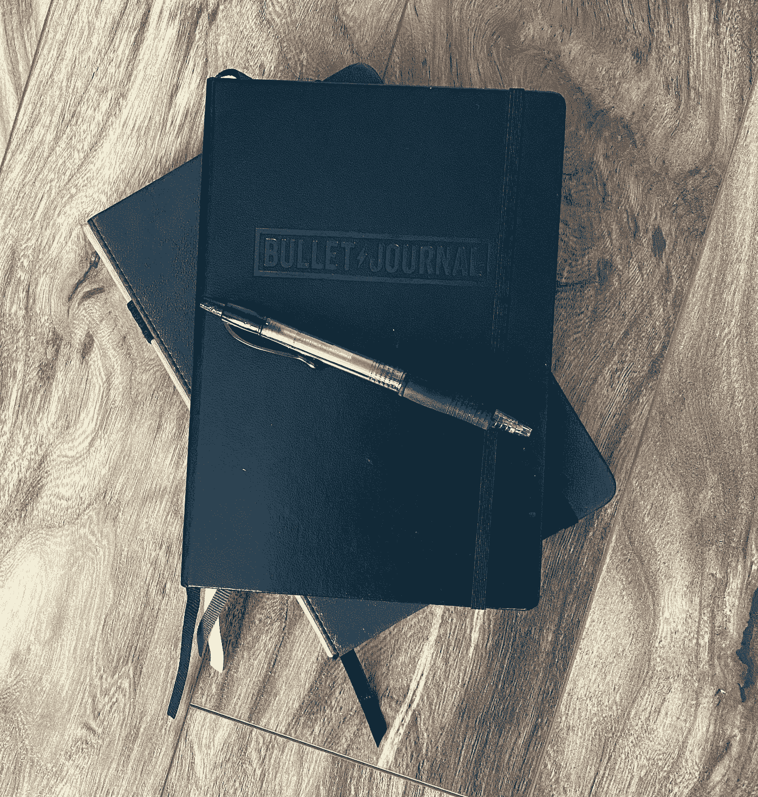
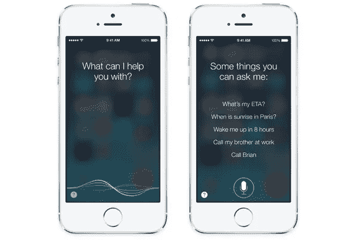
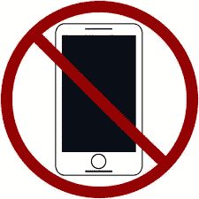

# 在家工作时保持高效工作的开发人员指南

> 原文：<https://blog.devgenius.io/developers-guide-to-staying-productive-while-working-from-home-c300e9d6e812?source=collection_archive---------11----------------------->

在过去的 5 年里，我一直在家做软件开发。随着冠状病毒的传播，似乎我更多的家人和朋友也开始这样做。我一直听说他们很难集中注意力。

当我第一次开始在家工作时，我也有一些同样的问题。起初，我很容易坚持工作，但是当你习惯了，分心的事情就开始出现了。它们开始时很小，但是如果你让它们生长，它们会被切割一千次直到死亡。

作为软件开发人员，我们已经每天处理一百万个微决策。再加上那些令人分心的事情，那将会是一场灾难。幸运的是，我有一些提示可以帮助你掌握一切。

# 专用工作空间

内政部

拥有一个专用的工作空间是我成功的关键。我用一间备用卧室，但任何空间都可以。我认为这是我完成工作相关任务的地方。这向我的大脑发出了工作时间到了的信号。

我甚至有两张桌子。一个用于工作，一个用于个人项目。当我坐在办公桌前时，是时候完成与工作相关的任务了。

# 耳机

耳机

另一件真正帮助我进入状态的东西是耳机。我有一对 Airpods 和 over-ear Sony 的，但任何一个都可以。当我戴上它的时候，它能帮我转移注意力。我甚至发现听正确的播放列表会增加我的产出。

在 Spotify 上，我推荐 [Dope Beats](https://open.spotify.com/playlist/37i9dQZF1DWZn5qrhqBJgl) 或 [Deep Focus](https://open.spotify.com/playlist/37i9dQZF1DWZeKCadgRdKQ) 播放列表。这个免费的 app 也很棒:[https://apps . apple . com/il/app/lo-fi-radio-work-study-chill/id 1231391229](https://apps.apple.com/il/app/lo-fi-radio-work-study-chill/id1231391229)

# 番茄定时器

番茄定时器

当我在做一些我真的不想做的事情时，番茄定时器成了我的救命稻草。默认设置是工作 25 分钟，休息 5 分钟。这有助于你知道 25 分钟后你会有一个休息时间。大多数时候，如果我快要解决某个问题，我会放弃休息。

番茄定时器也帮助我管理我的能量。你曾经紧张地工作了几个小时，感到筋疲力尽吗？坚持休息，深呼吸或冥想有助于让你一整天都充满活力。

这是我用的 app:[https://apps . apple . com/us/app/be-focused-pro-focus-timer/id 961632517？mt=12](https://apps.apple.com/us/app/be-focused-pro-focus-timer/id961632517?mt=12)

# 电影时间

电影院

我是从某个地方偷来的(要么是[乔·罗根](http://podcasts.joerogan.net/)要么是[蒂姆·费里斯播客](https://tim.blog/podcast/))，但基本前提是:当你坐下来工作时，你应该表现得像要去看电影一样。确保你有喝的东西，你去过洗手间，你准备好至少坐一两个小时。这样就没有什么会打断你的注意力。

# Todoist

不管你的职业是什么，你都不能把所有的事情都记在脑子里。你需要在忘记之前把你的想法和任务拿出来。我曾经使用[子弹日志](https://bulletjournal.com/)(这也很棒)，但是我讨厌带着笔记本。

这就是我开始用 [Todoist](https://todoist.com/) 的原因。每当我有一个重要的想法或任务时，我都会把它放在应用程序中。然后，每天晚上我会把 2-4 个最重要的任务添加到我第二天的待办事项列表中。

# 笔记本电脑

笔记本电脑

正如我在上一篇技巧文章中所说的，我之前使用了 Bullet Jornal 方法来跟踪任务。现在我用 Todoist，但是我总是在我的桌子上放一个笔记本来开会。我发现人们不喜欢被问到他们已经告诉你的事情(咄！).

这就是为什么在每次会议上，我都会记下与我相关的重要内容。这有助于我产生任务，我再也不用问任何人同样的问题两次。当我在会议结束后被其他事情分心时，这救了我。

# Siri/谷歌助手

iPhone4S 上的语音控制功能

为了掌控我的个人生活，我倾向于使用 Siri(或 Android 的谷歌助手)。提醒起来超级方便。只要我脑子里有什么想法，我就会说“嘿 Siri，提醒我每周三晚上 7 点倒垃圾”。

Siri 也非常适合基于位置的提醒。如果我出门在外，我可以说这样的话，“嘿 Siri，当我回家的时候提醒我给植物浇水”。如果你有 Apple watch 或 Airpods，你甚至不用掏出手机。

# 没有电话

没有电话

这似乎是一个显而易见的问题，但我知道很多开发人员在工作时都把手机放在身边。然后他们一收到通知，就在他们手里。研究甚至表明，这些通知给了我们多巴胺，让视力中没有它们变得更加重要。

我承认我在这个问题上很纠结，但是我已经想出了一个系统。因为我有苹果手表，我把手机放在另一个房间，只有短信和电话进来。这有助于我在没有收到每一个小通知的情况下仍然感到与外界联系。

# 结论

在家保持高效率可能是一场战斗。但是，有了这些建议，你可以给自己一个奋斗的机会。通过使用其中的一两个，我可以保证你的工作效率会提高。

我自己也一直在寻找更多的建议，我很想听听你们中的一些人在家里工作时是如何保持高效的。所以，让我在下面的评论区告诉你什么对你有用。