# 使用 MVC 开发模块化应用程序

> 原文：<https://blog.devgenius.io/developing-a-modular-app-fbec6bcf1815?source=collection_archive---------11----------------------->

## 使用模型控制器分离我们的代码

## 开发可重用的网络课程第三部分

所有的部分组成一个整体，但是一次专注于一个部分对大多数团队来说更有效率，尤其是在处理大型项目的时候。维护模块化开发且组织良好的代码库通常更容易。

## 以下是第一部分，以防你错过:

 [## 开发一个可重用的网络类

### 以及为什么编写可重用的代码很重要

medium.com](https://medium.com/swlh/developing-a-reusable-networking-class-66ef1f7566f) 

## 第二部分…

 [## 实现自动编码

### 开发一个可重用的网络类第二部分

medium.com](https://medium.com/swlh/implementing-automatic-codable-1e212b54848) 

在第二部分的中，我们已经了解了如何实现 Codable，如何制作可重用的编码和解码方法，以及如何使用我们的`NetworkService`类来封装这些方法。

这一次，我们将把这个`NetworkService`放在一个应用程序中使用，这个应用程序使用一个可编码的结构来存储和检索使用 Firebase 的对象。

## 组织

我们完全可以在 ViewController 中开发这个应用程序——这并不复杂。但是后来，假设我们决定改变我们对请求进行错误处理的方式。如果我们不模块化地编写我们的代码库，我们就会陷入重构每种方法的困境。同样，对于这样规模的项目，*没什么大不了的。*

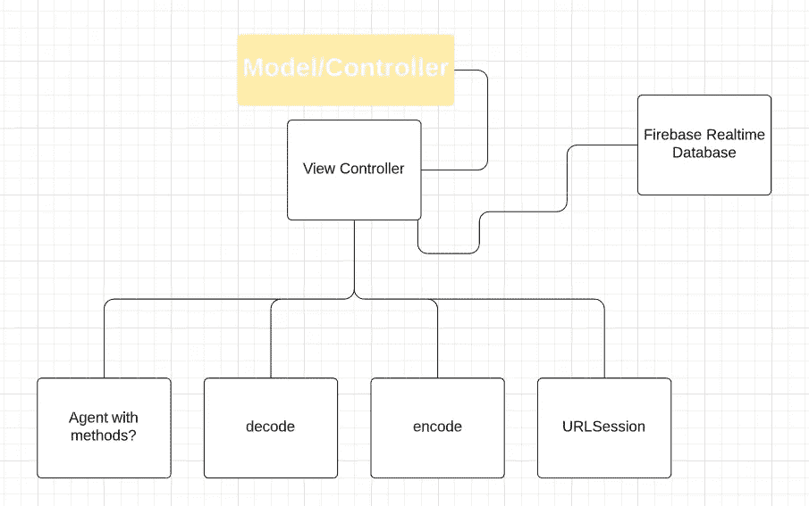

但是，开始添加新功能，故事就会发生巨大的变化。随着项目的发展，现在也许您要维护 100 个共享公共代码的方法，而您本可以编写一个方法并重用它，只需要重构这一个方法。见鬼，即使我们只是添加了另一个 ViewController，我们也会失去对所有网络代码的访问，除非我们建立了不必要的委托关系或其他形式的双向通信。

# 模型视图控制器

我喜欢使用 MVC(或者模型、视图、控制器)开发我的应用程序。因此，在较小的应用程序中，我通常会创建 3 个主组和与每个主组相关的子组。每层一组—模型、视图和控制器。如果您正在跟进，并且还没有这样做，那么继续创建一个单一视图应用程序。

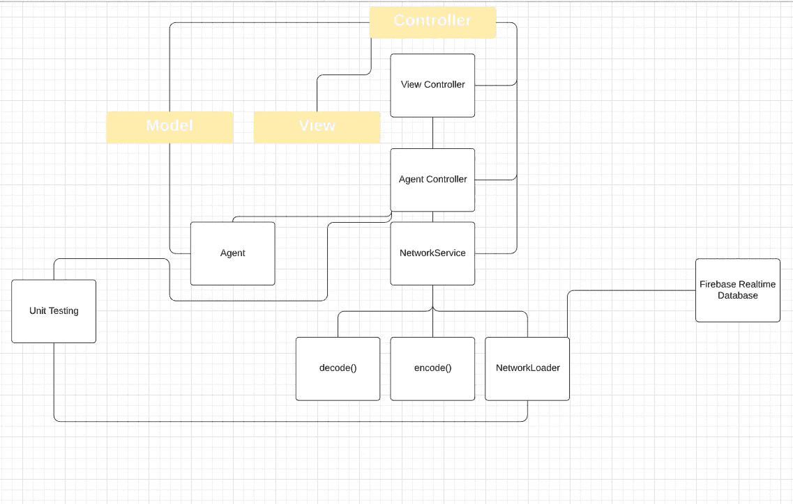

目前我们的视图层中唯一的东西是我们的故事板(或编程/SwiftUI 视图)。如果我们添加自定义视图，它们的文件也将属于视图层

## 模型

我保持模型非常简单，除了偶尔计算的属性，通常排除任何逻辑。我将我的模型存储在模型组中。让我们为我们的模型创建一个文件和结构。记住只使用符合 Codable 的属性。

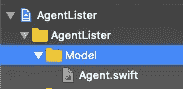

模型层——Tada

## 视角

在视图层，我放置了我的故事板、自定义单元格、自定义视图等..本质上任何可以被认为是视图的东西。

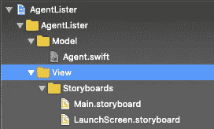

视图层(目前只是故事板)

注意:一些关于把他们的故事板放在哪里的争论。对我来说，他们主要关心视图是有意义的，因为他们包含了视图和与之相关的信息。虽然视图保存在 ViewController 的表示中，它们也是视图和 View controller 之间的桥梁。我也看到人们把他们的故事板放在他们的资源(或应用程序)文件夹中，或者只是把它们挂在他们项目的根目录下。

## 控制器

在控制器层，我放置了视图控制器和模型控制器。在这种规模的项目中，我可能不会对模型和视图控制器使用单独的组。但是让我们像发展这个项目一样发展它。

让我们把网络服务。我们模型控制器组的 Swift。以防你没有《T2》第二部的拷贝。您可以使用单独的文件，也可以将它们放在一个文件中。我要把我的全部放进一个。

网络加载器和实现

让我们也为模型控制器创建一个文件。我通常使用的命名约定是 modelNameController(独一无二，嗯！？🙄)

我将其余文件(AppDelegate、SceneDelegate、Assets.xcassets 和 Info.plist)放在一个没有文件夹的组中。我将这个组命名为资源。使用不带文件夹的群组会将文件保留在磁盘上的原始位置，但会在项目中移动它们。

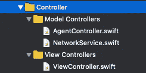

⚠️如果不这样做，将会产生一个编译器错误，该错误可以通过在项目的生成设置中更改文件的位置来解决。[指路](https://medium.com/@salvador.rhenz/setting-info-plist-path-on-xcode-11-65bed161bea5) ⚠️

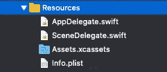

请注意文件夹图标左下方的阴影区域。这表示没有文件夹的群组

# 让我们创建我们的用户界面

当我们在故事板和文件之间来回切换时，请耐心等待。

为了简单起见，我现在将删除故事板上的 ViewController，并用一个`UINavigationController` 替换它。如果你注意到了，我们的导航控制器附带了一个`UITableViewController`

我还要删除 ViewController.swift 文件，替换为:
1。创建新文件
2。选择可可触摸类别
3。从 UITableViewController
4 子类化。将文件命名为某种语义(我将把我的命名为 AgentListViewController.swift)

现在回到故事板，我将把 UITableViewController 的类改为 AgentListViewController

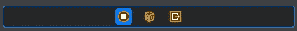

单击视图控制器上方的栏，并确保选中高亮显示的图标。然后更改类别并按键盘上的 enter 键

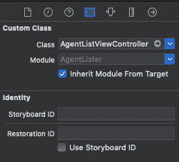

完成后，我会将我的导航控制器设置为应用程序的入口点，否则，当我们运行应用程序时，我们只会看到一个黑屏。

点按导航控制器上方的栏，并确保选中高亮显示的图标

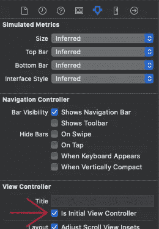

确保在“属性检查器”选项卡上选择了“初始视图控制器”

此时，我总是运行我的应用程序，如果我在源代码控制之下，我会提交我的初始项目。

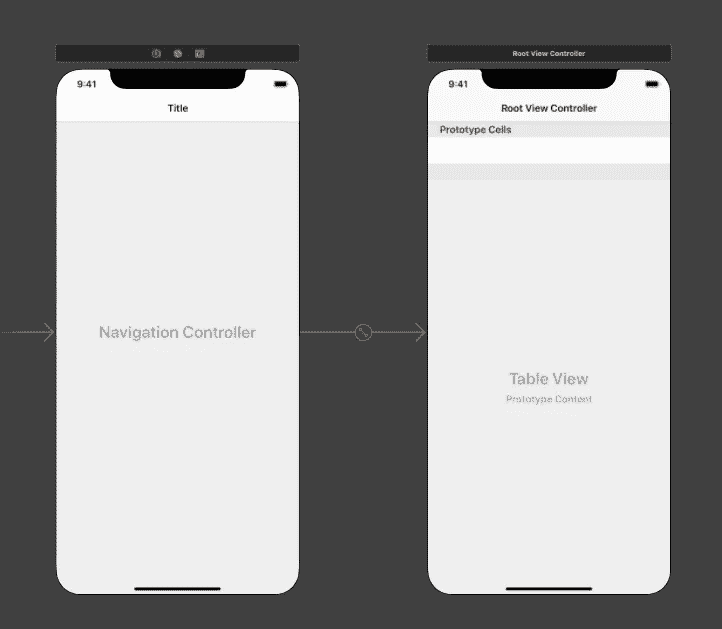

在这一点上，这应该是你的故事板。请注意导航控制器左侧的箭头，这表示它是您的应用程序的入口点。

在这一点上，我们没有任何东西可以在我们的应用程序中展示。我们可以在 Firebase 中手动输入数据，然后下载并解码……但这很繁琐。

我在测试的时候，经常喜欢用 Swift 做对象，编码成 JSON，然后发给服务器，看看能不能解码。一旦我们像现在这样有了基础设施，这是一个相当快速的健全测试。我已经如此习惯于保持我的 ViewControllers 没有不必要的代码，以至于我几乎已经不再使用它们来进行测试，而是经常选择单元测试来一箭双雕。不幸的是，这篇文章已经发展得不成比例了，所以这是另一天的主题。

让我们在模型控制器中创建一个快速的一次性方法，用数据填充 Firebase 数据库。

# 说到火焰基地

首先，我们需要创建一个 Firebase 实例，并获得实时数据库(⚠️而不是云 firestore)的基本 URL。如果你还没有的话，去 https://firebase.google.com/的[创建一个账户。](https://firebase.google.com/)

请沿着这条路走下去——如果你离开这条路，我可能无法带你回到我们正在走的这条路上。开个玩笑…如果你迷路了，找不到回去的路，你可以重新开始，创造一个新的实例🤓。

## 我们去 Firebase 控制台吧

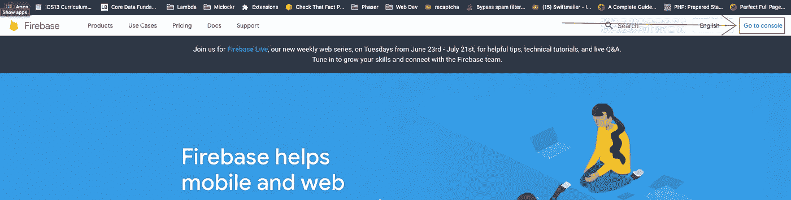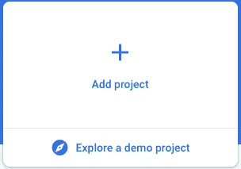

进入控制台后，添加一个新项目

我通常会禁用“玩具”应用的分析功能，但这没多大关系——我们没有使用 SDK。

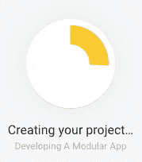

我们等待着…

这一步会绊倒很多人。尤其是考虑到我说过不要使用云 Firestore。点击云 Firestore lol…

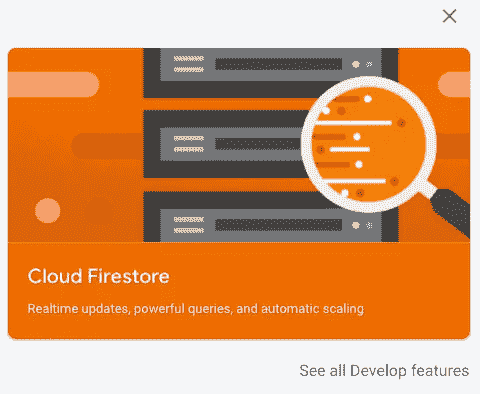

我知道，我说过不要用云 Firestore…我责怪谷歌

向下滚动，直到看到实时数据库，然后单击创建数据库

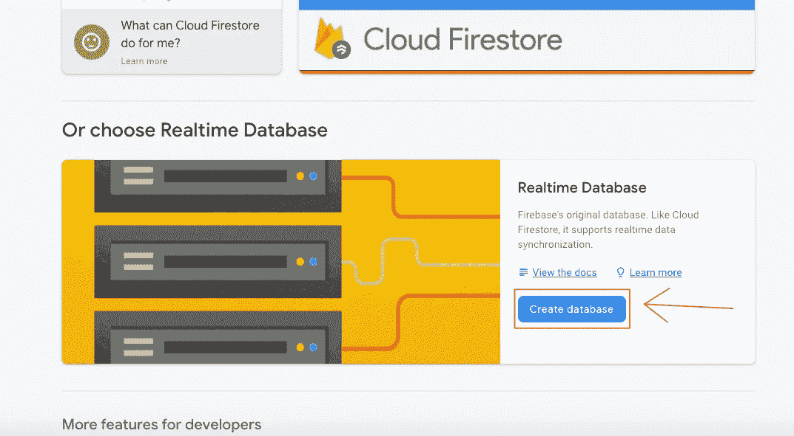

让我们从测试模式开始，因为这是我们对这个应用程序所做的一切。如果你决定(或者你正在阅读这篇文章的目的是)将这个应用程序投入生产，你应该仔细阅读 Firebase 最佳安全实践，以确保你的用户数据不容易受到外部攻击。

让我们从这个屏幕中获取我们的 URL，并在我们的模型控制器中创建一个私有常量`private let baseURL = URL(string:"https://your-firebase-database-project.firebaseio.com")`

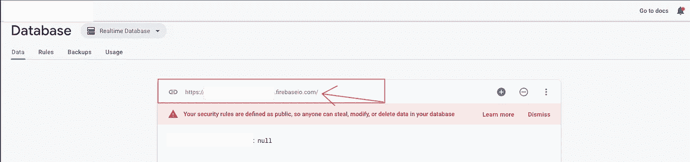

获取整个 URL，并在模型控制器中用它创建一个常量

让我们向模型控制器添加几个其他属性。让我们给自己一个使用 URLSession 的 NetworkService 私有实例(所以默认初始化器)

我还将添加一个私有的 lazy var firebaseURL。json 到我们的 baseURL。这是懒惰的，因为它需要使用我们的 baseURL，这是一个实例属性。惰性变量直到我们的类被初始化后才被初始化，这保证了在创建 firebaseURL 时我们将有一个 baseURL 的实例。

## 让我们在模型控制器中创建一个方法，将对象发送到数据库。

我会叫我的`sendAgent(_ agent: Agent)`

请记住，networkService.encode 接受一个请求和一个可编码的实例，对实例进行编码并将其附加到请求中。我们不需要为这个请求添加任何头，因为 Firebase 知道我们想要根据方法和以. json 结尾的 URL 做什么。

这是目前为止我们的 AgentController:

现在，让我们在视图控制器中给自己一个 AgentController 的私有实例，并使用它向 Firebase 发送一些代理。请记住在发送代码后删除代码，并验证代码是否已发送，否则每次运行应用程序时都会发送代码。

## 但是首先，删除样板评论！

它们既难看又没必要..让我们摆脱他们。除了 1 个方法之外的所有方法——离开`cellForRowAt`(应该是`numberOfRowsInSection`下的第一个)。继续并取消注释那个，但是删除其余的。如果您打算继续做下去，您可能想使用`prepare(for segue: …` ,但是您也可以开始输入它，稍后使用自动完成。

如果你运行你的应用程序并检查 Firebase，你可能会有点困惑。您可能期望看到 5 个代理，但只看到 1 个！

## 怎么回事？？

*“好的，Kenny…我运行了我的应用程序，然后去了 Firebase——我只存储了一个对象！”*

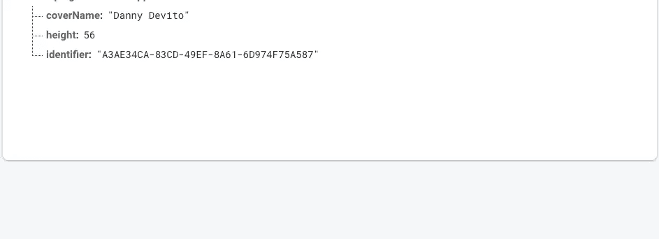

如果你参加了我的第二部分，你可能已经准备好了。你甚至可能试图通过发布请求来解决这个问题。这在技术上可以解决这个问题，但是如果您需要获得一个特定的代理，您就失去了从数据库中轻松提取代理的能力。你必须把它们都下载下来并解析列表来找到你要找的那个。

无论如何，这里发生的是我们确实把所有 5 个特工都送到了 Firebase。Firebase 只是用它前面的一个覆盖了每一个，因为这就是 PUT 所做的。

让我们修改发送方式。我们仍将使用一个 PUT 请求，所以如果您已经更改了您的请求，请继续将其更改回来。相反，我们要做的是对 JSON 进行不同的编码，这样它就以我们对象的标识符作为键，以我们的对象作为值来存储。请记住，在 Swift Land™️中，这是`[String:Object]` …以后会派上用场。

要做到这一点，我们所要做的就是修改我们用来创建请求的 URL，使它在 baseURL 之后. json 之前有代理的标识符。

现在，在运行应用程序之前，您需要从 Firebase 数据库中删除数据(只需单击当您将鼠标悬停在数据库层次结构的最顶端时出现的小 x(我们的第一个代理之前的部分))。之后，运行你的应用程序，你将在 Firebase 中拥有 5 个对象！

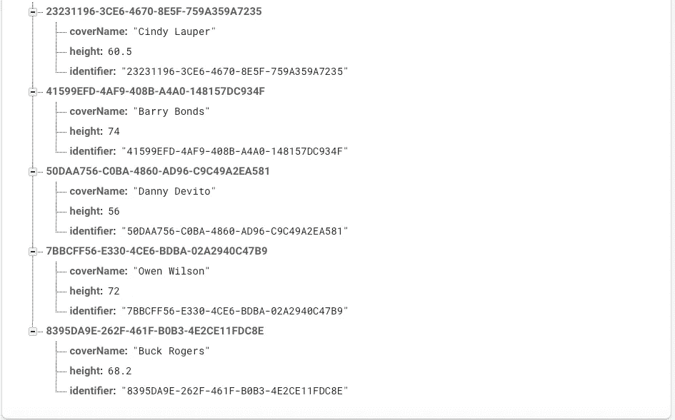

⚠️:好的，确保你现在从你的视图控制器中删除这段代码。我们不想每次都发！⚠️

太好了，现在我们在 Firebase 里有数据了。让我们下载我们的对象，并将它们存储在应用程序功能的核心位置——模型控制器。

让我们在模型控制器中创建一个可选的对象数组。我们将使用这些来显示我们的表视图。

还有一个方法，`getObjectsFromFirebase`。getObjectsFromFirebase 将创建一个 get 请求，解码一个包含`[agent.identifier:agent]`的字典，并通过映射该字典的值来设置代理数组。我们还需要一个完成处理程序，让我们的 UI 知道代理何时被解码成代理数组。我们将在主线程上调用 completion()，这样我们就可以安全地更新我们的 UI。

现在我们的 AgentController 可以下载代理，并填充它的数组，让我们试一试。

在我们为 numberOfSections 返回 0 的地方，让我们将其更改为 1 或删除该方法(默认为 1 section)。

我们的 ObjectsListViewController 中的 numberOfCells 方法返回 0，让我们改变它，这样它返回 AgentController 的数组中的代理数量，**或者** 0，如果它是零。

`return agentController.agents?.count ?? 0`

最后，让我们回到故事板，给我们的单元格一个标识符，将该标识符粘贴到 cellForRowAt 方法中，并将代理的名称分配给我们的单元格的 textLabel。

在 viewDidLoad 中，调用 agent controller . getagentsfromfirebase。在完成块中，调用 tableView.reloadData。

这是整个 ViewController:

# 总结

如果你一直和我在一起，从另一边走出来，对模块化开发应用有了更深的理解，那么恭喜你！我们在这个系列中讨论了很多！

在第 1 部分中，我们开始看到通过开发一个可重用的网络类来开发模块化代码的好处。

在第二部分中，我们以模块化的方式实现了自动编码。

我们只是将所有这些放在一个应用程序中，我们使用 Firebase 和他们的 REST API 进行模块化开发。

干得好！

*下次和我一起分享更多干净的代码和最佳实践。*