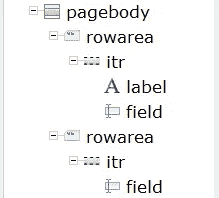

# 使用自然 AJAX 框架开发 AJAX 网页

> 原文：<https://blog.devgenius.io/developing-ajax-web-pages-e270eb59fc92?source=collection_archive---------13----------------------->

## 将大型机数据库连接到 web 环境


照片由[UX](https://unsplash.com/@uxindo?utm_source=medium&utm_medium=referral)在 [Unsplash](https://unsplash.com?utm_source=medium&utm_medium=referral) 上拍摄

AJAX 是“异步 JavaScript 和 XML”的首字母缩写(参考 [Garret 2005](https://courses.cs.washington.edu/courses/cse490h/07sp/readings/ajax_adaptive_path.pdf) )，它包括一套编程技术，允许网页动态更新而无需刷新(参考 [Ulman 2007](https://web.archive.org/web/20070309134632/http://www.wrox.com/WileyCDA/Section/id-303217.html) )，主要由 XMLHttpRequest(一个内置的浏览器对象)提供支持，以触发 JavaScript 中的 HTTP 请求(参考 [JavaScript.info 2020](https://javascript.info/xmlhttprequest) )。AJAX 使 Windows、UNIX 和大型机平台上的自然用户能够开发和使用具有基于浏览器的用户界面的自然应用程序(参见[Software AG Documentation 2010](https://web.archive.org/save/https://documentation.softwareag.com/natural/nat426mf2/njx/njx-intro.htm))。Natural ONE IDE 提供了两个自然 AJAX 项目的例子，即`Hello World`和`Get Employee`(参考[Software AG Documentation 2017](https://documentation.softwareag.com/naturalONE/natONE914/core/njx/fs-about.htm#fs-about))。本教程重新创建了 Hello World 项目，以便学习开发工作流。

```
PRE-REQUISITE:
(1) ADABAS and NATURAL Server Community Edition (Docker Version). 
(2) NaturalONE IDE.
(refer [here](https://medium.com/@mohamad.razzi.my/getting-started-with-adabas-natural-part-1-6597688406ad) for the [setup guide](https://medium.com/@mohamad.razzi.my/getting-started-with-adabas-natural-part-1-6597688406ad)).
```

# (1)创建 Hello World 项目

## (1.1)创建一个新项目，HELLO1。

进入菜单，选择文件/新建/自然工程。


进入菜单，选择文件/新建/自然工程。

给一个名字 HELLO1。


给一个名字 HELLO1。

设置主机名=本地主机，端口号=2700。
点击完成按钮。


设置主机名=本地主机，端口号=2700。

HELLO1 项目已创建。


HELLO1 项目已创建。

## (1.2)创建一个新的库，LIB1。

右键单击项目名称，选择“新建/自然库”。


右键单击项目名称，选择“新建/自然库”。

设置库名=LIB1。


设置库名=LIB1

## (1.3)启用 AJAX 开发人员特性。

右键单击项目，选择 Enable for AJAX Developer。


单击完成。


## (1.4)创建一个新的用户界面组件 UIC1。

右键单击用户界面组件，选择新建/用户界面组件。


设置组件名=UIC1。


将自然适配器文件夹设置为../LIB1/SRC。


## (1.5)创建一个新的页面布局，PL1。

右键单击 XML 文件夹，选择新建/页面布局。


右键单击 XML 文件夹，选择新建/页面布局。

设置页面布局名称=PL1，自然适配器名称=PA1，模板名称=自然非响应页面。单击完成按钮。


设置页面布局名称=PL1，自然适配器名称=PA1，模板名称=自然非响应页面。

## (1.6)编辑布局，PL1。

右键单击 PL1.xml 文件，选择用/Layout Painter 打开。
单击按钮，在属性面板中将名称“Exit”替换为“Say Hello”。


将属性方法中的文本“onExit”替换为文本“sayHello”。这表明应该有一个以这个名字命名的函数。


页面正文需要两个 ROWAREAS。右键单击页面正文，选择添加为第一个子节点/容器/行区域。再重复一次。


向每个行区域添加一个 ITR 行元素。


> 有两种类型的行:
> 
> TR 行是一个普通的表行。如果在一个容器中放置多个表格行(一个在另一个下面),表格行中的列将全部同步。
> 
> ITR 行是一个特殊的表格行。如果在一个容器中放置多个 ITR 表行，每一行都有一组独立的列；即列不同步。
> 
> (参见 [NatONE914 ITR IR](https://documentation.softwareag.com/naturalONE/natONE914/core/njx/positioningofcontrolsinsideacontainer.htm?hi=itr+itrs) )

对于第一个 ITR，右键单击选择“添加为第一个子节点/控件/标签”。然后，右键单击选择添加为最后一个子节点/控件/字段。


对于第二个 ITR，只添加一个字段，如下所示。



如下设置元素的属性。

```
TITLEBAR (Name=Hello World!)
HEADER
BUTTON
PAGEBODY
(First) ROWAREA [name=Input Area]
ITR
   Label [name=Your name][width=100]
   Field [valueprop=name][width=200]
(Second) ROWAREA [name=Output Area] 
ITR
   Field [display only=true][valueprop=result][width=300]
```

保存文件。布局将有一个更新的显示，如下所示。


设置页面布局元素的属性。

编辑布局文件(PL1.xml)时，将相应地创建和更新另外两个文件，即适配器页面(PA1。NS8)和网页(PL1.html)。


## (1.7)生成主程序，PM1。

右键单击 PA1。NS8，选择生成主程序。


设置对象名称=PM1


将创建主程序，并根据从布局文件中获得的信息自动填充自然语句。


在`VALUE U’sayHello’`语句后添加以下一行。

```
COMPRESS "Hello " NAME "!" INTO RESULT
```


> 进程页面语句构成了对外部渲染引擎的通用接口描述，从而将自然的内部数据表示与外部数据表示链接起来。
> (参见 [Nat0NE914 工艺页面](https://documentation.softwareag.com/naturalONE/natONE914/natmf/sm/processpage.htm?))

选择项目并生成([ALT+B])。然后选择文件 PM1 并运行([SHIFT+ALT+X][N])。


要在外部 web 浏览器中运行应用程序，请选择菜单窗口/首选项，然后在首选项窗口中，选择常规/Web 浏览器，最后勾选“使用外部 Web 浏览器”选项。


再跑一次。外部网络浏览器将打开该页面。通过查看 URL，了解到页面内容是由 servlets(基于 Java 的代码)处理的。通过查看开发人员面板，可以了解到实际的应用程序页面是在 iframe 中运行的。在任何地方都找不到 XMLHttpRequest 对象。自然的 AJAX 框架将对象隐藏在内部深处。


# (2)吸取的经验教训

(2.1) NATURAL AJAX 将 NATURAL platform 的功能扩展到服务 web 应用程序。另一方面，这可能只是一个带有 AJAX 标签的 Java 驱动的应用程序吗？一些值得思考的事情。
(2.2)虽然在没有页面刷新的情况下更新字段时可以看到 AJAX 的效果，但是不熟悉 AJAX 的开发人员可能会想知道[它实际上是如何工作的](https://medium.com/@mohamad.razzi.my/how-does-ajax-actually-work-2f57cf4ddc55)？术语“AJAX 开发人员”相当容易混淆，因为在工作流中没有涉及到与 AJAX 相关的开发活动，而仅仅是具有 WYSIWYG 方向的可视化布局。
(2.3)所见即所得(WYSIWYG)的定位为 web 开发新手创造了一条额外的学习曲线。这里，一个简单的 Hello World 网页需要创建 4 个单独的文件，即 XML、HTML、自然适配器和自然程序文件。这似乎太复杂了。
(2.4)天生的 AJAX 框架将 web 开发仅限于某些前端框架，比如 jQuery 和 BootStrap。实际上，前端开发是非常动态的，并且总是在变化。存在开发过时设计的风险。

备选方案之一是不使用自然 AJAX 框架开发自定义 AJAX 网页，然后通过 ADABAS REST 服务连接 ADABAS 数据库。

未完待续在下[部分](https://medium.com/@mohamad.razzi.my/how-does-ajax-actually-work-2f57cf4ddc55)。

本帖是“Adabas & Natural 入门”系列的一部分，该系列包括:
(1) [设置 Adabas & Natural 社区版(Docker 版)](https://medium.com/@mohamad.razzi.my/getting-started-with-adabas-natural-part-1-6597688406ad)。
(2) [通过 Adabas REST Web app 访问 Adabas 数据库](https://medium.com/@mohamad.razzi.my/getting-started-with-adabas-natural-part-2-34621e576fa4)。
(3) [Adabas“周期组”和 JSON 数据格式的“多值”表示](/getting-started-with-adabas-natural-part-3-a334822db12)。
(4) [使用 Adabas TCP-IP 节点包访问 Adabas 数据库](https://medium.com/@mohamad.razzi.my/getting-started-with-adabas-natural-part-4-728e6977ad4f)。
(5) [使用 NaturalONE IDE 的大型机编程(Natural)介绍](https://medium.com/@mohamad.razzi.my/getting-started-with-adabas-natural-part-5-1665a0be42ab)。
(6) [使用自然编程和自然 IDE 访问 Adabas 数据库](https://medium.com/@mohamad.razzi.my/getting-started-with-adabas-natural-part-6-48b4b2fd3e6d)。
(7) [大型机数据库编程基础](https://medium.com/@mohamad.razzi.my/mainframe-database-programming-fundamentals-b34fd88acf6e)。
(8) [大型机数据库编程中级](https://medium.com/@mohamad.razzi.my/mainframe-database-programming-27803b92a3a3)。
(9) [使用自然 AJAX 框架开发 AJAX 网页](https://medium.com/@mohamad.razzi.my/developing-ajax-web-pages-e270eb59fc92)。
(10)[AJAX 实际上是如何工作的](https://medium.com/@mohamad.razzi.my/how-does-ajax-actually-work-2f57cf4ddc55)？
(11) [向 ADABAS REST Web app 发送带有 JWT 令牌的 AJAX 请求](https://medium.com/dev-genius/how-does-ajax-actually-work-2f57cf4ddc55)。
(12)通过 Java Servlets 和 Java Web Services (SOAP)向 ADABAS REST 服务发送 HTTP 请求。