# 利用韩国的 LCK 数据开发算法来识别是什么造就了一个 MVP 级别的英雄联盟球员

> 原文：<https://blog.devgenius.io/developing-algorithms-to-identify-exceptional-league-of-legends-players-using-koreas-lck-data-dccdf552cb2e?source=collection_archive---------1----------------------->

作者:ISYE 6740 的理查德·莫斯

代号:[https://github.com/CAmossy/ISYE_6740](https://github.com/CAmossy/ISYE_6740)

# 问题陈述

10 多年来，《英雄联盟》一直是世界上最大的视频游戏之一。《英雄联盟》专为竞技游戏打造，是一款五对五的多人在线对战竞技场(MOBA)风格的游戏，在游戏中，队友必须驾驶一个选定的角色来完成与敌方队伍对抗的目标。在英雄联盟中，这个目标是摧毁敌人的基地，称为 Nexus。为了获得优势，团队可以完成目标，农场奴才，并杀死敌人的冠军，以获得额外的经验和黄金，允许他们购买物品和增加他们的力量。

从竞争角度来看，英雄联盟生态系统由中国、韩国、北美和欧洲的 4 个主要联盟，巴西、独联体、越南、拉丁美洲、亚太地区、巴西、大洋洲、土耳其和日本的 9 个次要地区以及全球 100 多个业余、地区、大学和高中联盟组成。全球有 1.8 亿玩家，英雄联盟的竞争场景每年都以世界锦标赛为高潮。2019 年，世界锦标赛吸引了大约一亿独立观众，而同年的超级碗吸引了九千八百万观众(裴，2019)。从行业角度来看，前十大最有价值球队的总价值为 35 亿美元，如图 1 所示，并产生约 10 亿美元的收入，所有权群体包括职业运动队和运动员、风险资本集团和百万富翁投资者(Knight，2022)。

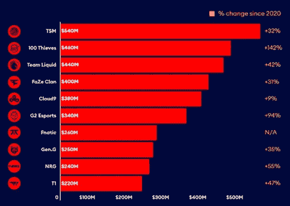

图一。2022 福布斯最有价值的电子竞技组织

组织受欢迎的最决定性因素之一是获胜。上面显示的前十名名单上的所有球队都表现出了在各自地区获胜的反复倾向。例如，前三名球队都参加了英雄联盟北美锦标赛系列赛(LCS)。TSM 是有史以来“赢得最多”的球队，获得了七个冠军，Team Liquid 获得了四个冠军，是唯一一个连续四次获得冠军的球队，尽管是联盟的新人，100 贼队只有一个冠军，并参加了最近的四次连续决赛和两次世界锦标赛。因此，很明显，找到赢家是组织成功和盈利的关键。为了找到这些球员，本文将基于韩国英雄联盟冠军韩国(LCK)的球员开发机器学习应用。作为一个联盟，LCK 是赢得绝大多数世界冠军的主导力量，赢得了 7/11，除了一个队之外，每个韩国队都没有至少进入所有参赛队的前八名。然后，该模型将被应用于 LCS 和英雄联盟欧洲锦标赛(LEC)，以证明其识别强大球员的能力，最后，它将被应用于 LCS 试验场数据，以识别哪些业余球员可能是游戏中的未来之星。

# 方法学

这个应用程序将使用两个主要数据集来开发。第一个数据集来自 Leaguepedia (Leaguepedia，2022)。每次分开，(一年的 1/2)玩家打 18 场三局两胜系列赛。在该系列的每场比赛之后，该比赛的一名玩家被奖励，并且该累计被跟踪以识别最佳玩家。下面是 2022 年 LCK 春季分裂的一个例子。

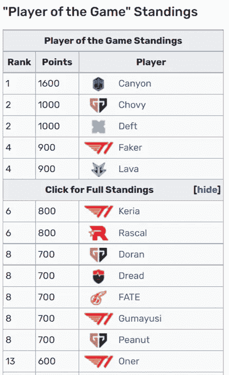

图二。LCK 春天拆分了 2022 年游戏玩家排行榜

追溯到 2012 年的每一次拆分都会跟踪这一数据。它使我们能够识别出对球队获胜影响最大的球员，并将作为我们算法的响应。第二个数据集将包含我们的预测变量，并且来自 Oracle 的 Elixir (Oracle 的 Elixir，2022)。虽然这些数据可以追溯到 2012 年，但 LCK 在 2015 年后可以获得详细的预测值，因此 2015 年春季将作为该机器学习应用的起点。从 2015 年到 2022 年，每年都有两次球员数据分割，总共 16 次数据分割。玩家的统计数据跟踪他们的杀戮，死亡，助攻和先进的统计数据，如黄金差异相比，他们的敌人和他们的团队在许多其他方面的损害百分比。

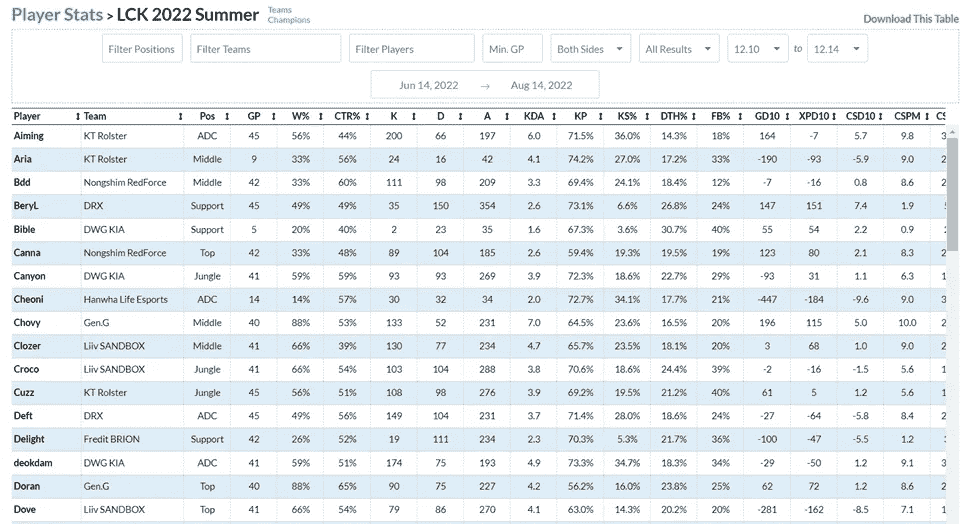

图 3。甲骨文灵药的 LCK 玩家数据

将进行一些预处理来为分析准备数据。首先，这两个数据集将在球队、球员姓名和分裂上组合，以便每个球员的球员的游戏分数与他们的分裂平均统计数据一起存储。任何少于 10 场比赛的球员也将从数据集中过滤掉，以避免小样本比赛的替补球员扭曲数据。最后，每个类别都有不同的范围，随着游戏的变化和玩家的提高，类别的值往往会逐年提高。同样地，每个预测值将被标准化用于每个分割，从而识别出在多个预测值的分割中异常的玩家，并且不与游戏可能已经改变的其他年份的玩家进行比较。经过预处理后，分割的数据集将被合并到一个大的数据框中，其中每个像元将是一个介于 0 和 1 之间的值，代表该玩家在每个统计数据中与该分割中的同行相比的表现。数据集将被拆分，以便 80%的数据点用于训练，20%用于测试。

将进行特征选择，以便移除非预测性特征，例如球员姓名、球队名称和位置。通过计算预测值的方差膨胀因子，可以发现要素集中的多重共线性，并识别在预测值集中增加线性相关性的相关要素。该特征选择将通过查看 VIF、因素之间的相关性以及使用逐步和套索回归来完成。

为了分析数据，将建立一些模型，以便找到识别优秀球员的最佳方法。这些模型包括一个基本的多元线性回归模型，岭和套索回归模型，一个决策树，最后是随机森林。从这些模型中，可以找到模型中解释的方差、测试和训练集中的误差，并且对于一些方法，可以进行特征选择。这将允许我们确定模型，该模型最好地解释了玩家的游戏评级的变化。接下来，从该模型中取具有最大绝对值的系数，可用于识别对玩家表现有显著影响的特征。最后，由 LCK 测试数据确定的最佳模型可用于预测在 LCS 和 LEC 最近的分裂中哪些玩家将获得最多的游戏玩家分数。将这些名单与这些地区的 MVP 投票进行比较，看看该模型是否能够按照预期识别出有技能的球员。最后，该模型将应用于 LCS 试验场的数据，这些数据来自业余选手、学院选手和大学选手为识别潜在人才而进行的竞争。

# 特征选择

## 多重共线性

一旦完成上述预处理，最终的数据帧具有 904×21 的形状。这意味着有 904 行分割比例数据，每一行包含 20 个预测值和我们的响应，如下所示。

图 4。分割缩放的播放器数据帧

在开始多重共线性测试之前，下表描述了此过程中使用的列。值得注意的是，每个特性都是在缩放之前描述的。

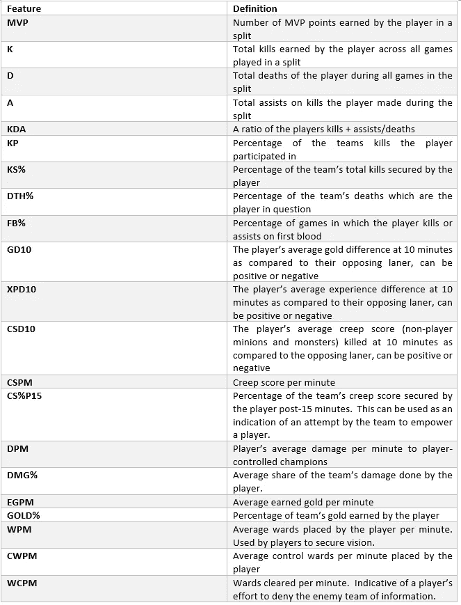

表 1。功能定义

现在，根据中的定义，可以使用热图确定预测值之间的相关性，如图 5 所示。

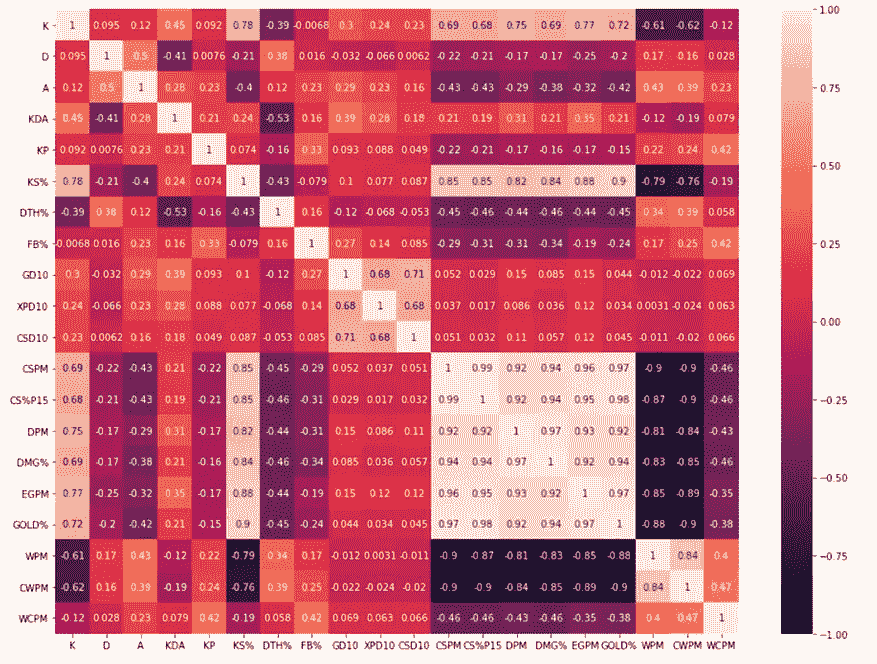

图 5。预测值关联的热图

可以看出，预测值之间有很强的相关性。可以使用方差膨胀因子(VIF)对多重共线性进行另一种检查，而不是简单地直观地删除它们。VIF 用于确定一个因子在多大程度上是数据集中其他因子的线性组合。一个可以完全用其他预测因子组合来描述的因子不会给我们的回归模型提供额外的信息，这些因子的存在会增加我们回归模型的标准误差。通过对所有其他预测值回归每个预测值，并对该回归模型除以 1-R2，可以找到 VIF，其中 R2 是回归模型中解释的变化量。

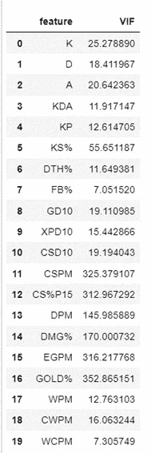

图 6。球员表现 VIF 奖

因此，在第一次传递时，数据帧有许多列被其他人大量描述。实际上，这是有道理的。例如，一个玩家的 EGPM 是从杀球、助攻和爬行得分中获得的金牌的直接总和。因此，功能选择是必不可少的。

## 逐步回归

## 预选

首先，可以应用前向选择来执行逐步回归。正向选择从模型中没有要素开始，然后添加每个变量以查看哪个变量在统计上最重要，并将其添加到模型中。形成正向逐步回归后，选择的预测因子列表为:['K '，' GD10 '，' A '，' FB% '，' DPM '，' CS%P15 '，' CSPM '，' WCPM '，' CSD10 '，' GOLD%']。那么可以使用这组预测值来拟合多元线性回归模型。下图显示了这种回归。

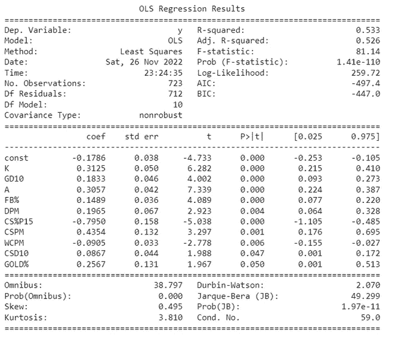

图 7。前向选择线性模型摘要

## 反向选择

对于后向选择，该模型从数据集中的所有变量开始，消除一个变量，并检查被消除的变量是否具有统计显著性，以消除无关紧要的预测因素。我们的回归模型在反向选择后的输出如下所示。

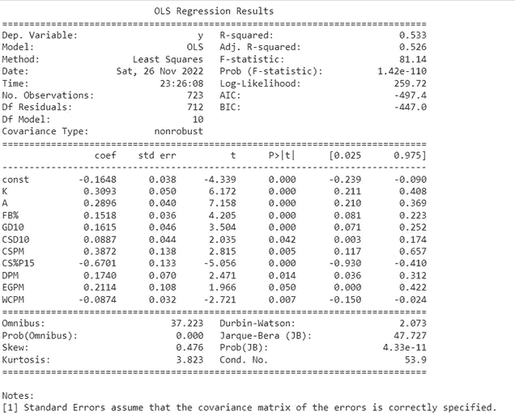

图 8。反向选择线性模型概述

有趣的是，两种方法都选择了相同的 10 个预测因子，除了 EGPM 是由后向方法选择的，而 GOLD%是由前向方法选择的。因为这两个指标都衡量了一个球员的金牌对 MVP 排名的影响，而且金牌是通过包括在内的其他预测因素获得的，所以让我们去掉这两个预测因素。有趣的是，GD10 包含在两个模型中，可以认为这是因为这衡量了玩家在游戏早期产生优势的能力，而不是其他因素的线性组合，因为玩家可以通过多种方式做到这一点，或者，玩家可以在游戏早期表现强劲，在游戏后期挣扎，这将使该统计数据与其他指标相区别。仅基于由两个模型选择的九个预测值创建新数据集，给出以下相关矩阵和 VIF。

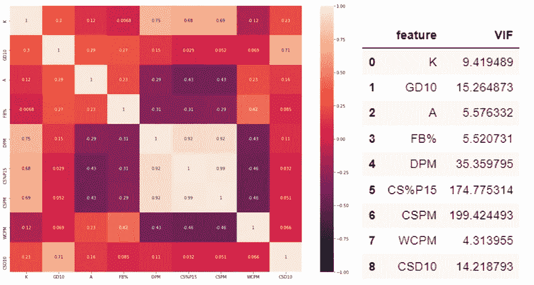

图 9。逐步特征选择后的相关矩阵和 VIF

到目前为止，特征选择似乎大大提高了特征之间的相关性，并显著降低了 VIF。值得注意的是，我们的两个 CS 特征之间的 VIF 和相关性仍然非常高。因此，我将删除 CSPM，并显示最终的相关矩阵和 VIF 值。

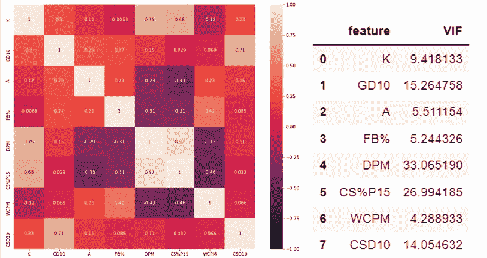

图 10。逐步方法的最终特征选择多重共线性度量

## 套索回归

作为最后的检查，选择的变量是最重要的，为建立我们的模型预测球员的游戏点，从这一点上标记为 MVP，套索回归可以使用。LASSO 回归通过执行 L1 正则化，使数据向鼓励稀疏模型的中心趋势收缩。通过对回归模型中每个系数的绝对值增加惩罚，一些对整个模型不重要的系数或具有高度多重共线性的系数可以被强制为零。对于此 LASSO 回归模型，主数据框中的数据已经进行了缩放，然后可以对介于 0.0025 和 0.01 之间的 alpha 值执行 10 重交叉验证，以找到模型的最佳惩罚值。一旦完成，与α的最佳值相关的九个系数是:['K '，' A '，' DTH% '，' FB% '，' GD10 '，' XPD10 '，' DPM '，' WPM '，' WCPM']。与我们的逐步选择相比，这两个模型都选择了杀戮，辅助，第一次血百分比，10 点的金差，每分钟的伤害和每分钟的结界清除。LASSO 模型还选择死亡百分比、10 时的经验差异和每分钟的病房数，而不是通过逐步回归选择的 15 后的 CS 百分比和 10 时的 CS 差异。

此时，可以根据获得的信息做出一些决定。通过两种方法选择的六个特征将被包括在内。直觉说一个玩家避免死亡的能力应该被考虑在内，因此 DTH%被套索选中可以被包括在内。从逐步模型中，CS%P15 将被丢弃，原因是它是一个将有利于某些位置而不是其他位置的度量，并且因此不会提供对该应用广泛有用的模型。当考虑 CSD10 和 XPD10 时，CSD10 将被包括在内，因为它是一个衡量球员相对于对手 laner 的技能的指标，其中 XPD10 将是 CS、杀戮、死亡和助攻的产物；所有这些都已经包含在模型中。最后，在决定 WPM 之前，到目前为止选择的因子的相关矩阵和 VIF 如下所示。

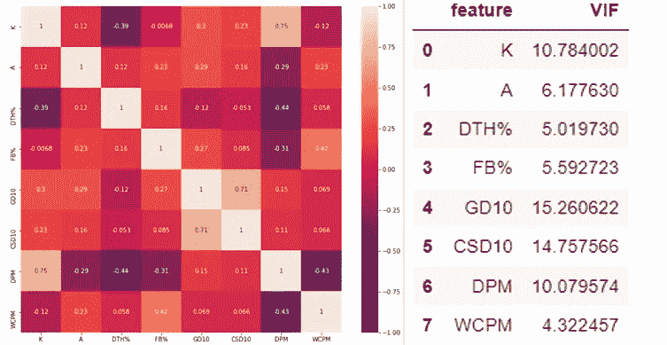

图 11。基于 LASSO 和逐步回归的特征选择

在这个特征集中，相关性已经非常低了，虽然我们的一些 VIF 值大于 10，但是总体上 VIF 值客观上更低。作为最终测试，包括 WPM，结果如下。

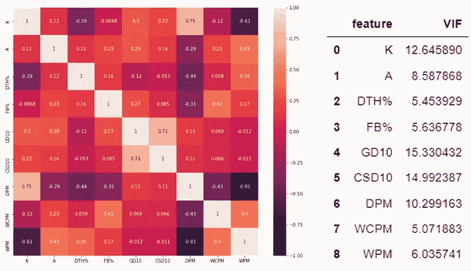

图 12。包括 WPM 的功能选择

可以看出，除了 DPM 之外，WPM 与其他预测因子的相关性相对较低，并且 VIF 较低。另一方面，包括 WPM 确实略微增加了一些因素如 K 的 VIF，然而，此时包括 WPM 似乎是有益的。

# 模型拟合和评估

随着变量选择的完成，上述模型可以适合训练数据。然后，测试数据将用于评估均方误差(MSE)、平均绝对误差(MAE)、均方根误差(RMSE)和 R2 值。测试集上每个模型的性能将用于选择最佳模型进行进一步测试。

## 多元线性回归

从最简单的模型开始，线性模型将适合训练集中列出的所有特征。这个模型如下所示。

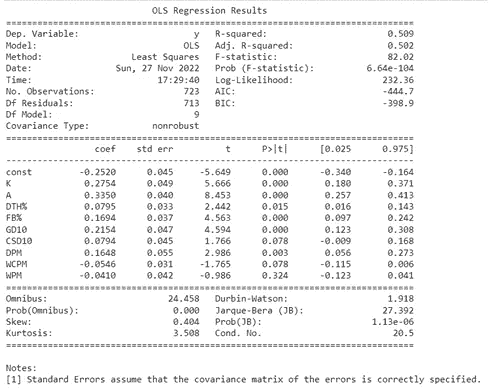

图 13。测试数据的 MLR 模型

然后，预测值的测试集被拟合到模型以形成预测集。对照测试响应评估该预测集，以确定误差度量。本报告模型比较部分的表 2 显示了该模型和所有其他模型的误差指标。

## 里脊回归

岭回归是一种回归模型，它通过执行 L2 正则化来管理数据集中的多重共线性。与 LASSO 类似，惩罚项用于将一些系数收缩为零，但是，ridge 不会将系数设置为零，因此它不会从模型中完全消除系数。使用 10 重交叉验证，发现训练数据集的最佳 alpha 值为 2.9，并且系数为:[-0.19394465，0.27541449，0.30777943，0.0569583，0.15100022，0.20980459，0.07846254，0.1247985，-0.05586 然后将其与表 2 中输入的测试数据和误差度量进行拟合。

## 套索回归

LASSO 回归在这个阶段应用于已经减少的数据集，但是，根据 alpha 的最佳值，它仍然有能力进一步消除变量。在 10 倍交叉验证后，发现α的最佳值为 0.005，如表 2 所示，与变量选择过程中看到的改进相比，在此阶段应用 LASSO 并没有进一步改进模型。

## 决策图表

为了适合决策树，执行网格搜索以找到具有 10 重交叉验证的最佳超参数。然后，在使用模型通过测试集进行预测之前，使用最佳超参数来拟合训练数据上的树。误差指标记录在表 2 中。

## 随机森林

随机森林是一种黑盒模型，其中并行构造多个决策树，将树预测的平均响应作为最终输出。这个模型用了一千棵树。

# 模型比较

每个型号的误差指标如下表所示。从表中可以看出，MLR 和 Ridge 模型的表现非常相似，随机森林提供了最低的误差度量和最高的 R2。因此，当在外部数据集上评估模型的功效时，MLR 和随机森林都将用于观察哪个表现更好。

表二。应用于测试数据的模型的误差度量

# 使用其他数据集测试模型功效

## LCS 数据集

在此阶段，LCS 2022 年夏季分割数据以与 LCK 数据相同的方式进行提取和预处理。然后将数据集输入随机森林和多元线性回归模型，以生成预测的 MVP 值。然后，数据集按照预测的响应进行排序，从而允许将结果排名与 LCS MVP 和全队投票进行比较。由于 LCS 不像 LCK 那样产生强大的游戏玩家排名，因此不存在精确的一对一比较，但这可以用来查看模型是否正确地识别了最佳玩家。

首先，随机森林前五名玩家的输出如下所示。从这张表中可以得出一些有趣的观点。首先，排名 2-4 的球员都来自两支球队，由于他们的超级巨星天赋，这两支球队被单方面宣布为本赛季最佳球队。此外，排名第一的球员 Blaber 来自最终赢得 split 的球队，多年来一直被认为是联盟中最好的丛林球员之一。当检查其余的数据时，LCS 全职业队的所有 15 名球员都出现在前 25 名球员中，斯普利特的新秀 Jojopyun 排名第 7，进步最快的球员 Contractz 排名第 11。另一方面，该模型大大低估了 MVP 的激励，他只排在第 25 位。模特最看重的球员是 Abbedagge，尽管他没有获得任何荣誉，但他在模特中排名第六。

图 14。随机森林评选出的最佳 LCS 玩家

接下来，MLR 模型预测的输出如下所示。

图 15。MLR 评选的最佳 LCS 球员

值得注意的是，该模型对 jojopyun、Danny 和 Impact 给予了很高的评价，他们都是第一或第二职业球队，并赢得了夏季常规赛。Bwipo 和 Hans Sama 很有意思，因为这两个模型都高度重视他们，尽管在季后赛表现不佳后社区情绪不一。这种模式的 MVP 激励值要高得多，但仍然只排在第 17 位。值得注意的是，尽管他们在全职业投票中缺乏出场机会，但该模型高度重视的球员是排名第七的最有进步的球员 Contractz，排名第八的 100T Mid Laner Abbedagge，排名第九的 FlyQuest ADC Johnson，排名第 11 的 CLG 突围队 midlaner Palafox，以及排名第 14 的 CLG ADC Luger。值得注意的是，两个模型似乎都很难找到强有力的支持玩家，100T Huhi 是这个角色中唯一一个在两个模型中都进入前二十的玩家。

## LEC 数据集

在这一阶段，与上述相同的过程被应用于 2022 年 LEC 数据集。首先，通过随机森林模型排名前五的玩家如下所示。值得注意的是，斯普利特 MVP 尼斯基排名第四，长期顶级球员戴普斯和詹科斯排名第一和第二。一队所有职业荣格勒埃利约亚也是这种模式排名第五。这个模型中最大的惊喜是阿尔穆特，尽管他在常规赛中是顶级球队，但却未能进入任何职业球队。在这种模式下，表现最差的是第一队所有专业顶级 laner Broken Blade，他排在第 14 位，落后于排名第 10 位的第 9 位 Jungler Xerxe。再一次，支持者在这个模型中挣扎，最好的支持者是 with 拉布罗夫，排在第 23 位，而第一队所有职业支持者凯泽仅排在第 33 位，落后于他的三个同行。

图 16。随机森林预测 MVP 球员

对于多元线性回归模型，前 25 名玩家之间的顺序变化程度比在 LCS 看到的更大。Misfits 第三团队 all pro ADC Neon 上升了五个等级，与第一名 Rogue 的 ADC Comp 一起进入前五名。另一个价值更高的球员是 with 佩尔茨，尽管经历了一个混乱的赛季，他被认为具有超强的团队活力，但与他团队中的其他球员不同，他受到了两种模式的高度评价。尽管这个模型将凯泽列为第二大支持者，但他仍未能进入前二十名。进入该模型的进一步应用，越来越清楚的是，虽然该模型公平地评估了其他玩家，但将支持玩家与他们的同龄人进行比较而不是与数据集中的其他人进行比较是重要的。在某种程度上，这是意料之中的；在观察用于训练模型的 LCK 数据集时，平均而言，支持获得的游戏玩家投票要少得多，因此，与整体玩家基础相比，模型对支持的评价更低。

图 17。LEC MLR 模型前 5 名球员

# 将模型应用于业余选手

在这个阶段，这两个模型都可以应用于业余选手，以确定顶级前景。随着淡季的全面展开，这也可以用来查看主要地区球队在下赛季签下了哪些顶级球员。出于此模型的目的，每个模型确定的每个角色的前两名参与者将在美国的表 3 和欧洲的表 4 中列出。

首先，对于北美潜在客户，北美试验场数据集用于至少有 5 场比赛的玩家。有趣的是，这些球员中的一些人将在下一次分裂中被提升到职业球队，其他人如 Armao，Arrow 和 Joey 都曾在 LCS 队工作过。此外，这种模式中的业余支持大大超过了他们在高端的同行，达到了更高的整体排名，但差距非常大，许多表现不佳的支持甚至没有进入前五十名的前景。Eyla 作为一名球员特别突出，他远远高于模型评估的任何其他支持球员，当然，考虑到他的统计数据是与其他业余球员而不是在以前的数据集中竞争的职业球员相比较。

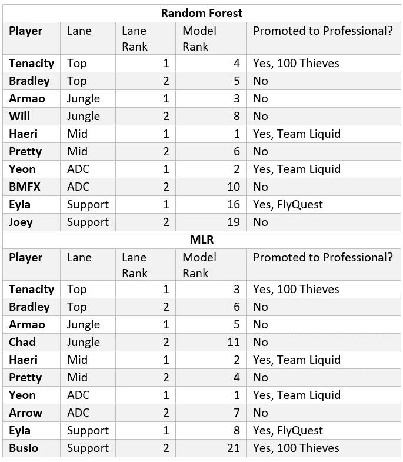

表 3。由模型确定的北美顶级潜在客户

对于欧洲球员，在欧洲大师赛主赛事(EUM)中至少打了 5 场比赛的球员将被考虑。因此，该模型确定了较少的要提升的玩家，但仍然很好地成功确定了强玩家。bluerzor、Reeker、Zwyroo 和 Innaxe 等球员将在职业球队的学院名单上竞争。此外，一些玩家几乎没有错过他们角色的前两名，但将参加职业比赛，如 BDS 团队的 Sheo(总排名第三，随机森林中的 junglers 第三)和 BDS 团队的 Crownie(总排名第九，MLR 中的 ADC 第三)。在欧盟和北美，有一些方法可以进一步应用于减少结果的差异，这将在本报告的下一节中讨论。

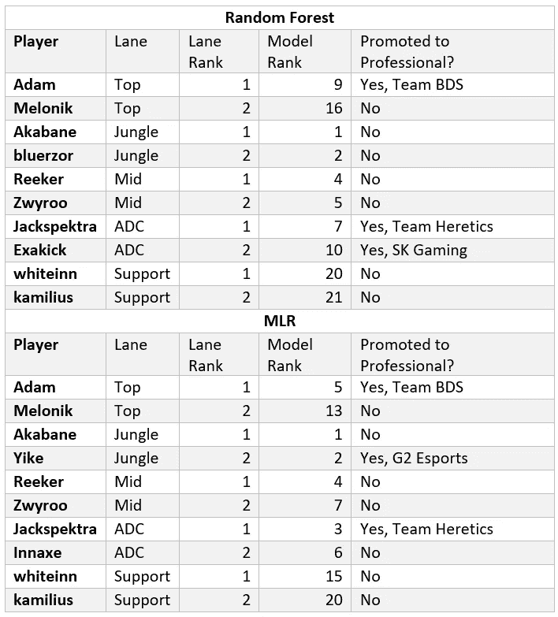

表 4。模型确定的欧盟顶级潜在客户

# 结果和结论

因此，总之，这两个模型都显示出了一些识别技术高手的能力。目前还不清楚哪种模型更好，因此最好同时应用这两种模型，并尝试通过汇总玩家排名得出结论，以便识别有前景的人才。

可以采取一些进一步的步骤来改进该模型。首先，很明显他们的模式贬低了支持球员的价值。为了避免这个问题，将球员位置一次性编码为模型中的分类变量可能是有益的，并且看看这是否改善了模型对支持球员的感知。另一个潜在的解决方案可能是包括辅助玩家擅长的额外变量，如视觉分数或杀戮参与度。另一个潜在的扩展是将 MVP 点数除以在训练模型中进行的比赛，以便获得每场比赛的 MVP 点数的标准值，因为一些球员可能仅仅因为进行更多比赛而获得更多点数。虽然这种影响很小，因为预计最好的玩家会参加每场比赛，但这将说明训练集中的差异，并且还允许在测试集中较小游戏样本大小的情况下进行更准确的预测。

最后一个令人感兴趣的扩展是将它扩展到普通玩家群。由于一些原因，这被证明是困难的。首先，该算法需要对数据集的统计数据进行标准化。这意味着在当前形式下对单个玩家的数据进行预测是不可能的，而是需要聚集大量的排名服务器。此外，虽然有一些 API 允许收集英雄联盟的数据，但其当前形式的回归公式对于排名数据是不可行的。比赛统计数据相当有限，不包括甲骨文职业比赛药剂的深度统计数据。因此，可能需要为一般玩家群训练新的模型，但是缺乏可用的预测器可能会使任何模型的方差高于本报告中训练的模型。

总的来说，本文中介绍的两种识别天才球员的方法在识别未来的天才球员方面确实显示出了成功。与任何机器学习算法一样，都存在一些差异，例如灵感的低值。这将意味着，通过使用随机森林和 MLR 方法获得的任何信息都需要持保留态度，但当与专业教练和专业生态系统中的分析师的意见相结合时，可以作为尝试评估有潜力的未来球员的起点。

# 引用的作品

奈特布雷特。(2022).【2022 年最有价值的电竞公司。发表于福布斯。网络。

Leaguepedia。(2022).*英雄联盟冠军朝鲜。*发表于 Lol Fandom。网络。

裴，安妮。(2019).*这个电子竞技巨头吸引的观众比超级碗还要多，而且有望变得更大。*发表于美国消费者新闻与商业频道。网络。

塞文胡森，蒂姆。(2022).*按分割进行玩家统计*。发表在甲骨文的长生不老药上。网络。