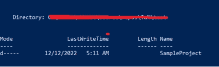
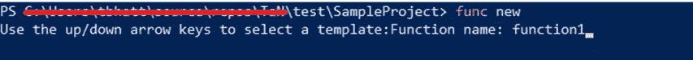

# 用开发 Azure 函数。Net 6.0 和核心工具

> 原文：<https://blog.devgenius.io/developing-azure-functions-with-net-6-0-7-0-and-core-tools-48875ef3b85?source=collection_archive---------3----------------------->

我是 CLI 工具的忠实粉丝，尽管**Visual Studio**&**Visual Studio 代码**提供了出色的支持，我还是想写一篇关于使用核心工具创建和运行 azure 函数的文章。


# 先决条件

要继续，请确保您具备以下条件:

*   。Net 6 SDK ( [)。Net 7 SDK 用于隔离工人](https://learn.microsoft.com/en-us/azure/azure-functions/dotnet-isolated-in-process-differences)。运行命令**dot net—list-SDK**来验证. net 的最新版本。
*   [Azure 功能核心工具](https://learn.microsoft.com/en-us/azure/azure-functions/functions-run-local?tabs=v4%2Cwindows%2Ccsharp%2Cportal%2Cbash#install-the-azure-functions-core-tools)。运行命令**func–version**确认 Azure function core tools 的最新版本。为了[升级 azure function](https://learn.microsoft.com/en-us/azure/azure-functions/functions-run-local?tabs=v4%2Cwindows%2Ccsharp%2Cportal%2Cbash#changing-core-tools-versions) core tools 的版本，使用 npm 命令:**NPM install-g azure-functions-core-tools @ 4—unsafe-perm true**

> [Azure 不支持。Net 7 来创建进程内。Net Azure 函数。在进程中，Azure 函数支持. Net 的 LTS(长期支持)版本](https://learn.microsoft.com/en-us/azure/azure-functions/dotnet-isolated-process-guide#supported-versions)

# 功能初始化

对 cmd 或 PowerShell 窗口上的进程内 azure 函数使用以下命令。

```
func init SampleProject
```

**选择点网**


**选择 C#**


该命令将使用 func init 命令中提供的名称创建一个新文件夹。在我们的例子中，它将是 SampleProject。



目录 SampleProject 由以下文件组成:


**local.settings.json**

*   Local.settings.json 保存本地开发的应用程序设置。我们不应该将这个文件签入到我们的代码库中。
*   Azure 函数需要存储帐户才能执行。但是，在开发阶段，您并不需要。我们可以使用现有的存储帐户或标志 **UseDevelopmentStorage** 来指示本地开发。


**host.json**

host.json 文件包含运行时特定的配置。

## **具有独立工作进程的 Azure 函数**

运行下面提到的命令，使用隔离的工作进程创建 azure 函数。由于独立的工作进程支持. net7，我们可以使用 option -target-framework 来利用最新的。网络版。

```
func init SampleProj — worker-runtime dotnet-isolated — target-framework net7.0
```

# 新功能

使用 **func new** 命令在功能应用程序中创建新功能。


我将使用 HttpTrigger。这意味着可以使用 HTTP URL 访问该函数。

提供函数名:



让我们回顾一下创建的文件夹:


## 功能 1.cs

此函数的入口点是 function1.cs。代码如下所示:

```
using System;
using System.IO;
using System.Threading.Tasks;
using Microsoft.AspNetCore.Mvc;
using Microsoft.Azure.WebJobs;
using Microsoft.Azure.WebJobs.Extensions.Http;
using Microsoft.AspNetCore.Http;
using Microsoft.Extensions.Logging;
using Newtonsoft.Json;
namespace SampleProject
{
 public static class function1
 {
   [FunctionName(“function1”)]
   public static async Task<IActionResult> Run(
   [HttpTrigger(AuthorizationLevel.Function, “get”, “post”, Route = null)] HttpRequest req,
   ILogger log)
   {
   log.LogInformation(“C# HTTP trigger function processed a request.”);
   string name = req.Query[“name”];
   string requestBody = await new StreamReader(req.Body).ReadToEndAsync();
   dynamic data = JsonConvert.DeserializeObject(requestBody);
   name = name ?? data?.name;
   string responseMessage = string.IsNullOrEmpty(name)
   ? “This HTTP triggered function executed successfully. Pass a name in the query string or in the request body for a personalized response.”
   : $”Hello, {name}. This HTTP triggered function executed successfully.”;
   return new OkObjectResult(responseMessage);
   }
 }
}
```

# 功能启动

运行命令**‘func start’**命令运行该功能


将函数 URL 放在浏览器中:

[http://localhost:7071/API/function 1](http://localhost:7071/api/function1)


[**http://localhost:7071/API/function 1？name = hello world**](http://localhost:7071/api/function1?name=HelloWorld)


页（page 的缩写）s-Medium 是一个阅读、写作和向其他作者学习的绝佳平台。如果你想加入我的旅程，今天就加入 [medium](https://tarunbhatt9784.medium.com/membership) 。