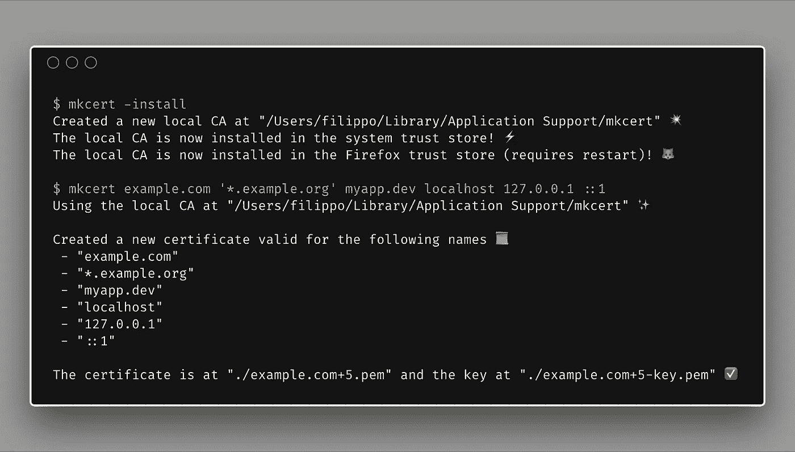
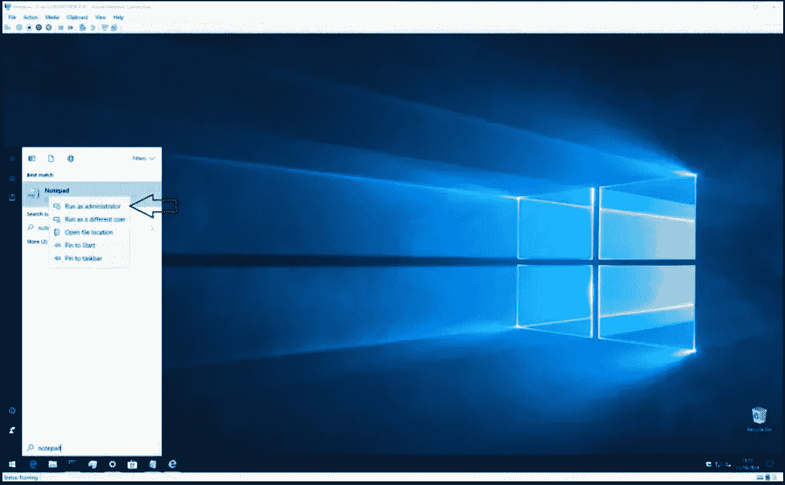
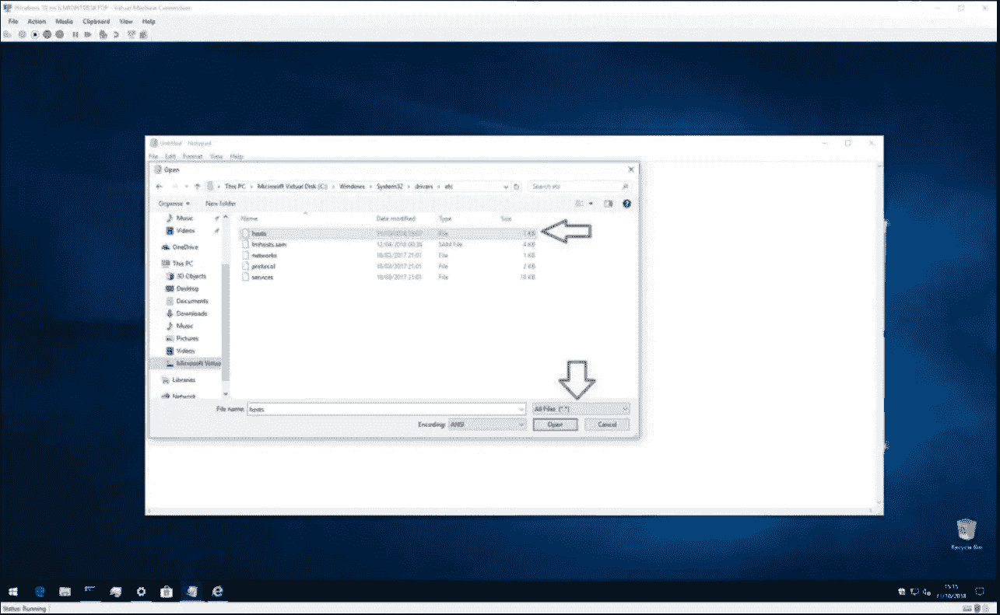
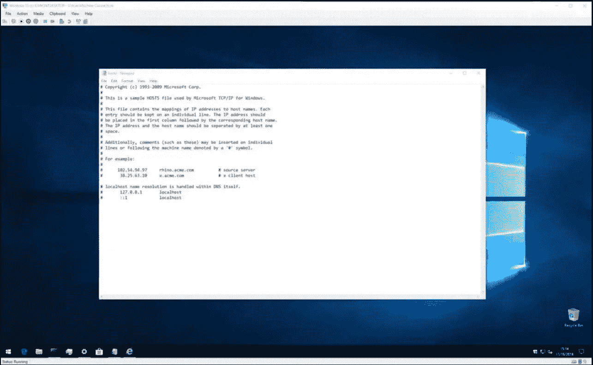

# 使用 Traefik 和 Docker 与 HTTPS 在 Django 进行本地开发

> 原文：<https://blog.devgenius.io/developing-locally-with-https-on-django-using-traefik-and-docker-3ae8092757d1?source=collection_archive---------1----------------------->



通过利用 HTTPS 反向代理和 [mkcert](https://github.com/FiloSottile/mkcert) ，在本地使用 TLS/SSL 在 Docker 上为您的 Docker 化应用提供服务的解决方案。

我想说的是，没有很多教程会详细解释如何设置，相信我，我已经搜索过了。本教程是写关于小时研究的有效性，并已成功应用于一个项目。让我们开始吧。

# 目录

*   ***全局设置 MK cert***
*   ***本地设置 Traefik***
*   ***配置环境***
*   ***将容器化服务连接到 Traefik***
*   ***配置在 Traefik 侧***
*   ***服务端配置***

越来越有必要在一个安全的环境中开发软件，以便在部署到生产环境中时只有很少的更改。最近，脸书改变了对使用脸书登录的应用程序/网站的政策，要求 OAuth 重定向 URL 使用 HTTPS URL。因此，如果您想将`users`应用程序与 OAuth 提供商(如脸书)一起使用，那么保护您与本地开发环境的通信将是必要的。

# 全局设置 mkcert

为了创建一个安全的环境，我们需要在 Docker 应用程序中安装一个可信的 SSL 证书。为此，我们将利用 [mkcert](https://github.com/FiloSottile/mkcert) 。

该链接将带您到 GitHub repo，它将指导您如何在您的操作系统上安装 mkcert 来生成 SSL 证书。在本教程中，我将使用 windows 操作系统。你需要为 windows [安装一个软件包管理器。](https://chocolatey.org/instal)

一旦你以管理员的身份安装了 run `choco install mkcert`,在这个过程完成后运行`mkcert -install`,如果你没有得到任何错误，你就成功地设置了它。

# 在本地设置 Traefik

我发现实施 HTTPS 流量的过程有点挑战性，需要比 Traefik 版本 1 更多的努力。现在，我们可以使用 HTTPS 只有一个本地开发的自签名证书，没有 HTTP。

您可以为我开发的 Traefik 容器克隆 Github repo，以便在本地环境[这里](https://github.com/Ocolus1/local_traefik)上运行。

[Traefik](https://github.com/traefik/traefik) 是开源的边缘路由器。您可以将它用作 docker 容器中服务和应用程序的反向代理。这是使用自签名 SSL 证书在 docker 中的本地计算机上运行 Traefik 的配置和使用指南。克隆存储库后，您需要配置您的环境。在您选择的文本编辑器中打开克隆的 repo，并导航到终端中的文件夹。

# 配置环境

*   创建一个名为`proxy`的 docker 网络(网络名称可以是任意的，只要为所有服务保留即可)。该网络将为 Traefik 代理的所有服务和应用程序所共用(外部):

```
docker network create proxy
```

*   转到终端中的文件夹`certs`，使用 mkcert 为 Traefik dashboard 生成一个自签名证书。在这个例子中，域名是`traefik.local`。如果要使用另一个域名，还需要在`docker-compose.yml`中的 Traefik 路由器主机规则中进行更改，并注意其他步骤中的域名。

```
mkcert --cert-file traefik.local.crt --key-file traefik.local.key traefik.local
```

*   将生成的证书和密钥路径添加到`conf`文件夹下的动态配置文件`tls_certificates.local.yml`中。如果您将域“traefik.local”用于自签名证书，则不需要做任何事情，因为这些路径已经在文件中。如果您使用另一个域名，您需要在`tls_certificates.local.yml`文件中将`traefik.local`更改为您的域名)
*   将 Traefik 仪表板的域名(`traefik.local`)添加到`hosts`文件中(使用本地主机的 IP)

# 为此:

1.以管理员权限打开记事本



2.单击左上角的文件，然后单击打开。



3.浏览到 **C:Windows > System32 >驱动程序>等>主机**



如果您以图形方式浏览文件夹，请记住将文件类型过滤器更改为“所有文件”,以便显示 hosts 文件。现在您已经准备好编辑文件了。如果您以前从未打开过 hosts 文件，您将会看到一小段描述其用途以及如何进行编辑的文本。简介提供了一个关于文件结构的有用概述，但是我们将在这里讨论基础知识。

hosts 文件是 IP 地址和主机名的简单映射。每个条目占据一个新行，首先是 IP 地址(数字地址)，然后是空格或制表符，最后是主机名(或域)。您可以通过在行首放置一个“#”字符来向文件添加注释，这将使 Windows 在读取文件时忽略该行。

因此，如果你想将“[microsoft.com](https://microsoft.com/)”指向 IP 1.2.3.4，你应该在新的一行上写“1 . 2 . 3 . 4[microsoft.com](https://microsoft.com/)”。每次你试图访问 microsoft.com T21，你都会发现自己在(不存在的)1.2.3.4 网站上。

将`127.0.0.1 traefik.local`添加到主机文件并保存。

# 运行本地 Traefik

完成配置步骤后，在 shell 中打开 local_traefik 存储库的根文件夹，并运行命令

```
docker-compose up --build -d
```

之后，在浏览器中打开`https://traefik.local`查看 Traefik 仪表盘。如果浏览器没有抱怨证书，那么一切都是正确的。确保在浏览器中包含完整的 URL，而不仅仅是域名。

# 将集装箱服务连接到 Traefik

在一个典型的场景中，我们有外部 docker 网络、包含 Traefik 的容器，以及几个包含服务和应用程序的容器。启动 Traefik 后，我们可以将客户端连接到它，而无需重新启动它。例如，我们想将域为`testapp.local`的服务`testapp`连接到我们的 local_traefik。为此，请执行以下步骤:

# 操作系统端的配置

像上一步一样，将服务的域名(在我们的例子中是`testapp.local`)添加到`hosts`文件中(使用本地主机的 IP ):

```
127.0.0.1 testapp.local
```

# Traefik 侧的配置

*   转到 shell 中的文件夹`certs`,用 mkcert 为`testapp.local`域名生成一个自签名证书:

```
mkcert --cert-file testapp.local.crt --key-file testapp.local.key testapp.local
```

*   将生成的证书和密钥路径添加到`conf`文件夹中的动态配置文件`tls_certificates.local.yml`:

```
...        
   -  certFile: "/etc/traefik/certs/testapp.local.crt"
      keyFile: "/etc/traefik/certs/testapp.local.key"
```

再说一次:在这些步骤之后，您不需要重新启动 local_traefik 容器，配置会动态应用。

# 服务端的配置

*   在`docker-compose.yml`文件中定义外部 docker 网络`proxy`(与 traefik 通用):

```
networks:
  proxy:
    external: true
```

*   在`docker-compose.yml`文件中为服务配置设置网络`proxy`:

```
testapp:
    networks:
      - proxy
    ...
```

*   在`docker-compose.yml`文件中添加服务配置的标签:

```
labels:
      - traefik.enable=true
      - traefik.docker.network=proxy
      - traefik.http.routers.{ROUTER_NAME}.entrypoints=websecure
      - traefik.http.routers.{ROUTER_NAME}.rule=Host(`testapp.local`) 
      - traefik.http.routers.{ROUTER_NAME}.tls=true
      - traefik.http.routers.{ROUTER_NAME}.service={SERVICE_NAME}
      - traefik.http.services.{ROUTER_NAME}.loadbalancer.server.port=80
```

整个`docker-compose.yml`文件:

```
testapp:
    networks:
      - proxy
    image: testapp
    container_name: "local_testapp"
    build:
      context: .
      dockerfile: TestApp/Dockerfile
    env_file: 
      - .env
    labels:
      - traefik.enable=true
      - traefik.docker.network=proxy
      - traefik.http.routers.testapp-router.entrypoints=websecure
      - traefik.http.routers.testapp-router.rule=Host(`testapp.local`) 
      - traefik.http.routers.testapp-router.tls=true
      - traefik.http.routers.testapp-router.service=testapp-service
      - traefik.http.services.testapp-router.loadbalancer.server.port=8000 
networks:
  proxy:
    external: true
```

为了使用 Django 进行配置，您的`django`项目或容器应该有一个`.env`文件与之连接。添加以下变量。你应该这样做，特别是当你和一个团队一起工作，并且你想把你的本地环境细节留给你自己的时候。

```
*# HTTPS*
*# ------------------------------------------------------------------*
VIRTUAL_HOST=testapp.local
VIRTUAL_PORT=8000
```

在您的设置配置中允许新的主机名

```
ALLOWED_HOSTS = ["testapp.local"]
```

重新构建您的`docker`应用程序。

```
docker-compose up -d --build
```

进入你的浏览器，在你的地址栏输入`[https://testapp.local](https://testapp.local)`

这就是你在本地用 Traefik 和 Docker 设置 Django 应用程序的简单方法。

PS-你可以为其他应用程序使用相同的配置，你只需要为 Django 改变配置(例如端口-8000)。

如果你喜欢这篇文章，请给它一两个掌声，如果你有任何问题或疑问，请在下面的评论中留下。