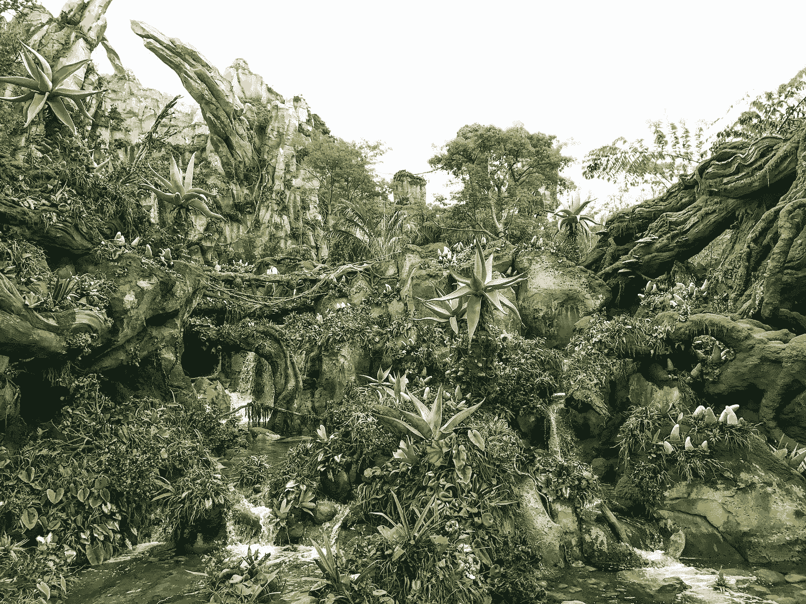

# 使用 Quasar 库开发 Vue 应用程序——头像

> 原文：<https://blog.devgenius.io/developing-vue-apps-with-the-quasar-library-avatars-cdc1cf9d6b3a?source=collection_archive---------2----------------------->



照片由[卢克·坦尼斯](https://unsplash.com/@saluken?utm_source=medium&utm_medium=referral)在 [Unsplash](https://unsplash.com?utm_source=medium&utm_medium=referral) 上拍摄

Quasar 是一个流行的 Vue UI 库，用于开发好看的 Vue 应用程序。

在本文中，我们将了解如何使用 Quasar UI 库创建 Vue 应用程序。

# 电影《阿凡达》

我们可以使用提供的头像组件将头像添加到我们的 Vue 应用程序中。

例如，我们可以写:

```
<!DOCTYPE html>
<html>
  <head>
    <link
      href="https://fonts.googleapis.com/css?family=Roboto:100,300,400,500,700,900|Material+Icons"
      rel="stylesheet"
      type="text/css"
    />
    <link
      href="https://cdn.jsdelivr.net/npm/quasar@1.12.13/dist/quasar.min.css"
      rel="stylesheet"
      type="text/css"
    />
  </head> <body class="body--dark">
    <script src="https://cdn.jsdelivr.net/npm/vue@^2.0.0/dist/vue.min.js"></script>
    <script src="https://cdn.jsdelivr.net/npm/quasar@1.12.13/dist/quasar.umd.min.js"></script>
    <div id="q-app">
      <q-layout
        view="lHh Lpr lFf"
        container
        style="height: 100vh;"
        class="shadow-2 rounded-borders"
      >
        <q-avatar color="red" text-color="white" icon="directions" />
      </q-layout>
    </div> <script>
      new Vue({
        el: "#q-app",
        data: {}
      });
    </script>
  </body>
</html>
```

要添加头像，。

`color`设置背景颜色。`text-color`设置文本颜色。

`icon`设置图标名称。

我们还可以添加一张图片作为头像:

```
<!DOCTYPE html>
<html>
  <head>
    <link
      href="https://fonts.googleapis.com/css?family=Roboto:100,300,400,500,700,900|Material+Icons"
      rel="stylesheet"
      type="text/css"
    />
    <link
      href="https://cdn.jsdelivr.net/npm/quasar@1.12.13/dist/quasar.min.css"
      rel="stylesheet"
      type="text/css"
    />
  </head> <body class="body--dark">
    <script src="https://cdn.jsdelivr.net/npm/vue@^2.0.0/dist/vue.min.js"></script>
    <script src="https://cdn.jsdelivr.net/npm/quasar@1.12.13/dist/quasar.umd.min.js"></script>
    <div id="q-app">
      <q-layout
        view="lHh Lpr lFf"
        container
        style="height: 100vh;"
        class="shadow-2 rounded-borders"
      >
        <q-avatar>
          
        </q-avatar>
      </q-layout>
    </div> <script>
      new Vue({
        el: "#q-app",
        data: {}
      });
    </script>
  </body>
</html>
```

此外，我们可以用`size`道具改变尺寸:

```
<!DOCTYPE html>
<html>
  <head>
    <link
      href="https://fonts.googleapis.com/css?family=Roboto:100,300,400,500,700,900|Material+Icons"
      rel="stylesheet"
      type="text/css"
    />
    <link
      href="https://cdn.jsdelivr.net/npm/quasar@1.12.13/dist/quasar.min.css"
      rel="stylesheet"
      type="text/css"
    />
  </head> <body class="body--dark">
    <script src="https://cdn.jsdelivr.net/npm/vue@^2.0.0/dist/vue.min.js"></script>
    <script src="https://cdn.jsdelivr.net/npm/quasar@1.12.13/dist/quasar.umd.min.js"></script>
    <div id="q-app">
      <q-layout
        view="lHh Lpr lFf"
        container
        style="height: 100vh;"
        class="shadow-2 rounded-borders"
      >
        <q-avatar
          size="100px"
          font-size="52px"
          color="green"
          text-color="white"
          icon="directions"
        />
      </q-layout>
    </div> <script>
      new Vue({
        el: "#q-app",
        data: {}
      });
    </script>
  </body>
</html>
```

我们可以用`square`做道具:

```
<!DOCTYPE html>
<html>
  <head>
    <link
      href="https://fonts.googleapis.com/css?family=Roboto:100,300,400,500,700,900|Material+Icons"
      rel="stylesheet"
      type="text/css"
    />
    <link
      href="https://cdn.jsdelivr.net/npm/quasar@1.12.13/dist/quasar.min.css"
      rel="stylesheet"
      type="text/css"
    />
  </head> <body class="body--dark">
    <script src="https://cdn.jsdelivr.net/npm/vue@^2.0.0/dist/vue.min.js"></script>
    <script src="https://cdn.jsdelivr.net/npm/quasar@1.12.13/dist/quasar.umd.min.js"></script>
    <div id="q-app">
      <q-layout
        view="lHh Lpr lFf"
        container
        style="height: 100vh;"
        class="shadow-2 rounded-borders"
      >
        <q-avatar
          square
          size="100px"
          font-size="52px"
          color="green"
          text-color="white"
          icon="directions"
        />
      </q-layout>
    </div> <script>
      new Vue({
        el: "#q-app",
        data: {}
      });
    </script>
  </body>
</html>
```

我们可以用`rounded`道具制作圆角:

```
<!DOCTYPE html>
<html>
  <head>
    <link
      href="https://fonts.googleapis.com/css?family=Roboto:100,300,400,500,700,900|Material+Icons"
      rel="stylesheet"
      type="text/css"
    />
    <link
      href="https://cdn.jsdelivr.net/npm/quasar@1.12.13/dist/quasar.min.css"
      rel="stylesheet"
      type="text/css"
    />
  </head> <body class="body--dark">
    <script src="https://cdn.jsdelivr.net/npm/vue@^2.0.0/dist/vue.min.js"></script>
    <script src="https://cdn.jsdelivr.net/npm/quasar@1.12.13/dist/quasar.umd.min.js"></script>
    <div id="q-app">
      <q-layout
        view="lHh Lpr lFf"
        container
        style="height: 100vh;"
        class="shadow-2 rounded-borders"
      >
        <q-avatar
          rounded
          size="100px"
          font-size="52px"
          color="green"
          text-color="white"
          icon="directions"
        />
      </q-layout>
    </div> <script>
      new Vue({
        el: "#q-app",
        data: {}
      });
    </script>
  </body>
</html>
```

头像可以添加到芯片中:

```
<!DOCTYPE html>
<html>
  <head>
    <link
      href="https://fonts.googleapis.com/css?family=Roboto:100,300,400,500,700,900|Material+Icons"
      rel="stylesheet"
      type="text/css"
    />
    <link
      href="https://cdn.jsdelivr.net/npm/quasar@1.12.13/dist/quasar.min.css"
      rel="stylesheet"
      type="text/css"
    />
  </head> <body class="body--dark">
    <script src="https://cdn.jsdelivr.net/npm/vue@^2.0.0/dist/vue.min.js"></script>
    <script src="https://cdn.jsdelivr.net/npm/quasar@1.12.13/dist/quasar.umd.min.js"></script>
    <div id="q-app">
      <q-layout
        view="lHh Lpr lFf"
        container
        style="height: 100vh;"
        class="shadow-2 rounded-borders"
      >
        <q-chip>
          <q-avatar color="red" text-color="white">100</q-avatar>
          Emails
        </q-chip>
      </q-layout>
    </div> <script>
      new Vue({
        el: "#q-app",
        data: {}
      });
    </script>
  </body>
</html>
```

它们也可以添加到按钮中:

```
<!DOCTYPE html>
<html>
  <head>
    <link
      href="https://fonts.googleapis.com/css?family=Roboto:100,300,400,500,700,900|Material+Icons"
      rel="stylesheet"
      type="text/css"
    />
    <link
      href="https://cdn.jsdelivr.net/npm/quasar@1.12.13/dist/quasar.min.css"
      rel="stylesheet"
      type="text/css"
    />
  </head> <body class="body--dark">
    <script src="https://cdn.jsdelivr.net/npm/vue@^2.0.0/dist/vue.min.js"></script>
    <script src="https://cdn.jsdelivr.net/npm/quasar@1.12.13/dist/quasar.umd.min.js"></script>
    <div id="q-app">
      <q-layout
        view="lHh Lpr lFf"
        container
        style="height: 100vh;"
        class="shadow-2 rounded-borders"
      >
        <q-btn round>
          <q-avatar size="28px">
            
          </q-avatar>
        </q-btn>
      </q-layout>
    </div> <script>
      new Vue({
        el: "#q-app",
        data: {}
      });
    </script>
  </body>
</html>
```

# 结论

我们可以使用 Quasar 库将头像添加到我们的 Vue 应用程序中。