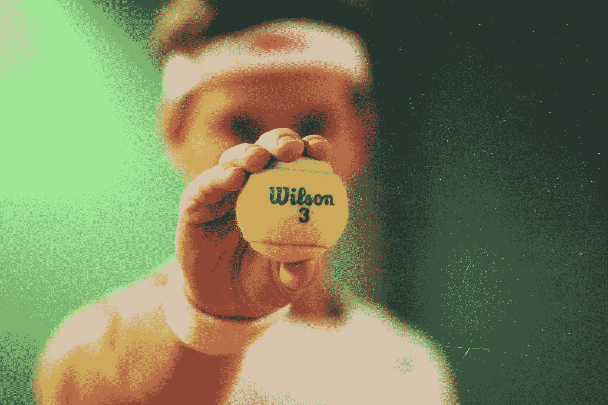

# 使用 Quasar 库开发 Vue 应用程序—徽章

> 原文：<https://blog.devgenius.io/developing-vue-apps-with-the-quasar-library-badges-2643bd2cb762?source=collection_archive---------6----------------------->



约翰·福南德在 [Unsplash](https://unsplash.com?utm_source=medium&utm_medium=referral) 上拍摄的照片

Quasar 是一个流行的 Vue UI 库，用于开发好看的 Vue 应用程序。

在本文中，我们将了解如何使用 Quasar UI 库创建 Vue 应用程序。

# 徽章

我们可以添加一个带有`q-badge`组件的徽章。

例如，我们可以写:

```
<!DOCTYPE html>
<html>
  <head>
    <link
      href="https://fonts.googleapis.com/css?family=Roboto:100,300,400,500,700,900|Material+Icons"
      rel="stylesheet"
      type="text/css"
    />
    <link
      href="https://cdn.jsdelivr.net/npm/quasar@1.12.13/dist/quasar.min.css"
      rel="stylesheet"
      type="text/css"
    />
  </head> <body class="body--dark">
    <script src="https://cdn.jsdelivr.net/npm/vue@^2.0.0/dist/vue.min.js"></script>
    <script src="https://cdn.jsdelivr.net/npm/quasar@1.12.13/dist/quasar.umd.min.js"></script>
    <div id="q-app">
      <q-layout
        view="lHh Lpr lFf"
        container
        style="height: 100vh;"
        class="shadow-2 rounded-borders"
      >
        <q-badge color="blue">
          badge
        </q-badge>
      </q-layout>
    </div> <script>
      new Vue({
        el: "#q-app",
        data: {}
      });
    </script>
  </body>
</html>
```

我们添加`q-badge`组件来添加一个徽章。

`color`是徽章的背景色。

我们可以用`text-color`道具改变文本颜色:

```
<!DOCTYPE html>
<html>
  <head>
    <link
      href="https://fonts.googleapis.com/css?family=Roboto:100,300,400,500,700,900|Material+Icons"
      rel="stylesheet"
      type="text/css"
    />
    <link
      href="https://cdn.jsdelivr.net/npm/quasar@1.12.13/dist/quasar.min.css"
      rel="stylesheet"
      type="text/css"
    />
  </head> <body class="body--dark">
    <script src="https://cdn.jsdelivr.net/npm/vue@^2.0.0/dist/vue.min.js"></script>
    <script src="https://cdn.jsdelivr.net/npm/quasar@1.12.13/dist/quasar.umd.min.js"></script>
    <div id="q-app">
      <q-layout
        view="lHh Lpr lFf"
        container
        style="height: 100vh;"
        class="shadow-2 rounded-borders"
      >
        <q-badge color="orange" text-color="black" label="2" />
      </q-layout>
    </div> <script>
      new Vue({
        el: "#q-app",
        data: {}
      });
    </script>
  </body>
</html>
```

此外，我们可以在带有`q-icon`组件的徽章内添加一个图标:

```
<!DOCTYPE html>
<html>
  <head>
    <link
      href="https://fonts.googleapis.com/css?family=Roboto:100,300,400,500,700,900|Material+Icons"
      rel="stylesheet"
      type="text/css"
    />
    <link
      href="https://cdn.jsdelivr.net/npm/quasar@1.12.13/dist/quasar.min.css"
      rel="stylesheet"
      type="text/css"
    />
  </head> <body class="body--dark">
    <script src="https://cdn.jsdelivr.net/npm/vue@^2.0.0/dist/vue.min.js"></script>
    <script src="https://cdn.jsdelivr.net/npm/quasar@1.12.13/dist/quasar.umd.min.js"></script>
    <div id="q-app">
      <q-layout
        view="lHh Lpr lFf"
        container
        style="height: 100vh;"
        class="shadow-2 rounded-borders"
      >
        <q-badge color="blue">
          <q-icon name="bluetooth" color="white" />
        </q-badge>
      </q-layout>
    </div> <script>
      new Vue({
        el: "#q-app",
        data: {}
      });
    </script>
  </body>
</html>
```

我们可以在按钮上添加浮动徽章:

```
<!DOCTYPE html>
<html>
  <head>
    <link
      href="https://fonts.googleapis.com/css?family=Roboto:100,300,400,500,700,900|Material+Icons"
      rel="stylesheet"
      type="text/css"
    />
    <link
      href="https://cdn.jsdelivr.net/npm/quasar@1.12.13/dist/quasar.min.css"
      rel="stylesheet"
      type="text/css"
    />
  </head> <body class="body--dark">
    <script src="https://cdn.jsdelivr.net/npm/vue@^2.0.0/dist/vue.min.js"></script>
    <script src="https://cdn.jsdelivr.net/npm/quasar@1.12.13/dist/quasar.umd.min.js"></script>
    <div id="q-app">
      <q-layout
        view="lHh Lpr lFf"
        container
        style="height: 100vh;"
        class="shadow-2 rounded-borders"
      >
        <q-btn push color="white" text-color="primary" label="Unread Mails">
          <q-badge color="red" floating>50</q-badge>
        </q-btn>
      </q-layout>
    </div> <script>
      new Vue({
        el: "#q-app",
        data: {}
      });
    </script>
  </body>
</html>
```

此外，我们可以用`outline`道具制作一个轮廓徽章:

```
<!DOCTYPE html>
<html>
  <head>
    <link
      href="https://fonts.googleapis.com/css?family=Roboto:100,300,400,500,700,900|Material+Icons"
      rel="stylesheet"
      type="text/css"
    />
    <link
      href="https://cdn.jsdelivr.net/npm/quasar@1.12.13/dist/quasar.min.css"
      rel="stylesheet"
      type="text/css"
    />
  </head><body class="body--dark">
    <script src="https://cdn.jsdelivr.net/npm/vue@^2.0.0/dist/vue.min.js"></script>
    <script src="https://cdn.jsdelivr.net/npm/quasar@1.12.13/dist/quasar.umd.min.js"></script>
    <div id="q-app">
      <q-layout
        view="lHh Lpr lFf"
        container
        style="height: 100vh;"
        class="shadow-2 rounded-borders"
      >
        <q-badge outline align="middle" color="teal">
          v1.0.0
        </q-badge>
      </q-layout>
    </div> <script>
      new Vue({
        el: "#q-app",
        data: {}
      });
    </script>
  </body>
</html>
```

另外，我们可以用`transparent`道具制作一个透明的背景徽章:

```
<!DOCTYPE html>
<html>
  <head>
    <link
      href="https://fonts.googleapis.com/css?family=Roboto:100,300,400,500,700,900|Material+Icons"
      rel="stylesheet"
      type="text/css"
    />
    <link
      href="https://cdn.jsdelivr.net/npm/quasar@1.12.13/dist/quasar.min.css"
      rel="stylesheet"
      type="text/css"
    />
  </head> <body class="body--dark">
    <script src="https://cdn.jsdelivr.net/npm/vue@^2.0.0/dist/vue.min.js"></script>
    <script src="https://cdn.jsdelivr.net/npm/quasar@1.12.13/dist/quasar.umd.min.js"></script>
    <div id="q-app">
      <q-layout
        view="lHh Lpr lFf"
        container
        style="height: 100vh;"
        class="shadow-2 rounded-borders"
      >
        <q-btn color="teal" size="sm" label="Unread Mails">
          <q-badge color="orange" floating transparent>
            100
          </q-badge>
        </q-btn>
      </q-layout>
    </div> <script>
      new Vue({
        el: "#q-app",
        data: {}
      });
    </script>
  </body>
</html>
```

# 结论

我们可以使用 Quasar 库将各种风格的徽章添加到我们的 Vue 应用程序中。