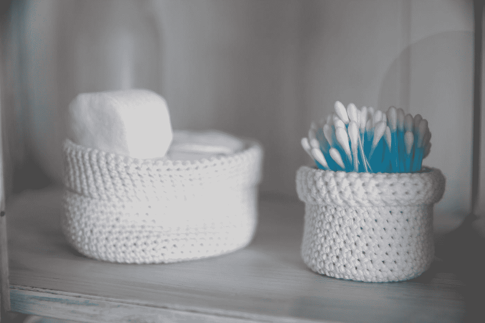

# 使用 Quasar 库开发 Vue 应用程序—按钮定制

> 原文：<https://blog.devgenius.io/developing-vue-apps-with-the-quasar-library-button-customization-1cbd8ac24f7d?source=collection_archive---------6----------------------->



奥利维尔·伯杰龙在 [Unsplash](https://unsplash.com?utm_source=medium&utm_medium=referral) 上拍摄的照片

Quasar 是一个流行的 Vue UI 库，用于开发好看的 Vue 应用程序。

在本文中，我们将了解如何使用 Quasar UI 库创建 Vue 应用程序。

# 自定义按钮颜色

我们可以设置自定义按钮颜色。

例如，我们可以写:

```
<!DOCTYPE html>
<html>
  <head>
    <link
      href="https://fonts.googleapis.com/css?family=Roboto:100,300,400,500,700,900|Material+Icons"
      rel="stylesheet"
      type="text/css"
    />
    <link
      href="https://cdn.jsdelivr.net/npm/quasar@1.12.13/dist/quasar.min.css"
      rel="stylesheet"
      type="text/css"
    />
  </head>
  <body class="body--dark">
    <script src="https://cdn.jsdelivr.net/npm/vue@^2.0.0/dist/vue.min.js"></script>
    <script src="https://cdn.jsdelivr.net/npm/quasar@1.12.13/dist/quasar.umd.min.js"></script>
    <div id="q-app">
      <q-layout
        view="lHh Lpr lFf"
        container
        style="height: 100vh;"
        class="shadow-2 rounded-borders"
      >
        <q-btn
          style="background: #ff0080; color: white;"
          label="Fuchsia"
        ></q-btn>
      </q-layout>
    </div>
    <script>
      new Vue({
        el: "#q-app",
        data: {}
      });
    </script>
  </body>
</html>
```

我们设置`style`道具来改变样式。

此外，我们可以添加图标:

```
<!DOCTYPE html>
<html>
  <head>
    <link
      href="https://fonts.googleapis.com/css?family=Roboto:100,300,400,500,700,900|Material+Icons"
      rel="stylesheet"
      type="text/css"
    />
    <link
      href="https://cdn.jsdelivr.net/npm/quasar@1.12.13/dist/quasar.min.css"
      rel="stylesheet"
      type="text/css"
    />
  </head>
  <body class="body--dark">
    <script src="https://cdn.jsdelivr.net/npm/vue@^2.0.0/dist/vue.min.js"></script>
    <script src="https://cdn.jsdelivr.net/npm/quasar@1.12.13/dist/quasar.umd.min.js"></script>
    <div id="q-app">
      <q-layout
        view="lHh Lpr lFf"
        container
        style="height: 100vh;"
        class="shadow-2 rounded-borders"
      >
        <q-btn color="primary" icon="mail" label="Mail"> </q-btn>
      </q-layout>
    </div>
    <script>
      new Vue({
        el: "#q-app",
        data: {}
      });
    </script>
  </body>
</html>
```

我们设置`icon`道具，在按钮左侧添加一个图标。

另外，我们可以用`round`道具添加一个圆形按钮:

```
<!DOCTYPE html>
<html>
  <head>
    <link
      href="https://fonts.googleapis.com/css?family=Roboto:100,300,400,500,700,900|Material+Icons"
      rel="stylesheet"
      type="text/css"
    />
    <link
      href="https://cdn.jsdelivr.net/npm/quasar@1.12.13/dist/quasar.min.css"
      rel="stylesheet"
      type="text/css"
    />
  </head>
  <body class="body--dark">
    <script src="https://cdn.jsdelivr.net/npm/vue@^2.0.0/dist/vue.min.js"></script>
    <script src="https://cdn.jsdelivr.net/npm/quasar@1.12.13/dist/quasar.umd.min.js"></script>
    <div id="q-app">
      <q-layout
        view="lHh Lpr lFf"
        container
        style="height: 100vh;"
        class="shadow-2 rounded-borders"
      >
        <q-btn round color="primary" icon="shopping_cart"></q-btn>
      </q-layout>
    </div>
    <script>
      new Vue({
        el: "#q-app",
        data: {}
      });
    </script>
  </body>
</html>
```

我们可以在按钮中添加其他内容。例如，我们可以添加头像:

```
<!DOCTYPE html>
<html>
  <head>
    <link
      href="https://fonts.googleapis.com/css?family=Roboto:100,300,400,500,700,900|Material+Icons"
      rel="stylesheet"
      type="text/css"
    />
    <link
      href="https://cdn.jsdelivr.net/npm/quasar@1.12.13/dist/quasar.min.css"
      rel="stylesheet"
      type="text/css"
    />
  </head>
  <body class="body--dark">
    <script src="https://cdn.jsdelivr.net/npm/vue@^2.0.0/dist/vue.min.js"></script>
    <script src="https://cdn.jsdelivr.net/npm/quasar@1.12.13/dist/quasar.umd.min.js"></script>
    <div id="q-app">
      <q-layout
        view="lHh Lpr lFf"
        container
        style="height: 100vh;"
        class="shadow-2 rounded-borders"
      >
        <q-btn round>
          <q-avatar size="42px">
            
          </q-avatar>
        </q-btn>
      </q-layout>
    </div>
    <script>
      new Vue({
        el: "#q-app",
        data: {}
      });
    </script>
  </body>
</html>
```

长标签可以通过写入以下内容来截断:

```
<!DOCTYPE html>
<html>
  <head>
    <link
      href="https://fonts.googleapis.com/css?family=Roboto:100,300,400,500,700,900|Material+Icons"
      rel="stylesheet"
      type="text/css"
    />
    <link
      href="https://cdn.jsdelivr.net/npm/quasar@1.12.13/dist/quasar.min.css"
      rel="stylesheet"
      type="text/css"
    />
  </head>
  <body class="body--dark">
    <script src="https://cdn.jsdelivr.net/npm/vue@^2.0.0/dist/vue.min.js"></script>
    <script src="https://cdn.jsdelivr.net/npm/quasar@1.12.13/dist/quasar.umd.min.js"></script>
    <div id="q-app">
      <q-layout
        view="lHh Lpr lFf"
        container
        style="height: 100vh;"
        class="shadow-2 rounded-borders"
      >
        <q-btn color="primary" style="width: 200px;">
          <div class="ellipsis">
            Lorem ipsum dolor sit amet, consectetur adipiscing elit.
          </div>
        </q-btn>
      </q-layout>
    </div>
    <script>
      new Vue({
        el: "#q-app",
        data: {}
      });
    </script>
  </body>
</html>
```

我们添加一个带有类`ellipsis`的 div 来截断文本，并在其后添加省略号。

我们在`style`属性中设置宽度来设置按钮的宽度，这样文本可以被截断。

# 结论

我们可以在我们的 Vue 应用程序中使用 Quasar 以各种方式定制按钮。