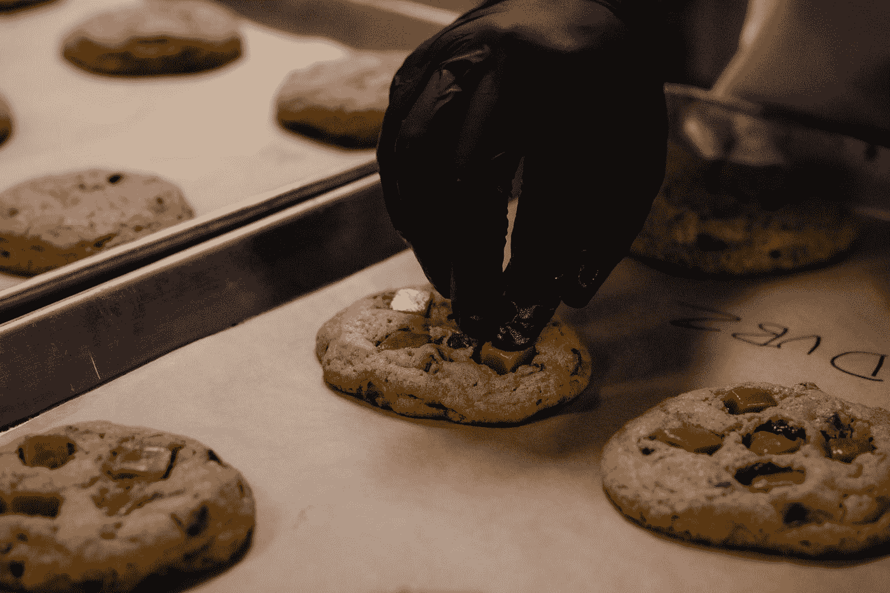

# 使用 Quasar 库开发 Vue 应用程序——全屏和 Cookies

> 原文：<https://blog.devgenius.io/developing-vue-apps-with-the-quasar-library-full-screen-and-cookies-a0926ee40a63?source=collection_archive---------3----------------------->



照片由[康纳·布朗](https://unsplash.com/@commonboxturtle?utm_source=medium&utm_medium=referral)在 [Unsplash](https://unsplash.com?utm_source=medium&utm_medium=referral) 拍摄

Quasar 是一个流行的 Vue UI 库，用于开发好看的 Vue 应用程序。

在本文中，我们将了解如何使用 Quasar UI 库创建 Vue 应用程序。

# 全屏切换

Quasar 附带代码，让我们切换全屏模式，并检查我们是否处于全屏模式。

为了使用它，我们写:

```
<!DOCTYPE html>
<html>
  <head>
    <link
      href="https://fonts.googleapis.com/css?family=Roboto:100,300,400,500,700,900|Material+Icons"
      rel="stylesheet"
      type="text/css"
    />
    <link
      href="https://cdn.jsdelivr.net/npm/quasar@1.12.13/dist/quasar.min.css"
      rel="stylesheet"
      type="text/css"
    />
  </head>
  <body class="body--dark">
    <script src="https://cdn.jsdelivr.net/npm/vue@^2.0.0/dist/vue.min.js"></script>
    <script src="https://cdn.jsdelivr.net/npm/quasar@1.12.13/dist/quasar.umd.min.js"></script>
    <div id="q-app">
      <div class="q-pa-md">
        <q-btn
          color="secondary"
          @click="$q.fullscreen.toggle()"
          :icon="$q.fullscreen.isActive ? 'fullscreen_exit' : 'fullscreen'"
          :label="$q.fullscreen.isActive ? 'Exit Fullscreen' : 'Go Fullscreen'"
        >
        </q-btn>
      </div>
    </div>
    <script>
      new Vue({
        el: "#q-app",
        data: {}
      });
    </script>
  </body>
</html>
```

我们调用`$q.fullscreen.toggle()`来切换全屏模式。

然后我们的属性表明我们是否处于全屏模式。

# 应用可见性

我们可以通过`$q.appVisible`属性来观察应用程序的可见性:

```
<!DOCTYPE html>
<html>
  <head>
    <link
      href="https://fonts.googleapis.com/css?family=Roboto:100,300,400,500,700,900|Material+Icons"
      rel="stylesheet"
      type="text/css"
    />
    <link
      href="https://cdn.jsdelivr.net/npm/quasar@1.12.13/dist/quasar.min.css"
      rel="stylesheet"
      type="text/css"
    />
  </head>
  <body class="body--dark">
    <script src="https://cdn.jsdelivr.net/npm/vue@^2.0.0/dist/vue.min.js"></script>
    <script src="https://cdn.jsdelivr.net/npm/quasar@1.12.13/dist/quasar.umd.min.js"></script>
    <div id="q-app">
      <div class="q-pa-md"></div>
    </div>
    <script>
      new Vue({
        el: "#q-app",
        data: {},
        watch: {
          "$q.appVisible"(val) {
            console.log(
              val ? "App became visible" : "App went in the background"
            );
          }
        }
      });
    </script>
  </body>
</html>
```

# 底部薄板

我们可以用类星体的`$q.bottomSheet`方法加一张底片。

为了补充它，我们写道:

```
<!DOCTYPE html>
<html>
  <head>
    <link
      href="https://fonts.googleapis.com/css?family=Roboto:100,300,400,500,700,900|Material+Icons"
      rel="stylesheet"
      type="text/css"
    />
    <link
      href="https://cdn.jsdelivr.net/npm/quasar@1.12.13/dist/quasar.min.css"
      rel="stylesheet"
      type="text/css"
    />
  </head>
  <body class="body--dark">
    <script src="https://cdn.jsdelivr.net/npm/vue@^2.0.0/dist/vue.min.js"></script>
    <script src="https://cdn.jsdelivr.net/npm/quasar@1.12.13/dist/quasar.umd.min.js"></script>
    <div id="q-app">
      <div class="q-pa-md">
        <q-btn
          no-caps
          push
          color="primary"
          label="List BottomSheet"
          @click="show()"
        ></q-btn>
        <q-btn
          no-caps
          push
          color="white"
          text-color="primary"
          label="Grid BottomSheet"
          @click="show(true)"
        ></q-btn>
      </div>
    </div>
    <script>
      new Vue({
        el: "#q-app",
        data: {},
        methods: {
          show(grid) {
            this.$q
              .bottomSheet({
                message: "Bottom Sheet message",
                grid,
                actions: [
                  {
                    label: "Drive",
                    img: "https://cdn.quasar.dev/img/logo_drive_128px.png",
                    id: "drive"
                  },
                  {
                    label: "Keep",
                    img: "https://cdn.quasar.dev/img/logo_keep_128px.png",
                    id: "keep"
                  },
                  {
                    label: "Google Hangouts",
                    img: "https://cdn.quasar.dev/img/logo_hangouts_128px.png",
                    id: "calendar"
                  },
                  {},
                  {
                    label: "John",
                    avatar: "https://cdn.quasar.dev/img/boy-avatar.png",
                    id: "john"
                  }
                ]
              })
              .onOk((action) => {
                console.log("Action chosen:", action.id);
              })
              .onCancel(() => {
                console.log("Dismissed");
              })
              .onDismiss(() => {
                console.log("I am triggered on both OK and Cancel");
              });
          }
        }
      });
    </script>
  </body>
</html>
```

我们用一个对象数组调用`bottomSheet`,将项目添加到底部的工作表中。

`label`有每一项的文字。`img`每件商品都有图片。

然后我们可以用`onOk`、`onCancel`和`onDismiss`方法观察各种事件，观察项目点击和关闭底部表单。

# 饼干

我们可以用`$q.cookies`属性获取和设置 cookies。

例如，我们可以写:

```
<!DOCTYPE html>
<html>
  <head>
    <link
      href="https://fonts.googleapis.com/css?family=Roboto:100,300,400,500,700,900|Material+Icons"
      rel="stylesheet"
      type="text/css"
    />
    <link
      href="https://cdn.jsdelivr.net/npm/quasar@1.12.13/dist/quasar.min.css"
      rel="stylesheet"
      type="text/css"
    />
  </head>
  <body class="body--dark">
    <script src="https://cdn.jsdelivr.net/npm/vue@^2.0.0/dist/vue.min.js"></script>
    <script src="https://cdn.jsdelivr.net/npm/quasar@1.12.13/dist/quasar.umd.min.js"></script>
    <div id="q-app">
      <div class="q-pa-md"></div>
    </div>
    <script>
      new Vue({
        el: "#q-app",
        data: {},
        beforeMount() {
          this.$q.cookies.set("cookie_name", "foo", {
            expires: 10,
            secure: true
          });
          console.log(this.$q.cookies.getAll());
        }
      });
    </script>
  </body>
</html>
```

我们分别用键、值和选项调用`set`。

`expires`具有以秒为单位的到期时间。

`secure`确保仅在 HTTPS 连接上设置 cookie。

其他 cookie 选项，如`path`、`domain`、`sameSite`、`httpOnly`等。受到支持。

我们用`getAll`方法得到所有的 cookies。

# 结论

我们可以切换全屏，用 Quasar 的内置插件获取和设置 cookies。