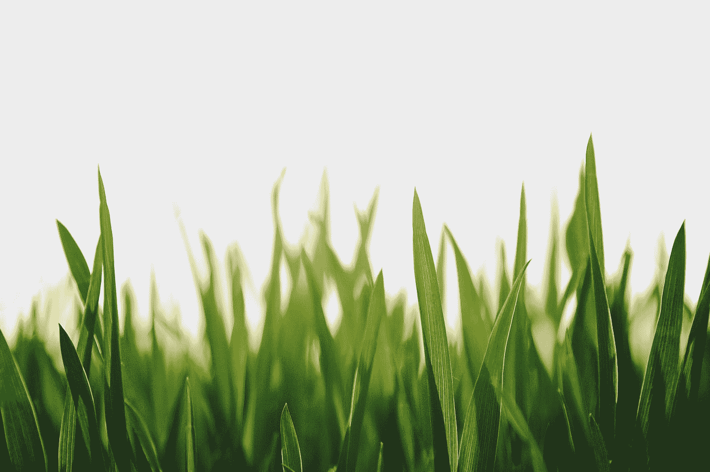

# 使用 Quasar 库开发 Vue 应用程序——图像样式、过渡和错误

> 原文：<https://blog.devgenius.io/developing-vue-apps-with-the-quasar-library-image-styles-transitions-and-errors-1767fa2803fc?source=collection_archive---------8----------------------->



[常青](https://unsplash.com/@lee0201?utm_source=medium&utm_medium=referral)在 [Unsplash](https://unsplash.com?utm_source=medium&utm_medium=referral) 上拍照

Quasar 是一个流行的 Vue UI 库，用于开发好看的 Vue 应用程序。

在本文中，我们将了解如何使用 Quasar UI 库创建 Vue 应用程序。

# 图像样式

我们可以用`style`和`img-class`道具改变图像样式:

```
<!DOCTYPE html>
<html>
  <head>
    <link
      href="https://fonts.googleapis.com/css?family=Roboto:100,300,400,500,700,900|Material+Icons"
      rel="stylesheet"
      type="text/css"
    />
    <link
      href="https://cdn.jsdelivr.net/npm/quasar@1.12.13/dist/quasar.min.css"
      rel="stylesheet"
      type="text/css"
    />
  </head>
  <body class="body--dark">
    <script src="https://cdn.jsdelivr.net/npm/vue@^2.0.0/dist/vue.min.js"></script>
    <script src="https://cdn.jsdelivr.net/npm/quasar@1.12.13/dist/quasar.umd.min.js"></script>
    <div id="q-app">
      <q-layout
        view="lHh Lpr lFf"
        container
        style="height: 100vh;"
        class="shadow-2 rounded-borders"
      >
        <div class="q-pa-md">
          <q-img
            src="https://cdn.quasar.dev/img/parallax2.jpg"
            spinner-color="white"
            style="height: 170px; max-width: 300px;"
            img-class="my-custom-image"
            class="rounded-borders"
          >
            <div class="absolute-bottom text-subtitle1 text-center">
              Caption
            </div>
          </q-img>
        </div>
      </q-layout>
    </div>
    <script>
      new Vue({
        el: "#q-app",
        data: {}
      });
    </script>
  </body>
</html>
```

我们可以在用`transition`道具加载图像时添加过渡效果:

```
<!DOCTYPE html>
<html>
  <head>
    <link
      href="https://fonts.googleapis.com/css?family=Roboto:100,300,400,500,700,900|Material+Icons"
      rel="stylesheet"
      type="text/css"
    />
    <link
      href="https://cdn.jsdelivr.net/npm/quasar@1.12.13/dist/quasar.min.css"
      rel="stylesheet"
      type="text/css"
    />
  </head>
  <body class="body--dark">
    <script src="https://cdn.jsdelivr.net/npm/vue@^2.0.0/dist/vue.min.js"></script>
    <script src="https://cdn.jsdelivr.net/npm/quasar@1.12.13/dist/quasar.umd.min.js"></script>
    <div id="q-app">
      <q-layout
        view="lHh Lpr lFf"
        container
        style="height: 100vh;"
        class="shadow-2 rounded-borders"
      >
        <div class="q-pa-md">
          <q-img
            transition="slide-right"
            :src="url"
            style="width: 150px;"
            ratio="1"
            spinner-color="white"
            class="rounded-borders"
          >
          </q-img>
        </div>
      </q-layout>
    </div>
    <script>
      new Vue({
        el: "#q-app",
        data: {
          url: "https://placeimg.com/500/300/nature"
        }
      });
    </script>
  </body>
</html>
```

我们用转换的名称设置`transition`道具，以显示图像加载的时间。

其他可能的值包括:

*   `‘slide-left’`
*   `‘slide-up’`
*   `‘slide-down’`
*   `‘fade’`
*   `‘scale’`
*   `‘rotate’`
*   `‘flip-right’`
*   `‘flip-left’`
*   `‘flip-up’`
*   `‘flip-down’`
*   `‘jump-right’`
*   `‘jump-left’`
*   `‘jump-up’`
*   `‘jump-down’`

我们可以通过填充`loading`插槽来更改微调器:

```
<!DOCTYPE html>
<html>
  <head>
    <link
      href="https://fonts.googleapis.com/css?family=Roboto:100,300,400,500,700,900|Material+Icons"
      rel="stylesheet"
      type="text/css"
    />
    <link
      href="https://cdn.jsdelivr.net/npm/quasar@1.12.13/dist/quasar.min.css"
      rel="stylesheet"
      type="text/css"
    />
  </head>
  <body class="body--dark">
    <script src="https://cdn.jsdelivr.net/npm/vue@^2.0.0/dist/vue.min.js"></script>
    <script src="https://cdn.jsdelivr.net/npm/quasar@1.12.13/dist/quasar.umd.min.js"></script>
    <div id="q-app">
      <q-layout
        view="lHh Lpr lFf"
        container
        style="height: 100vh;"
        class="shadow-2 rounded-borders"
      >
        <div class="q-pa-md">
          <q-img :src="url">
            <template v-slot:loading>
              <q-spinner-gears color="white"></q-spinner-gears>
            </template>
          </q-img>
        </div>
      </q-layout>
    </div>
    <script>
      new Vue({
        el: "#q-app",
        data: {
          url: "https://placeimg.com/500/300/nature"
        }
      });
    </script>
  </body>
</html>
```

我们还可以通过将`placeholder-src`槽设置为图像 URL 来添加一个占位符图像:

```
<!DOCTYPE html>
<html>
  <head>
    <link
      href="https://fonts.googleapis.com/css?family=Roboto:100,300,400,500,700,900|Material+Icons"
      rel="stylesheet"
      type="text/css"
    />
    <link
      href="https://cdn.jsdelivr.net/npm/quasar@1.12.13/dist/quasar.min.css"
      rel="stylesheet"
      type="text/css"
    />
  </head>
  <body class="body--dark">
    <script src="https://cdn.jsdelivr.net/npm/vue@^2.0.0/dist/vue.min.js"></script>
    <script src="https://cdn.jsdelivr.net/npm/quasar@1.12.13/dist/quasar.umd.min.js"></script>
    <div id="q-app">
      <q-layout
        view="lHh Lpr lFf"
        container
        style="height: 100vh;"
        class="shadow-2 rounded-borders"
      >
        <div class="q-pa-md">
          <q-img
            :src="url"
            placeholder-src="data:image/png;base64,iVBORw0KGgoAAAANSUhEUgAAAJYAAACWBAMAAADOL2zRAAAAG1BMVEXMzMyWlpaqqqq3t7fFxcW+vr6xsbGjo6OcnJyLKnDGAAAACXBIWXMAAA7EAAAOxAGVKw4bAAABAElEQVRoge3SMW+DMBiE4YsxJqMJtHOTITPeOsLQnaodGImEUMZEkZhRUqn92f0MaTubtfeMh/QGHANEREREREREREREtIJJ0xbH299kp8l8FaGtLdTQ19HjofxZlJ0m1+eBKZcikd9PWtXC5DoDotRO04B9YOvFIXmXLy2jEbiqE6Df7DTleA5socLqvEFVxtJyrpZFWz/pHM2CVte0lS8g2eDe6prOyqPglhzROL+Xye4tmT4WvRcQ2/m81p+/rdguOi8Hc5L/8Qk4vhZzy08DduGt9eVQyP2qoTM1zi0/uf4hvBWf5c77e69Gf798y08L7j0RERERERERERH9P99ZpSVRivB/rgAAAABJRU5ErkJggg=="
          >
          </q-img>
        </div>
      </q-layout>
    </div>
    <script>
      new Vue({
        el: "#q-app",
        data: {
          url: "https://placeimg.com/500/300/nature"
        }
      });
    </script>
  </body>
</html>
```

我们可以通过填充`error`插槽来添加当我们指向的图像无法加载时显示的图像:

```
<!DOCTYPE html>
<html>
  <head>
    <link
      href="https://fonts.googleapis.com/css?family=Roboto:100,300,400,500,700,900|Material+Icons"
      rel="stylesheet"
      type="text/css"
    />
    <link
      href="https://cdn.jsdelivr.net/npm/quasar@1.12.13/dist/quasar.min.css"
      rel="stylesheet"
      type="text/css"
    />
  </head>
  <body class="body--dark">
    <script src="https://cdn.jsdelivr.net/npm/vue@^2.0.0/dist/vue.min.js"></script>
    <script src="https://cdn.jsdelivr.net/npm/quasar@1.12.13/dist/quasar.umd.min.js"></script>
    <div id="q-app">
      <q-layout
        view="lHh Lpr lFf"
        container
        style="height: 100vh;"
        class="shadow-2 rounded-borders"
      >
        <div class="q-pa-md">
          <q-img :src="url" style="height: 140px; max-width: 150px;">
            <template v-slot:error>
              <div
                class="absolute-full flex flex-center bg-negative text-white"
              >
                Cannot load image
              </div>
            </template>
          </q-img>
        </div>
      </q-layout>
    </div>
    <script>
      new Vue({
        el: "#q-app",
        data: {
          url: "abc"
        }
      });
    </script>
  </body>
</html>
```

# 结论

我们可以使用 Quasar 设置图像样式、添加占位符、微调器和错误图像。