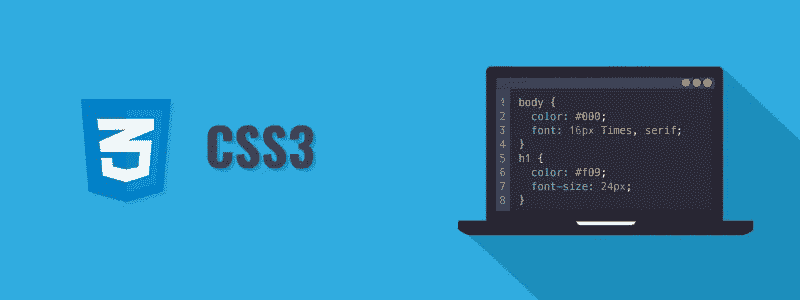
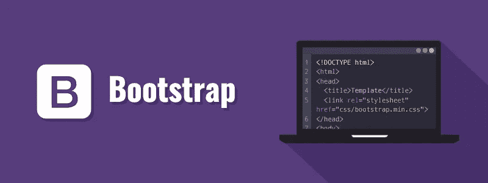
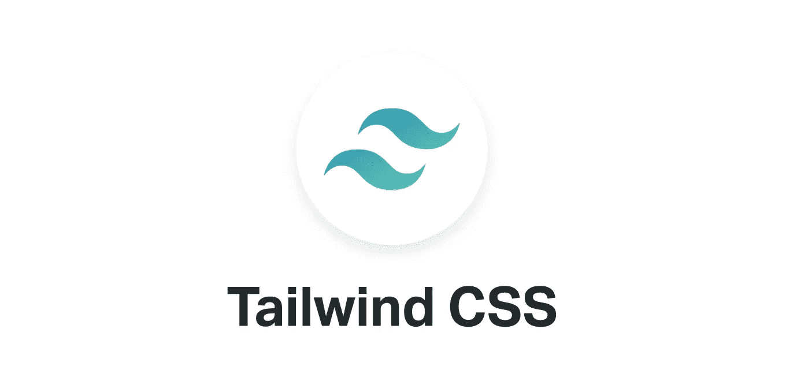
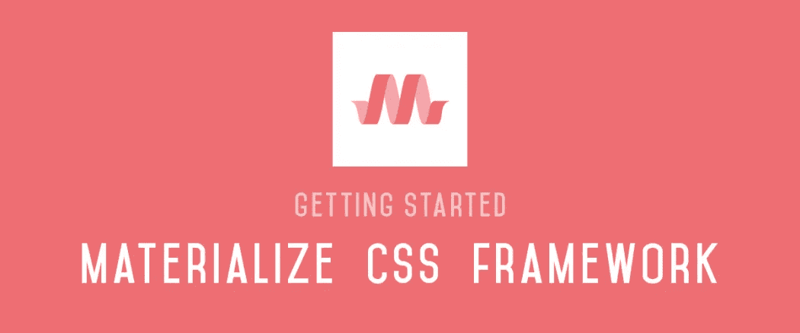

# 发展你的网站组合

> 原文：<https://blog.devgenius.io/developing-your-website-portfolio-7ecd69f4637?source=collection_archive---------3----------------------->


照片由[负空间](https://www.pexels.com/@negativespace?utm_content=attributionCopyText&utm_medium=referral&utm_source=pexels)发自[像素](https://www.pexels.com/photo/gray-laptop-computer-showing-html-codes-in-shallow-focus-photography-160107/?utm_content=attributionCopyText&utm_medium=referral&utm_source=pexels)

第 2 部分:使用 CSS 框架开发一个响应迅速、跨平台兼容的网站

> 在第 1 部分中，我们研究了如何在 GitHub 上托管我们的网站，并开始使用 HTML 进行结构化布局。如果你错过了那篇博文，请点击这里查看:[设计入门，HTML 和 GitHub](https://link.medium.com/XNqVbkEYO8)

到目前为止，您应该已经在 GitHub 上托管了一个普通的 HTML 网站。我们现在将重点放在前端开发，这是网站的视觉美感和感觉。

涵盖的主题:

*   什么是 CSS
*   响应式网络和移动设计
*   前端框架
*   下一步是什么？
*   其他资源和更新

# 什么是 CSS？

级联样式表是用来给 web 文档添加样式的工具。



## CSS 语法

开发者可以通过使用**选择器**和**声明块**(由属性-值对组成)**在他们的网站上实现 CSS。**

```
/*selector{property:value}*/
/*Application*/
h1{color: red;}
```

## 如何实现 CSS

*   Inline:使用 style 属性专门向 HTML 标记添加样式。

```
<h1 style="color:blue">Amantle's Blog</h1>
```

*   内部:使用 HTML 文档中的

```
<style>
h1{color: red;}
</style>
```

*   外部:使用中的<link>标签导入一个. css 文件。

```
<link rel="stylesheet" href="mystyle.css">
```

## 层叠顺序

如果在标签上实现样式时发生冲突，那么下面的层次顺序将会起作用。

优先级 1:内嵌样式

优先级 2:外部和内部样式表

优先级 3:浏览器默认值

如果样式具有相同的优先级并且相互冲突，则将使用浏览器默认设置。

参考 W3Schools 了解更多关于 CSS3 的知识:[学习 CSS](https://www.w3schools.com/css/default.asp)

# 响应式移动设计

世界上有很多不同屏幕分辨率和尺寸的计算设备。移动设备使用的增加与响应式网站重要性的增加成正比。

2015 年，谷歌推出了 [*Mobilegeddon*](https://en.wikipedia.org/wiki/Mobilegeddon) 这是一种移动友好的排名算法。为了让你的网站在谷歌搜索引擎上获得优先，它必须被[*mobile geddon*](https://en.wikipedia.org/wiki/Mobilegeddon)*排名靠前。*

响应式网站会随着设备屏幕大小和移动操作系统的变化而变化。响应式网站优化了图像和内容调整，并依赖于移动设备。如果你的网站反应灵敏，提供一致的体验，你的网站可能会获得更多的关注。

## 你的网站有反应吗？

这就是你如何判断一个网站是否已经针对多种设备进行了优化。

1.  不需要放大就能读懂文字吗？
2.  不需要水平滚动就能查看所有内容吗？
3.  按钮和链接之间有足够的间距吗？
4.  页面加载速度有多快？

## 如何让你的网站反应更快

1.  使用流体网格
2.  灵活的文本和图像
3.  媒体查询

记得在不同的浏览器上测试你的网站。

**参考 W3Schools 了解更多响应式设计:** [学习响应式设计](https://www.w3schools.com/html/html_responsive.asp)

# 前端框架

如前所述，以多个场景和网络浏览器为目标很重要，框架使这变得更容易。框架让你能够使用预定义的代码，而不是从头开始编码。

## 引导 4 框架



引导标志

Bootstrap 由 Twitter 的 Mark Otto 和 Jacob Thornton 开发，旨在鼓励内部工具和响应式设计的一致性。

## 为什么自举？

1.  减少跨浏览器冲突和错误
2.  轻量级选手
3.  高度可定制
4.  允许快速原型制作
5.  响应式结构和风格
6.  跨所有平台的一致样式
7.  可以使用 jQuery 应用 JavaScript 插件
8.  Twitter 还支持良好的文档和社区支持
9.  大量免费和专业的模板、WordPress 主题和插件

【https://getbootstrap.com/2.3.2/components.html】组件:

**安装**:[https://getbootstrap.com/docs/4.5/getting-started/download/](https://getbootstrap.com/docs/4.5/getting-started/download/)

**学习 Bootstrap:**[https://www . w3schools . com/Bootstrap 4/Bootstrap _ get _ started . ASP](https://www.w3schools.com/bootstrap4/bootstrap_get_started.asp)

## 顺风 CSS 框架



顺风 CSS 徽标

Tailwind 提供了各种各样的 CSS 类，每个类都有自己的用途。

**为什么选择顺风 CSS？**

1.  不需要给你的类命名
2.  可以定制
3.  如果开发者熟悉该框架，很容易应用于多个项目
4.  加速发展
5.  跨浏览器和设备兼容

**组件:**https://tailwindcomponents.com/components

**安装:**【https://tailwindcss.com/docs/installation/ 

**课程:**[https://tailwindcss . com/Course/setting-up-tailwind-and-post CSS](https://tailwindcss.com/course/setting-up-tailwind-and-postcss)

## 物化 CSS 框架



物化 CSS 徽标

Materialize CSS 是 Google 设计的一个 UI 组件库，由 CSS、JavaScript 和 HTML 创建。目标是创建一个用户体验设备工具，允许兼容所有谷歌产品和其他浏览器。

1.  提高浏览器的可移植性
2.  轻量级选手
3.  内置组件和功能
4.  缩短编码时间
5.  详细文件

**组件:**https://materializecss.com/badges.html

**安装:**https://materializecss.com/getting-started.html

**课程:**[https://www.youtube.com/watch?v=gCZ3y6mQpW0&list = pl 4 cuxegkcc 9 ggrbtvasezslfeybnpkmff](https://www.youtube.com/watch?v=gCZ3y6mQpW0&list=PL4cUxeGkcC9gGrbtvASEZSlFEYBnPkmff)

# 下一步是什么？

1.  学习基本的 CSS:[https://www.freecodecamp.org/learn](https://www.freecodecamp.org/learn)
2.  仔细阅读，学习如何让你的网站响应迅速
3.  选择一个框架，用它来优化你的网站

# 其他资源和更新

1.  我的投资组合发展的最新情况:[https://amantlexza.github.io/](https://amantlexza.github.io/)
2.  调色板生成器:[https://coolors.co/](https://coolors.co/)
3.  CSS 图标:[https://www.w3schools.com/icons/icons_reference.asp](https://www.w3schools.com/icons/icons_reference.asp)
4.  登陆页面设计灵感:[https://www.lapa.ninja/](https://www.lapa.ninja/)
5.  无飞溅高质量图像:[https://unsplash.com/](https://unsplash.com/)
6.  无像素高质量图像:[https://www.pexels.com/](https://www.pexels.com/)
7.  手机友好测试:[https://search.google.com/test/mobile-friendly](https://search.google.com/test/mobile-friendly)

> 感谢你的阅读，请随时让我知道你的想法，并告诉我你的旅程。

# 参考

1.  法约克，C. (2020)。*什么是 Tailwind CSS，如何将其添加到我的网站或 React 应用程序中？*【在线】freeCodeCamp.org。可在:[https://www . freecodecamp . org/news/what-is-tail wind-CSS-and-how-can-I-add-it-to-my-website-or-react-app/](https://www.freecodecamp.org/news/what-is-tailwind-css-and-how-can-i-add-it-to-my-website-or-react-app/)【2020 年 8 月 10 日获取】。
2.  格雷戈里，S. (2019)。*为什么响应式设计很重要，谷歌批准了*。[在线]新鲜火花。可在:[https://freshsparks.com/why-responsive-design-is-important/](https://freshsparks.com/why-responsive-design-is-important/)【2020 年 8 月 10 日进入】。
3.  Gupta，A. (2017)。*基础和自举各有什么利弊&弊？*【在线】Uplers。可从以下网址获取:[【https://www . uplers . com/blog/what-is-the-pros-cons-of-foundation and-bootstrap/](https://www.uplers.com/blog/what-are-the-pros-cons-of-foundation-and-bootstrap/)【2020 年 8 月 10 日获取】。
4.  库姆萨尔·阿詹斯。(2014).*什么是移动(响应式)网页设计？为什么手机设计很重要？|库姆萨尔阿詹斯*。[在线]见:[https://www . kumsalajans . com/en/blog/we b-design/what-is-mobile-responsive-web-design-why-is-mobile-design-important](https://www.kumsalajans.com/en/blog/web-design/what-is-mobile-responsive-web-design-why-is-mobile-design-important)【2020 年 8 月 10 日获取】。
5.  帕约达。(2018). *Materialize 不错，但是比 Bootstrap 或者 Semantic-UI 好吗？—帕约达*。[在线]见:[https://www . payoda . com/blog/is-materialize-better-than-bootstrap-or-semantic-ui/](https://www.payoda.com/blog/is-materialize-better-than-bootstrap-or-semantic-ui/)【2020 年 8 月 10 日访问】。
6.  史蒂夫(2008)。CSS 教程#5:级联顺序和继承。[在线] mrc 技术博客。可在:[https://www.mrc-productivity.com/techblog/?p=769](https://www.mrc-productivity.com/techblog/?p=769)【2020 年 8 月 10 日获取】。
7.  Thakur，A. (2018)。*前端开发者的 10 个最佳 CSS 框架——geek flare*。[在线]极客 flare。可在:[https://geekflare.com/best-css-frameworks/](https://geekflare.com/best-css-frameworks/)【2020 年 8 月 10 日获取】。
8.  ‌W3schools.com。(2020).*什么是 CSS？*【在线】可在:【https://www.w3schools.com/whatis/whatis_css.asp】T2【2020 年 8 月 10 日访问】。