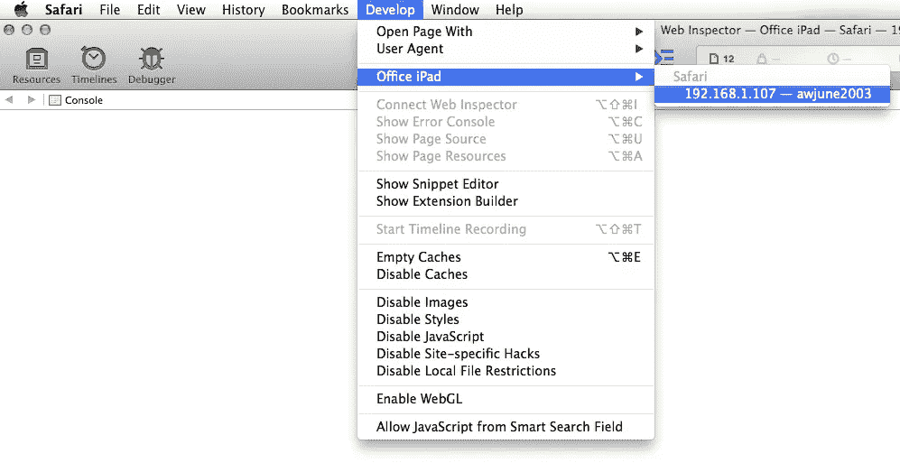

# Andriod 和 iOS 应用内 Webview 开发技巧。

> 原文：<https://blog.devgenius.io/development-tips-on-andriod-and-ios-in-app-webview-9328cd18136d?source=collection_archive---------29----------------------->

我想谈谈我在使用应用内 Webview 的职业生涯中的个人经历。我将尝试解释我在 Andriod 和 iOS 的应用内 Webview 中遇到的问题。


# **1。如何使用 javascript 检测 Andriod 设备或 iOS 设备？**

通过使用 javascript，我们可以使用下面的代码来检测 Andriod 或 iOS。

```
function getMobileOperatingSystem() {
 var userAgent = navigator.userAgent || navigator.vendor || window.opera;
 console.log(userAgent);
 if (userAgent.toLowerCase().indexOf("windows") >= 0 || userAgent.toLowerCase().indexOf("x11") >= 0) {
  return "Web";
 }
 if (/windows phone/i.test(userAgent)) {
  return "Windows Phone";
 }
 if (/android/i.test(userAgent)) {
  return "Android";
 }
 if (/iPad|iPhone|iPod/.test(userAgent) && !window.MSStream) {
  return "iOS";
 }
 return "unknown";
}var dtype = getMobileOperatingSystem();
if (dtype == "Android") {
 Android.<Andriod Method>;
}else if (dtype == "iOS") {
   window.location.href = "<domain url with http or https and Query string for ios method to call>";
}
```

下面代码强制调用一个 Andriod 方法

```
Android.<Andriod Method>;
```

下面的代码是调用 iOS。这里我们需要用查询参数触发 URL，它调用 iOS 方法。

```
window.location.href = "<domain url with http or https and Query string for ios method to call>";
```

# 2.iOS 相机 pic 上传旋转问题。

如果你想用相机在横向或纵向模式下拍照，请使用应用内网络视图。它需要一个风景模式的图片，这是因为在 iOS 中默认相机的图片是在风景模式。我们需要通过后端处理这种旋转。

# 3.第三方 URL 重定向

如果有任何第三方网址，那么重定向到您的网页可能是一个问题，因为使用 android 或 ios 后退按钮将关闭应用内 Webview。这里我们需要停止所有使用 javascript 的第三方 URL。

# 4.Webview ->应用和应用->Webview 通信

如果您想将数据从应用程序发送到 Webview:我们可以用参数(GET 或 POST 方法参数)触发 URL，我们可以将数据发送到 web 浏览器。

如果你想从 Webview 发送数据到 App:这里我们可以使用 javascript 代码(请参考*第一点*中提到的代码)，通过检测 Andriod 或 iOS 设备调用各自的方法。

# 5.文本框焦点 Webview 缩放问题

有时你可能会注意到，当我们聚焦在文本框上时，浏览被放大了。通过使用下面的 HTML 代码，我们可以避免缩放问题

```
<meta name="viewport" content="width=device-width, initial-scale=1.0, maximum-scale=1.0,user-scalable=0"/>body { font-size: 16px; }
input, select { font-size: 100%; }
```

# 6.在本地系统中调试 Andriod 和 iOS web 浏览器

Andriod :我们需要使用代码级别启用调试模式。之后，我们可以在本地 Google Chrome inspect 元素中调试 Webview。如需参考，请访问谷歌官方网站。

[](https://developers.google.com/web/tools/chrome-devtools/remote-debugging) [## 开始远程调试 Android 设备

### 从您的 Windows、Mac 或 Linux 电脑远程调试 Android 设备上的实时内容。本教程教你如何…

developers.google.com](https://developers.google.com/web/tools/chrome-devtools/remote-debugging) 

**iOS** :这里我们可以通过将 iPhone 设备连接到 Mac 设备，在 Safari 浏览器中检查应用内 Webview。

接下来，你需要在你的 iOS 设备上启用“网页检查器”。前往“设置”>“Safari”>“高级”,并切换 Web Inspector 使其启用。


iPhone 图像

然后，您需要在 Mac 电脑上的 Safari 中启用“开发”菜单(如果尚未启用)。前往 Safari >偏好设置>高级，并在菜单栏中勾选“*显示开发菜单”复选框。*


Mac 设备

现在，如果您的 iOS 设备连接到您的电脑，并且您希望调试的网页当前处于打开状态，您可以在桌面 Safari 中进入开发> iOS 设备名称，然后单击您希望调试的页面。



Mac 设备

现在，您可以在浏览器中调试代码。

# 7.如何在 Andriod app Webview 中设置文件拣选权限？

为了从 Andriod 应用内 web 视图中选择文件，我们需要在代码级别启用 web view 的权限。下面的 android 代码将使您能够浏览本地存储的文件。

```
//Necessary Variable to implement file chooser in webview
private ValueCallback<Uri> mUploadMessage = null;
private ValueCallback<Uri[]> uploadMessage = null;
private Integer FILECHOOSER_RESULTCODE = 1;
private Integer REQUEST_SELECT_FILE = 2;

// Using WebChromeClient to pick file
 private class MyWebChromeClient extends WebChromeClient {
     protected void openFileChooser(ValueCallback<Uri> uploadMsg) {
         mUploadMessage = uploadMsg;
         Intent i = new Intent(Intent.ACTION_GET_CONTENT);
         i.addCategory(Intent.CATEGORY_OPENABLE);
         i.setType("*/*");
         String[] mimetypes = {"image/*", "application/pdf"};
         i.putExtra(Intent.EXTRA_MIME_TYPES, mimetypes);
         startActivityForResult(Intent.createChooser(i, "File Chooser"), FILECHOOSER_RESULTCODE);
     }
     // For Lollipop 5.0+ Devices
     public boolean onShowFileChooser(WebView mWebView, ValueCallback<Uri[]> filePathCallback, WebChromeClient.FileChooserParams fileChooserParams) {
         if (Build.VERSION.SDK_INT >= Build.VERSION_CODES.M) {
             if (ContextCompat.checkSelfPermission(ThemeDisplayBrowser.this,
                     Manifest.permission.WRITE_EXTERNAL_STORAGE)
                     != PackageManager.PERMISSION_GRANTED) {
                 // ASK FOR STORAGE PERMISSION HERE
             }
         }
         if (uploadMessage != null) {
             uploadMessage.onReceiveValue(null);
             uploadMessage = null;
         }
         uploadMessage = filePathCallback;
         Intent intent = null;
         if (Build.VERSION.SDK_INT >= Build.VERSION_CODES.LOLLIPOP) {
             intent = fileChooserParams.createIntent();
             intent.setType("*/*");
             String[] mimetypes = {"image/*", "application/pdf"};
             intent.putExtra(Intent.EXTRA_MIME_TYPES, mimetypes);
         }
         try {
             startActivityForResult(intent, REQUEST_SELECT_FILE);
         } catch (ActivityNotFoundException e) {
             uploadMessage = null;
             Toast.makeText(getApplicationContext(), "Cannot Open File Chooser", Toast.LENGTH_LONG).show();
             return false;
         }
         return true;
     }
     @Override
     public boolean onJsAlert(WebView view, String url, String message, JsResult result) {
         result.confirm();
         return true;
     }
 }

// Retriving choosen file using onActivityResult

 @Override
 protected void onActivityResult(int requestCode, int resultCode, Intent data) {
     if (requestCode == REQUEST_SELECT_FILE) {
         AppUtils.pritLogg("got into 1");
         if (uploadMessage == null) return;
         if (Build.VERSION.SDK_INT >= Build.VERSION_CODES.LOLLIPOP) {
             uploadMessage.onReceiveValue(WebChromeClient.FileChooserParams.parseResult(resultCode, data));
         }
         uploadMessage = null;
     } else if (requestCode == FILECHOOSER_RESULTCODE) {
         AppUtils.pritLogg("got into 2");
         if (null == mUploadMessage)
             return;
         // Use MainActivity.RESULT_OK if you're implementing WebView inside Fragment
         // Use RESULT_OK only if you're implementing WebView inside an Activity
         Uri result = data == null || resultCode != RESULT_OK ? null : data.getData();
         mUploadMessage.onReceiveValue(result);
         mUploadMessage = null;
     }
 }
```

# 9.移动 Safari 浏览器或应用内 iOS webview 中的 HTML 输入控件样式问题

使用`appearance`属性避免专有风格化

```
-moz-appearance: none;/* older firefox */
-webkit-appearance: none; /* safari, chrome, edge and ie mobile */
appearance: none; /* rest */
```


iOS 下拉列表问题