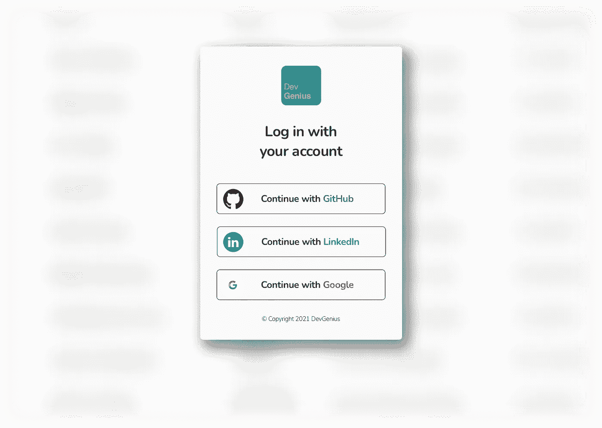

# DevGenius 作业—更新#2

> 原文：<https://blog.devgenius.io/devgenius-jobs-update-2-4eb57ee5c0b7?source=collection_archive---------4----------------------->

亲爱的用户您好，
这是新项目展示后在 Medium 上的第一次更新。

上个月，我们完成了网站的 **UI** 和 **UX** 部分，并开始实现带有外部提供商认证的**登录页面**。

我们知道，现在人们不需要另一个用户名和密码来访问网站，因此我们选择了最重要的供应商作为开发者！

正如您在下面的屏幕中看到的，可用的提供商有: **Github** 、 **LinkedIn** 和 **Google** 。

你认为实现用户名-密码登录更好吗？你认为其他外部供应商有用吗？欢迎在此评论或在 LinkedIn 上给我发消息。

## 要获得关于 DevGenius Jobs 的所有新闻、投票和更新，不要忘记订阅“即将推出”页面 [**此处**](https://jobs.devgenius.io) 。

[推特](https://twitter.com/devgenius1) | [脸书](https://www.facebook.com/devgenius1/) | [领英](https://www.linkedin.com/company/dev-genius/)