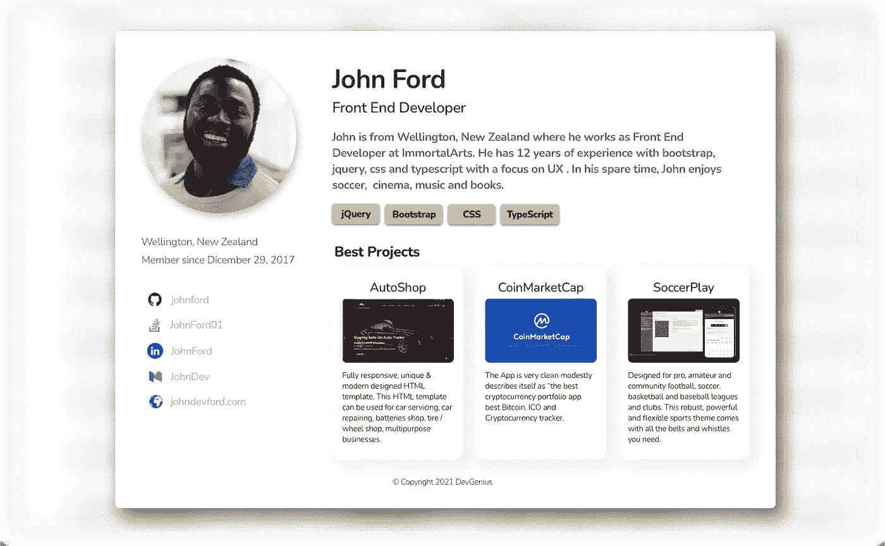

# DevGenius 作业—更新#3

> 原文：<https://blog.devgenius.io/devgenius-jobs-update-3-77c05c6cc8dd?source=collection_archive---------3----------------------->

亲爱的用户您好，
这是我们新项目**开发天才乔布斯**的第三次媒体更新！

今天，我们将谈论我们现在正在做的网站页面:**用户简介**。

我们创建了一个简单的页面，招聘人员可以立即找到所有需要的信息。这个 UI 背后的想法是将大部分注意力引向用户技能、投资组合项目和外部网站，如 **Github** 、 **StackOverflow** 、 **LinkedIn** 、 **Medium** 和**个人**用户网站。

从顶部开始，可以找到用户的**名**、**姓**、职务**职**。然后有一个小的**传记**，用户可以谈论他们以前的工作、激情和软技能。

在生物部分之后，有一个简介的主要部分:**技能标签**。这一部分非常重要，主要有两个原因:

*   招聘人员可以在主页上筛选技能来找到合适的人
*   我们会发一份简讯，列出所有贴有相同标签的公司。

最后，在这一页的底部，你可以看到用户过去参与的最有意义的项目。

你认为这一页缺少了什么吗？这些外部站点够用吗？欢迎在此评论或在 LinkedIn 上给我发消息。

## 要获得关于 DevGenius Jobs 的所有新闻、投票和更新，不要忘记在此处订阅“即将推出”页面[。](https://jobs.devgenius.io/)

[推特](https://twitter.com/devgenius1) | [脸书](https://www.facebook.com/devgenius1/) | [领英](https://www.linkedin.com/company/dev-genius/)