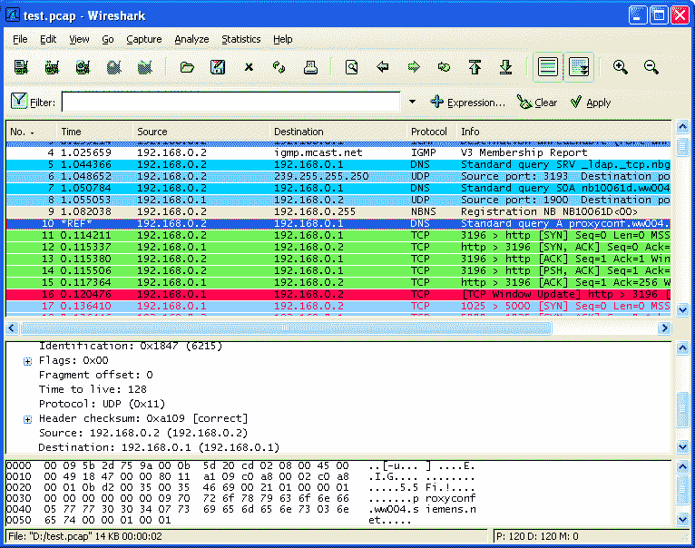
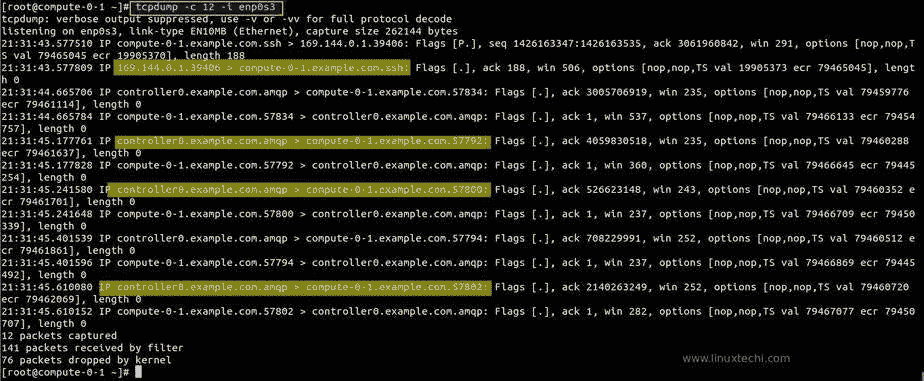
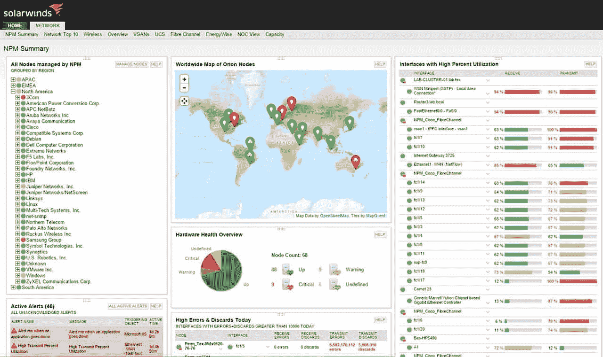
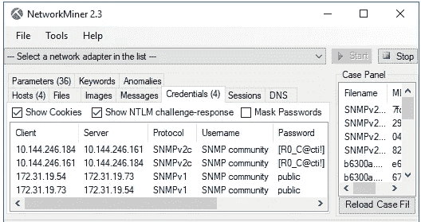
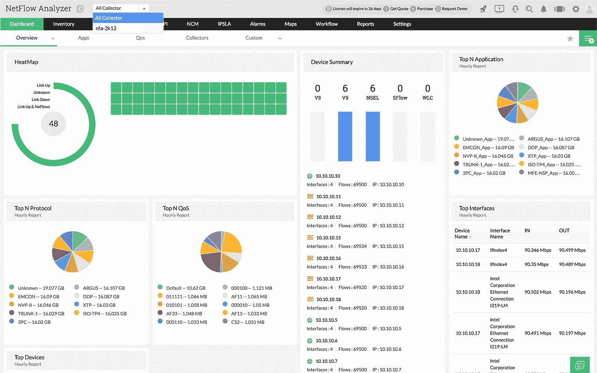
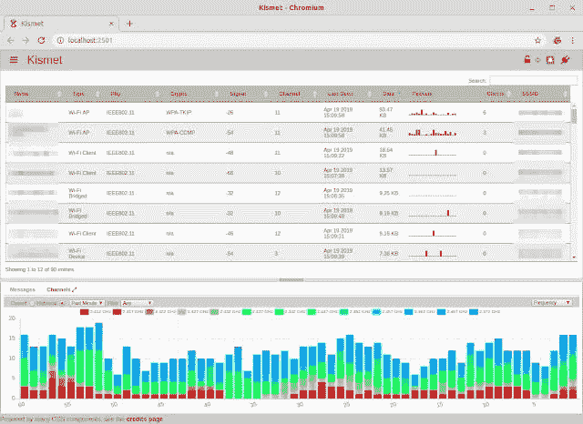
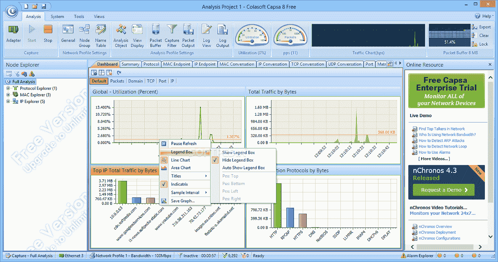
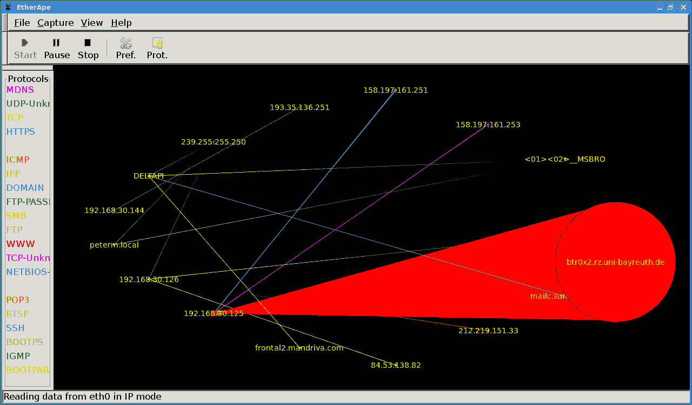
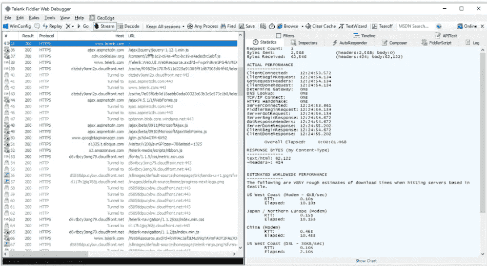
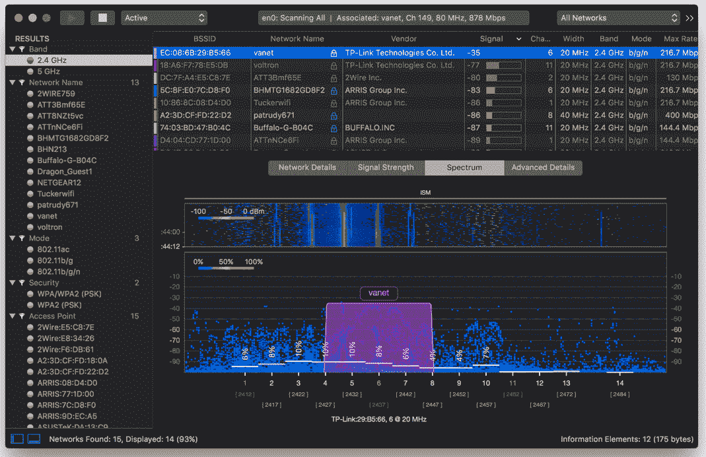

# DevOps — 10 款强大的网络嗅探工具

> 原文：<https://blog.devgenius.io/devops-10-powerful-network-sniffing-tools-c9def6c0b2a0?source=collection_archive---------0----------------------->

图片来自 https://www.softwaretestinghelp.com/

随着数字化业务的广泛开展，企业网络每天都在产生大量的数据，这些数据被分解成无数的数据包，按照既定的规则在网络上有序传输。

当任何一个数据包受到干扰，出现异常，整个传输过程都会受到影响。网络嗅探(数据包分析)工具主要用于分析网络传输交换中的数据包。

通过分析这些数据，网络安全工程师可以更好地了解网络运行并提前感知安全威胁。

本文从网络安全管理的角度出发，介绍了 10 种最常用的网络嗅探分析工具以及这些工具的应用特点。

# wireshark

Wireshark 是一款开源的嗅探分析工具，可以深度分析网络数据包。这个产品项目历史悠久，可以追溯到 1998 年。

Wireshark 目前支持数百种网络协议，并兼容各种类型的文件格式，如 Catapult DCT2000、微软网络监视器和思科安全 IDS iplog。

它几乎可以在任何平台上运行，如 Linux、Solaris、Windows、macOS 或 FreeBSD。它可以设置不同的检测规则，以实现更快的视觉流量扫描，以及动态 gzip 解压缩。

来自 techilife.com[的图片](https://www.techilife.com/packet-analyzer-wireshark-android-alternatives/)

# tcpdump

tcpdump 是一个经典的 Linux 实用程序。虽然它没有图形界面和应用环境，但可以通过其应用的便利性来弥补这一不足。

Tcpdump 的工具命令简单明了，旨在帮助用户解决网络数据包分析中的特定问题。不同的命令可用于不同的检测问题。

如果用户需求比较简单，但是需要快速扫描，tcpdump 会是一个不错的选择。

大多数当前的 Linux 发行版操作系统都带有这个工具。

来自 linuxtechi.com[的图片](https://www.linuxtechi.com/capture-analyze-packets-tcpdump-command-linux/)

# 网络安全管理软件产品网络监控工具

这个来自网络安全管理软件产品的工具提供了广泛的数据包分析功能，并且是一个显示网络运行概况的多层工具。用户可以非常快速地检测、诊断和解决任何网络问题。

它可以利用安装的传感器来帮助深度数据包检测(DPI)捕获数据包级数据，以管理 Windows 设备。

此外，用户可以使用逐步向导工具来部署传感器和选择要监控的自定义应用程序。它具有全面的网络带宽分析功能，包括 NetFlow、sFlow、NetStream、JFlow 和 IPFIX。

图片来自 netadmintools.com

# 网络矿工

etworkMiner 是一款网络取证分析工具(FNAT ),是一款用于被动网络分析的开源工具，具有出色的 GUI 界面。使用该工具，用户可以轻松查看传输的图像和其他文件。

NetworkMiner 还具有各种检测功能，如 IPv6 支持、Pcap-over-IP、操作系统指纹、地理 IP 本地化、命令行脚本支持等。这些功能适用于不同类型的流量，如 HTTP、SMB2、POP3、TFTP、FIP 和 SMB 等流量。

# 管理引擎网络流量分析器

这是一个全功能的流量分析软件，使用流量技术为安全团队提供深入的信息，以提供最佳流量模式的带宽性能。

这个嗅探器可以在 Windows 和 Linux 系统上使用。

**manage engine NetFlow Analyzer**使用 DPI 引擎来监控网络响应时间和应用响应时间，并执行分析以查明网络或应用是否出现错误。

NetFlow Analyzer 还允许用户列出受影响的用户，以便企业可以通知用户解决问题的方案。

它通过流量整形机制提供调节，以符合带宽管理技术，同时为高优先级应用提供网络性能保证。

来自 manageengine.com[的图片](https://www.manageengine.com/products/netflow/)

# 命运

Kismet 是使用最广泛的数据包嗅探工具之一。它主要用于 Wi-Fi 传输故障的分析和故障排除，也可以用于检测组织的内部网系统上的应用流量。

如果你想找到非法连接网络的网络设备，可以用 kismet 快速找到，阻止它连接所有网络基础设施。这个工具可以在 Windows 和 Linux 等多种操作系统上运行，但它也缺乏更好的用户体验的图形功能。

这个工具速度很快，并且在被动模式下工作。它拦截数据包，不会留下任何数字痕迹。Kismet 的独特之处在于它需要作为一个独立的应用程序运行。它是一个需要客户端支持的工具，需要将捕获的数据包发送回服务器进行综合分析。

图片来自[https://www.linuxuprising.com/](https://www.linuxuprising.com/)

# 可乐软 Capsa

如果用户只需要在 Windows 环境下应用，那么 Colasoft Capsa 会是一个不错的选择。它有三个版本:免费版，标准版和企业版。不同的版本可以满足不同层次用户的应用需求。

但是，即使是免费版也可以支持 300 种协议，并具有出色的流量分析和检测功能。标准版更好，支持 1000 多种协议，还允许用户定制分析会话，以实现数据包流量重建。

图片来自 softpedia.com

# 以太猿

EtherApe 是一个强大的可视化和开源网络嗅探分析工具。它有预构建的二进制文件，但是只对 Linux 发行版用户可用。

EtherApe 的代表功能是多节点流量编码监控，可以在“live off”模式下读取数据，也可以从 tcpdump 文件中读取数据。它还支持网络数据包的标准名称解析。

最新版本中，EtherApe 的 GUI 界面升级到了 GTK3，带来了更好的应用体验。

来自 surrey.lug.org.uk[的图片](https://surrey.lug.org.uk/KnowledgeBase/EtherapeIntroduction)

# 游手好闲的人

Fiddler 是一种应用于外部网络和内部网络用户设备之间的被动网络嗅探器。为了保证网络的正常运行，用户需要 Fiddler。

如果用户的主要需求是嗅探 HTTP 和 HTTPS 流量，Fiddler 被认为是最合适的工具之一。

用户可以使用 Fiddler 执行许多分析操作，如会话操作、安全分析和网络性能测试。

在会话操作中，Fiddler 使用 HTTP 头，可以根据需要修改会话数据；在安全测试中，它允许用户模拟中间人攻击，解密特定用户的所有 HTTPS 流量；在性能测试中，它可以分析页面加载(或 API 响应)时间，帮助用户发现网络应用中的性能瓶颈。

# Wifi 浏览器

Wifi Explorer 是一款用于 macOS 的无线网络数据包分析工具，可以帮助用户发现可能干扰网络的信道冲突和信号重叠。

Wifi Explorer 拥有精心设计的功能和丰富的检测分析工具，可以直接应用于网络核心部分的流量分析。

还可以帮助用户检测非法无线网络信号源，发现是否有干扰用户正常应用的无线网络信号。

来自 wlanpros.com[的图片](http://www.wlanpros.com/wifi-explorer-pro-update-review/)