# DevOps —通过 Jenkins 在 15 分钟内实现 CI / CD

> 原文：<https://blog.devgenius.io/devops-achieve-ci-cd-via-jenkins-in-15-mins-eddf8e25b0a6?source=collection_archive---------0----------------------->

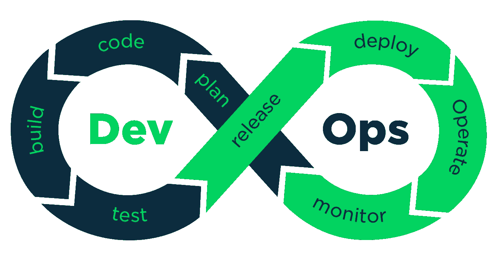

CI / CD(持续集成/持续交付)是现代应用开发环境的重要组成部分之一。CI/CD 是一种通过在应用程序开发阶段引入自动化来频繁集成和向最终用户交付应用程序的方法。这种方法有助于开发和运营团队以敏捷的方式一起工作。虽然 DevOps、敏捷和 CI / CD 是三个不同的东西，但它们以某种方式粘合在一起，产生了无缝的应用程序开发和交付体验。首先，让我们了解 CI 和 CD 的含义，然后我将带您一步一步地通过 Jenkins 设置 CI / CD 管道。

# **CI:持续集成**

CI / CD 的 CI 部分只是开发代码到主存储库的*常规集成。CI 的主要目的是尽早发现集成错误，这些错误可能会导致交付的延迟。在敏捷世界中，每个开发人员在他们自己的特性分支中开发他们的代码，他们定期将这些特性分支集成到主分支中。CI 和自动化确保这种集成或合并不会破坏现有的功能。自动化是 CI 的一个基本要素，没有自动化，您就无法充分发挥 CI 的威力。通过将 CI 管道应用于您的应用程序，您可以实现以下目标*

1.  自动代码质量扫描
2.  发布测试覆盖报告
3.  自动代码构建

# CD:持续部署

CI / CD 的 CD 部分简单来说就是*定期为客户发布代码*。CD 最小化了部署新代码的工作量，与 CI 一起，它最小化了发布后潜在失败的风险。在当今的微服务世界中，常规部署和监控很难管理。CD 使它变得容易和无摩擦。CI / CD 一起在敏捷软件开发中产生最好的 ROI。根据[敏捷宣言](https://agilemanifesto.org/principles.html)，持续交付也是敏捷软件开发的代码思想之一。

> *“我们最优先考虑的是通过早期和持续交付有价值的软件来满足客户。”*

# 没有 CI / CD 的应用程序开发—传统方法

让我们遵循传统的应用程序开发方法，找到可以通过应用 CI / CD 管道来解决的棘手问题。过去，在大多数组织中，开发和部署是两个独立的部门。开发团队的核心关注点是"*开发"*，而部署团队的核心关注点是"*保持生产服务器正常运行，并在最短的停机时间内部署更新"*。这种职责分离是传统应用程序开发方法中的首要问题。

按照传统的非敏捷方法，开发团队基本上由开发人员和 QA 组成。他们的主要工作是在开发服务器上开发和测试代码。如上所述，软件开发人员倾向于只专注于编写代码。一旦应用程序被编码，它就被移交给问答团队。如果测试人员发现了“bug ”,他们会记录错误，并将它们发回给开发人员进行纠正。一旦应用程序通过了测试阶段，开发团队的目标就实现了，他们将代码移交给部署团队。

部署团队需要在部署代码之前配置操作系统、执行数据库部署、配置网络和安全性，同时保持生产服务器运行。由于应用程序开发团队大多不了解生产环境的复杂性，这导致了不稳定的产品发布和不必要的推广。

CI/ CD 在克服职责分离、长发布周期和人工依赖等问题上发挥着关键作用。

# 用 CI / CD 开发应用程序——现代敏捷方法

在使用 CI / CD 的现代敏捷方法中，开发人员在他们自己的功能分支上开发代码，并在完成后将代码合并到 master 中。一旦他们将代码合并到主分支，CI / CD 就会从那里接收代码。像 Jenkins 这样的 CI / CD 工具会收到一个新代码被推/合并到主分支的通知。它从存储库中提取代码，构建所需的工件，并执行自动化来测试代码的集成。如果构建失败，它会向开发人员发送带有问题的电子邮件；如果构建通过，它会部署到生产服务器，无需任何手动干预。

通过 CI / CD，我们解决了基本的责任问题，因为现在整个团队负责开发和生产部署，即开发运维。这样，我们通过减少每一步的人工干预和协调，将错误发布的风险降至最低。

# 我们如何实现这一目标:

CI / CD 不难实现，但它始于改变团队文化，团队必须开始以敏捷的方式思考。有很多可用的工具，如 Jenkins、CircleCI 等，通过它们我们可以实现在项目上实施 CI / CD 的目标。现在，bitbucket 还在存储库中提供了“管道”,可以用来实现 CI / CD，而无需安装任何第三方软件。本文的目的是提供安装和设置 Jenkins 以启用 CI/CD 的步骤，因此让我们首先确定此实施的先决条件。

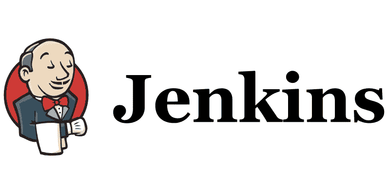

# 先决条件和假设:

我的重点是通过 Jenkins 在 Linux ubuntu 机器上安装和实现 CI/CD。根据操作系统的不同，步骤和先决条件可能会有所不同。我也在为一个 LARAVEL 项目写实现 CI/CD 的文章。其他应用程序的 CI / CD 实施可能稍有不同，但您仍然可以遵循此指南来获得为任何类型的应用程序定义 CI/CD 管道的重要知识。请确保在开始前准备好以下先决条件。

1.  一台至少有 2 GB 内存、20 GB 可用硬盘、双核 CPU 和 Ubuntu 的机器— *用于 Jenkins 安装和配置*。
2.  bitbucket account — *用于管理 bitbucket repository* 下应用的代码。
3.  生产机器——取决于应用程序的规模和用户。(*安装了 apache2 和 MySQL 的 Ubuntu 机器将用作生产服务器。*)

我假设你对 ubuntu 安装和服务器管理有基本的了解，所以这篇文章适合中级水平。在我的文章中，我将 AWS EC2 机器用于 Jenkins 和生产机器。你可以自由地使用任何提供 SSH 登录功能的基于云的服务器，并以 Ubuntu 作为操作系统。一旦你有了上面要求的组件，你就可以开始了。

# 让我们开始吧:

请按顺序执行以下步骤，最后，您将为您的项目实现 CI / CD 管道。

I)请通过 SSH 登录到您要安装 Jenkins 的服务器，然后依次运行以下命令。请注意，您必须为登录用户启用“sudo”权限。

ii) `sudo apt-get update`

iii) `sudo apt-get upgrade`

iv) `sudoapt-get install openjdk-8-jre openjdk-8-jdk`(目前，Jenkins 支持 JAVA 8 和 11，但为了简单起见，我使用 JAVA 8)

v) `wget -q -O — [https://pkg.jenkins.io/debian-stable/jenkins.io.key](https://pkg.jenkins.io/debian-stable/jenkins.io.key) | sudo apt-key add -`

六)`sudo sh -c ‘echo deb [http://pkg.jenkins.io/debian-stable](http://pkg.jenkins.io/debian-stable) binary/ > /etc/apt/sources.list.d/jenkins.list’`

vii) `sudo apt-get update`

viii) `sudo apt install jenkins`

ix) `sudo systemctl start jenkins`(开始詹金斯)

x) `sudo systemctl status jenkins` (检查詹金斯的状态)

xi) `sudo ufw allow 8080`(如果你安装了 ufw，那么你必须打开 ufw 上的 8080 端口)

xii) `sudo ufw allow OpenSSH`

xiii) `sudo ufw enable`

十四)`sudo ufw status`

xv)现在，您的 Jenkins 已准备好安装。您可以通过[http://your _ server _ IP _ or _ domain:8080](http://your_server_ip_or_domain:8080)运行 Jenkins 并输入密码。请按照安装过程安装推荐的插件。(您需要运行命令“`sudo cat /var/lib/jenkins/secrets/initialAdminPassword`”来获取登录 Jenkins 的初始密码。)

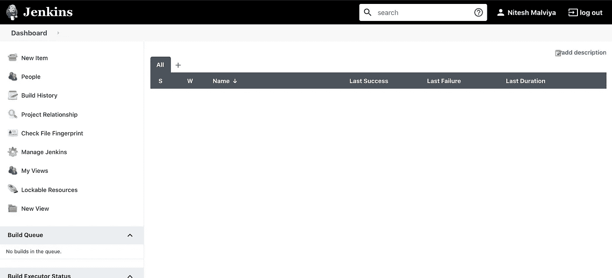

xvi)现在 Jenkins 机器已经准备好了，让我们通过 SSH 运行以下命令来安装 composer。Composer 习惯于为 Laravel 项目安装依赖项

```
 →php -r “copy(‘https://getcomposer.org/installer', ‘composer-setup.php’);”
 → php -r “if (hash_file(‘sha384’, ‘composer-setup.php’) === ‘756890a4488ce9024fc62c56153228907f1545c228516cbf63f885e036d37e9a59d27d63f46af1d4d07ee0f76181c7d3’) { echo ‘Installer verified’; } else { echo ‘Installer corrupt’; unlink(‘composer-setup.php’); } echo PHP_EOL;”
 →php composer-setup.php
 →php -r “unlink(‘composer-setup.php’);”
```

xvii)现在，composer 安装已准备就绪。您可以通过运行命令“`php composer.phar`”来测试这一点

xviii)现在，您需要将 composer 移动到“bin”目录，以便通过直接命令运行它。请运行命令“`sudo mv composer.phar /usr/local/bin/composer`”来移动文件

xix)现在您可以在命令提示符下运行命令“`composer`”来测试 composer 的安装是否正确。

xx)安装 composer 后，让我们在 Jenkins 机器上安装 git。Git 将用于与 bitbucket 交互。您可以通过命令"`sudo apt-get install git`"安装 git

xxi)现在让我们安装 ZIP 模块，它将用于压缩或解压缩文件夹。您可以通过命令“`sudo apt-get install zip unzip`”安装 ZIP 模块

xxii)现在通过[http://your _ server _ IP _ or _ domain:8080](http://your_server_ip_or_domain:8080)在浏览器中打开 Jenkins 页面，点击“管理 Jenkins”，然后点击“管理插件”——>“可用”，搜索“bitbucket”插件，安装该插件并重启。

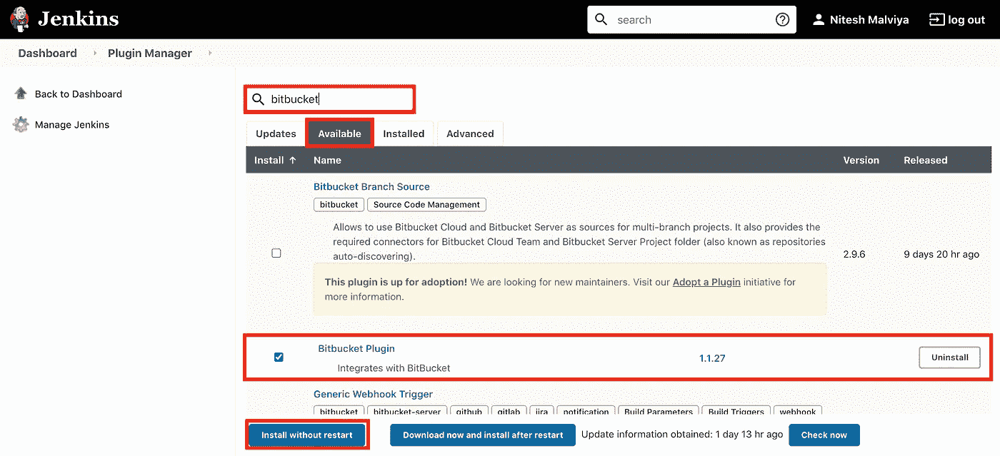

xxiii)现在我们需要 Jenkins 服务器的 SSH 密钥，它将用于通过 SSH 与 bitbucket 交互。要在 Jenkins 服务器上生成新的 ssh 密钥，请运行以下命令

```
 →ssh-keygen -t rsa -C “<your email>” (It will ask for the path of the file. Provide the path or use the default one ~/.ssh/id_rsa)
 → cat ~/.ssh/id_rsa.pub (To copy the public file of the key and copy. Please replace the path with the path where you installed the SSH keys)
```

xxiv)您的 Jenkins 机器现在几乎准备好了。现在让我们转到 bitbucket 并配置存储库以与 Jenkins 机器交互

xxv)打开 bitbucket 上的项目存储库，单击“项目设置”,然后单击“访问密钥”,然后添加上面的密钥，这样 Jenkins 服务器就可以通过 SSH 与 bitbucket 进行交互

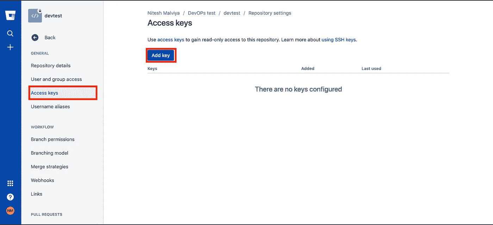

xxvi)现在在 bitbucket 上点击“项目设置”->“webhooks”，然后点击“添加 web hook”。然后输入网址为“http://<your jenkins="" url="">:8080/bit bucket-hook/”。单击“SSL/TLS”和“启用请求历史记录收集”,然后添加 webhook。(只要任何开发人员将代码推送到这个存储库，这个钩子就会将请求推送到 Jenkins。请注意，这将为任何分支中的每次推送向 Jenkins 发送通知，因此我们必须配置 Jenkins，以便只接受和处理存储库特定分支的通知。)</your>

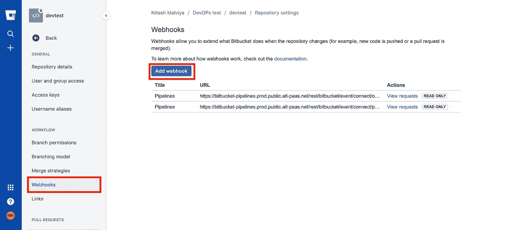

xxvii)现在转到 Jenkins 页面，从左侧菜单中单击“新项目”。输入名称，选择“自由式项目”，点击“确定”。然后选择“源代码管理”，进入存储库“ *SSH URL* ”，然后点击“*添加(在凭证下)——>Jenkins*”，添加 SSH 凭证登录 bitbucket。它将打开一个弹出窗口来添加凭据。然后在“*种类”*下拉列表中选择“*带私钥的 SSH 用户名”*，并输入用户名作为您在前面步骤中生成 ssh-keygen 时使用的电子邮件。然后运行“猫~/。ssh/id_rsa”(来复制私有文件。请用您生成的私钥路径替换该路径)并粘贴到“*私钥*部分并保存。

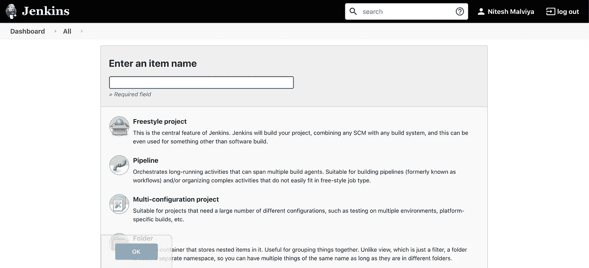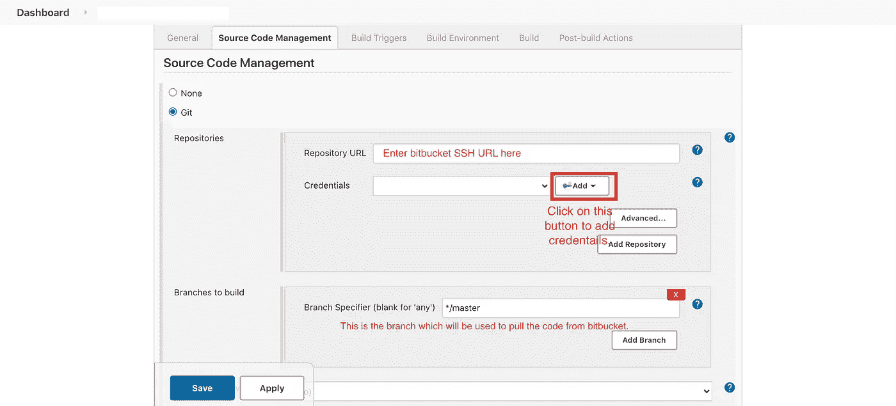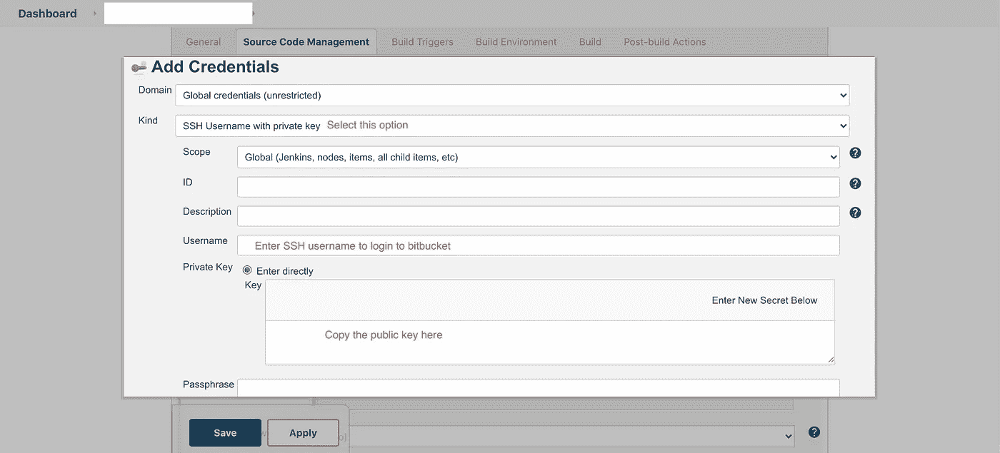

xxviii)然后在构建触发器下选择“*当一个变更被推送到 BitBucket* 时构建”，并在这里输入存储库的“ *HTTP URL* ”。

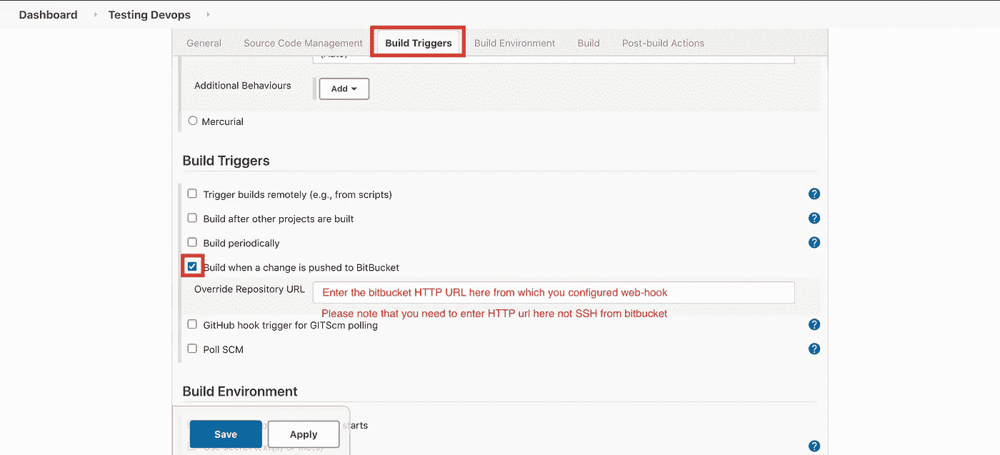

xxix)现在，在 build 部分下，选择" *Execute Shell* ，并输入以下行
→ `composer install` (安装 LARAVEL 依赖项)
→ `mv .env.example .env` (您应该在. env.example 文件中添加您的生产服务器细节，以便您可以在持续集成期间复制它们，这将用于连接到生产服务器)
→ `php artisan key:generate`(生成 LARAVEL 密钥)
→ `./vendor/bin/phpunit ./tests`(运行自动化测试)

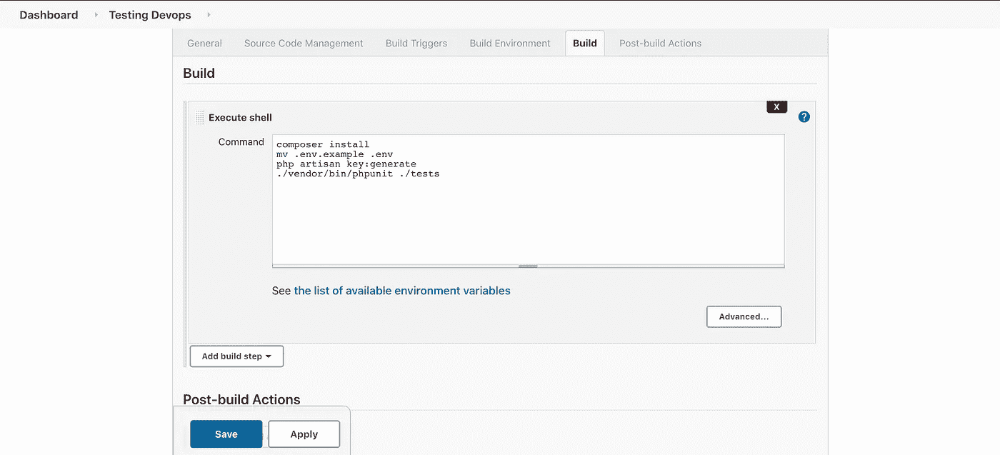

xxx)现在，您的 Jenkins 服务器已准备好接收来自 bitbucket 的推送通知，并执行 CI 部分。它将从主分支获取最新的代码，安装依赖项，并运行自动化测试用例来验证集成。所以现在持续集成完成了。让我们现在完成 CD 部分。

xxxi) Jenkins 使用“Jenkins”用户连接到任何服务器进行持续部署。因此，我们将更改该用户的权限，并生成 SSH 密钥。不要在这里混淆。前面的 SSH 密钥用于连接 CI 部分的 bitbucket，这个 SSH 密钥将用于通过 SSH 连接 CD 部分的生产服务器。通过 ssh 登录到 Jenkins 服务器，并运行以下命令。
→`sudo su -s /bin/bash jenkins`→
→`ssh-keygen -f ~/.ssh/id_rsa -t rsa -b 4096 -C “devops”`
→`cat ~/.ssh/id_rsa.pub` (复制 ssh 公钥到剪贴板)
→现在登录 ***AWS 云生产*** ***服务器(您将用作生产服务器的服务器)*** 通过 SSH 并转到“~/。ssh”文件夹，然后运行以下命令
→`sudo nano authorized_keys`
→现在粘贴从 JENKINS 服务器复制的密钥并保存该文件
→ `sudo /etc/init.d/ssh restart`(重启 SSH 服务器)

xxxii)现在通过 URL[http://your _ server _ IP _ or _ domain:8080](http://your_server_ip_or_domain:8080)打开 Jenkins，并通过单击 configure 编辑之前创建的管道，然后在同一个构建部分中修改以下命令。您的构建部分现在应该看起来像下面这样(请注意，下面的命令还将运行 DB 迁移和 seeder 来填充数据库。请根据您的使用情况修改命令)

```
 composer install
 mv .env.example .env
 php artisan key:generate
 ./vendor/bin/phpunit ./tests rsync -vrzhe “ssh -o StrictHostKeyChecking=no -i ~/.ssh/id_rsa” — exclude vendor/ . ubuntu@<your production server IP>:/var/www/html ssh ubuntu@<your production server IP>-i ~/.ssh/id_rsa -o StrictHostKeyChecking=no <<EOF
 cd /var/www/test
 composer install — no-dev
 sudo chgrp -R www-data storage bootstrap/cache
 sudo chmod -R ug+rwx storage bootstrap/cache
 php artisan migrate 
 php artisan db:seed
 EOF
```

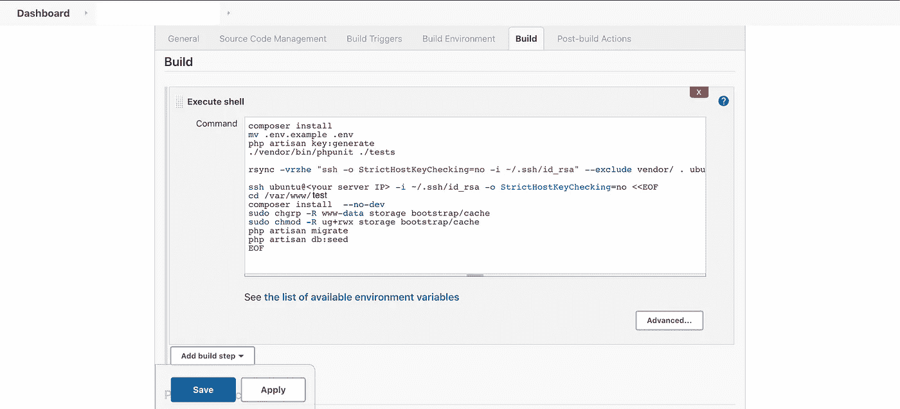

至此，您的 Jenkins 服务器可以对该 web 服务器运行“rsync”命令了。祝贺您成功地使用 Jenkins 实施了 CI / CD。现在，一旦开发人员将 bitbucket 主分支中的代码推送出去，它就会通过 webhook 向 Jenkins 服务器发送推送通知。Jenkins 服务器将从 bitbucket 主分支提取代码，并运行自动化测试用例来验证构建。一旦测试成功，它将通过“rsync”命令将代码复制到 SSH 上的生产服务器，以完成 CI / CD 管道。现在可以打开 http:// <your production="" server="" ip="">运行生产服务器了。</your>

这只是开始。从这里你可以做很多事情。您可以通过在 Jenkins 上安装和配置 SONACUBE 来添加自动代码质量检查。我将添加另一篇文章来描述在 Jenkins 上安装 SONARCUBE 并在 Jenkins 上启用电子邮件通知的逐步过程。