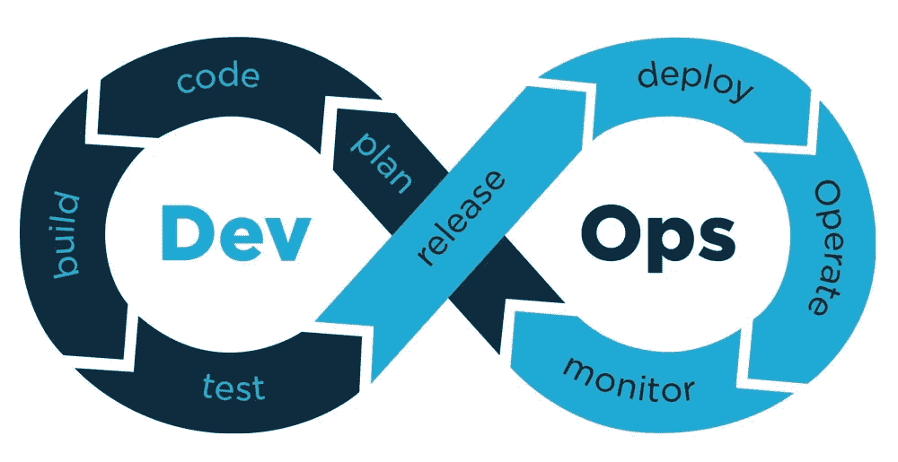
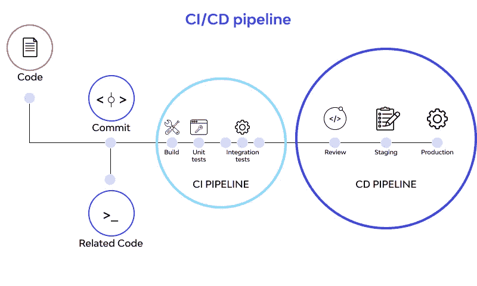

# DevOps、CI/CD 基础知识

> 原文：<https://blog.devgenius.io/devops-ci-cd-basics-b4ae7241e0f3?source=collection_archive---------6----------------------->

DevOps 和阶段 CI/CD 管道的基本概念。

CI/CD 管道的阶段

# DevOps 是什么？

> DevOps 是文化哲学、实践和工具的**组合，提高了组织高速交付应用和服务的能力**:以比使用传统软件开发和基础设施管理流程的组织更快的速度发展和改进产品。

为了衡量与传统 IT 相比的变化，我们使用 **KPI(关键参数指标)**或指标

1.  **速度**:一段时间内的更新次数。
    将更新推向生产的频率如何？这些更新是非常大还是非常小？[DevOps 专注于提供频繁的小型更新，因此故障排除和修复问题将会很容易]
2.  **品质**:生产发料数量。
    实施 DevOps 后，生产问题的数量和严重性降低了吗？如果不是，那么核心自动化需要做一些改变。
3.  **MTTR** (平均恢复时间):停机后恢复所需的时间。
    应用/网站在中断后多快能恢复到运行状态被称为 MTTR。实施 DevOps 后 MTTR 降低了吗？如果是，那么这是一个好迹象。

# DevOps 在解决什么问题？

DevOps 试图通过自动化来提高软件生命周期的效率。并使开发团队和运营团队彼此更加接近，因此软件开发和部署可以快速完成，而不会影响质量和效率。

# 传统 IT vs DevOps？

**传统**:开发团队开发软件，然后测试团队进行测试，并将问题反馈给开发团队，然后开发团队修复问题，这一过程既耗时又低效。一旦问题得到解决，最终软件将由 Ops 团队部署。部署也将花费大量时间，并且容易出错，因为这是由人工完成的。然后，在部署之后，大多数生产问题需要由支持团队来处理。生产问题在数量上也是巨大的，没有自动化解决这些问题是非常低效的。

**DevOps:**
另一方面，DevOps 是一种主动的、自动化的、协作的思维方式，通过自动化的方式将软件交付给最终用户。在 DevOps 的帮助下，大部分时间花在了软件开发上，而不是测试和部署上。此外，通过自动化来减少生产问题的数量，我们可以更快地解决问题，并提供出色的客户体验。

# DevOps 的优势

1.  **交付产品的时间**:在 DevOps 工具的帮助下，不到 30 分钟就可以将完整的软件投入生产，这是传统 It 无法做到的。
2.  **可伸缩性**:由于请求的突然增加或者由于你想要缩减资源的原因，这可以很容易地完成。
3.  **可靠性**:产品的可靠性很高，因为有了自动化，很容易从中断中恢复。例如，如果一些节点关闭，很容易通过 K8s 等工具启动类似的节点来服务请求。
4.  **更好的客户体验，这反过来赢得了客户的信任和收入的增长**:通过自动化和主动措施，大多数生产问题甚至在出现之前就得到解决，因此客户满意度更高，反过来赢得了客户的更多信任，收入也有所增长。
5.  **安全性**:在细粒度控制、配置管理系统等的帮助下，在不损害安全性的情况下快速交付软件。
6.  **发布软件和更新**:在 Devops 中，软件更新经常发布，但更新较小，原因很简单，如果更新后出现问题，开发者可以很容易地查明问题，因为更新非常小。
    **DevOps =频繁的小更新。
    传统 IT =不频繁的大型更新**

# 如何实现 devo PS—CI/CD 管道的阶段

在学习 CI/CD 管道之前，我们需要了解 CI 和 CD。

**CI(持续集成)**
**持续集成**，这是一个面向开发人员的自动化过程。成功的 CI 意味着定期构建、测试应用程序的新代码更改，并将其合并到共享存储库中。这是一个解决同时开发一个应用程序的太多分支可能会相互冲突的问题的方法

**CD(持续交付和/或持续部署)**
**持续交付**通常意味着开发人员对应用程序的更改会被自动进行错误测试并上传到存储库(如 GitHub 或 container registry)，然后由运营团队部署到实际的生产环境中。这是对开发人员和业务团队之间缺乏可见性和沟通的问题的解决方案。为此，持续交付的目的是确保用最少的努力来部署新代码。

**持续部署**(另一个可能的“CD”)可以指将开发人员的变更从存储库自动发布到产品中，在那里客户可以使用它。它解决了运营团队因手动流程减缓应用交付而过载的问题。它通过自动化管道中的下一个阶段，建立在连续交付的好处之上。

# CI/CD 管道的阶段

CI/CD 管道

1.  **计划**:在 Github 项目板和问题等工具的帮助下协调和跟踪工作
2.  **代码**:在这个阶段，代码从开发团队写到 Github 或 Gitlab 进行协作。
3.  **构建**:编译前一阶段编写的代码(例如，包安装、代码运行等)并生成一个构建。此阶段使用的工具有 Jenkins、Travis CI、Circle CI 等..
4.  **部署**:在评审、试运行之后，代码被部署到产品中。(例如，应用程序运行在 EC2 实例或 GCP 计算引擎上。这种部署可以通过构建代码的相同工具来完成。)
5.  **监控和操作**:在这一阶段，监控和记录应用程序，以便于故障排除和解决问题。(使用的工具:Graphana、Splunk 等。现在使用 SaaS 工具。)

# 结论

本博客解释了 DevOps 和 CI/CD 管道的基本术语和概念。