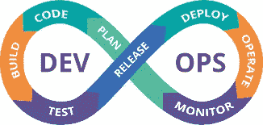
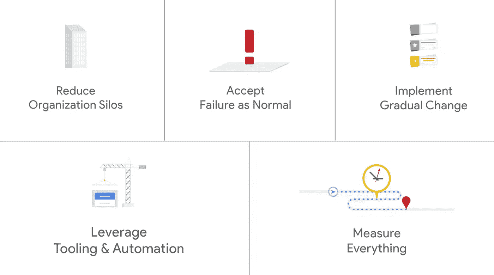

# 面向新工程师的 DevOps

> 原文：<https://blog.devgenius.io/devops-for-new-engineers-e8eb1f5dd7fc?source=collection_archive---------10----------------------->

刚学完编码和理论课程，你可能还没有准备好去听那些对你构建投资组合应用没有帮助的行话。但是要进入劳动力市场，我们才刚刚开始了解一些我们必须知道的皮毛。你会问，公司不仅仅是用少量组件创建单页应用程序？完全没有。因此，当我在构建自己的编码知识库时，我也意识到在一家科技公司高效工作需要惊人的大量知识。

## DEVOPS 为什么存在

让我们跳转到一个最实际的话题: **DevOps** 。你可以看[这个关于这个话题的很棒的教程](https://www.youtube.com/watch?v=uTEL8Ff1Zvk)。我将同时考察《德沃普斯》和《SRE 》,这两个主题相关，但又有足够的不同，值得进行比较分析。根据 [AWS](https://aws.amazon.com/devops/what-is-devops/#:~:text=DevOps%20is%20the%20combination%20of,development%20and%20infrastructure%20management%20processes.) 的说法，“DevOps 是文化哲学、实践和工具的结合，提高了组织高速交付应用和服务的能力。”传统上，**开发人员**为他们的应用程序编写代码，然后将代码交给**操作员**来维护和运行。根据视频教程“DevOps 和 SRE 有什么区别？”“开发者只关心功能和速度，而运营商只关心可靠性。”然而，由于它们是两个不同的系统，在很大程度上彼此独立运行，开发人员在开发结束时将大型应用程序交给操作人员进行测试和运行，因此错误只能在生产流程中被发现。错误代价高昂，生产缓慢。进入 DevOps。

## 简而言之，DEVOPS

根据埃森哲的文章“[打破开发&运营](https://www.accenture.com/us-en/blogs/software-engineering-blog/shinde-development-operations-silos)之间的孤岛”，在新的 DevOps 理念下，“开发和运营团队合作，以最大限度地减少发布软件所涉及的工作和风险。。。]您可以通过确保运营团队不断向开发团队提供关于代码的反馈来引入协作，考虑最终用户来分析影响，并一起解决任何问题，以获得产品的稳定性。”这意味着 DevOps 创建的系统在整个开发过程中集成了故障排除、稳定性和用户体验，而不是具体的开发和维护的前期和后期阶段。这最终简化了流程，减少了公司的时间和金钱成本。

回到我们的视频教程，它将 DevOps 分为五个有用的类别。虽然不同公司的 DevOps 操作看起来可能非常不同，但我们可以看到，DevOps 系统本质上是基于一套旨在提高产品质量、更快发现错误并创建反馈循环以持续改进实践的原则。

## 对 DEVOPS 哲学的深入探究

让我们假装我们不是超级工程师，对所有的术语都有点了解，并探索这些原则。

1.  **减少组织孤岛**:这意味着有意识地在一家公司的不同团队之间创造沟通方式，这些团队通常不容易沟通，因为他们独立运作，使用不同的技术系统。
2.  **接受失败是正常的**:当我们接受人类和计算机都会犯错。所以，与其指指点点，不如专注于纠正错误。
3.  **实施渐进变革**:与其进行大规模的推广，其中的错误可能代价高昂且浪费时间，不如一次实施少量的变革，这样更易于管理、审查和纠正。这为公司节省了时间和金钱。
4.  **利用工具&自动化**:自动化减少了人工工作，有效地减少了错误和成本。其他的[工具](https://www.practitest.com/qa-learningcenter/best-practices/devops-testing-tools/#:~:text=You%20can%20leverage%20DevOps%20tools,building%2C%20testing%2C%20and%20deployment.)可能会提高“工作流程的可视性、团队沟通、故障排除的响应时间以及产品的可靠性和质量。”
5.  **衡量一切**:度量必须用于衡量前四个原则在实践中的效力。

## 结论

DevOps 是公司整合开发和运营系统时遵循的一套总体原则。增加团队之间的交流，接受错误作为过程的一部分，对产品进行小的改变，尽可能地自动化过程，以及不断地测量系统的效率，这些都导致了日益简化的生产。