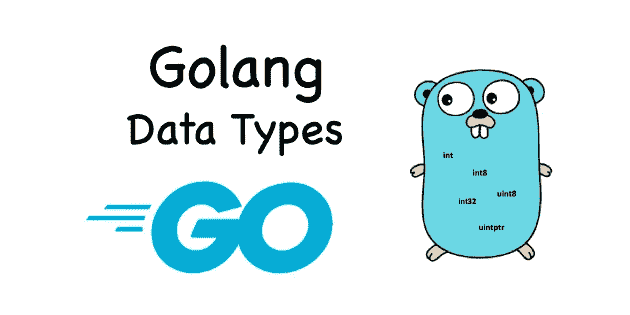
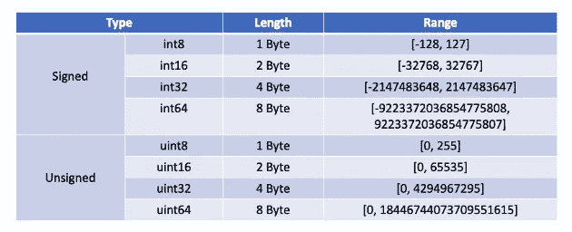
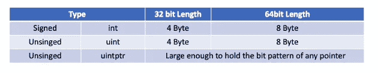

# Go 中的 DevOps 基本数据类型

> 原文：<https://blog.devgenius.io/devops-in-go-basic-data-types-492d69f733ca?source=collection_archive---------2----------------------->

## Go bootcamp 系列中的 DevOps



在我的上一篇文章“ [DevOps in Go — Variables](https://medium.com/geekculture/devops-in-go-variables-42022d5088bc) ”中，我谈到了声明 Go 变量的不同方式，以及为什么 Go 变量应该通过指定变量类型来拥有清晰的内存边界。今天我们来探讨一下 Go 基本数据类型。

# Go 数据类型

Go 数据类型大致可以分为三种:

*   基本数据类型
*   复杂数据类型
*   接口数据类型

基本数据类型是三种类型中最常用的一种。

# 基本数据类型

## Go 整数类型

整数类型主要用于表示现实世界中的整数，如年龄、年份等。分为**平台无关**整型和**平台相关**整型。

平台无关和平台相关的主要区别在于，在不同的 CPU 架构或操作系统下，这些整数类型是否相同。

下表显示了与 Go 平台无关的整数类型:



对于平台相关的整数类型，我们有`int`、`uint`和`uintptr`:



因为`int`、`uint`和`uintptr`都是平台相关的，所以当我们编写需要可移植性的代码时，一定不能依赖这些类型的长度。如果不知道目标操作平台上这三种类型的长度，可以通过 unsafe 包提供的`SizeOf`函数得到。例如，在 x86–64 平台上，它们的长度是 8:

```
var a, b = int(5), uint(6)
var p uintptr = 0x12345678
fmt.Println("signed integer a's length is", unsafe.Sizeof(a)) // 8
fmt.Println("unsigned integer b's length is", unsafe.Sizeof(b)) // 8
fmt.Println("uintptr's length is", unsafe.Sizeof(p)) // 8
```

**整数数字文字**

Go 继承了 C 编程语言在数字文字(number literal)上的语法形式。早期版本支持十进制、八进制和十六进制数字文字形式，例如:

```
a := 53        // Decimal
b := 0700      // Octal，"0" prefix
c1 := 0xaabbcc // Hex，"0x" prefix
c2 := 0Xddeeff // Hex，"0X" prefix
```

在 Go v1.13 版之后，它增加了以下内容:

```
d1 := 0b10000001 // binary，"0b" prefix
d2 := 0B10000001 // binary，"0B" prefix
e1 := 0o700      // Octal，"0o" prefix
e2 := 0O700      // Octal，"0O" prefixa := 5_3_7          // Decimal: 537
b := 0b_1000_0111   // Binary 10000111 
c1 := 0_700         // Octal: 0700
c2 := 0o_700        // Octal: 0700
d1 := 0x_5c_6d      // Hex：0x5c6d
```

你也可以使用`fmt`包将整数转换成不同的格式输出:

```
var a int8 = 59
fmt.Printf("%b\n", a) // binary：111011
fmt.Printf("%d\n", a) // decimal：59
fmt.Printf("%o\n", a) // octal：73
fmt.Printf("%O\n", a) // octal with 0o prefix：0o73
fmt.Printf("%x\n", a) // Hex：3b
fmt.Printf("%X\n", a) // Hex：3B
```

## 浮点

与整数类型相比，浮点类型的使用场景相对集中，主要在科学数值计算、图形图像处理与仿真、多媒体游戏、人工智能等领域。

**浮动 32 vs 浮动 64**

Go 提供了两种浮点类型`float32`和`float64`，分别对应于 **IEEE 754** 中的单精度和双精度浮点数值类型。

不过这里需要注意的是，Go 语言中并没有提供`float`类型。这不像整数类型。Go 既提供了`int16`、`int32`等类型，也提供了 int 类型。换句话说，Go 提供的浮点类型是**平台无关的**。

无论是`float32`还是`float64`，它们变量的默认值都是 0.0。区别在于它们占用的内存空间，以及浮点数的范围/精度。

`float`到`binary`的对话比较复杂，这里不赘述，不过有兴趣的可以参考“ [IEEE-754 浮点转换器](https://www.h-schmidt.net/FloatConverter/IEEE754.html)”。

同样，为了方便起见，您可以只使用`fmt`包。

```
func main() {
    var f float32 = 139.8125
    bits := math.Float32bits(f)
    fmt.Printf("%b\n", bits)
}Output:
```

```
1000011000010111101000000000000
```

**浮点数字面**

Go 浮点型文字值大致可以分为两类，一类是浮点值形式:

```
3.1415
.15
81.80
82.
```

另一种是科学符号形式:

```
6674.28e-2 // 6674.28 * 10^(-2) = 66.742800
.12345E+5  // 0.12345 * 10^5 = 12345.000000
```

与`int`一样，`fmt`包也提供浮点输出:

```
var f float64 = 123.45678
fmt.Printf("%f\n", f) // 123.456780fmt.Printf("%e\n", f) // 1.234568e+02
fmt.Printf("%x\n", f) // 0x1.edd3be22e5de1p+06
```

## 复杂数据类型

`z=a+bi`形式的数字称为复数。Go 语言本身支持复数类型。但相比整数和浮点类型，复数类型在 Go 中的应用更加有限，主要用于专业领域的计算，比如向量计算。

Go 提供了两种复数:`complex64`和`complex128`。如果一个复数没有显示分配的类型，那么它的默认类型是`complex128`。

在围棋中有三种表示复数的方法:

*   直接初始化一个复数变量:

```
var c = 5 + 6i
var d = 0o123 + .12345E+5i // 83+12345i
```

*   使用`complext`功能

```
var c = complex(5, 6) // 5 + 6i
var d = complex(0o123, .12345E+5) // 83+12345i
```

*   使用`real`和`imag`:

```
var c = complex(5, 6) // 5 + 6i
r := real(c) // 5.000000
i := imag(c) // 6.000000
```