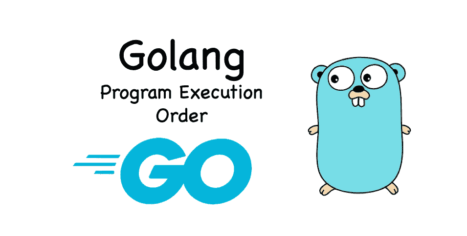
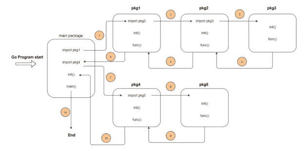

# Go 中的 DevOps 程序执行顺序

> 原文：<https://blog.devgenius.io/devops-in-go-program-execution-order-1329f4617aba?source=collection_archive---------2----------------------->

## Go bootcamp 系列中的 DevOps



通常在一个 Go 程序中有多个 Go 包，执行顺序在这些包之间切换。像 Python(和其他编程语言)一样，Go 也有自己的入口函数:`main`函数。

在本文中，我们将通过`main`函数并逐步展开，帮助您理解 go 程序的执行顺序。

# 主要功能

Go 语言中有一个特殊的函数:主包中的`main`函数，它是用户级的入口函数。Go 程序的执行逻辑将在该函数中根据其调用顺序展开。

让我们看一个例子:

```
package main
​
func main() {
    // User logic
    ... ...
}
```

可以看到函数原型非常简单，没有参数，没有返回值。而且 Go 语言**要求**可执行程序的主包必须定义`main`函数，否则 Go 编译器会报错。

另外值得一提的是，除了`main`包，其他包也可以有自己的函数或方法，命名为`main`。但是根据 Go 的可见性规则(以小写字母开头的标识符是非导出的标识符)，非 main 包中的自定义 main 函数仅限于在包中使用。以下代码片段来自非主包:

```
package pkga

import "fmt"
​
func Main() {
    main()
}
​
func main() {
    fmt.Println("main func for pkga")
}
```

上述`pkga`中定义的`main()`只能在`pkga`包中看到。

# 初始化功能

尽管`main`函数是用户级入口函数，但它不是第一个被执行的函数。Go 还有一个特殊功能叫做`init`，在`main`之前运行。例如:

```
func init() {
    // Package initialization
    ....
}
```

如果`main`包所依赖的包中定义了`init`函数，或者`main`包本身定义了 init 函数，那么 Go 程序会在包初始化时自动调用`init`函数。

有一点要注意的是，`main`函数会自动为你调用`init`，而你实际上不能直接调用`init`函数，否则会得到如下编译错误:

```
./main.go:10:2: undefined: init
```

事实上，一个 Go 包可以有不止一个`init`函数。所以在初始化 Go 包的时候，Go 会按照一定的顺序逐个调用这个包的`init`函数。一般来说，传递给 Go 编译器的源文件中的`init`函数会先执行；并且同一个源文件中的多个`init`函数会按照声明的顺序执行。

例如，如果我们有以下项目结构:

```
../testinit
├── go.mod
├── main.go
├── pkga
│   └── a.go
└── pkgb
    └── b.go2 directories, 4 files
```

还有`main.go`、`a.go`、`b.go`的样子:

```
main.go
============
package main

import (
 "fmt"
    _ "github.com/tonylixu/testinit/pkga"
    _ "github.com/tonylixu/testinit/pkgb"
)

func init() {
    fmt.Println("main init")
}

func main() {
    fmt.Println("Running main func")
}

a.go
=========
package pkgaimport "fmt"

func init() {
    fmt.Println("In package a")
}

func main() {
}

b.go
=========
package pkgbimport "fmt"

func init() {
    fmt.Println("In package b")
}

func main() {
}
```

输出将是:

```
$ go run main.go
In package a
In package b
main init
Running main func
```

## init —复杂的包级变量初始化

一些包级变量需要更复杂的初始化过程。有时，使用其类型零值(每个 Go 类型都有一个零值定义)或简单的初始化表达式无法满足业务逻辑需求，而`init`函数非常**适合**这项工作，在标准库`http`包中有这样一个典型的例子:

```
var (
    http2VerboseLogs    bool // Default false
    http2logFrameWrites bool // Default false
    http2logFrameReads  bool // Default false
    http2inTests        bool // Default false
)

func init() {
    e := os.Getenv("GODEBUG")
    if strings.Contains(e, "http2debug=1") {
        http2VerboseLogs = true // Reset http2VerboseLogs
    }
    if strings.Contains(e, "http2debug=2") {
        http2VerboseLogs = true // Reset http2VerboseLogs
        http2logFrameWrites = true // Reset http2VerboseLogs
        http2logFrameReads = true // Reset http2VerboseLogs
    }
}
```

我们可以看到标准库`http`包定义了一系列布尔特性开关变量，默认关闭(即值为 false)，但是我们可以通过 **GODEBUG** 环境变量的值开启相关特性开关。

所以在`http`包的`init`函数中，这些包级开关变量的复杂初始化是根据环境变量 **GODEBUG** 的值进行的。这保证了这些开关变量在 http 包初始化后可以处于合理的状态。

## 初始化—注册模式

让我们看看下面的例子:

```
import (
    "database/sql"
    _ "github.com/lib/pq"
)

func main() {
    db, err := sql.Open("postgres", "user=pqgotest dbname=pqgotest sslmode=verify-full")
    if err != nil {
        log.Fatal(err)
    }

    age := 21
    rows, err := db.Query("SELECT name FROM users WHERE age = $1", age)
    ...
}
```

事实上，这是一段“神奇”的代码。可以看到`lib/pq`包作为空导入导入。main 函数不使用`pq`包的任何变量、函数或方法，但它能够访问 PostgreSQL 数据库。而这一切的奥秘就在于`pq`包的`init`功能:

```
func init() {
    sql.Register("postgres", &Driver{})
}
```

即使`lib/pq`是一个空导入，但它的`init`功能仍然被执行。这种在`init`函数中注册自己实现的模式，有效地减少了 Go 包的直接暴露，尤其是包级变量的暴露，从而避免了外部通过包级变量对包状态的改变。

# 转到包初始化顺序

下图显示了 Go 包的初始化顺序:



我们可以用以下三个要点来总结这一顺序:

*   依赖包按照“深度优先”的顺序初始化；
*   每个包按照“常量->变量->初始化函数”的顺序初始化；
*   包中的多个 init 函数按照出现的顺序自动调用。