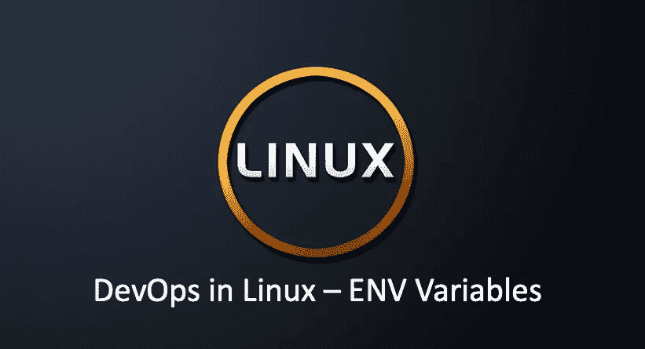

# Linux 中的 DevOps 环境变量

> 原文：<https://blog.devgenius.io/devops-in-linux-environment-variables-e1c38bda19fe?source=collection_archive---------1----------------------->

## Linux 环境变量用法概述



Linux 是一个多用户操作系统。多用户是指每个用户登录系统后都有自己专用的操作环境。而这个环境是由一组变量定义的，称为**环境变量**。用户可以修改自己的环境变量来满足环境的要求。

# 环境变量显示

您可以使用命令`env`或`printenv`显示当前定义的环境变量，例如:

```
$ env (or printenv)
XDG_SESSION_ID=3092
HOSTNAME=xxxx
NVM_CD_FLAGS=
TERM=xterm-256color
SHELL=/bin/bash
HISTSIZE=1000
SSH_CLIENT=xxxx 49967 22
SSH_TTY=/dev/pts/0
NVM_DIR=/mnt/efs/data/home/txu/.nvm
USER=txu
MAIL=/var/spool/mail/txu
...
LC_CTYPE=en_US.UTF-8
LESSOPEN=||/usr/bin/lesspipe.sh %s
```

要显示一个特定的`ENV`变量，可以使用`echo`命令:

```
$ echo $HOME
/mnt/data/home/txu
```

# 设置/取消设置新的环境变量

要设置一个新的环境变量，可以使用`export`命令:

```
$ echo $VERSION

$ export VERSION=1.0.0
$ echo $VERSION
1.0.0
```

要删除/移除现有的环境变量，使用`unset`命令

```
$ echo $VERSION
1.0.0
$ unset VERSION
$ echo $VERSION
```

您也可以设置/取消设置多个变量:

```
$ export VERSION=1.0.0 VERSION2=2.0.0
$ unset VERSION VERSION2
```

您也可以设置“只读”变量:

```
$ export VERSION=1.0.0
$ echo $VERSION
1.0.0
$ export VERSION=2.0.0
$ echo $VERSION
2.0.0
$ readonly VERSION
$ export VERSION=3.0.0
-bash: VERSION: readonly variable
```

# 设置持久环境变量

## 所有用户

为了使 ENV 变量对所有用户都是持久的，您可以利用`/etc/profile`文件。该文件用于在用户 shells 上设置系统范围的环境变量。变量有时与。bash_profile，但是这个文件用于为系统的所有 shell 用户设置初始路径或 PS1。例如:

```
export CLASSPATH=./JAVA_HOME/lib:$JAVA_HOME/jre/lib
```

添加完成后，新的环境变量不会立即生效，需要运行 source /etc/profile 才能立即生效，否则只有下次以用户身份重新登录时才会生效。

注意，除非你知道你在做什么，否则改变这个文件不是一个好主意。最好在/etc/profile.d/中创建一个 custom.sh shell 脚本来对您的环境进行定制更改，因为这将避免在将来的更新中进行合并。

## 单一用户

为单个用户设置特定的 ENV 变量，可以修改用户主目录中的`.bash_profile`文件，这是一个可以被`ll -a`viwed 的隐藏文件:

```
$ cd ~
$ ll -a .bash_profile
-rw-r--r-- 1 tony tony 193 Sep 22  2021 .bash_profile
```

## bash_profile vs bashrc

首先，我们来了解一下不同概要文件的调用顺序。当用户作为交互式登录 shell 登录时，Bash 会查找/etc/profile 文件，如果该文件存在，它会运行文件中列出的命令。然后 Bash 搜索~/。bash_profile，~/。bash_login 和~/。配置文件，并从找到的第一个可读文件开始执行命令。

当 Bash 作为交互式非登录 shell 被调用时，它从~/中读取并执行命令。bashrc，如果该文件存在，并且是可读的。

因此，基于上述事实，当 Bash 作为交互式登录 shell 被调用时，`.bash_profile`被读取并执行，而对于交互式非登录 shell，`.bashrc`被执行:

*   `.bash_profile`:用于只应运行一次的命令，如自定义 PATH 环境变量。
*   `.bashrc`:对于每次新 shell 启动时应该运行的命令，这里是`aliases`、`functions`、`custom prompts`和历史定制的地方。

# 常见环境变量

## 小路

```
$ echo $PATH
/usr/local/sbin:/usr/local/bin:/usr/sbin:/usr/bin:/root/bin
```

路径由冒号分隔，是可执行程序所在的目录列表。当你输入一个命令时，shell 会首先检查这个命令是否是系统内部的命令，如果不是，它会检查这个命令是否是一个应用程序，shell 会尝试从路径中找到这些应用程序。

如果 shell 在这些路径目录中找不到可执行文件，就会报错；如果找到，系统将调用并执行该应用程序。通过设置路径，我们运行程序或命令更加方便。

要将目录路径添加到 path，您可以编写:

```
$ pwd
/root/docker/httpd
$ export PATH=$PATH:$PWD
$ echo $PATH
/usr/local/sbin:/usr/local/bin:/usr/sbin:/usr/bin:/root/bin:/root/docker/httpd
```

## 家

当用户登录到 Linux 系统时，用户的主工作目录是默认目录。

```
$ whoami
tony
$ echo $HOME
/home/tony
```

## 历史尺寸

保存历史命令的数量。我们输入的命令会被系统保存，这个环境变量记录了要保存的命令数量。一般 1000。

```
$ echo $HISTSIZE
1000
$ HISTSIZE=1001
$ echo $HISTSIZE
1001
```

历史命令保存在内存中。当您退出或登录到 shell 时，它们将被自动保存或读取。我们可以通过历史命令查看它们。您可以使用符号`!`来执行具有指定序列号的历史命令。例如，要执行 1nd history 命令，输入`!1`。

```
$ history
...
 1000  env | grep VERSION
 1001  cd ~
 1002  ll -a .bash_profile
 1003  cat ~/.bash_profile
 1004  history
 1005  env

$ !1002
ll -a .bash_profile
-rw-r--r-- 1 tony tony 193 Sep 22  2021 .bash_profile
```

## 日志名

当前用户登录名。

```
$ echo $LOGNAME
txu
```

## 主机名

主机名。

```
$ echo $HOSTNAME
cloud-dev.test.com
```

## 壳

当前用户使用的外壳类型。

```
$ echo $SHELL
/bin/bash
```