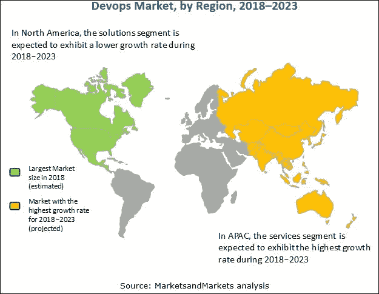
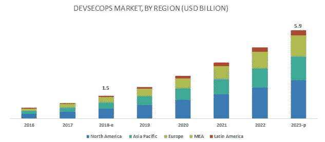

# DevOps 对 2022 年的预测:主要趋势

> 原文：<https://blog.devgenius.io/devops-predictions-for-2022-key-trends-2a8d01c9a41c?source=collection_archive---------13----------------------->

随着企业走上数字化转型之路，DevOps 变得比以往任何时候都更加重要。它已经成为当前 It 公司填补开发团队和运营团队之间的空白的时代呼唤。除了鼓励协作文化，DevOps 还促进了快速可靠的软件交付，提高了客户满意度，加快了上市时间，等等。考虑到这样的服务，DevOps 实践对大多数企业来说已经变得至关重要，并且随着时间的推移，它的名气越来越大。 [**市场和市场**](https://www.marketsandmarkets.com/Market-Reports/devops-824.html) 报告称，到 2023 年，DevOps 市场规模可能从 2017 年的 29.0 亿美元攀升至 103.1 亿美元。

随着业务场景的变化和新技术的高速发展，DevOps 也在不断发展以适应不断变化的需求。让我们来看一看 2021 年 DevOps 的一些发展趋势，这些趋势有望在未来重塑商业格局。

【2022 年及以后的新兴开发运维趋势

**1。Kubernetes 与 DevOps 的结合**

影响 DevOps 的关键基础设施趋势是全球科技公司越来越多地采用 Kubernetes。它已经成为组织管理软件交付的合适选择。借助 [Kubernetes](https://kubernetes.io/) ，软件开发人员可以轻松地与 IT 运营团队实时共享各种应用和软件。通过选择 Kubernetes 工作流，生产力得到了提高，因为它简化了 DevOps 中的构建、测试和部署管道。

集装箱管理系统和 Kubernetes 还可以减少人类互动的必要性，并促进全自动的“NoOps”场景。其管道架构方法使开发人员更容易使用 ML 和 AI 工具来检查、预测和自动化记录和工作流程。

在这个行业中，各种各样的供应商都很高兴能够扩大对 Kubernetes 的支持。领先的软件提供商如 RedHat 和 VMWare 已经支持 Kubernetes。最常见的原因是它有能力通过以容器为中心的微服务来改革基于云的应用。随着 Kubernetes 继续在 DevOps 领域占据优势，2021 年可能是支持它的工具的绝佳年份。

**2。云原生技术的大规模崛起**

云原生堆栈，也称为新堆栈，是用于构建和运行应用程序的云托管解决方案的现代范例。这种最新技术的采用可以带来更大程度的改进、进步和创新。与云托管服务不同，它们是可配置的、独立于基础设施的，并且在某些情况下非常安全。

云原生通常指基于容器的系统。这项创新技术支持平台构建包含容器服务的应用程序。它们作为微服务的一部分进行部署，在容器中运行，并使用敏捷和 DevOps 方法进行管理。cloud-native 的最终目标是提高服务组装的速度和效率，允许业务对市场变化做出快速反应。大多数 IT 公司都选择这种基于微服务等各种方法的技术。

随着网飞利用云技术取得的巨大成功，一些商业平台正在将其服务/解决方案转移到云原生技术。

IDC future escape:world wide Developer and devo PS 2021 Predictions 报告称，到 2021 年底，80%的公司将建立一种机制，以两倍于疫情之前的速度迁移到以云为中心的应用和基础设施。

**3。人工智能驱动和人工智能驱动方法的名声**

人工智能和机器学习在技术领域没有留下任何未被触及的东西。DevOps 并没有落后——这一技术程序吸收了许多人工智能和人工智能方法来寻找最佳结果。人工智能可以改变团队开发、交付、部署和组织应用的方式，从而无需太多努力就能提高他们的绩效。

人工智能和机器学习的应用为企业带来了真正的回报，使 IT 运营更加灵敏。他们可以提高团队的生产力，并在填补人类和大数据之间的差距方面发挥有影响力的作用。人工智能现在已经成为 DevOps 中辅助决策过程的宝贵资产。像 AIOps、DataOps 这样的最新术语也正在成为现实，它们的重要性在下一年将会增加。

**4。高要求的基础设施作为代码(IaC)**

IaC(作为代码的基础设施)不仅仅是自动化，在 DevOps 中也变得至关重要。它更像是通过配置文件管理云中的整个 It 基础设施。最重要的是，它确保了连续性，因为所有环境都是自动调配和配置的，没有人为错误。

IaC 的一些关键优势包括更容易的云原生采用、越来越短暂的架构、可追溯性、部署类似配置的恒定性，以及在整个软件开发周期中更高的效率。使用基础设施作为代码，甚至可以将过程反转到“最后一次工作的配置”。随着越来越多的团队意识到这些好处，IaC 将在 2021 年和不久的将来继续成为标准和突出的 DevOps 方面。

**5。GitOps 越来越多的采用**

gi tops——devo PS 工作流的新成员提供了一种自动化和控制基础设施的方法。*“GitOps 的关键功能之一是让一组系统更改得到正确应用，然后得到验证，”Weavework 的首席执行官兼创始人 Alexis Richardson 说。”*

它使用了一些团队使用的类似的 DevOps 最佳实践，比如代码审查、版本控制和 CI/CD 管道。借助 GitOps，团队可以毫不费力地自动化基础设施配置流程。声明文件可以很容易地存储在 Git 存储库中，就像我们存储应用程序开发代码一样。因此，它减少了停机时间，使部署更加可靠和快速。实现 GitOps 的团队可以对服务器基础设施、应用甚至 Kubernetes 集群使用类似的范例。

鉴于多云、混合和边缘应用部署的复杂性，像 MS Azure 和 Amazon AWS 这样的领先企业已经表示支持这种模式。

**6。采用 DevSecOps 的热潮**

安全性仍将是各种规模的公司的主要关注点，因此毫不奇怪，2021 年 DevSecOps 的采用将比以往任何时候都多。DevSecOps 从第一天起就为传统的 DevOps 实践增加了强大的安全手段。开发+安全+运营的结合，称为 DevSecOps，保证了每个开发生命周期层中严密的网络安全协议。

DevSecOps 产品可以很容易地与标准 CI/CD 测试工具相结合。因此，企业可以注意到显著的网络安全改进和整体 IT 效率。通过以 DevSecOps 为中心的方法，开发人员可以确保将安全性注入到每个开发生命周期层，从而能够快速检测和缓解任何威胁。简而言之，安全性将不再是 DevOps 管道中的第二个考虑因素。

统计数据怎么说？

根据 DevSecOps 全球预测的 [**市场和市场**](https://www.marketsandmarkets.com/Market-Reports/devsecops-market-122458587.html) 声明，DevSecOps 市场规模有可能从 2018 年的 15 亿美元增长到 2023 年的 59 亿美元。

**包装完毕！！**

总的来说，采用 DevOps 确实是对您未来业务增长的一项有价值的投资。最近的一项研究表明，将 DevOps 实践纳入其开发生命周期的领先组织在软件部署质量方面获得了 63%的提升。

及时拥抱这些最新趋势，让您的企业在科技世界中保持竞争力。