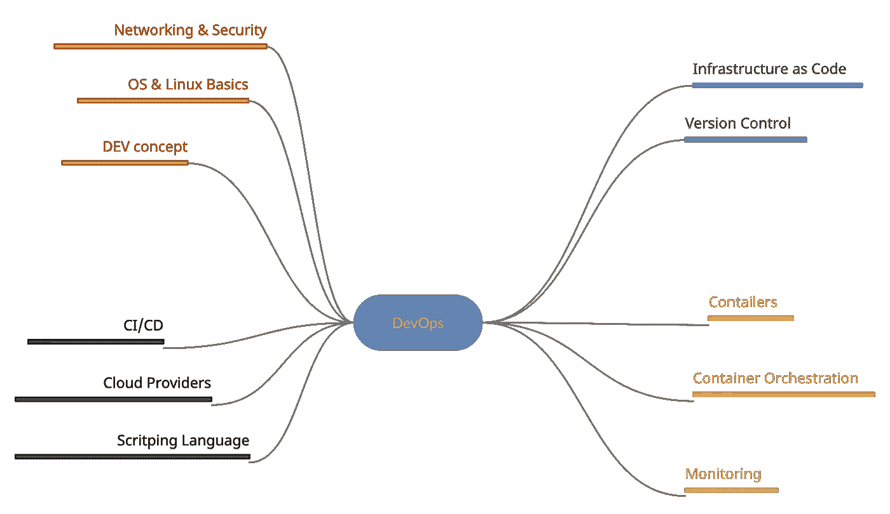
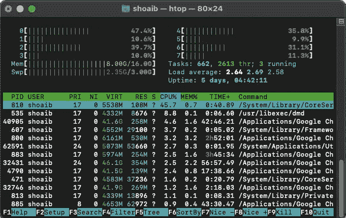
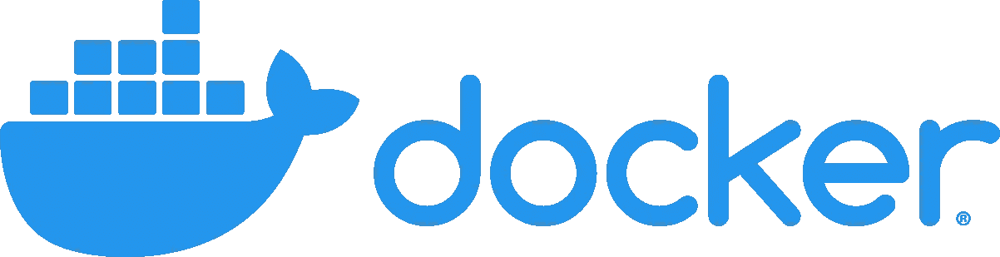
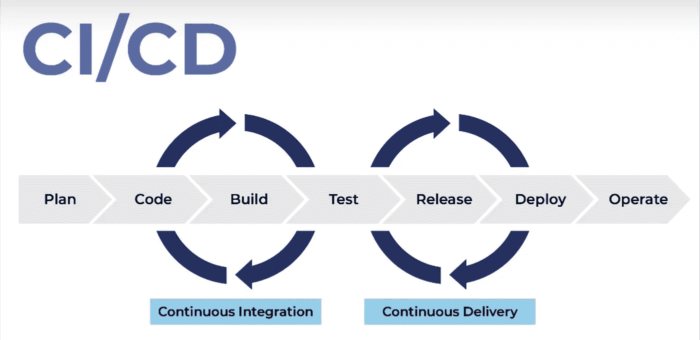
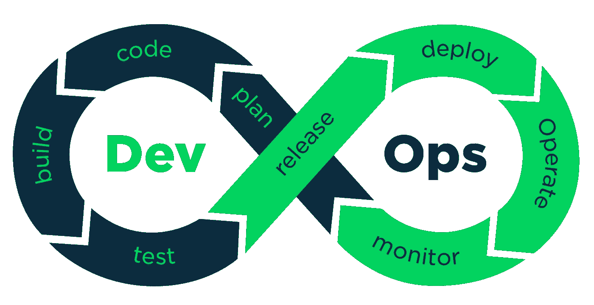
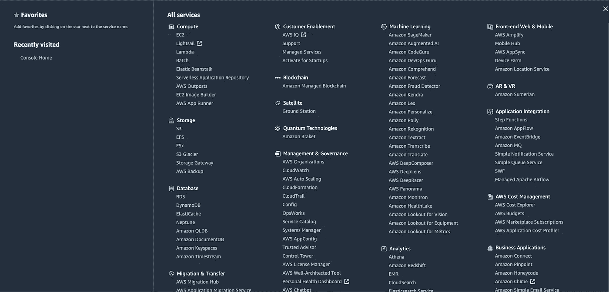
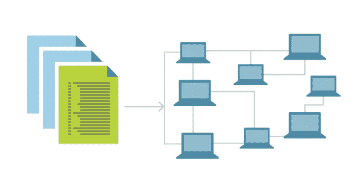
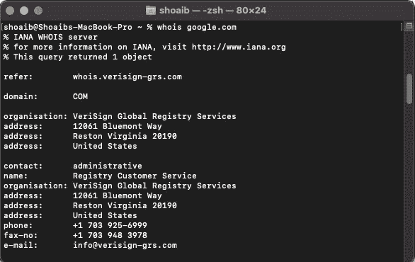

# 完整的开发运维工程师路线图 2021

> 原文：<https://blog.devgenius.io/devops-roadmap-2021-c9d77482804f?source=collection_archive---------0----------------------->

## 成为一名有正确指导方针的 DevOps 工程师

图片来源:作者

假设我们有开发人员正在创建一个新的应用程序。一方面，我们有被管理和配置来运行该应用程序的服务器。开发运维团队负责向最终用户提供这些信息。

在本文中，我们将了解成为 DevOps 工程师需要学习哪些工具。

# DevOps 基础

首先，您需要理解创建应用程序时有两个主要部分

**1。开发部分**

*   应用开发
*   测试应用程序

**2。操作部分**

*   应用程序的部署
*   在服务器上维护

DevOps 是两者之间的纽带。现在，这有点太抽象了，所以让我们深入细节，以真正理解 DevOps 任务以及执行这些任务需要哪些工具。

# 开发过程你应该知道。

这一切都始于应用。开发团队将使用任何技术堆栈、不同的编程语言、构建工具等来编写应用程序。他们有一个代码库，可以在团队中处理代码。现在最流行的一个是 git。作为一名 DevOps 工程师，你不需要编写应用程序，但是你需要理解开发人员如何工作的概念。他们正在使用哪个 git 工作流，以及应用程序如何配置为与其他服务或数据库对话。以及自动化测试的概念等等。以下是关键点

*   **开发者如何工作**
*   **哪个 git 工作流程**
*   **如何配置应用程序**
*   **自动化测试的概念**

# 操作系统和 Linux 基础知识

现在，应用程序需要部署在服务器上。以便最终用户可以访问它。这就是我们开发它的原因，所以我们需要某种基础设施本地服务器或云服务器。需要创建和配置这些服务器来运行我们的应用程序。

图片来源:作者

同样，作为 DevOps 工程师，您可能负责准备运行应用程序的基础设施。因为大多数运行应用程序的服务器都是 Linux 服务器，所以您需要 Linux 的知识。如果您习惯使用命令行界面，这会有所帮助。因为您将使用命令行界面在服务器上完成大部分工作。因此，了解基本的 Linux 命令，在服务器上安装不同的工具和软件，了解如何管理服务器的 Linux 文件系统基础，SSH 到服务器，等等。

*   Linux 基础知识
*   轻松使用 CLI
*   Shell 命令
*   Linux 文件系统
*   服务器管理

# 网络和安全性

您还需要了解网络和安全的基础知识。例如，要配置防火墙，保护应用程序，并打开一些端口以使应用程序可以从外部访问，您需要了解这些内容。

*   防火墙，代理服务
*   负载平衡器
*   HTTPS 网站
*   端口、IP、DNS 名称解析

# 开发运维与 IT 运营

要在它的操作和 DevOps 之间划清界限，你不一定要有高级的超级操作系统或者网络和安全技能。此外，能够从头到尾管理服务器；有自己的职业，如网络和系统管理员安全工程师。他们真的专攻其中一个领域。您的工作是理解这些概念，以便您可以准备服务器来运行您的应用程序。

## 你在这里的职责是

*   基本系统管理工作
*   基本网络管理
*   基本安全管理

# 码头集装箱

如今，集装箱已经成为新的标准。

[图像来源](https://trends.google.com/trends/explore?date=all&geo=DE&q=%2Fm%2F0wkcjgj)

您需要从总体上理解虚拟化和容器的概念。您还应该知道如何管理服务器上的容器化应用程序。docker 是当今最流行的容器技术之一。你应该对此有所了解。

# 自动化和 CI/CD 简介

CI/CD 是所有大型项目的必备。手动操作速度较慢，而且日常管理也很麻烦。CI/CD 帮助我们做事。

*   高效的
*   快的
*   自动化的

> **持续集成** ( **CI** )帮助开发人员更频繁地将他们的代码变更合并回一个共享分支，或者“主干”，有时甚至是每天。

# 构建自动化和 CI/CD

首先，当特性或错误修复完成后，我们需要运行测试。然后将应用程序打包成 jar 文件或 zip 等构件。这样我们就可以部署它，这就是构建工具和包管理器工具的用武之地。先进的公司正在采用集装箱作为新的标准。

**CI/CD 需要知道这些东西**

*   构建工具和包管理器
*   工件储存库
*   构建自动化

# Docker & DevOps 公司

[图像来源](https://www.docker.com/)

您可能会从您的应用程序中构建 Docker 图像。这个图像必须保存在图像库中的某个地方。这里将使用 nexus 或 Docker-hub 或任何其他上的 docker 工件库。因此，您需要了解如何创建和管理工件存储库。

当然，您不希望手动执行这些操作。您需要一个管道在连续的步骤中完成所有这些。所以如果你建立自动化会有所帮助。Jenkins 是最流行的构建自动化工具之一。

您需要将这个管道与 git 存储库连接起来以获取代码。这是持续集成过程的一部分。

当在部署服务器上不断地部署代码变更时，可能会有一些额外的步骤。向团队发送关于管道状态的通知或处理失败的部署在这里也是可能的。

[图像来源](https://www.youtube.com/watch?v=9pZ2xmsSDdo&ab_channel=TechWorldwithNana)

这个流程代表了 ci/cd 管道的核心，而 CI/CD 管道恰好是 DevOps 任务和职责的核心。作为一名 DevOps 工程师，您应该能够为您的应用配置完整的 CI/CD 管道，并且该管道应该是连续的。这就是为什么 DevOps 的非官方 logo 是无限循环，因为应用改进是无限的。需要部署的新功能和错误修复一直在增加。

[图片来源](https://devopedia.org/devops)

# 云提供商

现在让我们回到应用程序运行的基础设施。如今，许多公司正在使用云上的虚拟基础架构，而不是创建和管理他们的物理基础架构。这些是一些基础架构即服务平台。

*   自动警报系统
*   谷歌云
*   微软 azure

一个明显的原因是通过建立基础设施来节省成本。这些平台还管理许多东西，例如

*   负载平衡器
*   支持
*   使聚集
*   安全性和更多

**你可以在这里使用 UI 管理的东西**

*   创建您的网络配置
*   防火墙
*   路由表
*   基础设施的所有部分

您需要学习它们来管理那里的基础设施，所以如果您的应用程序运行在 AWS 上，您需要学习 AWS 及其服务。AWS 相当复杂。如此多的功能

[图像来源](https://aws.amazon.com/)

你不必了解它提供的所有服务。你需要知道那些你需要的概念和服务。

# 容器编排

我们的应用程序将作为容器运行，因为我们正在构建 docker 图像。容器需要管理。对于较小的应用程序，docker-compose 或 docker-swarm 足以管理它们。如果你有更多的容器，比如大型微服务，你需要一个更强大的容器编排工具来完成这项工作。Kubernetesmost 是最受欢迎的。

[图像来源](https://kubernetes.io/)

您需要了解 Kubernetes 是如何工作的，并且能够管理集群以在其中部署应用程序

# 监视

克里斯·利维拉尼在 [Unsplash](https://unsplash.com?utm_source=medium&utm_medium=referral) 上拍摄的照片

当您在 Kubernetes 的数百台服务器上运行数千个容器时，您如何跟踪单个应用程序的性能？您如何实时知道您的用户是否遇到了任何问题？作为 DevOps 工程师你的职责之一。你需要知道一个监控工具，比如

*   普罗米修斯
*   纳吉奥斯

# 基础设施作为代码

在您的项目中，您将需要开发和测试或试运行环境。在将应用程序部署到生产环境之前，对其进行适当的测试。

[图像来源](https://devblogs.microsoft.com/devops/infrastructure-as-code-azure-python-wpulumi/)

如果您多次拥有同一个部署环境，创建和维护它会很有帮助。但这并不容易，因为

*   耗时的
*   易出错的

所以我们不想手动多次。我们希望尽可能自动化。我们如何自动化这个过程？

*   **创建基础设施**
*   **配置运行您的应用**
*   **在**部署您的应用程序

可以使用两种类型的基础设施的组合作为代码工具来配置基础设施

**1。基础设施供应工具**

*   将（行星）地球化（以适合人类居住）

**2。配置管理工具**

*   ANSIBLE
*   厨师
*   木偶

作为一个 DevOps 工程师，你应该知道这些工具中的一个，让你自己的工作更有效率，所以你的系统给了你这些优势。

*   更有效率
*   透明的
*   易于复制
*   易于恢复

# 脚本语言

更多的自动化可能需要编写脚本。如果你懂脚本语言，会有很多好处。你可以用脚本语言做的是

*   备份
*   系统监控任务
*   克朗·乔布斯
*   网络管理

图片来源:作者

这里有一篇文章可以让你了解 cronjob 的基本知识。

 [## 如何使用 Cron 作业调度任务

### cronjob 初学者指南

javascript.plainenglish.io](https://javascript.plainenglish.io/how-to-schedule-tasks-with-cron-job-e17039863e5b) 

要做到这一点，您需要了解一种脚本语言。这里有两个选项供你选择。

**1。操作系统专用脚本语言**

*   尝试
*   Powershell

**2。更多的人要求一种更强大、更灵活的语言**

*   计算机编程语言
*   红宝石
*   戈朗

毫无疑问，学习这些语言中的一种。Python 是当今 DevOps 领域最受欢迎和最受欢迎的语言。

## 为什么是 Python？

*   简单易学
*   易于阅读
*   流行的
*   非常灵活
*   这么多图书馆

Python 为大多数数据库操作系统任务以及不同的云平台提供了库。

# 版本控制

有了这些自动化工具和语言，您可以像代码一样编写所有的自动化逻辑

*   创造
*   管理的
*   配置基础设施

照片由[扬西·敏](https://unsplash.com/@yancymin?utm_source=medium&utm_medium=referral)在 [Unsplash](https://unsplash.com?utm_source=medium&utm_medium=referral) 上拍摄

这就是为什么基础设施被称为代码。你如何像管理应用程序代码一样管理你的代码？您也可以使用 git 这样的版本控制来管理它。作为 DevOps 工程师，还需要学习 git。

# 结束语

此时，您可能会想，我需要学习多少这样的工具？我需要在每个类别中学习多种工具吗？应该学哪些？因为他们太多了。只需关注以下两点。

*   每个类别都有一个工具，最受欢迎的一个
*   使用最广泛/最流行的一种

因为一旦你理解了这些概念。基于这些知识并使用替代工具会容易得多。

**感谢您的阅读。祝您愉快！**

**参考:**[https://docs.aws.amazon.com/](https://docs.aws.amazon.com/)

**参考:**https://bit.ly/34avwTC

**参考:**[https://www.jenkins.io/doc/](https://www.jenkins.io/doc/)

**参考:**[https://bit.ly/3ugxXhQ](https://bit.ly/3ugxXhQ)

**参考:**https://bit.ly/3yr1w3A