# DevOps—使用 Jenkins CI/CD 管道进行软件质量控制

> 原文：<https://blog.devgenius.io/devops-software-quality-control-using-jenkins-ci-cd-pipeline-373ade18d738?source=collection_archive---------2----------------------->

## Java 技术软件质量保证的基本技巧


乔尔·富尔亨西奥在 [Unsplash](https://unsplash.com/s/photos/stair?utm_source=unsplash&utm_medium=referral&utm_content=creditCopyText) 上拍摄的照片

作为应用程序代码开发的一部分，构建自动化单元测试无疑是一个很好的实践，因为无论何时更改代码，您都可以频繁地运行测试来验证系统逻辑。不幸的是，测试本身只是软件质量的一个方面。只关注一个维度并不能保证高质量的可交付成果。

测试主要涵盖软件功能，同时还有其他方面，如可靠性、安全性、可维护性等。如果忽略了这些方面，您的应用程序将会出错。此外，由于复杂的系统逻辑或测试用例开发过程中的时间限制，您的测试用例可能无法完全覆盖所有场景。

在这篇文章中，我将分享除了测试之外，如何通过制作一套工具来解决软件质量的方法。我将在一个示例 Java 应用程序的 CI/CD 管道中演示整个设置。

社区中有许多可用的工具。有些是成熟的，在行业中被广泛采用。你会发现软件质量控制的实现是值得的，因为设置并不是一项困难的任务，但是无论你的项目大小如何，从个人单独的项目到团队开发，好处都是巨大的。

# 一眼

下面是本文中关于软件质量控制的主题列表:

*   **单元测试覆盖**——找出你的测试用例还没有覆盖的系统逻辑。
*   **静态代码分析** —检查您的代码是否存在与漏洞、安全性和可维护性相关的问题。
*   **经常检查代码风格** —在你写代码的时候经常检查你的代码风格。
*   **带质量关口的自动化管道** —在一个中心位置构建和分析您的代码，在交付之前作为代码质量的把关人。

## 工具作业

对于 Java 技术，将在管道实现中使用以下工具:

*   **Maven** —它是源代码构建和测试执行的主要工具。
*   JaCoCo —收集单元测试覆盖信息并生成报告
*   **sonar cube**—在源代码分析中起关键作用，如果源代码不符合质量关标准，流水线进程将被终止。

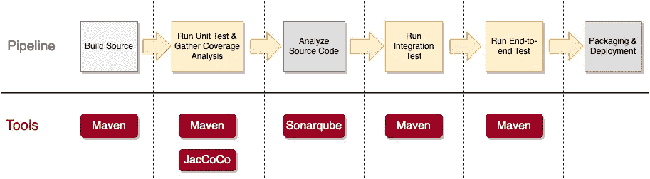

# **单元测试覆盖— JaCoCo**

## **白盒测试**

单元测试通常是一种“白盒测试”,让开发人员检查所有内部程序流并验证其代码逻辑，而不是将组件视为黑盒来检查其功能。这是确保所有系统逻辑都得到良好测试的有效且详尽的方法。

## **测试覆盖率**

你如何知道你的单元测试用例是否完全覆盖了所有的系统逻辑？检查是一项耗时的任务，尤其是在你的程序逻辑中有许多分支。 **JaCoCo** 是覆盖检查的一个很好的工具。

为了检查你的单元测试用例的覆盖范围，你可以简单地运行单元测试，JaCoCo 会在后台自动捕获测试执行的程序指令。结果，生成了一个 HTML 报告，显示了关于测试覆盖率的百分比和其他统计数据。您可以很容易地识别覆盖率低的区域，然后向下导航到类源代码级别，以查看哪些部分还没有被覆盖。

**应用级概述**

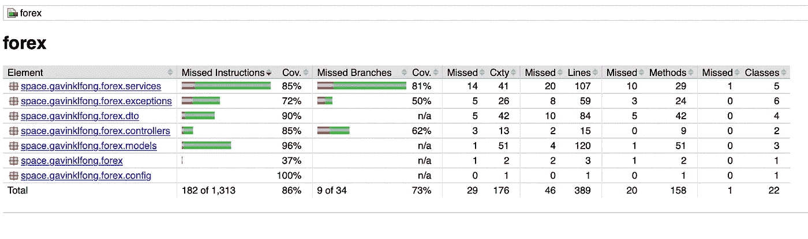

JaCoCo 报告—应用程序级别(在我的工作站上捕获的屏幕截图)

**带方法列表的类级别**

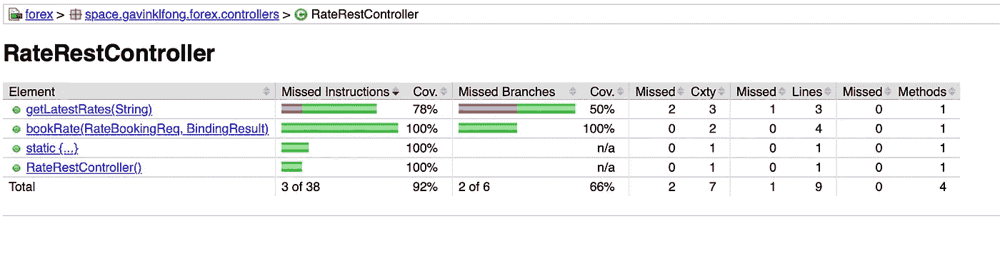

JaCoCo 报告—包含方法列表的类级别(在我的工作站上捕获的屏幕截图)

**源代码级别，覆盖范围突出显示**

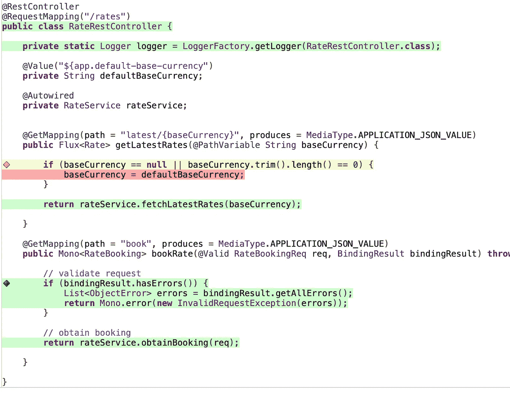

JaCoCo 报告——突出显示覆盖范围的源代码(在我的工作站上捕获的屏幕截图)

设置非常简单，它只是 Maven pom.xml 中的一个插件配置。因此，您可以通过向您的 Maven pom.xml 添加以下行来启用它，并且您将在测试用例执行后在 target/site/jacoco 中找到报告。

JaCoCo — Maven 配置

# **综合代码分析— Sonarqube**

软件缺陷的根本原因是由于没有遵循良好的编码实践或误用某些方法调用。一些不适当的编码实践会导致潜在的安全问题。然而，手动审查源代码是一项巨大工作，因为需要了解数百种编码实践。

因此，您可能需要一个能够进行更高级分析并存储结果的服务器端组件。 **Sonarqube** 是一款非常适合此目的的流行工具。

一旦你将代码提交给 Sonarqube 进行扫描，你就可以在它的门户网站上访问报告。下面的例子显示了不同类别的结果——可靠性、安全性、安全性、可维护性、代码复制以及测试覆盖率。

它带有质量关口，表明整体状态通过或未通过。可维护性状态是一个有趣的数字，它说明了修复代码味道的指示性工作。团队也许可以把它作为计划技术债务清理积压工作的参考。

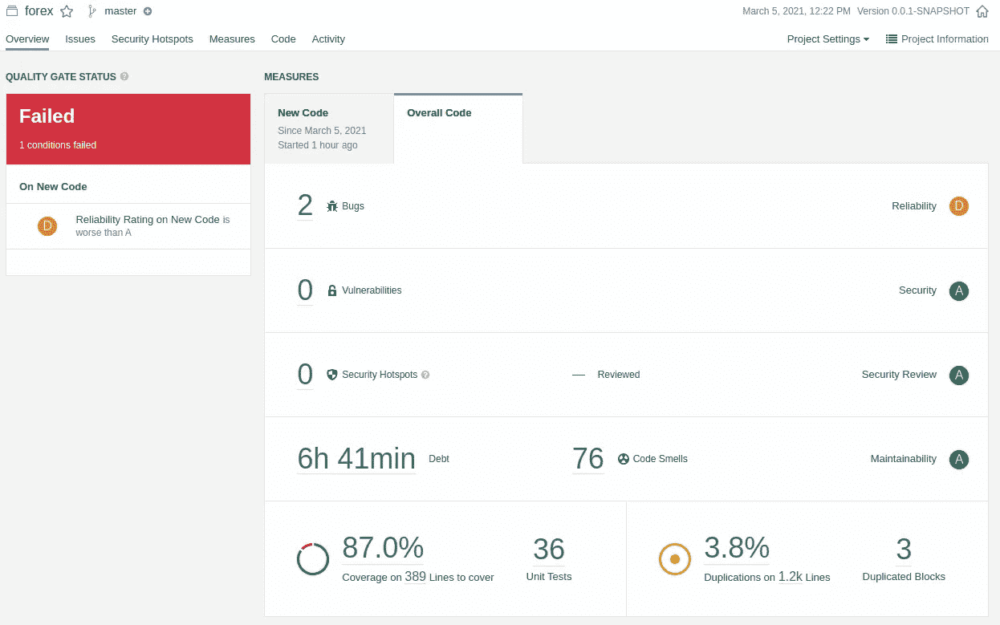

Sonarqube 报告—概述(在我的工作站上捕获的屏幕截图)

由于 Sonarqube 存储了所有以前的扫描结果，因此它清楚地显示了最近提交的质量趋势。这对团队来说是一个重要的信息，让他们知道他们应该更加关注哪个领域。

在下面的示例图中，新的代码提交在开始时引入了大量的技术债务，随后进行了一些改进，在后期的代码交付中情况变得稳定。

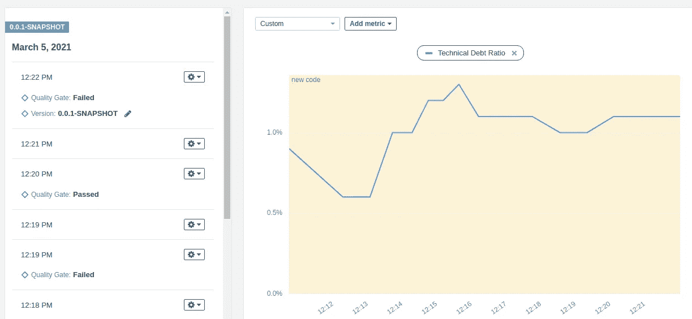

Sonarqube 报告-历史视图(在我的工作站上捕获的屏幕截图)

与 SonarLint 类似，它在源代码级别显示和突出问题。

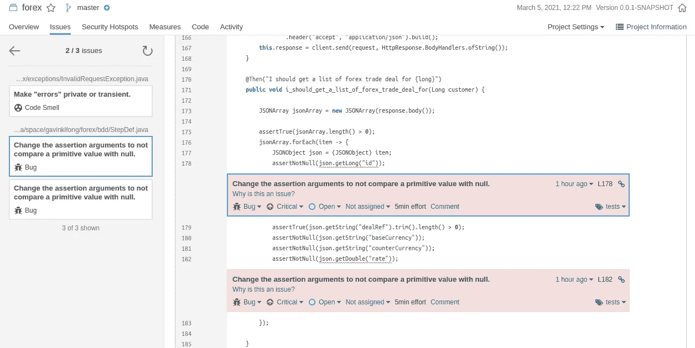

Sonarqube 报告—源代码级别的问题(在我的工作站上捕获的屏幕截图)

如果您收到一个问题列表，但没有任何处理线索，这将是一个令人头痛的问题。不用担心，扫描仪会为您提供解释和建议的解决方案。

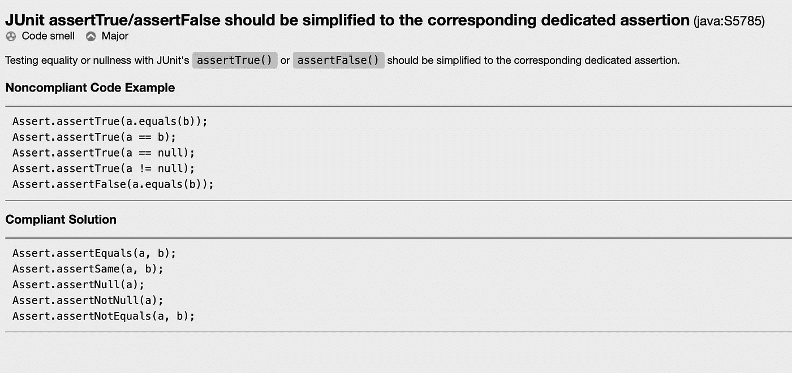

Sonarqube 规则解释和建议解决方案(在我的工作站上捕获的屏幕截图)

除了源代码级别和问题列表中突出显示的问题之外，Sonarqube 还提供了其他图表，这些图表可以从不同的角度为您提供见解。


Sonarqube 报告-不同视角的见解(在我的工作站上捕获的屏幕截图)

## **设置**

使用 docker 部署组件是一种方便的方法，它可以在几分钟内完成。请参考下面的码头工人组成定义:

[](https://github.com/gavinklfong/docker-compose-collection/blob/main/cicd-stack/docker-compose.yml) [## gawinklfong/docker-compose-collection

### 为各种案件撰写备审文件集。通过以下方式为 gawinklfong/docker-composite-collection 开发做出贡献…

github.com](https://github.com/gavinklfong/docker-compose-collection/blob/main/cicd-stack/docker-compose.yml) 

您可以克隆 git 存储库并运行 docker compose 命令来加速环境:

```
> git clone [https://github.com/gavinklfong/docker-compose-collection.git](https://github.com/gavinklfong/docker-compose-collection.git)> cd cicd-stack> docker-compose up
```

一旦 sonarqube 启动并运行，您需要做的就是向 Maven 添加配置，并提交源代码文件进行扫描。然后，结果将在几分钟后在 Sonarqube 门户网站上公布。您可以参考下面的链接了解 Maven 配置的详细信息:

 [## Maven 的 SonarScanner

### 建议将 Maven 的 SonarScanner 作为 Maven 项目的默认扫描仪。执行…的能力

docs.sonarqube.org](https://docs.sonarqube.org/latest/analysis/scan/sonarscanner-for-maven/) 

# 频繁的代码样式检查 SonarLint

您发现问题的时间越早，就越容易解决问题，对项目的影响也就越小。您可以经常运行代码分析，因为您在将代码提交给 sonarqube 之前，使用 **SonarLint** 在 IDE 上编写代码。

**SonarLint** 是 Sonarqube 的一部分，它是一个 IDE 插件，很多流行的 IDE 都可以使用它，比如 Eclipse、IntelliJ 和 Visual Studio Code。显然，IDE 是一个完美的工具，可以在您编写代码时提醒您注意任何问题，只需几分钟就可以纠正任何错误。尽管如此，这个工具是你的编码伴侣，但它不能代替提供更全面的代码分析的 Sonarqube。

以下是 Eclipse 的示例屏幕截图，问题在源代码中突出显示:

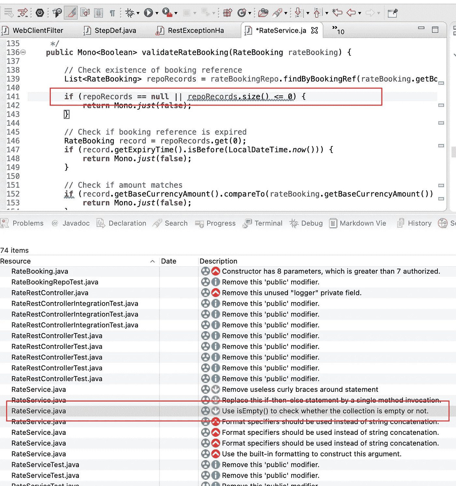

SonarLint 问题和源代码视图(在我的工作站上捕获的屏幕截图)

# **带质量门的自动化管道-詹金斯**

加强质量控制对确保交付符合标准至关重要。通过建立具有质量关口的自动化 CI/CD 流水线，输出质量得到保证，因为质量标准得到严格执行，不通过质量控制就不能部署不合标准的代码。

## **管道设计**

让我们弄清楚关于什么步骤将在管道中执行的要求。在执行管道中的下一个任务之前，应该满足当前步骤的退出标准。以下是每一步的退出标准:

1.  **单元测试** —所有单元测试用例通过
2.  **代码分析** —满足所有尺寸的所有质量标准。代码分析涉及以下维度:可靠性、安全性、可维护性和单元测试覆盖率。
3.  **集成测试** —所有集成测试用例通过
4.  **端到端测试** —所有端到端测试用例均通过

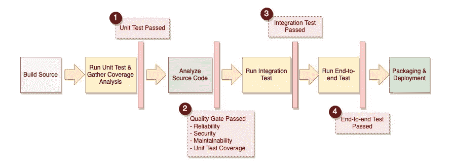

CI/CD 管道中的质量关(我自己制作的图表)

## **流水线实现**

管道步骤是使用 Groovy 脚本定义的，该脚本是声明性的和直观的，因此您将能够快速掌握逻辑。

管道定义

正如您在 Groovy 脚本中看到的，为每个管道步骤定义了专用的 Maven 概要文件，以便相应地执行测试用例的目标组。

*   **单元测试** —通过 ***Maven surefire 插件*** 运行标签为“Unit Test”的所有测试用例
*   **集成测试** —由 ***Maven surefire 插件*** 运行所有标签为“Integration Test”的测试用例
*   **端到端测试** —通过 ***Maven 故障保护插件*** 运行目标测试用例 java 类。这是一个黄瓜测试，它会自动执行所有的特征文件。

尽管 Jenkins 为管道设置提供了一个用户友好的 GUI，但我还是强烈推荐使用脚本，因为您可以将脚本文件签入 Git 存储库，以利于版本控制。

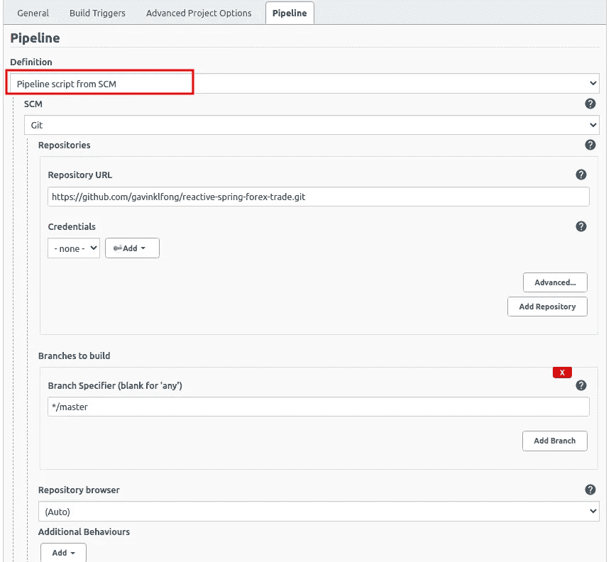

Jenkins 管道配置—来自 Git 的管道脚本(在我的工作站上捕获的屏幕截图)

在我的例子中，您可以在 Git 存储库中找到 Jenkins groovy 脚本，作为应用程序源代码的一部分。

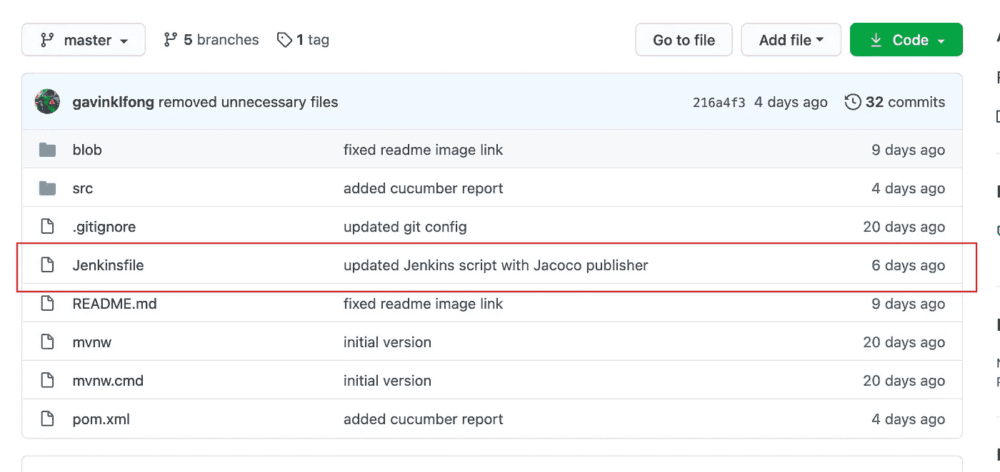

Git 中的管道 groovy 脚本(在我的工作站上捕获的截图)

## **管道在动作**

这个例子演示了源代码没有通过 Sonarqube 的质量关的场景。因为质量关没有通过，所以你可以看到管道中止所有后续步骤。

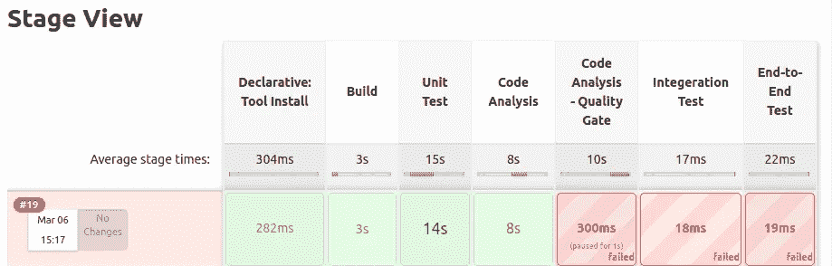

Jenkins Pipeline —执行失败，质量关未通过(在我的工作站上捕获的屏幕截图)

要修复代码问题，让我们检查 Sonerqube 报告的细节。它提供了一种便捷的方式来导航到有问题的源代码，并详细说明问题


sonerqube——问题在源代码级别突出显示(在我的工作站上捕获的屏幕截图)

问题解决后，我们重新运行管道，您可以看到质量关已通过，管道可以完全执行。

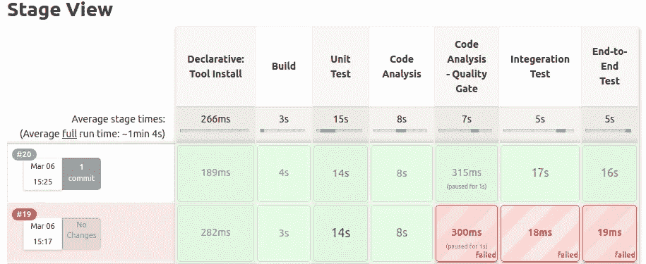

Jenkins Pipeline —成功执行，通过了质量关(在我的工作站上捕捉的屏幕截图)

## Git 储存库

如果您对管道实现感兴趣，可以参考这个 git 存储库，获取带有 Jenkins groovy 脚本和 Maven pom.xml 的示例应用程序

[](https://github.com/gavinklfong/reactive-spring-forex-trade) [## gavinklfong/无功-弹簧-外汇-贸易

### 创建这个库的目的是展示 Spring framework 的主流非阻塞技术…

github.com](https://github.com/gavinklfong/reactive-spring-forex-trade) 

# **最终想法**

无论开发项目的规模如何，考虑多个维度对于交付高质量的数字产品都是至关重要的。换句话说，功能只是一个单一的视角，你应该关注安全性、可维护性以及测试用例的覆盖率。

有许多很棒的工具可用，例如代码扫描和带有关卡控制的自动化 CI/CD 管道。因此，您可以快速建立和自动化质量控制流程，而无需在设置方面进行大量投资。更重要的是，质量控制过程和团队精神以及实现高质量产品的心态肯定会有所不同。

如果你对在基于云的平台上构建管道感兴趣，那么下面这篇文章就是为你准备的，因为它全面地涵盖了如何在一个流行的基于云的平台上构建同样的具有质量门的管道——**circle ci**。

[](https://medium.com/dev-genius/circleci-the-modern-cloud-based-platform-of-pipeline-automation-a5b293c9e171) [## circle ci——基于云的现代管道自动化平台

### 云计算之旅从 Jenkins 到 CircleCI

medium.com](https://medium.com/dev-genius/circleci-the-modern-cloud-based-platform-of-pipeline-automation-a5b293c9e171)