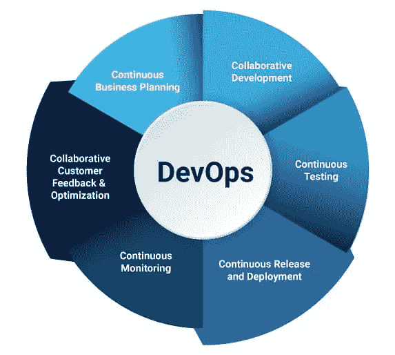
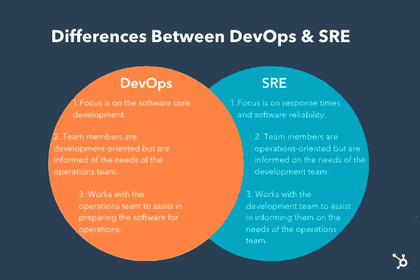
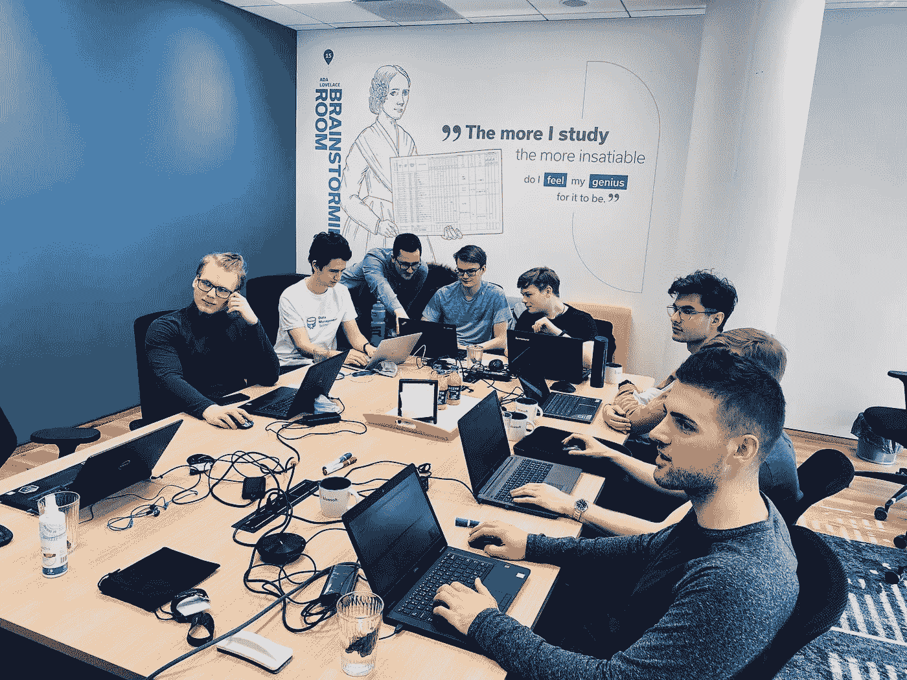

# 德文普斯诉 SRE:仔细看看。

> 原文：<https://blog.devgenius.io/devops-vs-sre-a-closer-look-5cdeecca565?source=collection_archive---------13----------------------->

> 正如我想象的那样，网络我们还没有看到。未来仍然比过去大得多。
> 
> **蒂姆·伯纳斯·李**

说到 DevOps 和 Site 可靠性工程(SRE)，这些角色可以适合任何你想要放置的定义品牌，从方法论到实践，甚至文化。虽然这两个角色经常互换使用，但实际上它们完全不同。

在本文中，我们将仔细研究 DevOps 和 SRE 之间的差异，并为那些刚刚开始从事 DevOps 领域的人提供初学者指南。

来自 radixweb.com 的照片

**德文普斯工程公司:**简介:

首先，术语“DevOps”结合了两个词——Dev 和 Ops。开发即开发，运营即运营。从最广泛的意义上来说，DevOps 是软件开发和 IT 运营之间的协作，以使软件生产和部署以自动化和可重复的方式运行。

> DevOps 对团队意味着什么？DevOps 使以前孤立的角色——开发、IT 运营、质量工程和安全——能够进行协调和协作，以生产出更好、更可靠的产品。通过采用 DevOps 文化，团队可以更好地响应客户需求，增强对他们构建的应用程序的信心，并更快地实现业务目标。

DevOps 是一套旨在改善科技公司和组织的软件工程的实践。您可以将 DevOps 文化视为一个连续的循环，涉及以下工作流程:计划、编码、构建、测试、发布、部署、操作和监控。当科技公司从用户那里获得关于他们的服务或产品的质量反馈时，他们会调整或改进周期的计划阶段，循环继续。

DevOps 生命周期

为了与软件预期保持一致，软件开发人员和 IT 利益相关者就给定项目的结构进行沟通。然后，不同的工程团队会互相独立地交付发布的更新。

DevOps 团队使用 CI/CD(连续集成和连续交付)管道和其他自动化工具将他们的代码从一个开发阶段推进到另一个开发阶段。然后，团队使用像 GitHub 这样的工具审查变更，并强制执行策略以确保版本符合要求的标准。有了这样的协作水平，整个团队都意识到已经发生的变化，从而简化了事件管理。

## **DevOps 与现场可靠性工程(SRE)的差异**

**从注重概念的角度来看**，DevOps 和 SRE 都是快速高效交付高质量软件的方法。然而，尽管 DevOps 专注于从开发到部署的整个软件交付管道，但 SRE(站点可靠性工程)特别关注软件系统的可靠性和可用性。

DevOps 工程师负责构建和维护软件交付管道，其中包括代码开发、测试和部署等任务，以及系统的监控和维护。DevOps 工程师与开发人员、运营团队和其他利益相关者密切合作，以确保软件高效且有效地交付。

另一方面，SRE 的工程师专注于确保软件系统的可靠性和可用性。他们致力于消除系统故障、提高系统性能和维护系统健康。SRE 工程师与 DevOps 工程师密切合作，确保软件交付渠道的可靠性和可扩展性。

# 德沃普斯和 SRE 的关系:朋友还是敌人。

在当今的软件开发世界中，开发人员一直面临着快速构建和发布功能的压力，而操作人员的任务是维护系统的稳定性和可靠性。这种激励的错位经常导致开发人员急于尽快推动变更，而运营商则努力通过拒绝这些变更来维持稳定。然而，DevOps 运动旨在联合组织中的每个人来改善客户体验。

为了实现这一目标，DevOps 强调了减少组织孤岛和促进开发者与运营商之间合作的重要性。通过合作，他们可以交付更好的结果，并提高系统的可用性、可靠性和性能。DevOps 还鼓励组织将失败作为一种正常的操作模式，并逐步实施变更，因为小的增量变更比几周或几个月内建立的大变更更安全。

自动化是 DevOps 的另一个关键方面。通过自动执行系统配置、应用部署和操作系统补丁等任务，开发人员和操作员可以专注于更重要的工作。这不仅可以提高速度和效率，还可以腾出时间专注于提高系统性能和可靠性。

测量在 DevOps 方法中也至关重要。良好的度量和测量有助于组织就如何改进他们的系统做出明智的决策。没有好的度量标准，就很难确定变更的影响或确定需要改进的地方。

然而，问题依然存在:场地可靠性工程(SRE)怎么样？2016 年，谷歌和奥赖利发布了一本书，介绍了误差预算的概念。错误预算有助于组织在速度和可靠性之间进行权衡，当系统没有达到其可靠性目标时，它可以帮助组织做出决策。例如，错误预算可能会指示团队停止推出新功能，并通过自动化部署专注于提高系统可靠性。

SRE 为定义错误预算提供了一个框架，从服务水平指标(SLIs)开始。SLI 是一种提供系统信息的指标，理想地反映了客户满意度。从 SLIs 中，组织可以生成服务级别目标(SLO ),它为可接受的服务可靠性设定了一个目标。

那么，DevOps 和 SRE 是竞争对手还是朋友？最终，他们有着共同的目标:改善客户体验。DevOps 强调协作、自动化和测量，而 SRE 提供了一个框架来定义误差预算，并在速度和可靠性之间做出明智的权衡。通过结合这些方法，组织可以交付更好的结果，并创建一个更加可靠和高效的系统。

# **从 DEVOPS 开始(一些入门级掘金)**

如果你想进入技术行业或进入 DevOps，重要的是要理解 DevOps 不仅仅是一个职位，而是一种通过促进公司、组织或团队中开发人员和 it 操作人员之间的协作来提高软件开发质量和效率的方法。虽然这两个领域可能有自己独特的子领域和术语，但 DevOps 的本质可以总结为一种促进它们之间更顺畅的通信和工作流的方式。

如今，许多公司都有真正的头衔、开发职位和机会，人们可以真正融入其中。也就是说，一些 DevOps 工程师在被聘用时通常会承担一些重要的责任。根据我的发现和长期研究，这些职责包括:

1.  基础设施
2.  监视
3.  自动化
4.  建立工作关系网
5.  安全性
6.  CI/CD

一个人处理上面列出的所有领域似乎有些力不从心，但是没有必要被吓倒。不可能每个团队成员都精通 DevOps 中涉及的所有工具和概念。然而，要在 DevOps 开始职业生涯，精通其中的大部分是必不可少的，即使你不是所有领域的专家。

根据我的经验，进入 DevOps 领域没有固定的路径，你不一定需要计算机科学学位。人们通常从学习编程语言开始，然后在掌握版本控制系统之前继续学习 Linux 命令行。学习这些工具的顺序不如能够在 DevOps 工程中有效地实现它们重要。

如果您正在过渡到 DevOps，在过渡到其他工具之前，有必要将重点放在基础领域，如编程语言(尤其是 Python)、操作系统(主要是 Linux)和云平台(通常是 AWS)。

有几个平台可以帮助你启动你的学习之旅，比如 Udemy、KodeKloud 和 YouTube。说到 YouTube，有很多有用的频道提供指南和提示。例如， [Sosa 的频道](https://youtu.be/s7E9pMHPRts)是一个很好的资源，还有许多其他的 YouTube 频道可以让你开始学习。做一个技术上的模仿者是明智的，从你能学到的任何地方学习，因为这是你成为一个更好的工程师的方法。此外，新兵训练营也是一个很好的选择，我推荐你去看看 Nana 的[科技世界。](https://www.techworld-with-nana.com/devops-bootcamp)

总之，DevOps 是一个不可思议的多才多艺的领域，值得探索。我鼓励你试一试。

**结论**

如果你觉得这篇文章有帮助，请给它一个掌声，并考虑跟随我的媒体页面获取更多信息。如果你对我可能没有充分阐明的话题有任何问题或担忧，请随时联系我本人或发电子邮件给[emediongsamuel07@gmail.com](mailto:emediongsamuel07@gmail.com)。

感谢您花时间阅读这篇文章。我感谢你的观众，并希望你发现信息有用。干杯！