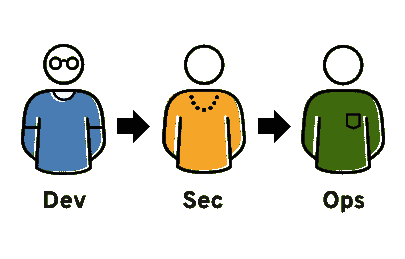
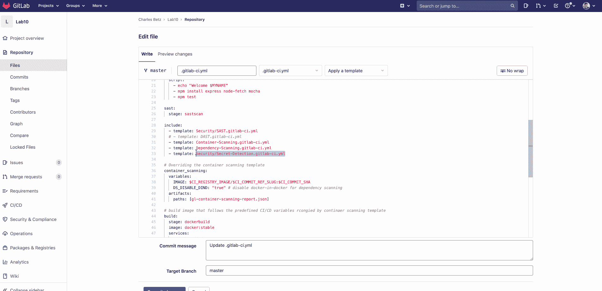
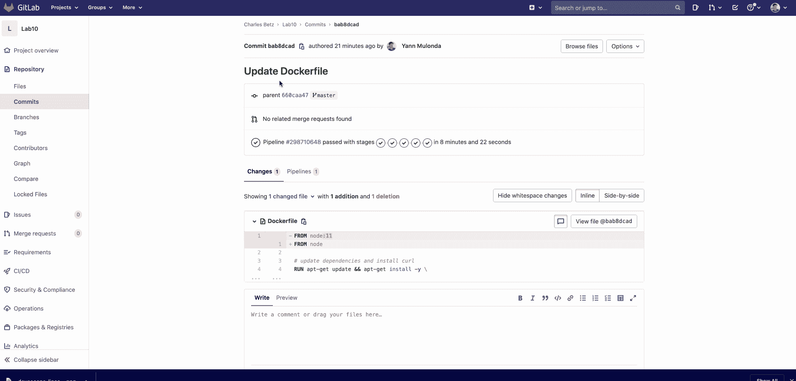

# 使用 GitLab Secure 进行开发

> 原文：<https://blog.devgenius.io/devsecops-using-gitlab-secure-6cc9bd736d40?source=collection_archive---------3----------------------->

Gitlab 企业安全扫描

在传统的 IT 开发过程中。安全性涉及到(应用程序或软件的)堆栈的末端。有时，开发团队会要求安全团队对他们的应用程序进行安全扫描。这甚至适用于以 [DevOps](https://blog.usejournal.com/what-is-devops-in-simple-english-6550fbb129bd) 方式工作的团队。

> 这就是开发、安全和运营(又名 ***DevSecOps*** )的用武之地。

## 什么是 DevSecOps？

[DevOps](https://blog.usejournal.com/what-is-devops-in-simple-english-6550fbb129bd) 和 **DevSecOps** 方法有相似的方面，包括使用自动化和连续过程来建立开发的协作循环。然而，虽然 [DevOps](https://blog.usejournal.com/what-is-devops-in-simple-english-6550fbb129bd) 优先考虑交付速度，但是 **DevSecOps** 建立在 [DevOps](https://blog.usejournal.com/what-is-devops-in-simple-english-6550fbb129bd) 的文化变化之上，以尽早整合安全团队的工作。

来源:[RedHat.com](http://What is DevSecOps? redhat.com)

DevSecOps 包括将 IT 安全实践集成到应用程序的整个生命周期中。简而言之，这意味着从一开始就考虑应用程序和基础设施的安全性。而不是在开发的最后阶段孤立安全团队的角色。安全性被认为是一项从始至终都需要整合的共同责任。

这还包括自动化一些安全门，以防止 DevOps 工作流程变慢；例如，每当开发人员向您的应用程序 CI/CD 管道推送新代码时，自动进行测试或扫描。这些实践将为诸如漏洞、代码覆盖率和风险之类的事情提供更好的可见性。

## Gitlab 企业安全扫描

GitLab 安全。Secure 提供静态应用程序安全测试(SAST)、动态应用程序安全测试(DAST)、容器扫描和依赖性扫描，帮助您交付安全的应用程序以及许可证合规性。

**静态应用程序安全测试(SAST)** —在部署之前扫描应用程序源代码以检查漏洞(可能导致 SQL DB 注入的错误代码)

**依赖性扫描** —分析所有外部依赖性，如库(如使用旧版本的库)

**容器扫描** —检查 docker 映像中应用环境中的已知漏洞(例如使用旧版本的依赖项)。这是通过使用一个叫做 Clair 的开源工具来实现的。

**动态应用程序安全测试(DAST)** —分析 web 应用程序的已知漏洞(如缺少 X 内容类型选项头)。它通过对评论应用程序或环境进行实时攻击来实现这一点。

**许可证扫描** —扫描项目依赖关系中的所有许可证，并将它们与批准或拒绝列表进行匹配。该列表基于安全小组制定的一组策略。

**秘密检测** —开发应用程序时经常出现的一个问题是，开发人员可能会无意中将秘密和凭证提交给他们的远程存储库。如果其他人可以访问源代码，或者如果项目是公共的，那么敏感信息就会暴露出来，恶意用户可以利用这些信息来访问资源，如部署环境。Secret Detection 会扫描存储库的内容，以查找不应该存在的 API 密钥和其他信息。—来源: [GitLab 应用 _ 安全](https://docs.gitlab.com/ee/user/application_security/)

安全扫描在统一的 UI 中显示漏洞，开发人员可以在合并到 master 之前解决这些漏洞。一个项目或一组项目的安全状况可以通过安全仪表板进一步评估。

# DevSecOps 展示

对于这个展示演示，我们正在构建一个演示 Nodejs 项目，该项目是由 [Charles Betz](https://www.stthomas.edu/gradsoftware/about/faculty/charles-betz.html) 教授在[圣托马斯大学](https://www.stthomas.edu/gradsoftware/)(明尼苏达州圣保罗)为 [SEIS 664 IT 交付课程](https://www.coursicle.com/stthomas/courses/SEIS/664/) —研究生院级别编写和设计的。请随意查看 Gitlab 回购、[课程内容](https://gitlab.com/charlestbetz/dp-course)和[演示项目](https://gitlab.com/charlestbetz/node-svc)以了解更多信息。

在开始之前，请确保您已经完成了之前在[***terra form Showcase***](/provisioning-vs-configuration-management-with-terraform-4bf07b9c79db)上的课程

> 通过包含 GitLab 提供的默认模板，可以将所有描述的证券扫描添加到您的 DevOps CI/CD 管道中。花点时间回顾一下代码，了解一下模板的作用，[安全模板](https://gitlab.com/gitlab-org/gitlab/-/tree/master/lib/gitlab/ci/templates/Security)。

## 启用安全扫描

*   注意:启用自动 DevOps 将启用当前项目 CI/CD 管道中的所有扫描。更多详情，请参见[自动开发](https://docs.gitlab.com/ee/topics/autodevops/index.html)。

我们将通过手动将安全扫描模板包含在现有的。gitlab-ci.yml 文件如下所示:

现在，提交一项更改，观察您的新 DevSecOps CI/CD 管道的运行情况，并检查您的安全和合规委员会:

您可能已经注意到，由于依赖关系的过时版本，我们有许多漏洞。

现在，您可以探索在构建映像时更新节点 js 和其他 docker 容器包依赖项的方法。您可以从修改 docker 文件并添加以下内容开始:

再次运行您的管道并进行比较，看看您的漏洞报告看起来是否有所不同。检查漏洞是否因更新而得到解决:

从这里开始，不断提高您的应用安全性🙂

> 如果你喜欢这个，你可能也会喜欢:[如何使用 Lamba 函数启动 AWS CloudFormation】](/how-to-launch-aws-cloudformation-using-lamba-function-3182101fa1da)

> 干杯！！！