# devtron:K8s 的开源软件交付工作流

> 原文：<https://blog.devgenius.io/devtron-open-source-software-delivery-workflow-for-k8s-23bd136efe06?source=collection_archive---------5----------------------->

在 Kubernetes 上对 CI/CD 和 GitOps 采取固执己见的态度。

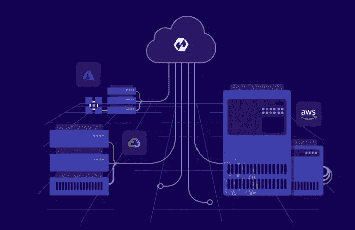

图片来源: [devtron.ai](https://devtron.ai/)

随着 Kubernetes 生态系统的不断成熟，我们看到了开源和商业 DevOps 工具的爆炸式增长。我们有专门针对 CI 的工具，比如 [Jenkins X](https://jenkins-x.io/) 和 [Circle CI](https://circleci.com/) ，还有来自 GitHub ( [GitHub Actions](https://github.com/features/actions) )和 GitLab ( [GitLab runners](https://docs.gitlab.com/runner/) )的集成工具。在持续部署(CD)方面，我们有 [Flux](https://fluxcd.io/) 、 [ArgoCD](https://argoproj.github.io/cd/) 和 [Spinnaker](https://spinnaker.io/) ，此外还有来自 [Codefresh](https://codefresh.io/) 和 [Harness](https://harness.io/) 的商业产品。还有 Kubernetes-native 框架，如 [Tekton](https://tekton.dev/) 试图标准化构建、测试和部署的方式。简而言之，这里并不缺少选择，然而将所有这些工具结合在一起以获得无缝体验并不容易。

Devtron 是一款开源软件交付工作流工具，专为 Kubernetes 工作负载而设计，旨在简化这种设置。它汇集了许多开源组件(例如 [ArgoCD](https://argoproj.github.io/cd/) 、 [Clair](https://github.com/quay/clair) 、[外部机密](https://github.com/external-secrets)、 [minio](https://min.io/) )，以提供托管的 GitOps 体验。Devtron 集成了所有流行的 Git 提供者，可以构建 Docker 映像和部署舵图。如果您正在为 CI/CD 寻找一个托管的、开源的产品，请遵循本指南来评估 Devtron。

# 先决条件

*   Kubernetes 集群(*注意:Devtron 建议生产设置使用 6 个 cpu 和 13 GB，但是 4 个 cpu 和 8 GB 对于简单的评估应该足够了*
*   舵 3
*   Git 帐户:GitHub、GitLab、Azure DevOps 或 Bitbucket
*   集装箱注册:码头中心，ECR

# 安装 Devtron

Devtron 目前支持通过 Helm 或者`kubectl`安装。默认安装包括:

*   argo: GitOps 引擎(也安装 argo 卷展栏)
*   克莱尔:集装箱扫描
*   Devtron 仪表板
*   kubeguard:验证 webhook 策略引擎
*   PostgreSQL:Devtron 的数据库存储
*   grafana:指标仪表板
*   外部机密:机密存储连接器
*   minio:存储

以及其他与这些组件交互的微服务。文档网站上列出了[配置设置](https://docs.devtron.ai/setup/install/override-default-devtron-installation-configs)的完整列表，以及修改每个 AWS/Azure 设置的说明。Devtron 网站上的大多数指南都是面向 AWS 的，但是舵图表值可以很容易地改变，以适应不同的云或现有的 Prometheus 或 Grafana 安装。

因为我是在 GKE 上运行的，所以我只使用了 minio 的默认设置，并通过 Helm 进行了部署:

```
$ helm repo add devtron [https://helm.devtron.ai](https://helm.devtron.ai)
$ helm install devtron devtron/devtron-operator --create-namespace --namespace devtroncd
```

Devtron 需要几分钟来完成安装步骤。等待状态输出从已下载变为已应用(大约 15–20 分钟):

```
$ kubectl -n devtroncd get installers installer-devtron -o jsonpath='{.status.sync.status}' -wDownloaded
Applied
```

安装完成后，获取门户的管理员凭据:

```
$ kubectl -n devtroncd get secret devtron-secret -o jsonpath='{.data.ACD_PASSWORD}' | base64 -d
```

并访问仪表板端点(默认情况下，它将提供一个负载平衡器)。

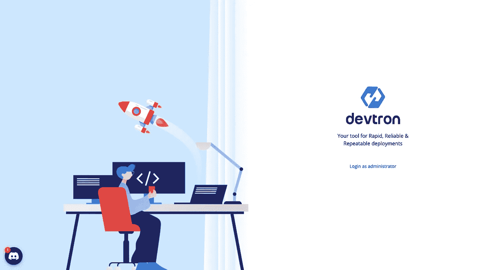

# 配置 Devtron

登录后，Devtron 将要求您完成设置过程(除非在配置设置过程中对此进行了修改)。

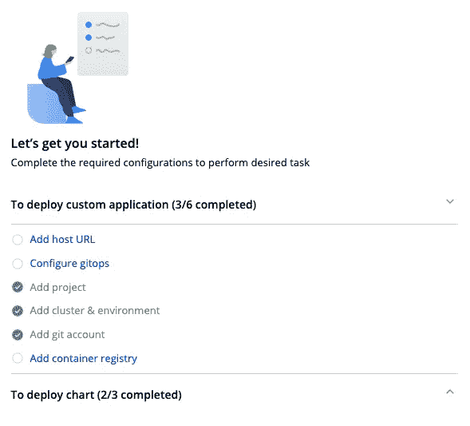

将主机 URL 保留为默认设置(即负载平衡器的 IP 地址)。


接下来在`GitOps`部分配置 Git 提供者。 [Devtron 文档](https://docs.devtron.ai/setup/global-configurations/gitops)详细介绍了如何配置 GitHub、Gitlab、Azure DevOps 和 BitBucket。我使用 GitHub，注意到我必须创建一个 GitHub 组织，而不是我的个人帐户。个人帐户令牌还需要拥有对`repo`、`admin:org`和`delete_repo`的完全访问权，以便 Devtron 为基于 GitOps 的舵图部署自动创建基本回购(稍后将详细介绍)。

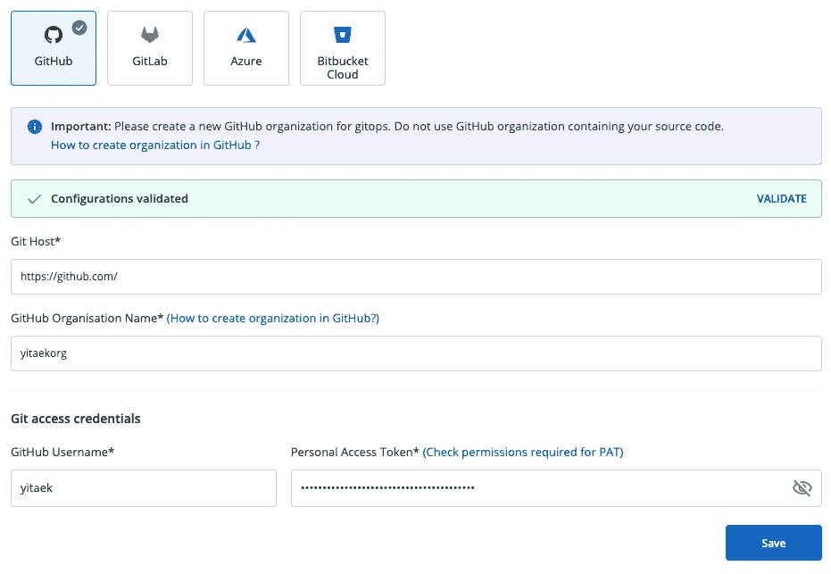

最后，我们可以为 Devtron 添加一个容器注册表，以便将 Docker 容器推送到其中。它目前支持 Docker Hub、ECR 和其他使用基本 auth 的应用程序。

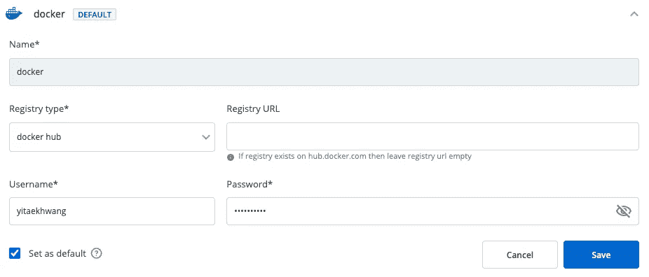

# 展开舵图

要部署样本舵图表，请单击左侧面板上的“图表”图标。与大多数 Helm dashboard 工具类似(例如 [kubeapps](https://kubeapps.com/) )，Devtron 在`dashboard/global-config/chart-repo`下列出了预配置的 Helm repos 列表(包括 bitnami、elastic、jetstack 等)。您也可以在此链接添加任何公共或私人的 Helm repos。

我们可以单击任何示例图表(例如 mysql):

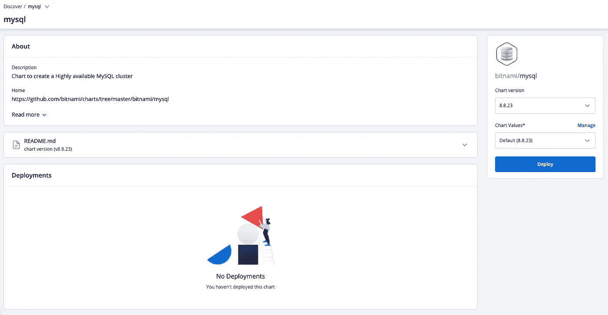

点击`Deploy`，可以修改`values.yaml`图。

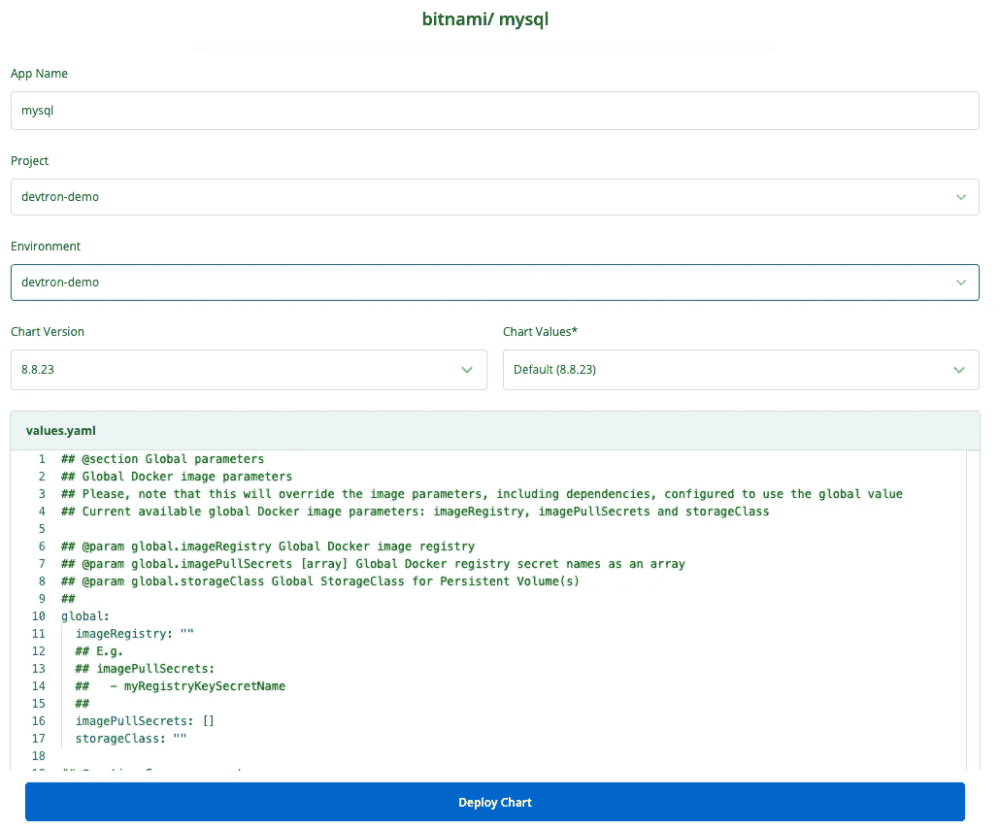

点击“部署图表”后，Devtron 实际上会在后台将 helm 图表提交给已配置的 Git repo:


然后它使用 ArgoCD 进行部署，您可以通过运行`helm ls -n devtron-demo`来验证，并看到它不是由 Helm 管理的，而是由 ArgoCD 管理的。

# 部署示例应用程序

虽然 Helm chart 的例子不错，但大多数现实的工作流将从 Git repo 开始，而不是从 Devtron UI 开始。因此，让我们来看一个简单的“Hello World”部署示例。点击“添加新应用”并使用空白模板:

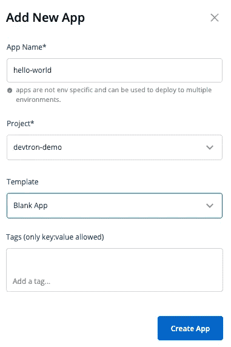

我们可以使用任何 Git 存储库，所以我选择使用 Devtron 提供的 Django 示例:


配置容器注册表设置，注意 Dockerfile 文件的路径:

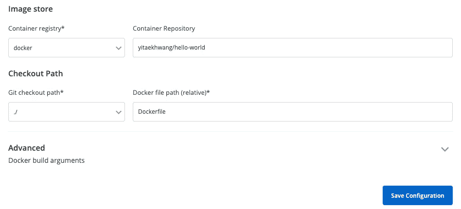

最后，我们可以为该应用程序的行为配置 YAML。这基本上通过一个舵图用 Kubernetes 清单包装了我们的应用程序。可配置参数的完整列表列在[文档网站](https://docs.devtron.ai/user-guide/creating-application/deployment-template/rollout-deployment)上。

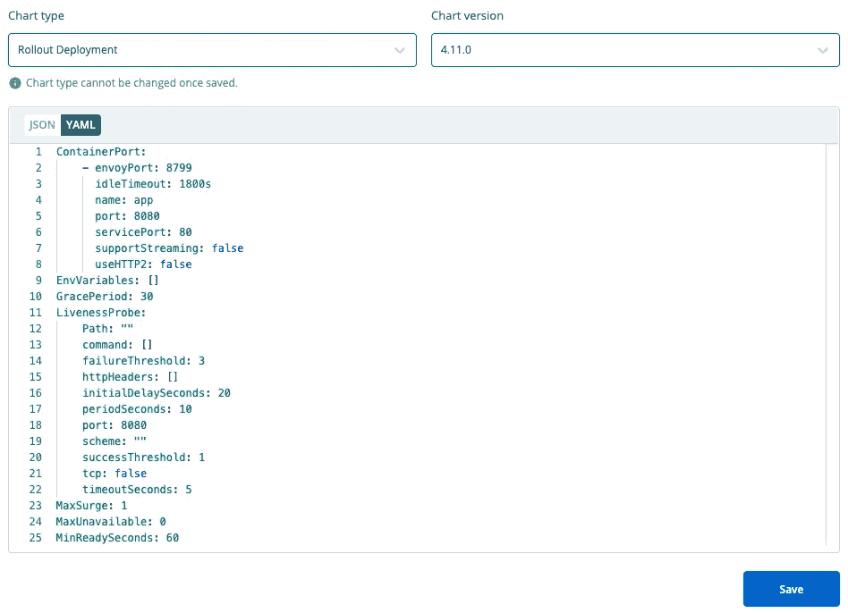

接下来，我们需要创建 CI/CD 管道。默认的 CI 管道将构建 Docker 映像并发布到我们配置的端点。单击 build 按钮右侧的+按钮来配置部署作业。由于我们使用公共回购，我们将把部署触发器改为手动。


触发构建流程后，我们可以看到集群中克隆和构建 Docker 映像的作业。我们可以在`Build History`选项卡下跟踪构建过程的进程:


构建完成后，我们可以使用映像触发部署:

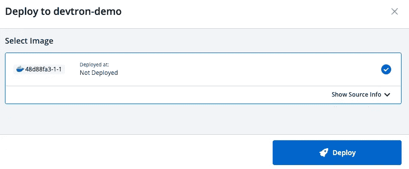

默认情况下，它使用滚动部署，我们可以看到正在创建的单元和服务:

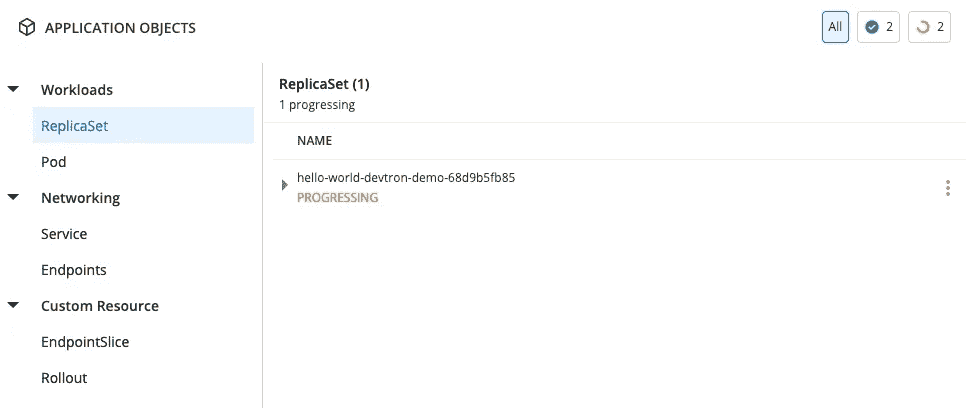

部署完成后，我们可以在`App Details`选项卡下检查状态:


我们还可以在 GKE 仪表板上验证成功部署:

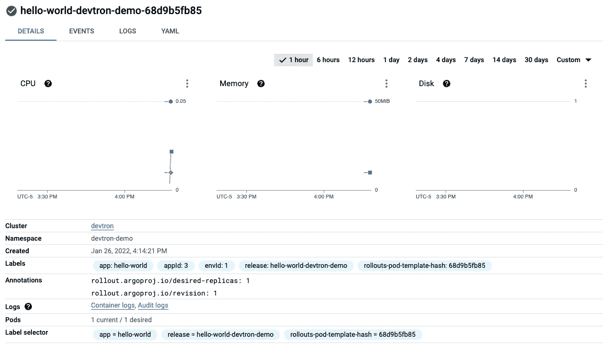

# 目标受众

Devtron 采用了一种自以为是的方法来使用 ArgoCD 和 Argo 部署，以及它如何通过外部秘密与 AWS/Azure 集成，以简化端到端 CI/CD 管道。这对于没有预先存在 CI 和 ArgoCD 设置的组织来说很容易。Devtron 只需要 20 分钟就可以安装预置配置，自动完成构建→发布→扫描→部署过程，并内置 guardrails。

另一方面，如果您已经有了与其他 CD 工具集成的复杂 CI 管道，Devtron 将花费一些精力来改进现有的工作流。然而，GitOps-heavy 方法仍然可以为使用遗留系统迁移到 Devtron 的托管体验的团队提供价值。

最后，在我的评估中，我无法以编程方式创建复杂的 CI 管道，包括典型的林挺、测试和安全扫描设置。然而，我希望 Devtron 团队继续构建更多的集成(例如，从现有的 CI 管道中触发，管理现有的舵图，从容器注册表中支持 CD)来成熟该工具，并允许更多的团队采用现代 CI/CD 堆栈。