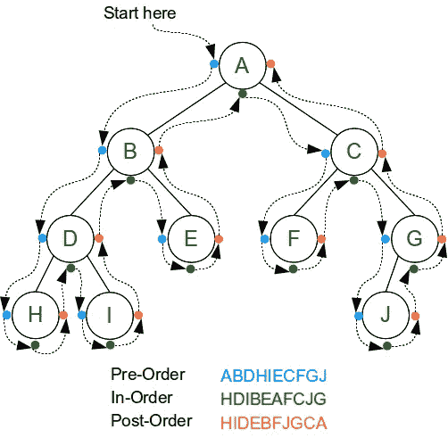
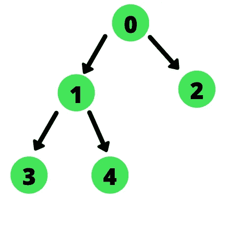

# DFS(深度优先搜索)遍历技术—简洁明了

> 原文：<https://blog.devgenius.io/dfs-depth-first-search-traversal-techniques-short-and-sweet-1e4c134babcf?source=collection_archive---------2----------------------->



[https://thenafi 36 . WordPress . com/2014/09/26/UVA-536-tree-recover/](https://thenafi36.wordpress.com/2014/09/26/uva-536-tree-recover/)

# 什么是二叉树？

二叉树是一种树形数据结构，其中每个节点最多有两个子节点。这些孩子被称为左孩子和右孩子。树中最顶端的节点被称为根节点。

树是节点的集合。节点由边连接。每个节点都包含一个值，它可能有也可能没有子节点。

# **什么是遍历树？**

遍历树是对树中的每个节点只访问一次的过程。遍历树有两种广为人知的技术:

*   DFS 或深度优先搜索
*   BFS 或广度优先搜索—层级顺序遍历

我们将关注 DFS(深度优先搜索)技术。这些算法可以推广应用到二叉树以外的其他类型的树。

# 3 DFS 遍历技术



[https://www . journal dev . com/44201/width-first-search-depth-first-search-bfs-DFS](https://www.journaldev.com/44201/breadth-first-search-depth-first-search-bfs-dfs)

1.  有序遍历—左、根、右`3 1 4 0 2`
2.  前序遍历—根、左、右`0 1 3 4 2`
3.  后序遍历——左、右、根`3 4 1 2 0`

让我们首先建立我们的二叉树数据结构:

```
function TreeNode(val, left, right) {
  this.val = (val===undefined ? 0 : val)
  this.left = (left===undefined ? null : left)
  this.right = (right===undefined ? null : right)
}
```

# **顺序遍历**

Inorder 遍历最初在左子节点上连续递归，直到该根没有左子节点。

1.  在左侧子节点上递归
2.  遍历当前根节点
3.  在右侧子节点上递归

当我们弹出调用堆栈时(退出每个递归函数)，我们将继续推送值并在正确的节点上递归(如果它存在的话)。

```
var inorderTraversal = function(root) {
    let result = [];
    let helper = function(node) {
        if (node) {
            helper(node.left);
            result.push(node.val);
            helper(node.right);
        }
    }
    helper(root);
    return result;
};
```

# 前序遍历

与顺序类似，但是步骤的顺序不同。

1.  遍历当前根节点
2.  在左侧子节点上递归
3.  在右侧子节点上递归

```
var preorderTraversal = function(root) {
    let result = [];
    let helper = function(node) {
        if (node) {
            result.push(node.val);
            helper(node.left);
            helper(node.right);
        }
    }
    helper(root);
    return result;
};
```

# 后序遍历

与顺序类似，但是步骤的顺序不同。

1.  在左侧子节点上递归
2.  在右侧子节点上递归
3.  遍历当前根节点

```
var preorderTraversal = function(root) {
    let result = [];
    let helper = function(node) {
        if (node) {
            helper(node.left);
            helper(node.right);
            result.push(node.val);
        }
    }
    helper(root);
    return result;
};
```

# 下一个挑战——我们如何迭代地实现它？

当迭代地实现这个算法时，同样的概念也适用。我们可以将调用栈想象成一个数组，并继续将子树添加(推送)到调用栈中，直到它被弹出。

二叉树逆向遍历的迭代算法示例。

```
var inorderTraversal = function(root) {
    let result = [];
    let stack = [];
    while (root || stack.length > 0) {
        if (root) {
            stack.push(root);
            root = root.left
        } else {
            let save = stack.pop();
            result.push(save.val);
            root = save.right;            
        }        
    }
    return result;
};
```

尝试看看我们如何为 DFS 的另外两个变体重新排序算法。调用堆栈的序列在这里会是什么样子？

我在黑客反应堆的第 13 周。我们现在正在建立自己的迷你应用程序！到目前为止，这是一个很好的学习经历，谁不喜欢建造东西。