# GitHub 文件中带有美人鱼的图表

> 原文：<https://blog.devgenius.io/diagrams-in-your-github-files-with-mermaid-273003d54421?source=collection_archive---------7----------------------->

## 一图胜千言。现在，您可以直接在 GitHub 存储库文件中包含惊人的图表。


哈尔·盖特伍德在 [Unsplash](https://unsplash.com?utm_source=medium&utm_medium=referral) 上拍摄的照片

你使用 *GitHub* 作为你选择的版本控制托管服务吗？很可能是的。5600 万用户不会错。最近， *GitHub* 发布了美人鱼支持供大家使用。

Mermaid 是一个基于 JavaScript 的图表工具，它使用 Markdown 来描述图表的外观。它支持以下类型的图表:

*   流程图
*   UML 图
*   Git 图表
*   用户旅程图
*   甚至是甘特图
*   还有更多…

创建图表就像输入名称、一些选项和图表本身的定义一样简单。美人鱼很强大。除了图表之外，你还可以随心所欲地选择图表样式，定义链接等等。

要创建图表，请将您的代码放入 Mermaid 代码块中:

```
```mermaiddiagram definition```
```

目前，渲染图表需要一些时间。希望随着技术的成熟，这个问题会得到解决。

如果你正在寻找一个完整的美人鱼文档，你会在他们的网站上找到[。我已经在我的 *GitHub* 库(位于](https://mermaid-js.github.io/mermaid)[https://github.com/mikemix/medium-mermaid](https://github.com/mikemix/medium-mermaid))上发布了一些例子。让我们直入主题吧。

## 流程图

> 流程图是一个过程中各个步骤按顺序排列的图片。它是一个通用工具，可用于多种目的，并可用于描述各种过程，如制造过程、管理或服务过程或项目计划——维基百科

```
flowchart LR
    A[Hard edge] -->|Link text| B(Round edge)
    B --> C{Decision}
    C -->|One| D[Result one]
    C -->|Two| E[Result two]
```

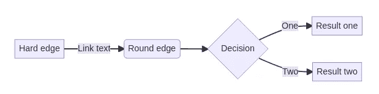

## 带图表的流程图

```
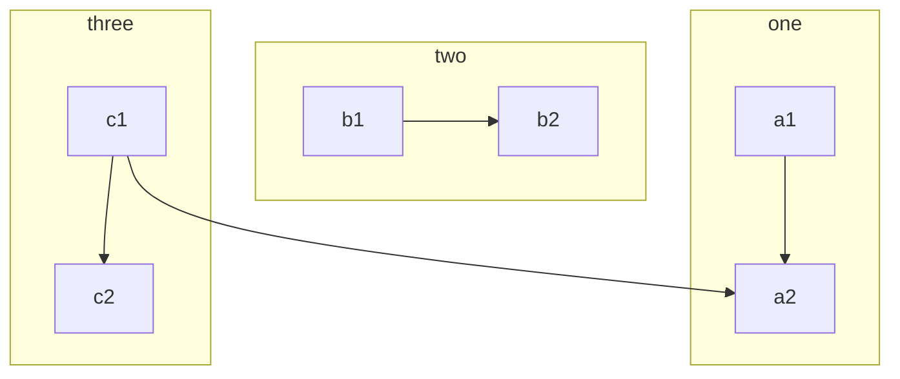
```

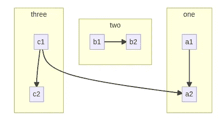

## 程序表

> 序列图说明了一组对象如何顺序地相互作用和操作。序列图由一组对象组成，这些对象由生命线和它们在交互过程中随时间交换的消息来表示——Wikipedia

```
```mermaid
sequenceDiagram
    Alice->>Bob: Hello Bob, how are you?
    alt is sick
        Bob->>Alice: Not so good :(
    else is well
        Bob->>Alice: Feeling fresh like a daisy
    end
    opt Extra response
        Bob->>Alice: Thanks for asking
    en
```

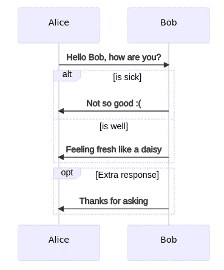

## 类图

> 类图是面向对象建模的主要构件。它用于应用程序结构的一般概念建模，以及详细建模，将模型转换为编程代码。类图也可以用于数据建模——维基百科

```
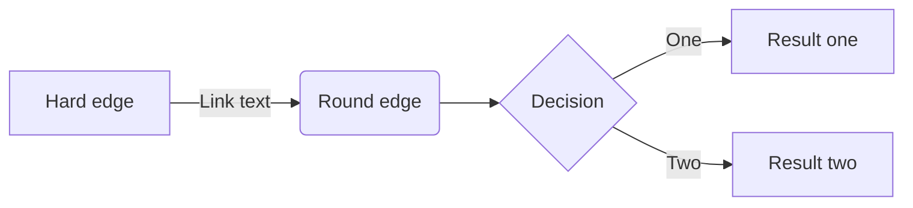
```

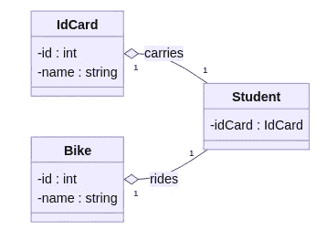

## 状态图

> 状态图是计算机科学和相关领域中用于描述系统行为的一种图表。状态图要求所描述的系统由有限数量的状态组成；有时候，情况确实如此，而在其他时候，这是一个合理的抽象——维基百科

```
```mermaid
stateDiagram-v2
    [*] --> Activestate Active {
        [*] --> NumLockOff
        NumLockOff --> NumLockOn : EvNumLockPressed
        NumLockOn --> NumLockOff : EvNumLockPressed
        --
        [*] --> CapsLockOff
        CapsLockOff --> CapsLockOn : EvCapsLockPressed
        CapsLockOn --> CapsLockOff : EvCapsLockPressed
        --
        [*] --> ScrollLockOff
        ScrollLockOff --> ScrollLockOn : EvScrollLockPressed
        ScrollLockOn --> ScrollLockOff : EvScrollLockPressed
    }
```
```

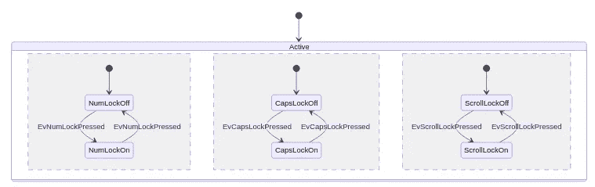

## 实体关系图

> 实体-关系模型描述了特定知识领域中相关的感兴趣的事物。基本的 ER 模型由实体类型组成，并指定实体之间可能存在的关系——Wikipedia

```
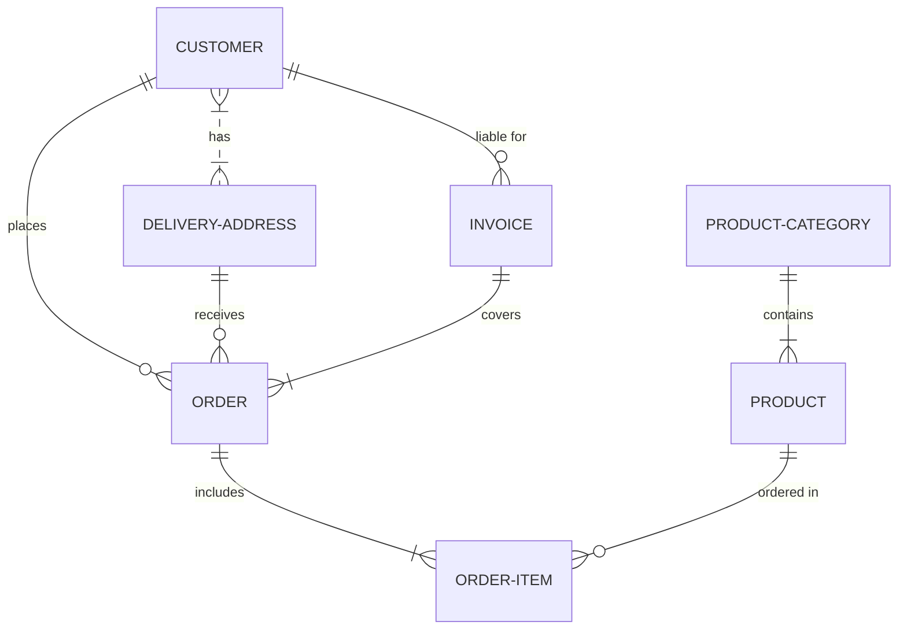
```

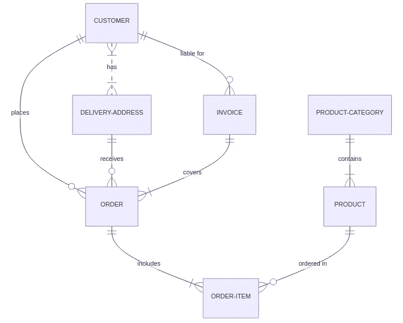

## 用户旅程图

```
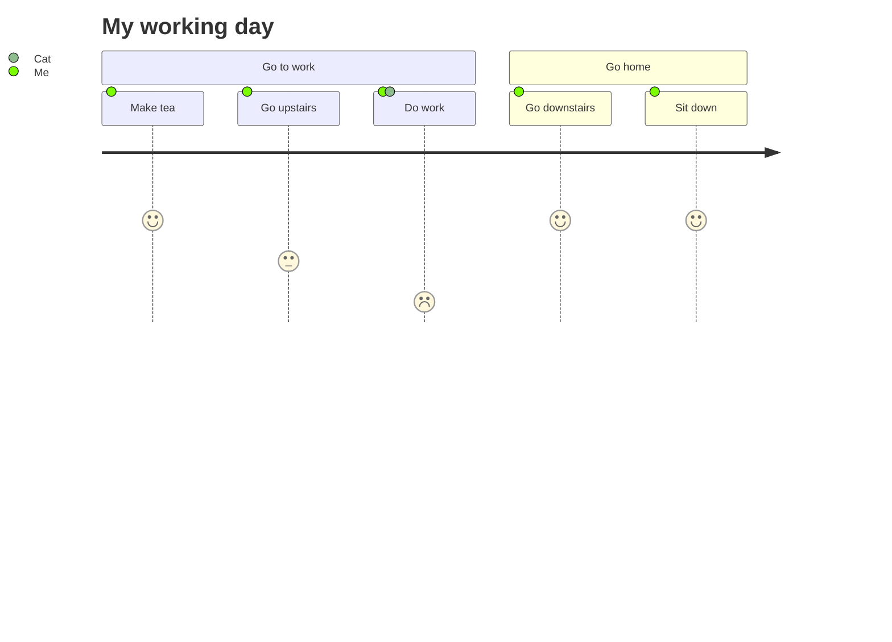
```


## 甘特图

> 甘特图是一种说明项目进度的条形图——维基百科

```
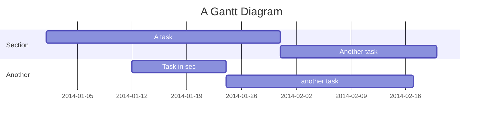
```

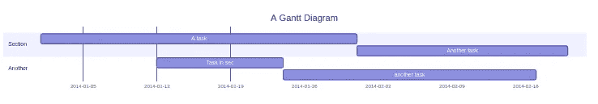

## 圆形分格统计图表

> 饼图是一个圆形的统计图形，它被分成若干片来说明数字比例。在饼图中，每个切片的弧长与它所代表的数量成正比

```
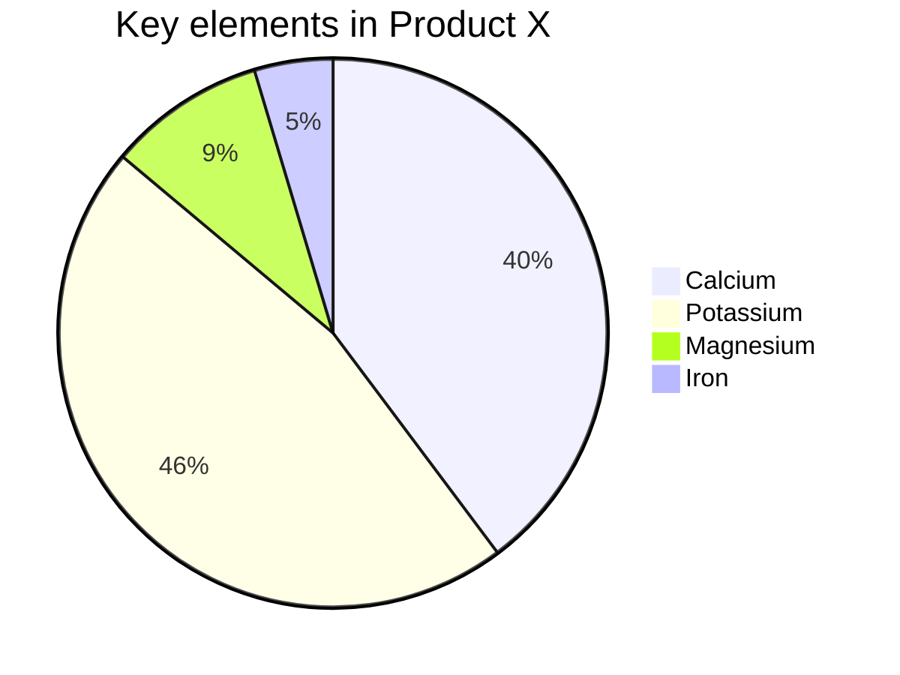
```

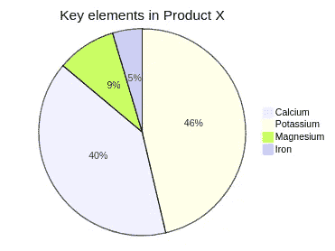

## 需求图

```
```mermaid
    requirementDiagramrequirement test_req {
    id: 1
    text: the test text.
    risk: high
    verifymethod: test
    }functionalRequirement test_req2 {
    id: 1.1
    text: the second test text.
    risk: low
    verifymethod: inspection
    }performanceRequirement test_req3 {
    id: 1.2
    text: the third test text.
    risk: medium
    verifymethod: demonstration
    }interfaceRequirement test_req4 {
    id: 1.2.1
    text: the fourth test text.
    risk: medium
    verifymethod: analysis
    }physicalRequirement test_req5 {
    id: 1.2.2
    text: the fifth test text.
    risk: medium
    verifymethod: analysis
    }designConstraint test_req6 {
    id: 1.2.3
    text: the sixth test text.
    risk: medium
    verifymethod: analysis
    }element test_entity {
    type: simulation
    }element test_entity2 {
    type: word doc
    docRef: reqs/test_entity
    }element test_entity3 {
    type: "test suite"
    docRef: github.com/all_the_tests
    }test_entity - satisfies -> test_req2
    test_req - traces -> test_req2
    test_req - contains -> test_req3
    test_req3 - contains -> test_req4
    test_req4 - derives -> test_req5
    test_req5 - refines -> test_req6
    test_entity3 - verifies -> test_req5
    test_req <- copies - test_entity2
```
```

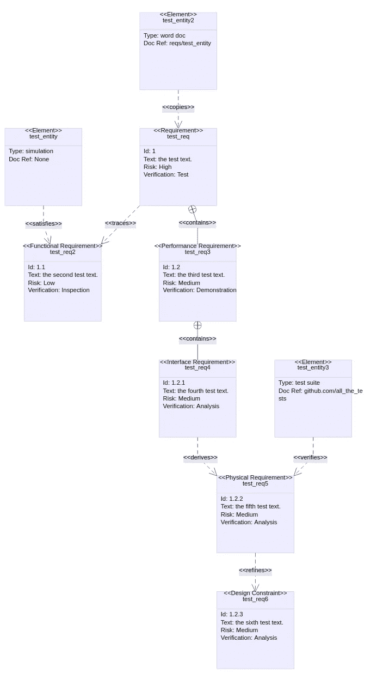

**快速提问:**这个故事*对你有价值吗*？请留言支持我的工作👏鼓掌或更多作为感谢的表示谢谢🥰