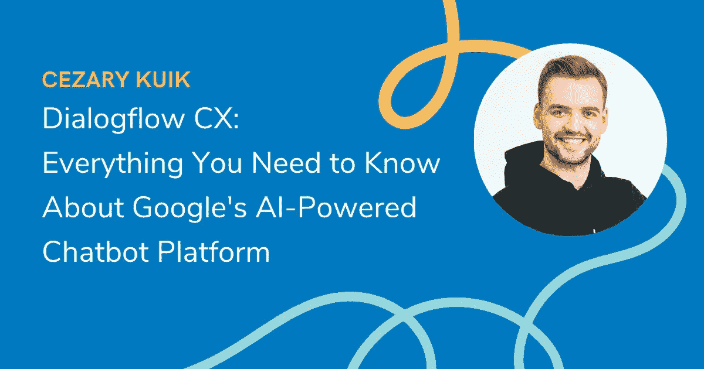
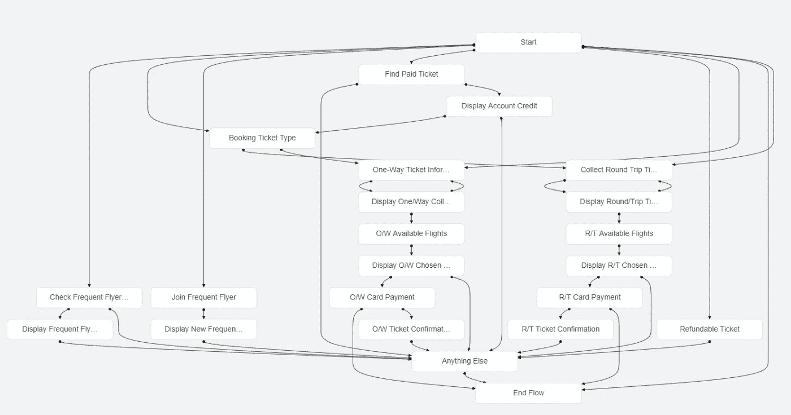
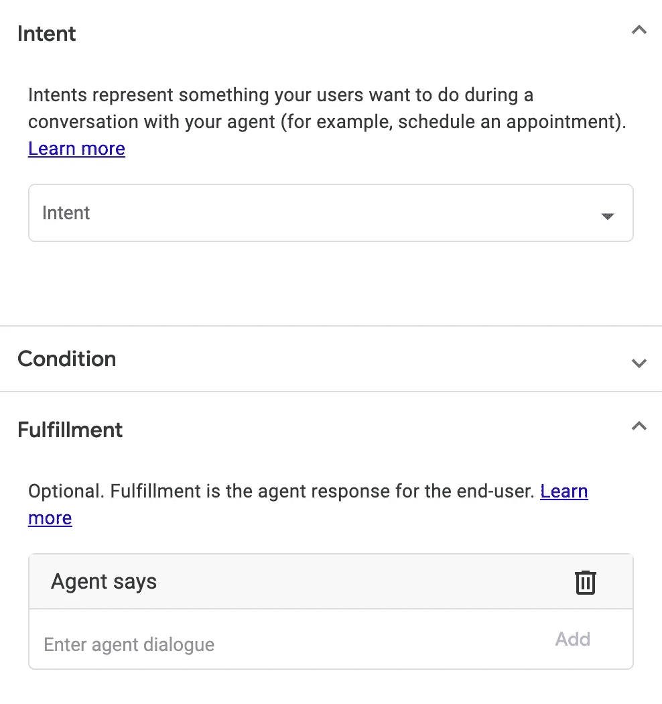
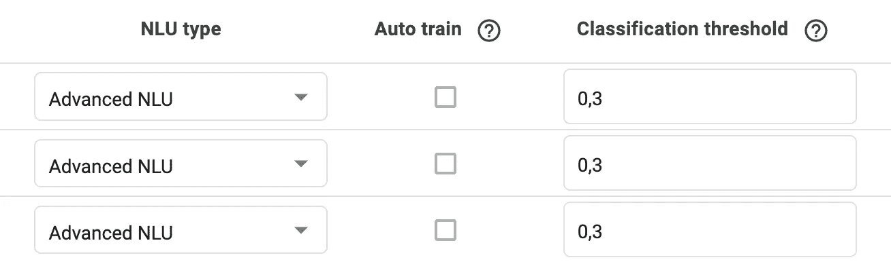
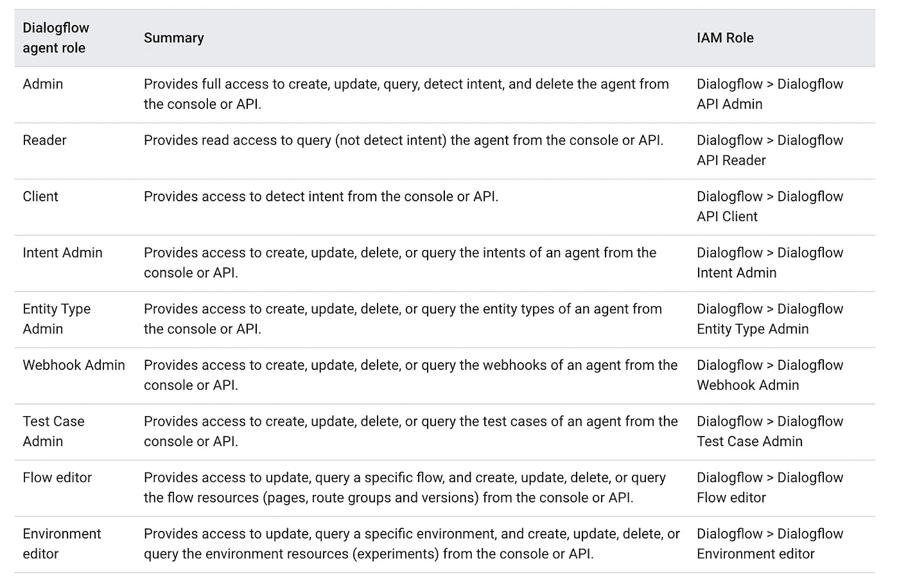

# 对话流 CX:关于谷歌人工智能聊天机器人平台你需要知道的一切

> 原文：<https://blog.devgenius.io/dialogflow-cx-everything-you-need-to-know-about-googles-ai-powered-chatbot-platform-cdd1e37e4fa4?source=collection_archive---------3----------------------->

如果你正在寻找建立一个聊天机器人，毫无疑问你听说过 Dialogflow。这是最受欢迎的聊天机器人开发平台之一，理由很充分——它包含了使构建聊天机器人变得容易的特性。在这篇文章中，我们将探索你需要知道的关于一个相对较新的对话流 CX 谷歌的人工智能聊天平台的一切。

# 为什么 Dialogflow CX 如此特别？

对话流 CX 提供了一种设计虚拟代理的创新方法，采用状态机的方法来设计代理。这为与最终用户的对话提供了清晰和明确的控制，从而为每个参与者(包括开发人员)带来更好的体验！背后有哪些功能？

## 流程可视化构建器

该平台旨在支持 bot 规模的实施。对话构建者可以在流可视化中看到他们的工作，并使用直观的工具(如可拖动的节点或连接器)轻松地进行更改，使他们可以纠正错误，而不会受到代理响应的任何干扰。

如果你曾经使用过像 Chatfuel 这样的平台，如果你不认为它是一种创新，我不会感到惊讶。然而，对于那些记得 Dialogflow ES 如何工作的人来说，这是一个巨大的变化。在旧版本中，我们能够采用简单直观的方法来建立小型对话，但当我们的需求增长时，这种方法不能很好地扩展。

对话框中的扁平结构以及上下文等隐式控件变得更具挑战性，因为它不允许我们进入更深的层次，所以在整个代理结构中进行了更改，如果您希望某些行为的分配不同于其他行为，甚至只是特定的部分。这就是为什么可视化编辑器是真正的游戏规则改变者。

## 基于状态的数据模型

我觉得这是一件需要一段时间去理解的事情，但是值得。你在维基百科上找到的定义很难，但我找到了一个奇妙的解释，作者是 Aravind Mohanoor，他把它比作自动售货机。

自动售货机从一个州到另一个州取决于你往里面放了多少钱。根据状态(余额)，可以选择不同的产品。根据产品的价格，你会从机器上得到不同的退款。

从我的角度来看，这种方法是如何让一切变得更容易的，这可以从对话流中 CX 实现与意图分离的事实中看出。在 Dialogflow 中，ES 意图与实现紧密相关，因此，当您想要创建具有不同响应的附加变体时，您必须创建整个意图的副本。现在你有了一个意图，你可以把不同的回应放入不同的流动点。我能说什么呢？少即是多。

使用这种方法，可以直观地重用意图、转换和数据条件。多个流允许您与您的团队在一个虚拟代理上同时工作—为每个流设置条件触发器，以确定它们将如何发生(例如，如果所有参数都等于某个值)。

## 粒度机器学习设置

在 DialogFlow CX 中，可以为每个流配置 ML 设置。真正有趣的是，我们可以选择一个标准或先进类型的 NLU。在谷歌官方文档中我们可以找到这样的解释:

> 先进的 NLU 技术。这种 NLU 类型比标准类型工作得更好，尤其是对于大型代理和流量。模型训练需要更长时间，因此自动训练被禁用。你需要手动或者通过 API 来训练流程。

实践中如何？我很好奇，所以我对选择的短语(250 个例子)进行了一个小测试，这些短语是根据高、中、低评分选择的(它是根据在 BERT 上训练的自定义模型确定的，与 Dialogflow 使用的相同)。我在 Dialogflow ES 和 CX 分类器上以普通和高级 NLU 模式尝试了相同的设置。结果显示，实际上先进的 NLU 得分高出 15 分。所以，是的——它看起来真的很先进。

## 单独的流程—不再有大型代理

管理流量的灵活性是大型代理的绝佳替代品。对话流 CX 提供了使用单个 bot 处理独立流的能力。使用该工具，您可以将代理划分为更小的对话主题，并让不同的团队成员负责对其部门需求而言重要的特定任务，而不会干扰其他领域，也不会浪费时间试图解释完全不愉快的事情。项目中可能的角色列表已经大大扩展了。

同样值得注意的是，Google 包含了运行 A/B 测试和流量分流的功能。它还在流级别支持版本控制，因此您可以基于您的环境运行多个版本。

# 局限性在哪里？

我不能说有很多，但它们肯定是引人注目的。在从旧版本切换到新版本之前了解它们是值得的，因为我们可能会遇到一些意想不到的困难。

## 访问历史需要自定义集成

Dialogflow ES 简化了您的代理参与的对话。这些日志是按时间顺序排列的，旨在概述用户如何与您的代理交互。目前这在 CX 还没有。如果您想要存储用户信息，您需要创建一个与 Google Datastore 或其他类型的数据库的定制集成。

## 仅支持英语

Dialogflow ES 支持 30 多种语言的所有功能，而 Dialogflow CX 不支持除英语以外的任何语言。

# 我需要 Dialogflow CX 吗？

Dialogflow CX 是拥有先进对话设计知识的团队和公司的最佳选择。如果你刚刚开始，我建议使用 Dialogflow ES，因为它有一个易于使用的界面。

如果您正在寻找能够处理大型复杂聊天机器人或具有区域数据需求的联络中心的企业级解决方案，CX 也将是最佳选择，那么 CX 将是您的企业所需要的。

另一个重要因素是钱。在这种情况下，已经有了更好的变化，使得平台对业务更可用。从 2021 年 9 月 1 日起，新的价目表生效，根据该价目表，我们将为每个请求支付 0.007 美元。在此之前，我们必须为每 100 次聊天支付 20 美元，所以现在 Dialogflow CX 是一个相对便宜的选择。

如果你想尝试一下，我强烈推荐谷歌的对话流 CXquest[**创建对话式人工智能代理。您将学习如何创建对话式虚拟代理，包括如何:定义意图和实体，使用版本和环境，创建对话分支，以及使用 IVR 特性。你还将获得技能徽章，可以在 LinkedIn 上分享。**](https://www.cloudskillsboost.google/quests/185)