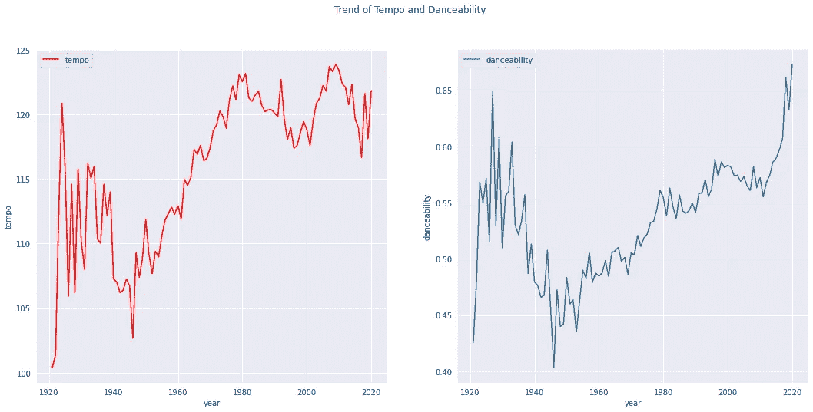
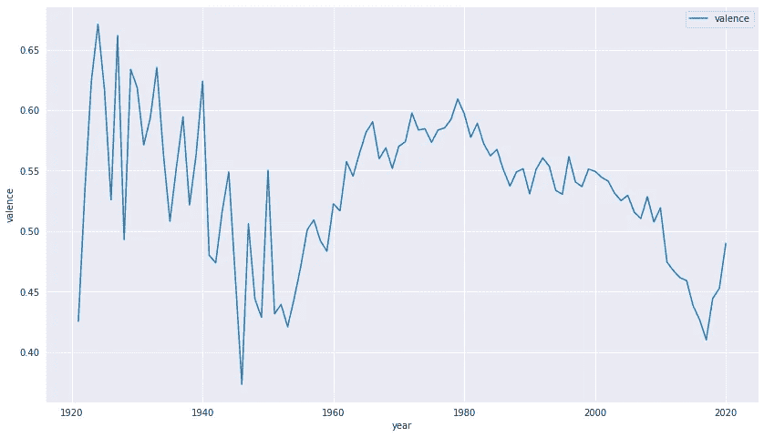
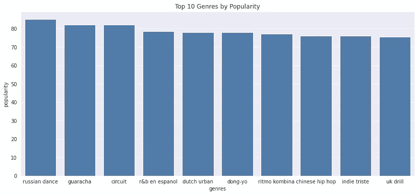
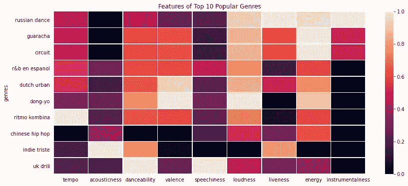
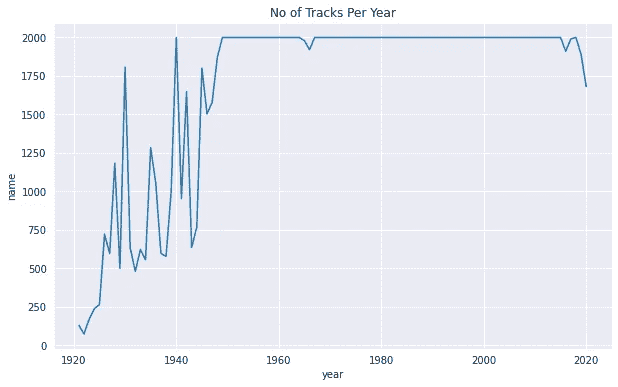
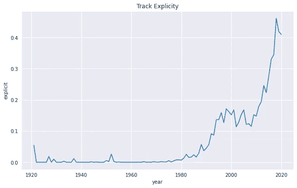
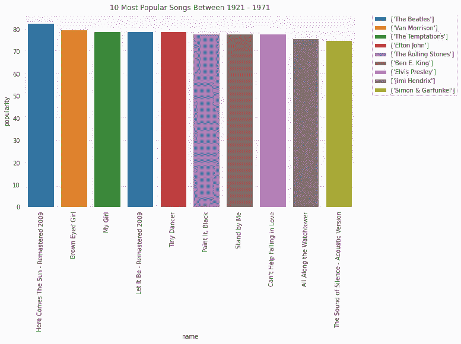
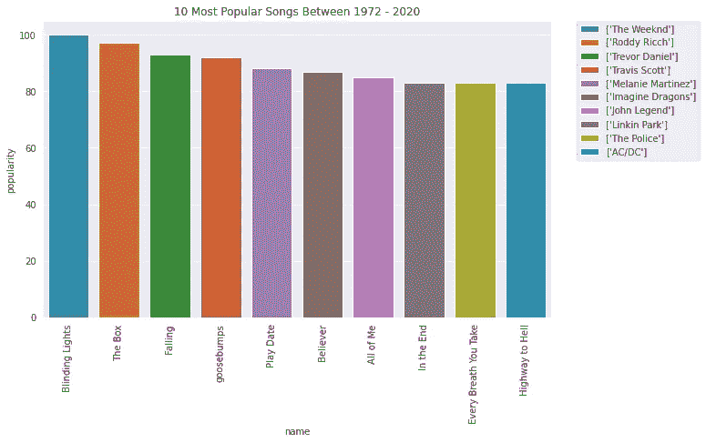
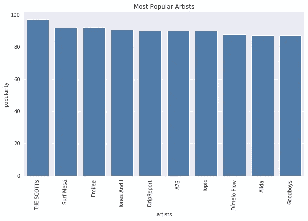

# 这些年来我们对音乐的品味改变了吗？

> 原文：<https://blog.devgenius.io/did-our-taste-in-music-change-over-the-years-74f31021a85b?source=collection_archive---------12----------------------->

**简介**

他们说音乐是一种世界语言。事实上，每个人都以这样或那样的方式喜爱和聆听某种类型的音乐。在过去的 25 年里，我们人类聆听和享受音乐的方式发生了巨大的变化。智能手机等技术的出现也导致了应用程序和软件开发的激增，让每个买得起智能手机的人都能享受音乐(这些年来智能手机变得非常便宜)。

其中一个让音乐离我们更近的应用叫做 [Spotify。](https://www.spotify.com)这是一个在线平台(有一个移动应用程序版本),提供来自世界各地不同艺术家和流派的数百万首音乐，通常按月订阅。Spotify 的其他变体可能包括但不限于 iTunes、Deezer 等。这些平台包含甚至在这些技术和平台被创造出来之前就被创造出来的音乐。

https://www.scdn.co/i/_global/open-graph-default.png 的 Spotify 标志

利用包含 1921 年至 2020 年间超过 16 万首歌曲的 Spotify 数据集，我们将探索音乐在 100 年间是如何变化的。这些年来歌曲的节奏有变化吗？这一时期有什么音乐流派占主导地位吗？谁是最受欢迎的艺术家？哪些歌曲占主导地位？还有很多。

# 世界变得更幸福了吗？

音乐有一种描述人们心情的方式。从悲伤到快乐，从庆祝到回忆，等等。我们如何从音乐中察觉这种情绪？声音、节奏或歌词等，让我们洞察每首音乐试图创造的情绪或氛围。可以跳舞的快节奏音乐/歌曲可能暗示快乐、庆祝的心情。另一方面，一首慢节奏的歌曲(仍然可以随着它跳舞)可能暗示悲伤/沮丧的情绪。

看一下上面的图表，我们可以看到两个图表在模式上是相似的。左边的图表显示了这些年来歌曲的节奏(每分钟的节拍数)是如何变化的。而右边的图表显示了歌曲的舞蹈能力(速度、节奏、稳定性和节拍强度的结合)也发生了变化，这并不奇怪。简单的解释是，随着这些年来歌曲节奏的加快，舞蹈能力也提高了。我们可以从图表中得到的另一个信息是，在 20 世纪 20 年代早期到中期的最初上升之后，在 20 世纪 40 年代早期，曲目的节奏和舞蹈能力有所下降。除了 20 世纪 20 年代和 40 年代的大幅下降，随着我们走向 2000 年代，曲目通常变得更加适合跳舞。有鉴于此，我们能说随着大多数歌曲变得更适合跳舞，社会变得越来越快乐吗？让我们再来看看数据集中的一个数据点，以了解节奏和舞蹈能力与快乐的关系。

化合价趋势

上面的图表显示了从 20 世纪 20 年代开始的曲目价格的历史。化合价是描述一首歌曲所传达的音乐积极意义的一种量度。因此，高价曲目通常更积极、快乐、愉悦或欣快。而那些低价位的人则悲伤、沮丧、愤怒。我们从图表中注意到的第一件事是它如何遵循从 20 世纪 20 年代到 80 年代的节奏和舞蹈能力的模式。在 20 世纪 20 年代早期到中期的最初上升之后，在 20 世纪 40 年代中期有所下降，正如我们在节奏和舞蹈能力方面发现的那样。然而，歌曲的价格从 20 世纪 80 年代开始持续下降，直到 2020 年初(尽管它们仍然高于 80 年代之前的价格)，开始略有上升。这意味着，尽管从 20 世纪 80 年代以来，歌曲的节奏或舞蹈能力有所提高，但与前几年相比，它们并没有表现出那么多欢快、快乐的情绪。结合这些数据点来回答世界是否变得越来越快乐仍然有些困难，因为我们还没有建立一个前提，即什么对艺术家的轨迹影响更大。是社会上发生的事情还是上述艺术家的个人生活/经历(这超出了本文的范围)。

# **最大赢家？**

**最受欢迎的流派**

不管有多难，每首音乐或曲目都可以被归类为某种类型。虽然一些流派可能比其他流派更出名，但一种流派并没有任何形式的“优势”超过另一种。尽管如此，了解过去 100 年中占主导地位的流派以及它们的特征是很重要的。

Spotify 上最受欢迎的流派

上面的图表清楚地显示了“俄罗斯舞蹈”是最受欢迎的类型,“guaracha”和“circuit”位居第二和第三。根据我们的数据显示，英国操练是第十大最受欢迎的类型。然而，是什么让这些流派如此受欢迎呢？它们的生产方式中有什么东西使它们受欢迎吗？在下面的图表中，我们看了一下这些顶级流派的特点，试图回答我们刚才提出的问题。

一眼看去，我们可以看到大多数顶级流派在节奏和舞蹈能力上处于中高水平。这仅仅意味着这种类型的曲目很快。几乎所有类型都很高的一个特征是响度，这解释了为什么这些类型的声音很低。对于评级较高的能源也是如此。然而，这是相反的，当谈到工具性，几乎所有的流派都非常低。

**最受欢迎的歌曲/艺术家**

在进入最受欢迎的歌曲之前，值得一提的是简要地探究一下从 1921 年起每年有多少首歌曲被加入。

Spotify 上添加的曲目数量

一眼看去，上面的图表向我们展示了每年在数据集中添加的大约 2000 首曲目。特别是从 20 世纪 40 年代中期到 2020 年，中间有几次下降。

虽然每年增加了 2000 首曲目，但我们也了解了这些曲目的一个特点。上图告诉我们，从 20 世纪 80 年代开始，曲目开始包含更露骨的内容。2000 年代的音乐比之前的任何一年都包含更多的直白内容(歌词)。

争夺数据集中最受欢迎歌曲的战斗分为两组。标准很简单，将发行年份分成 50 年；1921 年至 1971 年和 1972 年至 2020 年。在前者中，最受欢迎的歌曲是甲壳虫乐队的*太阳来了*，其次是范·莫里生的*棕眼女孩*。埃尔维斯·普雷斯利、埃尔顿·乔恩和吉米·亨德里克斯等巨星的歌曲占据了前十名。然而，后者包括来自更近的音乐天才的歌曲，如《周末》、罗迪·里奇、约翰·传奇等。《灯火辉煌的周末》是最受欢迎的歌曲，罗迪·里奇的《盒子》位居第二。随着*炫目的灯光*成为周末唯一一首流行度达到 100 的歌曲，它是数据集中最受欢迎的歌曲。

Spotify 上最受欢迎的 10 位艺术家

如上图所示，苏格兰人是 Spotify 上最受欢迎的艺术家。Surf Mesa 位居第二，Alida 和 Goodboys 位列十大最受欢迎的艺术家。

**结论**

在本文中，我们探索了包含 1921 年至 2020 年间超过 16 万首歌曲的 Spotify 数据集。调查结果总结如下:

1.  歌曲变得越来越快，越来越适合跳舞。尤其是从 20 世纪 40 年代末开始
2.  歌曲中包含的积极性也增加了，尽管没有歌曲的节奏和可跳性高
3.  从 20 世纪 80 年代开始，歌词变得越来越露骨，从 2000 年代开始的几年达到最高水平。
4.  最受欢迎的流派是俄罗斯舞蹈。这种类型的歌曲节奏快，可跳性强，充满活力，声音洪亮。
5.  周末最受欢迎的歌曲是*炫目的灯光*
6.  最受欢迎的艺术家是苏格兰人

这里的发现是观察性的，不是正式研究的结果。

感谢您的阅读。

要了解更多关于这个分析的内容，请点击这里[查看我的 GitHub 链接](https://github.com/e-ayeni)

您可以在上与我联系；

[领英](https://www.linkedin.com/in/emmanuel-ayeni-49baaab2/)

[推特](https://twitter.com/EmmanuelAyeni5)