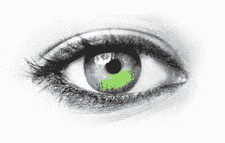
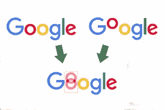

# 你知道枕头不仅仅能让你睡个好觉吗？

> 原文：<https://blog.devgenius.io/did-u-know-a-pillow-can-do-much-more-than-just-give-you-a-sound-sleep-932bcc80952c?source=collection_archive---------24----------------------->

在软件测试的世界里，我们的目标是捕捉错误。我们编写测试，自动化测试——我们捕捉错误。你的测试发现的错误越多，人们对你的测试就越有信心。人们执行不同类型的测试——UI 测试、API 测试、性能测试、安全测试等等。我们经常使用“回归”这个术语。人们经常问 QA 团队——你的回归套件有多强？".嗯，这是个很难回答的问题。作为一名 QA，我们编写手动测试用例，确定它们执行的优先级，然后根据优先级自动化它们。在这个过程中，我们有时会忽略 UI/UX 组件——网页中出现的文本、不太重要的按钮、超链接、由于 CSS 选择器的任何改变而导致的组件错位等等。那么我们如何避免呢？编写多个测试来验证页面中每个 web 元素的存在？或者编写一个单独的测试来验证每个 UI 组件，这当然是不可行的。然而，错过了页面中错综复杂的细节？为了解决这个问题，出现了一种叫做“视觉回归”的东西

通过像素查找网页中的差异

*   *首先也是最重要的需要是理解能够服务于你的目的的工具(也许是开源的？)而不偏离您现有的自动化框架。因为我们的框架是 Python 中的 Selenium，所以 Pillow 是最合适的。*
*   *其次，对于任何视觉回归工具，你都需要有基线图像来进行比较。对于我们的执行，我们将生产图像作为我们的基线图像。*
*   第三，确定您到底想要在哪个环境中执行这些测试。对于我们的执行，我们采用了一个低于生产的环境。因此，我们在这个环境中运行测试，并将从这个环境中捕获的图像与从生产环境中捕获的图像进行比较
*   第四，了解你想在哪里执行。对于我们的执行，我们使用 BrowserStack，因为我们已经有一个为其配置的 Jenkins 作业(阅读: [*此处为*](https://medium.com/@sanjukta.hazarika/how-to-configure-a-jenkins-job-to-run-selenium-python-tests-using-browserstack-73c2b933be85) *)*

## **使用枕头我们获得了什么？**

*   首先，我们在生产中捕获图像的截图，并将其作为基础图像*【我们在 Jenkins pipeline 中的一个阶段捕获了它，并复制了工件，然后将它们传递给下一个阶段；下面添加了相同的声明性语法]*
*   然后，我们在我们想要测试的较低环境中捕获图像的屏幕截图，然后将这两个图像作为参数进行比较*[我们在 Jenkins pipeline 的另一个阶段捕获了这一点。将从上一步复制的图像(构建工件)与此阶段生成的图像进行比较]*
*   使用 Pillow 的图像模块(image.getpixel ),我们得到两幅图像的像素
*   使用 Pillow 的 ImageDraw 模块，如果两个图像之间有任何差异，我们就画出正方形。
*   最后，如果有任何差异，我们保存图像结果，并在差异周围加上彩色方框[管道执行在此之后完成，并生成结果-，基准图像、测试图像和结果图像(如果有任何差异)被保存为构建工件。因此，如果你有一个结果图像和其他截图，你就知道你的测试失败了。]

> 在视觉回归中遇到一类假阳性是常见的问题。当有预测性的 UI 变化要被部署时，视觉回归测试可能会失败，因为随着新 UI 的引入，你的基础必须改变。

**Jenkins 声明性管道语法，用于在 BrowserStack 中从 Jenkins 管道运行我们的测试。**

## **为什么视觉回归应该是你的交付管道的重要组成部分？**

自动化的可视化回归构建带来了好处，比如减少手工的重复测试工作，并且在更高质量的发布中增加灵活性和信心。

自动化的视觉回归构建旨在验证正确的数据和内容是否显示在应用程序的前端，它还验证用户界面和整个 UI 上每个视觉元素的布局和外观。

自动化的可视化回归构建总是可以成为你的功能回归套件的助推器。

在我担任 QA 期间，我遇到了很多“关注细节”这个术语。因此，有了自动化的可视化回归构建，您可以始终关注交付的细节方面。

说到底，谁不想交付像素完美的产品呢？

> 完美是通过缓慢的程度达到的；它需要时间之手。
> 
> *——伏尔泰*

感谢阅读！！！！！